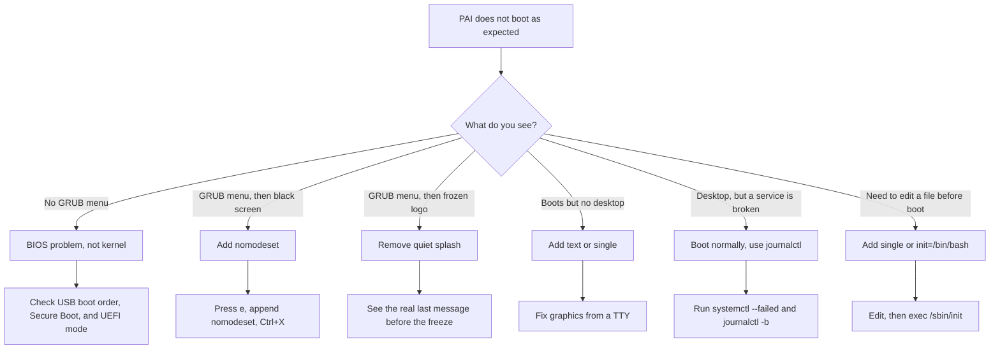

PAI boots through **GRUB**, the standard Linux bootloader. From the GRUB menu you can pick a profile, edit the kernel command line for one boot, or drop into a rescue shell when things go wrong. This page is the complete reference for every supported boot option, how to apply it, and which option to reach for when a boot fails.

In this guide:
- How to open and navigate the PAI GRUB menu
- A full table of kernel parameters you can append at boot
- How to boot PAI in safe mode with `nomodeset` for black-screen problems
- A flowchart that maps each boot failure symptom to the option that fixes it
- How to drop to a rescue shell and diagnose a broken boot
- How to verify which options were actually applied with `cat /proc/cmdline`
- How to make a boot option permanent

**Prerequisites**: A working PAI USB stick and a machine that reaches the GRUB menu when booted from USB. See [installing and booting](../first-steps/installing-and-booting.md) if your machine does not reach GRUB yet.

---

## The PAI GRUB menu

When you boot PAI, the first screen you see after your BIOS or UEFI firmware hands off is the **PAI GRUB menu**. It lists:

- **Start PAI** — the default entry, boots the `full` profile
- **Profiles** — a submenu with AI Only, Developer, Crypto, and Privacy Mode
- **Safe Mode** — boots without `quiet splash`, so you see kernel messages


*The PAI GRUB menu. The default entry auto-boots after eight seconds unless you press a key.*

The menu auto-selects **Start PAI** and counts down from **8 seconds**. Press any arrow key to pause the countdown and take control.

!!! note

    The GRUB menu is generated at ISO build time by `config/hooks/binary/0010-grub-profiles.hook.binary`. If you rebuild PAI from source and want a different default, that is the file to edit.


### Keys that work in the GRUB menu

| Key | What it does |
|---|---|
| `Up` / `Down` | Move between menu entries |
| `Enter` | Boot the highlighted entry |
| `e` | Edit the kernel command line for this boot only |
| `c` | Drop to a GRUB command line (advanced) |
| `Esc` | Leave a submenu or the editor |

Edits made with `e` apply to the current boot only. Reboot and the defaults return. That makes `e` the safest way to experiment — you cannot permanently break your USB by editing kernel parameters.

---

## Editing the kernel command line at boot

Most boot troubleshooting on PAI comes down to adding, removing, or changing one parameter on the `linux` line. Here is the exact flow.

1. Boot your machine from the PAI USB and wait for the GRUB menu to appear.

2. Use the arrow keys to highlight the entry you want to modify. For most users that is **Start PAI** or **Safe Mode**.

3. Press `e`. GRUB opens an editor showing the menu entry's commands. Look for the line that starts with `linux`, followed by the kernel path and a long list of parameters.

4. Use the arrow keys to move the cursor. Append your parameter at the end of the `linux` line, separated by a space. For example, to add `nomodeset`:

   ```
   linux /live/vmlinuz boot=live components quiet splash pai.profile=full nomodeset
   ```

5. Press `Ctrl+X` (or `F10`) to boot with your edits. PAI boots with the modified command line.

6. Once PAI is running, open a terminal and verify your change took effect:

   ```bash
   # Show the exact kernel command line the running system was booted with
   cat /proc/cmdline
   ```

   Expected output (your paths will differ):

   ```
   BOOT_IMAGE=/live/vmlinuz boot=live components quiet splash pai.profile=full nomodeset
   ```

If `nomodeset` appears in the output, your edit was applied. If it does not, you either forgot to press `Ctrl+X` or you edited a different line.

!!! tip

    You can add several parameters at once. Separate them with spaces. A common combination for diagnosing boot failures is `nomodeset single` — use basic graphics and drop to single-user mode.


---

## Full kernel option reference

The table below covers every parameter PAI officially supports. The **standard** options come from the upstream Linux kernel and `live-boot`; they work on any Debian live image. The one **PAI-specific** option is `pai.profile`, parsed by `/usr/local/bin/pai-profile-init` on every boot.

| Option | What it does | When to use | Example value |
|---|---|---|---|
| `nomodeset` | Disables kernel mode setting (KMS). Falls back to a simple framebuffer driver that works on almost any GPU. | Black screen or garbled display after GRUB. | `nomodeset` |
| `quiet` | Suppresses most kernel log messages during boot. Present by default. | Remove it when a boot hangs and you want to see the last message. | `quiet` |
| `splash` | Shows the Plymouth splash animation. Present by default. | Remove it to see the kernel and systemd messages underneath. | `splash` |
| `single` | Boots into single-user rescue mode. Mounts the filesystem, starts a minimal set of services, drops to a root shell. | You need to run commands as root before the graphical session starts. | `single` |
| `init=/bin/bash` | Replaces systemd with a bare Bash shell as PID 1. Skips all normal service startup. | Extreme recovery. Use when `single` does not work. | `init=/bin/bash` |
| `text` | Boots to a text console instead of starting the graphical `sway` session. | GPU is broken but you need a working terminal. | `text` |
| `mem=4G` | Caps visible RAM at the value you set. | Testing what PAI does on a lower-memory machine, or working around a BIOS that mis-reports RAM. | `mem=4G` |
| `toram` | Copies the entire PAI squashfs into RAM at boot. After boot, you can remove the USB. | Freeing the USB port, or running faster from RAM. Needs about 6 GB free. | `toram` |
| `noprompt` | Skips the `live-boot` prompt that asks you to insert the medium. | Rarely needed — only some exotic boot paths. | `noprompt` |
| `ignore_loglevel` | Forces the kernel to print every log message, regardless of loglevel. | Debugging a very early-boot issue. | `ignore_loglevel` |
| `debug` | Enables verbose debug output in `live-boot` scripts. | Troubleshooting the live-boot stage itself. | `debug` |
| `pai.profile=<name>` | Selects which PAI profile activates. Valid values: `full`, `ai`, `dev`, `crypto`, `privacy`. Read by `pai-profile-init`. | Booting with a different profile than the menu entry default. | `pai.profile=ai` |

!!! warning

    Boot options that are not listed above are **not wired into PAI as of v0.1.0**. Flags such as `pai.privacy`, `pai.offline`, `pai.nomodel`, and `pai.wipe-on-shutdown` are planned but not yet parsed by any script. Adding them to the command line will have no effect.


### How PAI reads `pai.profile`

The profile selector is implemented by `/usr/local/bin/pai-profile-init`, which runs at boot and greps `/proc/cmdline`:

```bash
# From pai-profile-init
PROFILE=$(grep -oP 'pai\.profile=\K\S+' /proc/cmdline 2>/dev/null || echo "full")
echo "$PROFILE" > /run/pai-profile
```

The value lands in `/run/pai-profile` and `/run/pai-profile-env`, where Sway and the PAI scripts can read it. If you ever want to confirm which profile is active, run:

```bash
# Show the profile that the running PAI session activated
cat /run/pai-profile
```

Expected output:

```
full
```

---

## Boot troubleshooting triage

Use this flowchart to pick the right option for the symptom you see.



### Symptom: black screen after GRUB

The kernel loaded, but the GPU driver could not take over the display. This is almost always fixed by disabling kernel mode setting.

Add `nomodeset` to the `linux` line (see the tutorial below). The display will look plain — no hardware acceleration — but you will get a working desktop.

### Symptom: boot hangs on the Plymouth logo

The kernel is stuck, but `quiet splash` is hiding the reason. Edit the entry, remove `quiet splash`, and boot. You will see every kernel and systemd message. Read the last line before the freeze — it almost always names the module or service that failed.

### Symptom: you reach the desktop but something is wrong

This is not a boot-options problem. Boot normally and use the standard systemd tools: `journalctl -b` for this boot's logs, `systemctl --failed` for the list of services that did not start.

---

## Tutorial: boot PAI in safe mode with nomodeset

**Goal**: boot PAI on a machine where the default entry shows a black screen after GRUB.

**What you need**:
- A PAI USB stick that reaches the GRUB menu
- Five minutes
- Access to the keyboard (no mouse needed)

1. Plug in the PAI USB and boot your machine. Wait for the GRUB menu to appear.

2. Use the down arrow to highlight **Safe Mode**. This entry already omits `quiet` and `splash`, so you will see kernel messages.

3. Press `e` to edit the entry.

4. Find the line starting with `linux`. Move the cursor to the end of that line.

5. Append a single space and `nomodeset`:

   ```
   linux /live/vmlinuz boot=live components pai.profile=full nomodeset
   ```

6. Press `Ctrl+X` to boot. You will see verbose kernel messages scrolling. This is expected.

7. PAI should reach the Sway desktop with a plain, unaccelerated display.

8. Open a terminal (from the Sway launcher, default `Super+D`) and verify:

   ```bash
   # Confirm nomodeset was applied
   cat /proc/cmdline | tr ' ' '\n' | grep nomodeset
   ```

   Expected output:

   ```
   nomodeset
   ```

**What just happened?** Modern Linux tries to load a hardware-specific graphics driver (KMS) early in boot. On some older or exotic GPUs, that driver hangs or leaves the screen blank. `nomodeset` tells the kernel to skip KMS and use a basic VESA or EFI framebuffer. You lose 3D acceleration and high refresh rates, but you gain a usable desktop.

**Next steps**: if `nomodeset` consistently fixes your boot, see "Making a boot option permanent" below. For deeper graphics issues, see [troubleshooting](../advanced/troubleshooting.md).

---

## The rescue shell: what to do when PAI will not boot

If PAI fails to boot even with `nomodeset`, the next escalation is a **rescue shell**. You get a root prompt with the filesystem mounted but no desktop — enough to inspect logs and fix things.

### Option 1: single-user mode

At GRUB, edit the entry. Replace `quiet splash` with `single nomodeset text`:

```
linux /live/vmlinuz boot=live components pai.profile=full single nomodeset text
```

Boot. systemd starts a minimal set of services and drops you at a root shell.

### Option 2: bash as PID 1

If `single` still does not bring you to a shell, try the nuclear option:

```
linux /live/vmlinuz boot=live components init=/bin/bash
```

This skips systemd entirely. You get a bare Bash prompt with the root filesystem mounted read-only. To make it writable:

```bash
# Remount the live overlay as read-write so you can edit files
mount -o remount,rw /
```

Once you are done, continue the normal boot with:

```bash
# Hand control back to systemd and continue booting
exec /sbin/init
```

### Useful commands in the rescue shell

```bash
# View this boot's kernel and service logs
journalctl -b

# List services that failed to start
systemctl --failed

# Last 50 kernel messages, including driver errors
dmesg | tail -n 50

# Show which block devices the kernel sees
lsblk

# Show the exact command line this boot used
cat /proc/cmdline
```

!!! danger

    A rescue shell gives you root with no confirmation prompts. Do not run destructive commands unless you know exactly what you are doing. On a live USB, you cannot harm the host's internal drives — PAI only mounts its own squashfs — but commands like `dd` can still overwrite the USB itself.


---

## Making a boot option permanent

Edits at GRUB with `e` only last for one boot. Reboot and you are back to defaults. There are two ways to make a boot option stick.

### Method 1: rebuild the ISO with edited GRUB config

This is how PAI itself is built. Edit the GRUB generation hook:

```
config/hooks/binary/0010-grub-profiles.hook.binary
```

Change the `linux` line for the menu entry you want to modify, then rebuild per [building from source](../advanced/building-from-source.md). Every ISO you build from then on will use your new default.

### Method 2: persistence drop-in (planned)

Once the persistence layer ships (see [persistence](../persistence/introduction.md)), you will be able to drop a `/live/persistence.conf` fragment that applies extra kernel parameters at every boot without rebuilding the ISO.

!!! note

    As of v0.1.0, persistence is still in progress. For now, if you need a permanent change, rebuild the ISO.


---

## Secure Boot and signed bootloaders

PAI v0.1.0 does **not** ship a signed GRUB shim. On machines with **Secure Boot** enabled, the firmware will refuse to load the PAI bootloader and you will see errors such as "image not trusted" or "security policy violation".

Workarounds:

- **Disable Secure Boot** in your firmware setup. This is the supported path today and applies to all unsigned Linux distributions.
- **Wait for a signed release**. Signed shims are on the PAI roadmap. See [warnings and limitations](../general/warnings-and-limitations.md) for the current state.

Disabling Secure Boot does not weaken your host OS — it only changes what your firmware allows at boot time. Re-enable it after you are done testing PAI if you want your host's normal protections back.

---

## Frequently asked questions

### How do I access GRUB on PAI?

GRUB is the first screen PAI shows after your BIOS or UEFI firmware hands off control. If your machine boots straight past GRUB, you probably have an aggressive eight-second timeout — press any arrow key as soon as the logo appears to pause the countdown. If you never see GRUB at all, your firmware is not booting from the USB; check the boot order and Secure Boot settings.

### How do I make a boot option permanent?

Rebuild the ISO with an edited `config/hooks/binary/0010-grub-profiles.hook.binary`, or wait for the persistence layer to land and use a drop-in config file. Edits made at the GRUB menu with `e` apply to a single boot only and revert the next time you power on. See "Making a boot option permanent" above.

### What does nomodeset do?

`nomodeset` disables **kernel mode setting**, the mechanism Linux uses to take control of your GPU early in boot. Without KMS, the kernel falls back to a basic VESA or EFI framebuffer that works on nearly every GPU. You lose 3D acceleration and hardware-specific features, but you gain a working display on machines where the native driver fails. It is the single most common fix for a black screen after GRUB.

### How do I boot PAI to a command line instead of the desktop?

Add the `text` parameter to the kernel command line at GRUB. The system boots normally but stops at a login TTY instead of starting the Sway session. If you want a minimal environment with no services running, use `single` instead — that drops you directly into a root shell. For the absolute bare minimum, `init=/bin/bash` skips systemd entirely. See "The rescue shell" above.

### What if I break something in the GRUB config?

Edits made at the GRUB menu with `e` only apply to the current boot. If PAI refuses to boot because of a bad edit, reboot the machine. On the next boot, do not press `e` — the defaults are back and you are at a normal GRUB menu again. You cannot permanently damage the USB through the `e` editor. If you rebuilt the ISO and broke the baked-in GRUB config, re-flash the USB with a known-good ISO.

### How do I enable verbose boot messages?

Use the **Safe Mode** menu entry — it already omits `quiet` and `splash`. Alternatively, at GRUB press `e` on any entry and remove the words `quiet` and `splash` from the `linux` line. For extreme verbosity, also add `ignore_loglevel` and `debug`. You will see every kernel message and every `live-boot` script step, which is invaluable for diagnosing early boot failures.

### Which profile am I running?

Run `cat /run/pai-profile` from any terminal. The profile is written there at boot by `/usr/local/bin/pai-profile-init`, which reads `pai.profile=X` from `/proc/cmdline`. If the file is missing, the profile init script did not run — something earlier in boot failed. Check `journalctl -u pai-profile-init -b` for the reason.

### Can I combine several boot options?

Yes. Separate parameters with spaces on the `linux` line. A common combination for diagnosing boot failures is `nomodeset single text ignore_loglevel` — basic graphics, single-user mode, text console, maximum verbosity. Any combination of the options in the reference table above is valid.

### How do I know whether my boot option was applied?

Run `cat /proc/cmdline` from a terminal. It shows the exact command line the running kernel was booted with. If your option appears there, it was applied. If it does not, you likely forgot to press `Ctrl+X` after editing, or you edited a different line. See the tutorial above for the full verification flow.

---

## Related documentation

- [**Installing and booting**](../first-steps/installing-and-booting.md) — Get to the PAI GRUB menu in the first place
- [**How PAI works**](../general/how-pai-works.md) — What happens after GRUB hands off to the kernel
- [**Warnings and limitations**](../general/warnings-and-limitations.md) — Secure Boot, hardware caveats, and known quirks
- [**Building from source**](../advanced/building-from-source.md) — Rebuild the ISO to make boot options permanent
- [**Troubleshooting**](../advanced/troubleshooting.md) — Deeper diagnostics when boot options are not enough
- [**System requirements**](../general/system-requirements.md) — Minimum hardware PAI expects to see at boot
