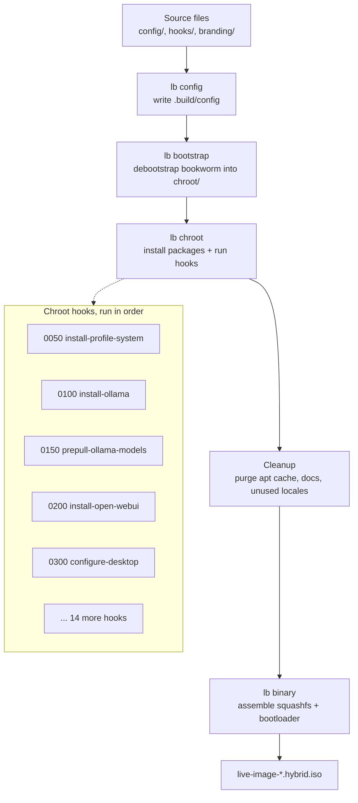
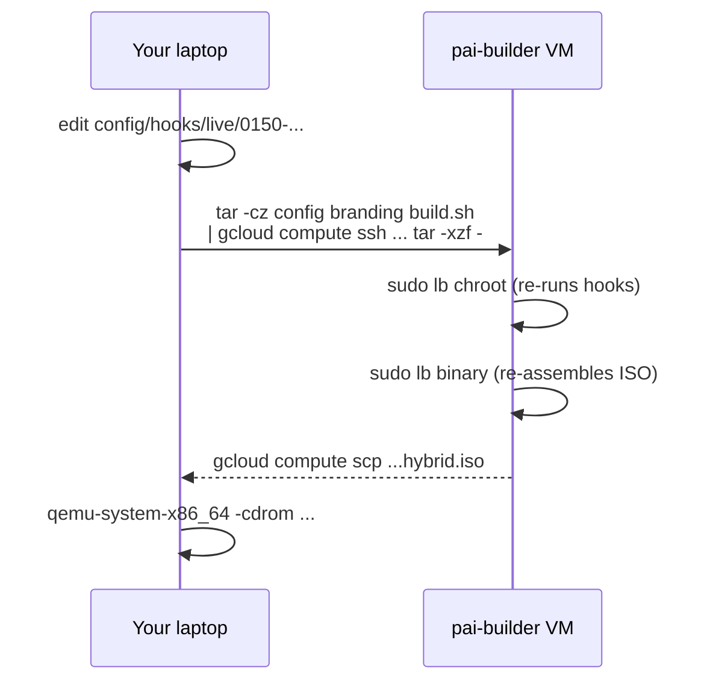

**PAI** is a Debian 12 live-image built with [Debian live-build](https://live-team.pages.debian.net/live-manual/html/live-manual/index.en.html). This guide is the canonical reference for building PAI from source: on a local Debian host, on the always-on Google Cloud builders, or on your own VM. You will learn the full live-build pipeline, the developer inner loop for iterating on the image, and how to bake in your own models, packages, and branding.

In this guide:

- What the build produces and how the repo is laid out
- Building PAI locally on Debian or Ubuntu
- Building PAI in the cloud (GCP builders or your own VM)
- The live-build pipeline: from source files to hybrid ISO
- A full tutorial for baking a different Ollama model into the ISO
- The developer inner loop (tar-pipe sync and partial rebuilds)
- Testing your build in QEMU without flashing a USB
- Reproducibility, common failures, and publishing your ISO

**Prerequisites**: Familiarity with the Linux command line, `apt`, `ssh`, and `git`. You do not need to be a Debian Developer; live-build handles the packaging for you. If you have never booted PAI, start with [First Boot Walkthrough](../first-steps/first-boot-walkthrough.md) first.

!!! note

    This page is the deeper reference for contributors, maintainers, and power users. If you only want to flash a pre-built ISO and boot it, see [Installing and Booting PAI](../first-steps/installing-and-booting.md) instead.


## Who this guide is for

Building PAI from source makes sense if you are:

- **Contributing to PAI** — fixing bugs, adding packages, or hardening the default image
- **A security researcher** verifying what ships in the ISO and reproducing the binary from source
- **A power user** creating a custom ISO with your own model baked in, your own branding, or extra packages for a specific workflow
- **An operator** deploying PAI to fleet hardware with a custom fingerprint (hostname, keyboard layout, firewall rules)

If you are just running PAI for yourself, the official ISOs from the release page are signed, reproducible, and ready to use. You do not need to build.

## What the build produces

A full build produces one of two hybrid ISO images:

| File | Architecture | Source tree | Typical size |
|---|---|---|---|
| `live-image-amd64.hybrid.iso` | x86_64 | repo root (`build.sh`) | 6–8 GB |
| `live-image-arm64.hybrid.iso` | aarch64 | `arm64/` subdirectory | 6–8 GB |

Both are **hybrid ISOs**: the same file works as a DVD image or flashed to USB with `dd`. Size is dominated by the pre-pulled Ollama model baked into `/usr/share/ollama/.ollama/models/` inside the chroot. Changing `PAI_DEFAULT_MODEL` is the single largest lever on output size.

**[amd64]** **[arm64]** **[hybrid ISO]**

### Raspberry Pi image (gap)

The arm64 live-build above produces a **UEFI/grub-efi ISO**, not a raw Pi-bootable disk image. Raspberry Pi boards need a FAT32 `/boot/firmware` partition with the Pi's proprietary bootloader chain (`bootcode.bin`, `start*.elf`, `config.txt`, kernel + DTB) — live-build's `iso-hybrid` output does not provide this.

Until a dedicated Pi image pipeline lands, the Raspberry Pi Imager integration (`website/public/imager.json`, generated by [`scripts/gen-imager-manifest.mjs`](https://github.com/nirholas/pai/blob/main/scripts/gen-imager-manifest.mjs)) ships in a "pending" state — `os_list: []` plus a `note` field — and Imager gracefully reports no images available.

**When a raw Pi image does exist**, package it into the expected release artifacts with:

```bash
scripts/package-arm64-img.sh path/to/pai-<version>-arm64.img
```

That writes `dist/pai-<version>-arm64.img.xz` and `dist/pai-<version>-arm64.img.json` (size + sha256 sidecar). The generator picks them up automatically on the next run. Track the Pi build work at [github.com/nirholas/pai/issues](https://github.com/nirholas/pai/issues).

## Repository layout

```
pai/
├── build.sh                            # amd64 live-build entry point
├── config/                             # live-build config for amd64
│   ├── package-lists/
│   │   └── pai.list.chroot       # every apt package in the ISO
│   ├── hooks/live/                     # ordered chroot hooks (see below)
│   │   ├── 0050-install-profile-system.hook.chroot
│   │   ├── 0100-install-ollama.hook.chroot
│   │   ├── 0150-prepull-ollama-models.hook.chroot
│   │   ├── 0200-install-open-webui.hook.chroot
│   │   ├── 0300-configure-desktop.hook.chroot
│   │   ├── 0500-firewall.hook.chroot
│   │   └── ...                         # 19 hooks total
│   └── includes.chroot_after_packages/ # files copied into the ISO
├── arm64/                              # parallel tree for aarch64
│   ├── build.sh
│   └── config/
├── branding/                           # logos, wallpapers, theming assets
├── docs/                               # documentation source (Astro Starlight)
├── prompts/                            # agent task prompts (not in the ISO)
├── scripts/                            # helper scripts (flashing, publishing)
└── website/                            # marketing site
```

The amd64 and arm64 config trees are intentionally kept in parallel. When you change a package list or a hook on one side, mirror the change on the other. The [CLAUDE.md](https://github.com/nirholas/pai/blob/main/CLAUDE.md) project rules call this out explicitly.

## The live-build pipeline

Debian live-build is a wrapper around `debootstrap`, `apt`, and a set of image-assembly helpers. Every PAI build flows through the same four stages, in order:



**What each stage does:**

1. **`lb config`** reads flags from `build.sh` and writes them into `.build/config`. No network activity yet.
2. **`lb bootstrap`** runs `debootstrap` to create a minimal Debian bookworm system in `chroot/`. This is the single longest network-bound step on a cold build.
3. **`lb chroot`** installs every package listed in `config/package-lists/pai.list.chroot` and runs each hook in `config/hooks/live/` in filename order. The hooks install Ollama, pre-pull the default model, install Open WebUI, configure Sway, set up the firewall, and more.
4. **`lb binary`** compresses the chroot into a squashfs, generates the ISO filesystem, and writes the hybrid bootloader (GRUB for amd64, GRUB-EFI for arm64).

After `lb chroot`, `build.sh` runs an aggressive cleanup pass that trims ~3 GB of unused data: apt caches, man pages, non-English locales, NVIDIA firmware blobs (CPU-only ISO), and Ollama GPU backends (CUDA, ROCm, Vulkan). Without this pass the ISO balloons past 10 GB.

!!! tip

    The pipeline is **idempotent from `lb bootstrap` onward**. If `lb chroot` fails on hook 0650, you can fix the hook and re-run `sudo lb chroot && sudo lb binary` without repeating `debootstrap`. This is the foundation of the developer inner loop.


## Choose your build path

=== "Local Debian host"

**Best for**: one-off builds, contributors with a Debian or Ubuntu workstation, reproducibility checks.

**Build time**: 30–45 minutes on an 8-core machine with an SSD and a 100 Mbps link. First build is slower because `debootstrap` pulls ~1.5 GB from the Debian mirror.

**Requirements**:

- Debian 12 (bookworm) or Ubuntu 22.04+ host
- Root access (live-build operates as root)
- 30 GB free disk space
- 8 GB RAM minimum, 16 GB recommended
- A working internet connection


1. Install `live-build` from the Debian repos.

   ```bash
   sudo apt update
   sudo apt install -y live-build git
   ```

2. Clone the PAI repo.

   ```bash
   git clone https://github.com/nirholas/pai.git
   cd pai
   ```

3. Run the amd64 build. This must run as root.

   ```bash
   sudo bash build.sh 2>&1 | tee build.log
   ```

   Expected final output:

   ```
   [pai] Disk usage after cleanup:
   /dev/sda1        30G   12G   17G  42% /
   6.8G    chroot/
   P: Begin building binary iso-hybrid image...
   ```

4. Verify the ISO exists and check its size.

   ```bash
   ls -lh live-image-amd64.hybrid.iso
   sha256sum live-image-amd64.hybrid.iso
   ```

   Expected output:

   ```
   -rw-r--r-- 1 root root 6.7G Apr 20 14:03 live-image-amd64.hybrid.iso
   4a...  live-image-amd64.hybrid.iso
   ```

5. (Optional) Build the arm64 ISO from the `arm64/` subtree.

   ```bash
   cd arm64
   sudo bash build.sh 2>&1 | tee build.log
   ```

   On an amd64 host this is a cross-build via `qemu-user-static`. It is noticeably slower (roughly 1.5–2x wall time) and requires `qemu-user-static` and `binfmt-support` installed.


=== "Google Cloud (PAI builders)"

**Best for**: PAI maintainers running their own Google Cloud project. Provision two VMs (`pai-builder` in `us-central1-a` and `pai-builder-arm` in `us-central1-f`) with the repo cloned at `~/pai`. Full operational runbook lives at [ops-cloud-builders.md](../ops-cloud-builders.md).

**Build time**: 25–30 minutes on `n2-highcpu-96` (amd64) or `t2a-standard-48` (arm64).


1. Authenticate gcloud (every fresh shell or Codespace).

   ```bash
   gcloud auth login
   gcloud config set project <your-gcp-project>
   ```

2. Start the builders.

   ```bash
   gcloud compute instances start pai-builder     --zone=us-central1-a
   gcloud compute instances start pai-builder-arm --zone=us-central1-f
   ```

3. Kick off a clean amd64 build, detached.

   ```bash
   gcloud compute ssh pai-builder --zone=us-central1-a --command="\
       cd ~/pai && sudo rm -rf chroot cache binary .build *.iso build.log; \
       (nohup sudo bash build.sh > ~/build.log 2>&1 &)"
   ```

4. Tail progress from your laptop while the VM builds.

   ```bash
   gcloud compute ssh pai-builder --zone=us-central1-a \
       --command='sudo tail -f /home/codespace/build.log'
   ```

5. Pull the finished ISO back to your laptop.

   ```bash
   gcloud compute scp --zone=us-central1-a \
       pai-builder:/home/codespace/pai/live-image-amd64.hybrid.iso \
       /tmp/pai-amd64.iso
   ```

6. Stop the builders when you are done. **You are billed by the hour while a VM runs.**

   ```bash
   gcloud compute instances stop pai-builder     --zone=us-central1-a
   gcloud compute instances stop pai-builder-arm --zone=us-central1-f
   ```


!!! warning

    `n2-highcpu-96` costs roughly $2.70/hour. Leaving a builder running over a weekend by accident burns ~$130. Stop the VM as soon as your build finishes, and set a billing budget alert in the GCP console.


=== "Custom VM"

**Best for**: contributors without GCP access who still want fast cloud builds, or anyone using AWS, Hetzner, Azure, or a self-hosted hypervisor.

**Build time**: depends on the instance. As a rule of thumb, you want at least 16 vCPUs and 32 GB of RAM for a 25-minute build. Smaller instances work but take an hour or more.


1. Provision a Debian 12 VM with at least:

   - 16 vCPUs (AMD Ryzen, Intel Xeon, or Ampere Altra all work)
   - 32 GB RAM
   - 200 GB SSD boot disk
   - Public IPv4 for SSH and outbound mirrors access

2. SSH in and install the build prerequisites.

   ```bash
   sudo apt update
   sudo apt install -y live-build git qemu-user-static binfmt-support
   ```

3. Clone the repo and run the build.

   ```bash
   git clone https://github.com/nirholas/pai.git
   cd pai
   sudo bash build.sh
   ```

4. Copy the ISO back with `rsync` or `scp`.

   ```bash
   # From your laptop
   rsync -avzP user@your-vm:~/pai/live-image-amd64.hybrid.iso ./
   ```


For arm64 on AWS, use a `c7g` or `m7g` instance and skip `qemu-user-static`; the native ARM host is much faster than cross-building.


## The developer inner loop: tar-pipe sync

A full build takes 30 minutes. When you are iterating on a single hook or a package list change, you do **not** want to rebuild from scratch each time. The PAI workflow for cloud builders is a **tar-pipe sync**: tar the small subset of files that changed, stream them over SSH, re-extract on the builder, and re-run only the stages that matter.



The canonical tar-pipe command (amd64):

```bash
# From the repo root on your laptop
tar -cz --exclude='.git' --exclude='chroot' --exclude='cache' \
        --exclude='binary' --exclude='*.iso' \
        config branding build.sh \
| gcloud compute ssh pai-builder --zone=us-central1-a \
        --command="cd ~/pai && tar -xzf -"
```

For arm64, swap the include list to `arm64 branding` and target `pai-builder-arm` in `us-central1-f`.

**Why tar-pipe and not `rsync`?**

- Builders in isolated VPCs may block inbound SSH-on-port-22 that `rsync` needs.
- `gcloud compute ssh` handles IAP tunneling, auth, and host keys transparently.
- Streaming the tarball is one SSH round-trip; `rsync` is many.
- You can easily add or remove paths from the tar command without maintaining an `--exclude-from` file.

!!! tip

    Pair the tar-pipe with a partial rebuild. If you only changed a hook, you can skip `lb bootstrap` entirely:

    ```bash
    gcloud compute ssh pai-builder --zone=us-central1-a --command="\
        cd ~/pai && sudo rm -rf binary .build/binary *.iso; \
        sudo lb chroot && sudo lb binary"
    ```

    This is roughly 8–12 minutes instead of 25–30.


## Tutorial: build a custom PAI ISO with a different model baked in

**Goal**: produce a custom PAI ISO that ships with `qwen2.5:3b` pre-pulled instead of the default `llama3.2:1b`, and verify the new model is present in the booted ISO.

**What you need**:

- A working PAI source checkout (local, GCP builder, or custom VM)
- 30 GB free disk (a 3B-parameter model adds ~2 GB to the ISO)
- QEMU installed for test-boot (`qemu-system-x86_64` on Linux, UTM on macOS)


1. Open the model pre-pull hook and note the current model.

   ```bash
   head -n 10 config/hooks/live/0150-prepull-ollama-models.hook.chroot
   ```

   Expected output:

   ```bash
   #!/bin/bash
   set -euo pipefail

   # Pre-pull default Ollama model into the chroot so the ISO ships with a
   # working model out of the box (zero-internet first boot).
   MODEL="${PAI_DEFAULT_MODEL:-llama3.2:1b}"

   echo "[pai] Pre-pulling Ollama model: $MODEL"
   ```

2. Change the default model. You have two options.

   **Option A (edit the hook directly):**

   ```bash
   sed -i 's/llama3.2:1b/qwen2.5:3b/' \
       config/hooks/live/0150-prepull-ollama-models.hook.chroot
   ```

   **Option B (export an environment override)** — only works if your build wrapper passes the variable into `lb chroot`. Easier to just edit the hook.

3. (Optional) Mirror the change on the arm64 side if you want both ISOs to match.

   ```bash
   sed -i 's/llama3.2:1b/qwen2.5:3b/' \
       arm64/config/hooks/live/0150-prepull-ollama-models.hook.chroot
   ```

4. Rebuild. On a cloud builder with the tar-pipe:

   ```bash
   tar -cz --exclude='.git' --exclude='chroot' --exclude='cache' \
           --exclude='binary' --exclude='*.iso' \
           config branding build.sh \
   | gcloud compute ssh pai-builder --zone=us-central1-a \
           --command="cd ~/pai && tar -xzf -"

   gcloud compute ssh pai-builder --zone=us-central1-a --command="\
       cd ~/pai && sudo rm -rf chroot cache binary .build *.iso build.log; \
       (nohup sudo bash build.sh > ~/build.log 2>&1 &)"
   ```

   Locally:

   ```bash
   sudo lb clean --purge
   sudo bash build.sh
   ```

5. Verify the model is baked into the chroot before `lb binary` cleans up. Watch the build log:

   ```bash
   grep -A2 'Pre-pulling Ollama model' build.log
   ```

   Expected output:

   ```
   [pai] Pre-pulling Ollama model: qwen2.5:3b
   pulling manifest
   pulling a80c4f17acd5... 100% ▕████████▏ 1.9 GB
   ```

6. Test-boot the ISO in QEMU without writing to a USB.

   ```bash
   qemu-system-x86_64 \
       -cdrom live-image-amd64.hybrid.iso \
       -m 6144 \
       -smp 4 \
       -enable-kvm
   ```

7. Once the Sway desktop is up, open a `foot` terminal and confirm the new model is present offline.

   ```bash
   ollama list
   ```

   Expected output:

   ```
   NAME              ID              SIZE      MODIFIED
   qwen2.5:3b        a80c4f17acd5    1.9 GB    10 minutes ago
   ```

8. Run a sanity prompt with the network disconnected (QEMU `-nic none` if you want to be fully sure):

   ```bash
   ollama run qwen2.5:3b "In one sentence, what is Debian live-build?"
   ```


**What just happened?** You changed a single shell variable in one hook. `lb chroot` re-ran the hook, Ollama pulled the new model into `/usr/share/ollama/.ollama/models/` inside the chroot, the cleanup pass left those files in place, and `lb binary` packed them into the squashfs. Because the model is inside the ISO, the booted system has the model available with zero internet.

**Next steps**: see [Managing Models](../ai/managing-models.md) for details on model sizes, quantizations, and how the runtime loads them.

## Customizing more than the model

### Add a package to the ISO

Edit `config/package-lists/pai.list.chroot` and add one package per line:

```bash
# Add obs-studio to the image
echo 'obs-studio' >> config/package-lists/pai.list.chroot
```

Rebuild. `lb chroot` picks up the new entry and `apt install`s it. If the package is only in `contrib`, `non-free`, or `non-free-firmware`, it is already available — `build.sh` configures all three archive areas.

### Add your own app or binary

Drop files into `config/includes.chroot_after_packages/` mirroring the filesystem layout you want inside the ISO:

```
config/includes.chroot_after_packages/
├── etc/
│   └── pai/my-app.conf
└── usr/
    └── local/
        └── bin/
            └── my-app
```

Anything under this directory is copied verbatim into the chroot after packages install. For anything requiring compilation, add a hook under `config/hooks/live/0700-build-my-app.hook.chroot` and compile inside the chroot.

### Change the desktop environment

PAI uses [Sway](https://swaywm.org/). If you want GNOME, KDE, or XFCE, swap the relevant packages in `config/package-lists/pai.list.chroot`, update the session entry under `config/includes.chroot_after_packages/etc/skel/.config/`, and replace the `0300-configure-desktop.hook.chroot` hook. Expect the ISO to grow by 1–2 GB for GNOME.

### Rebrand

Replace files in `branding/` (logos, wallpapers). The build copies them into `/usr/share/pai/` inside the ISO. For the Open WebUI name, edit `WEBUI_NAME=PAI` in `/etc/pai/open-webui.env`.

!!! note

    Rebrand to your heart's content — the license permits it. The upstream project name "PAI" stays as-is in this repo (per project policy).


## Reproducible builds

The same repo tree plus the same Debian snapshot **should** produce a bit-identical ISO. live-build supports reproducibility, but a handful of sources of nondeterminism creep in:

- **Package versions drift.** `deb.debian.org` is a rolling mirror; yesterday's build of `bookworm` may pull newer patch versions than today's. Pin to a `snapshot.debian.org` mirror (edit `--parent-mirror-bootstrap` in `build.sh`) if you need byte-for-byte reproducibility.
- **Build timestamps.** Some files embed the build date. Set `SOURCE_DATE_EPOCH` before running `build.sh`:

  ```bash
  export SOURCE_DATE_EPOCH=$(git log -1 --pretty=%ct)
  sudo -E bash build.sh
  ```

- **Locale and umask.** Run builds with `LC_ALL=C.UTF-8` and `umask 022` for deterministic sort order and permissions.
- **Ollama model downloads.** Ollama serves each model blob by a content-addressed hash, so a given tag is stable — but if a tag is moved upstream (e.g. `llama3.2:1b` is repackaged), your ISO changes.

For security-critical verification, compare `SHA256SUMS` between your build and the official release. If they differ, diff the per-file manifests inside the squashfs:

```bash
unsquashfs -l live-image-amd64.hybrid.iso > local.manifest
diff local.manifest official.manifest
```

## Testing your build without flashing a USB

QEMU is the fastest feedback loop. Two hardware-adjacent caveats:

- **Persistence and LUKS are ignored** unless you also attach a writable disk image and label it correctly. See [Persistence](../persistence/introduction.md).
- **Wi-Fi and Bluetooth** do not show up in a standard QEMU run. Use `virtio-net` for network and skip Wi-Fi testing until you flash to real hardware.

=== "Linux (KVM)"

```bash
# amd64 hybrid ISO, 6 GB RAM, 4 vCPU, KVM acceleration
qemu-system-x86_64 \
    -cdrom live-image-amd64.hybrid.iso \
    -m 6144 -smp 4 \
    -enable-kvm \
    -vga virtio -display gtk,gl=on
```

=== "macOS (UTM)"

1. Open UTM, click **Create a New Virtual Machine → Virtualize**.
2. Choose **Linux**, pick **Boot from ISO** and select `live-image-arm64.hybrid.iso` on Apple Silicon or `live-image-amd64.hybrid.iso` on Intel Macs (emulation mode).
3. Allocate 6 GB RAM, 4 cores, 20 GB virtual disk.
4. Boot. First-boot walkthrough applies identically.

See [Starting on Mac](../first-steps/starting-on-mac.md) for full UTM setup.

=== "Windows (Hyper-V)"

Hyper-V boots hybrid ISOs as DVDs. Create a Generation 2 VM, disable Secure Boot (PAI does not ship Secure-Boot signed kernels), attach the ISO, and boot.

=== "Flash to USB"

Only after a successful QEMU boot. **Double-check the device node** — `dd` overwrites without asking.

```bash
# Linux
sudo dd if=live-image-amd64.hybrid.iso of=/dev/sdX bs=4M status=progress conv=fsync
```

On macOS use `diskutil list` then `sudo dd if=... of=/dev/rdiskN`. On Windows run `irm https://pai.direct/flash.ps1 | iex` in an elevated PowerShell, or use the Rufus graphical tool in **DD image mode** as an alternative.


!!! danger

    Writing to the wrong `/dev/sdX` destroys the target drive. Always run `lsblk` immediately before `dd` and confirm the size and removable flag match your USB stick.


## Common build failures

| Symptom | Root cause | Fix |
|---|---|---|
| `E: Unable to locate package X` | Package moved to backports or a PPA | Enable the archive area in `build.sh`, or drop the package |
| `Failed to create chroot` | Out of disk space | `sudo lb clean --purge`, verify 30 GB free |
| `Hash Sum mismatch` | Corrupt package cache or mirror glitch | `sudo rm -rf cache/` and rebuild |
| `Unable to execute /usr/bin/lb` | `live-build` not installed | `sudo apt install live-build` |
| Hook fails with `permission denied` | Hook missing executable bit | `chmod +x config/hooks/live/*.hook.chroot` |
| arm64 build hangs on `debootstrap` | Missing `qemu-user-static` and `binfmt-support` | Install both on the amd64 host |
| Build stops at `lb binary` with "no space left" | `/tmp` or chroot filled the disk | Rerun `build.sh` — cleanup between stages is aggressive, or mount extra scratch space |

## Publishing your custom ISO

Once a build is green:

1. Generate a checksum file:

   ```bash
   sha256sum live-image-*.hybrid.iso > SHA256SUMS
   ```

2. Host the ISO somewhere verifiable: GitHub Releases for small projects, or an object store (GCS, S3, R2, Backblaze B2) for public downloads. See [ops-cloud-builders.md](../ops-cloud-builders.md) for the GCS publishing workflow PAI maintainers use.

3. Document **build provenance** in your release notes: the exact commit hash, the Debian snapshot date, the build host, and the output SHA256. This is what lets downstream users verify what they are booting.

## Frequently asked questions

### Do I need Debian to build PAI?

A Debian 12 or Ubuntu 22.04+ host is the path of least resistance because `live-build` is in the Debian repos and is tested against matching package versions. You **can** build on other Debian-derived distros (Mint, Pop!_OS, MX Linux) but may hit subtle `live-build` version mismatches. Non-Debian Linux (Fedora, Arch) needs a Debian chroot or a VM — see the custom-VM tab above. See [System Requirements](../general/system-requirements.md) for host-side hardware guidance.

### Can I build PAI on macOS?

Not directly. `live-build` is Debian-specific and depends on `debootstrap`, which needs Linux syscalls. Run a Debian VM in UTM, Parallels, or Lima (`brew install lima`) and build inside the VM. On Apple Silicon, targeting arm64 is native and fast; targeting amd64 from the same VM requires `qemu-user-static`. Many PAI contributors keep a small Lima VM around just for builds.

### How do I add my own app to the ISO?

Two choices. **If it is packaged as a `.deb`**, add the package name to `config/package-lists/pai.list.chroot` and rebuild. **If it is not packaged**, drop the binary and config files into `config/includes.chroot_after_packages/` mirroring the target filesystem path (e.g. `.../usr/local/bin/my-app`). For anything that needs compilation, add a chroot hook under `config/hooks/live/` with a four-digit sort prefix that slots after `0100-install-ollama`. See [Customizing more than the model](#customizing-more-than-the-model).

### How long does a build take?

On a 16-core modern laptop with an SSD and a 100 Mbps link, a clean amd64 build runs **30–45 minutes**. On the GCP `n2-highcpu-96` builder, a clean build runs **25–30 minutes**. Incremental builds using the tar-pipe sync pattern complete in **8–12 minutes** because `lb bootstrap` and the apt download phase are skipped. arm64 cross-builds on an amd64 host are roughly 1.5–2x slower; native arm64 (Apple Silicon VM, GCP `t2a-standard-48`) matches amd64 times.

### How do I change the baked-in model?

Edit the `MODEL="..."` line in `config/hooks/live/0150-prepull-ollama-models.hook.chroot` and rebuild. The hook runs `ollama pull` inside the chroot during `lb chroot`, so whatever tag you set ends up in `/usr/share/ollama/.ollama/models/` in the final ISO. Remember: bigger model = bigger ISO. A 3B-parameter model adds ~2 GB; a 7B model adds ~4 GB. Full tutorial above.

### Can I build PAI in Docker?

Yes, with privileged mode. live-build needs to call `chroot`, `mount`, and loopback devices, which Docker normally blocks. Start a privileged Debian 12 container, mount the repo as a volume, and run `build.sh` inside. This is fragile and not the recommended path — a Debian VM gives you a cleaner environment with fewer surprises. A sample command:

```bash
docker run --privileged --rm -it \
    -v "$PWD":/pai -w /pai \
    debian:bookworm \
    bash -c 'apt update && apt install -y live-build && bash build.sh'
```

### How do I test my build without flashing a USB?

QEMU on Linux, UTM on macOS, Hyper-V on Windows. Point the VM at the hybrid ISO as a boot medium, allocate 4 GB RAM minimum (6 GB is more comfortable for Ollama), and boot. Everything on the PAI desktop works in a VM except Wi-Fi, Bluetooth, and physical-hardware-only features. Persistence works if you attach a writable virtual disk and label it per [Persistence](../persistence/introduction.md). Full QEMU commands in [Testing your build without flashing a USB](#testing-your-build-without-flashing-a-usb).

### Why is my ISO bigger than the official release?

The single biggest lever is the pre-pulled model. Check `du -sh chroot/usr/share/ollama/.ollama/models/` before `lb binary`. Other offenders: uncleaned apt caches (check `chroot/var/cache/apt/archives/`), extra locales you forgot to purge, and accidentally shipping the `.git` directory via `config/includes.chroot_after_packages/`. `build.sh` runs a cleanup pass that normally catches these, but if you added your own hook that re-installs caches after the cleanup, size balloons.

### Is a PAI build reproducible?

Mostly. With `SOURCE_DATE_EPOCH` set, `LC_ALL=C.UTF-8`, a pinned `snapshot.debian.org` mirror, and a stable Ollama model tag, PAI builds are bit-identical across hosts. In practice the official release is rebuilt periodically to pick up security updates, so the SHA256 of the signed release ISO tracks the Debian package set at release time. See [Reproducible builds](#reproducible-builds).

## Related documentation

- [**Cloud Build Infrastructure**](../ops-cloud-builders.md) — The internal runbook for the GCP builders (auth, start/stop, resize, cost hygiene)
- [**How PAI Works**](../general/how-pai-works.md) — The boot flow, the live system, and how Ollama fits in at runtime
- [**System Requirements**](../general/system-requirements.md) — Host-side requirements for both running and building PAI
- [**Features Included**](../general/features-included.md) — Everything that ships in the default ISO, useful when deciding what to add or remove
- [**Managing Models**](../ai/managing-models.md) — Pulling, pinning, and removing Ollama models at runtime
- [**First Boot Walkthrough**](../first-steps/first-boot-walkthrough.md) — What to expect once you flash your custom ISO
