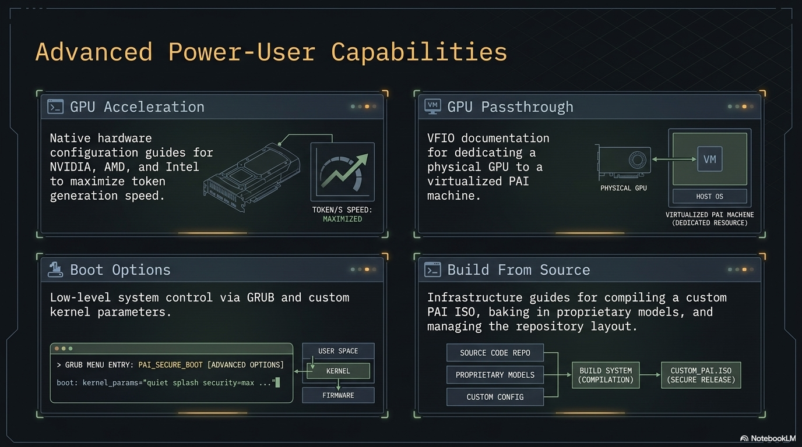

GPU acceleration turns Ollama from "slow but usable" into "interactive realtime" for mid-size models. On CPU, an 8B model might produce 5 tokens per second; on a modern NVIDIA GPU, the same model can hit 50-100+ tokens per second.

**The payoff is real:** if you have a discrete GPU, turning it on moves PAI from "I'll wait for the answer" to "typing speed." NVIDIA, AMD ROCm, and Intel Arc are all supported. The one quirk of a live system — drivers don't persist across reboots — has a clean fix (persistence partition or a custom ISO), covered below.

This guide covers how to enable GPU acceleration on PAI, which GPUs work, and the significant caveat that live systems make this harder than on a regular Linux install.

In this guide:
- Why GPU setup requires persistence (or a custom ISO)
- NVIDIA driver installation
- AMD ROCm setup
- Intel Arc support
- Verifying acceleration is active
- Performance expectations

**Prerequisites**: PAI booted and running. A discrete GPU in the host machine (not a VM — see [Running in a VM](running-in-a-vm.md) for GPU passthrough). Comfortable with the command line.

## The live-system caveat

!!! warning "GPU drivers don't persist by default"

    PAI is a live system. Anything you install with `apt` vanishes on reboot.
    Proprietary GPU drivers are dozens of megabytes of kernel modules, userspace
    libraries, and CUDA/ROCm dependencies. Installing them every boot is painful.


You have three options:

| Option | Effort | Best for |
|---|---|---|
| Install drivers every boot | Low effort per session, but repeated | One-off testing |
| Use [persistence](../persistence/introduction.md) | Medium one-time setup | Daily driver use |
| [Build a custom ISO](advanced/building-from-source.md) with drivers pre-installed | High one-time effort | Distributing to multiple machines |

Persistence (once v0.2 ships) is the sweet spot for most users. Until then, building a custom ISO is the only practical way to have GPU support "just work" at every boot.

## NVIDIA setup

### Which NVIDIA GPUs work

Ollama supports NVIDIA GPUs with compute capability 5.0 or higher (Maxwell architecture and newer). In practice, this means any NVIDIA GPU from roughly 2014 onward.

Minimum VRAM for useful acceleration:

| VRAM | Models that run well |
|---|---|
| 4 GB | 1-3B models (llama3.2:3b, phi-3) |
| 8 GB | 7-8B models (mistral:7b, llama3.1:8b) |
| 12-16 GB | 13-14B models (qwen2.5:14b) |
| 24 GB+ | 30B+ models |

### Install the NVIDIA driver


1. Connect to the internet (wifi or ethernet).

2. Add Debian's `contrib` and `non-free-firmware` repositories:
   ```bash
   sudo sed -i 's|bookworm main|bookworm main contrib non-free non-free-firmware|' /etc/apt/sources.list
   sudo apt update
   ```

3. Install the recommended driver:
   ```bash
   sudo apt install -y nvidia-driver firmware-misc-nonfree
   ```
   This pulls the version that matches your kernel. Expect ~500 MB download.

4. Load the module:
   ```bash
   sudo modprobe nvidia
   ```

5. Verify the driver is loaded:
   ```bash
   nvidia-smi
   ```
   You should see your GPU listed with the driver version.

6. Restart Ollama so it detects the GPU:
   ```bash
   sudo systemctl restart ollama
   ```


!!! tip "Without a reboot"

    A kernel-level driver usually wants a reboot to guarantee clean module load. On a live system that's not always feasible. `modprobe nvidia` works most of the time; if `nvidia-smi` errors, reboot and try again.


### Verify Ollama is using the GPU

```bash
# Start a model
ollama run llama3.1:8b "Say hello"

# In another terminal, watch GPU usage
nvidia-smi -l 1
```

You should see the `ollama` process using GPU memory and non-zero GPU-Util percentage.

Expected output of `nvidia-smi` while a model is loaded:
```
+-----------------------------------------------------------------------------+
| Processes:                                                                  |
|  GPU   GI   CI        PID   Type   Process name                  GPU Memory |
|        ID   ID                                                   Usage      |
|=============================================================================|
|    0   N/A  N/A     12345      C   ollama_llama_server           4532MiB    |
+-----------------------------------------------------------------------------+
```

## AMD ROCm setup

### Which AMD GPUs work

ROCm support in Ollama is experimental but improving. Officially supported:

- AMD Instinct MI series (data center cards)
- Radeon RX 6800, 6900, 7900 series (RDNA 2 / RDNA 3)
- Some Pro W-series workstation cards

Older GCN-based cards (RX 400/500/Vega) have partial support that sometimes works.

### Install ROCm


1. Connect to internet.

2. Add the AMD ROCm apt repository:
   ```bash
   wget https://repo.radeon.com/rocm/rocm.gpg.key -O - | \
       sudo gpg --dearmor > /usr/share/keyrings/rocm-keyring.gpg

   echo "deb [signed-by=/usr/share/keyrings/rocm-keyring.gpg] https://repo.radeon.com/rocm/apt/debian bookworm main" \
       | sudo tee /etc/apt/sources.list.d/rocm.list
   ```

3. Update and install:
   ```bash
   sudo apt update
   sudo apt install -y rocm-hip-runtime rocm-llvm
   ```

4. Add your user to the `render` and `video` groups:
   ```bash
   sudo usermod -aG render,video $USER
   ```

5. Log out and back in (on live PAI, a reboot is effectively the same).

6. Verify ROCm sees the GPU:
   ```bash
   rocminfo | grep "Name:"
   ```
   You should see your GPU listed.

7. Restart Ollama:
   ```bash
   sudo systemctl restart ollama
   ```


### Verify acceleration

```bash
# While a model is running
watch -n 1 'rocm-smi --showuse'
```

## Intel Arc setup

Intel Arc GPUs (A380, A580, A750, A770) have experimental Ollama support through the Intel Extension for PyTorch (IPEX-LLM). Setup is more involved and less stable than NVIDIA or AMD.

As of this writing, most users on Intel Arc stick to CPU-only inference and accept the speed hit. If you want to experiment, the [Ollama Intel Arc docs](https://github.com/ollama/ollama/issues?q=intel+arc) have current status.

## Performance expectations

Rough tokens-per-second for `llama3.1:8b` (your mileage will vary):

| Hardware | Tokens/sec | Feel |
|---|---|---|
| CPU only, Ryzen 5700X | 4-6 | Slow — like waiting for dial-up |
| CPU only, Core i9-13900K | 8-12 | Slow but usable |
| NVIDIA GTX 1070 (8 GB) | 25-35 | Fast enough for interactive chat |
| NVIDIA RTX 3060 (12 GB) | 40-60 | Clearly interactive |
| NVIDIA RTX 3090 (24 GB) | 80-120 | Feels like cloud AI |
| NVIDIA RTX 4090 (24 GB) | 120-180 | Realtime, very snappy |
| AMD RX 7900 XT (20 GB) | 50-80 | Good, comparable to RTX 3060-3080 range |

For anything above 7B parameters, GPU acceleration moves the experience from "functional" to "great."

## Tutorial: Verify your GPU is accelerating Ollama

### Goal
Confirm that your model is running on the GPU, not the CPU.

### What you need
- GPU driver installed (follow the relevant section above)
- A model pulled (`ollama pull llama3.1:8b`)
- Two terminal windows


1. In terminal 1, start a conversation:
   ```bash
   ollama run llama3.1:8b "Count to 100, one number per line."
   ```
   This will generate a long response, giving you time to inspect.

2. In terminal 2, watch GPU usage:
=== "NVIDIA"
       ```bash
       watch -n 1 nvidia-smi
       ```
=== "AMD"
       ```bash
       watch -n 1 'rocm-smi --showuse --showmemuse'
       ```

3. Look for:
   - The `ollama_llama_server` process listed
   - Non-zero GPU-Util (usually 40-100% during generation)
   - Multi-GB GPU Memory Usage

4. If you see zero GPU usage and the generation is slow, Ollama is falling back to CPU. Check:
   ```bash
   journalctl -u ollama -n 50
   ```
   Look for messages about GPU detection. Common errors: missing driver, incompatible CUDA version, insufficient VRAM.


### What just happened

Ollama detected your GPU when it started, loaded the model weights into VRAM, and is computing each token on the GPU. The CPU is just coordinating input and output. This is typically 5-20x faster than CPU inference.

## Troubleshooting

### "CUDA driver initialization failed"
Reboot. Live systems sometimes load the driver incompletely when done with `modprobe` alone.

### "nvidia-smi: command not found"
Driver wasn't installed or the install failed halfway. Reinstall with `sudo apt reinstall nvidia-driver`.

### GPU is detected but Ollama still uses CPU
Check `journalctl -u ollama` — Ollama logs when it successfully uses GPU vs falls back to CPU. If it's falling back, the most common cause is insufficient VRAM for the model you're trying to run.

### Out-of-memory on GPU
Switch to a smaller model or a more aggressively quantized variant:
```bash
ollama pull qwen2.5:7b-instruct-q4_K_M   # 4-bit, smaller VRAM footprint
```

## Frequently asked questions

### Do I need a GPU to run PAI?
No. PAI runs on CPU just fine for small models (1-3B parameters). GPU acceleration is an optional upgrade that makes larger models interactive. The default `llama3.2:1b` model runs well on any modern CPU.

### Will my old GPU work?
For NVIDIA: anything from 2014 onward with compute capability 5.0+ should work. For AMD: RX 6000 series and newer are best supported. Integrated graphics (Intel HD, AMD APU) usually cannot run LLMs — they lack dedicated VRAM.

### Can I use the GPU in a VM?
Yes, but it requires GPU passthrough configuration on the host — see [GPU Passthrough](gpu-passthrough.md). UTM on Apple Silicon does not support GPU passthrough to Linux guests.

### Do I need CUDA installed separately?
No. Debian's `nvidia-driver` package bundles everything Ollama needs. You do not need to install the NVIDIA CUDA Toolkit separately.

### How much VRAM does each model need?
Roughly 1 GB per billion parameters for 4-bit quantized models. A 7B model needs ~5 GB VRAM, a 14B model needs ~9 GB, a 70B model needs ~40 GB. Running out of VRAM causes fallback to CPU or outright failure.

### Can I use two GPUs?
Ollama can split a model across multiple GPUs if it's too big for one. Set `CUDA_VISIBLE_DEVICES=0,1` in the Ollama systemd unit. Single-GPU is simpler and usually sufficient.

### Does the GPU driver leak privacy info?
NVIDIA's closed-source driver does contain telemetry hooks, but they are off by default on Linux. You can confirm with `nvidia-smi -q | grep -i telemetry`. For maximum privacy, AMD open-source drivers (mesa + amdgpu) are the safest option, though they have weaker Ollama acceleration.

### Will my GPU use power when idle?
Yes, a few watts. If you care about battery life on a laptop, you can unbind the GPU with `nvidia-smi drain` commands, but the setup is finicky. Desktops: the idle power draw is negligible.

## Related documentation

- [**Choosing a model**](../ai/choosing-a-model.md) — What models fit in what VRAM
- [**Running PAI in a VM**](running-in-a-vm.md) — GPU passthrough for VM users
- [**GPU Passthrough**](gpu-passthrough.md) — Dedicated doc on VM GPU passthrough
- [**System Requirements**](../general/system-requirements.md) — Baseline hardware
- [**Persistence Introduction**](../persistence/introduction.md) — Required to avoid reinstalling drivers every boot
- [**Building from Source**](advanced/building-from-source.md) — Pre-install GPU drivers in a custom ISO
