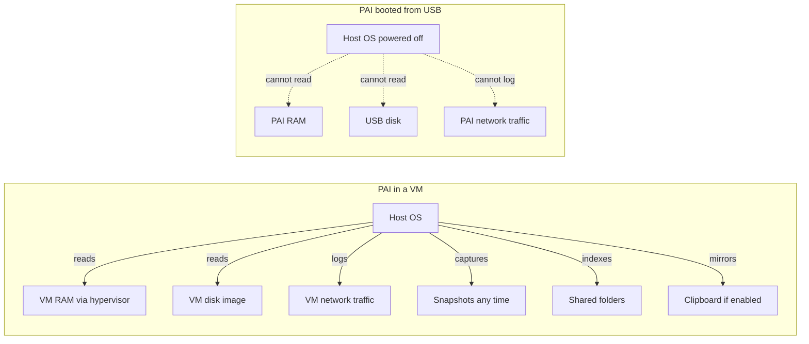

**PAI** — the bootable offline AI Linux distribution — runs inside every major hypervisor: **UTM** on macOS, **VirtualBox** and **VMware Player** on Windows, **Hyper-V** on Windows Pro, and **QEMU/KVM** on Linux. Running PAI in a VM is the fastest way to evaluate the project without flashing a USB drive, and it is the most flexible option for development or doc work. A virtual machine is not, however, a substitute for booting from USB when privacy is the goal: the host operating system retains full visibility into the guest's memory, disk, and network. This guide explains when a VM is appropriate, how to configure each hypervisor for Sway and Ollama, and which settings silently leak data if you leave them at their defaults.

**Good news first:** a VM is a great way to kick the tires. Pick your hypervisor, allocate 4 GB of RAM and 2 CPUs, boot the ISO, and you're chatting with a local model in a few minutes — no USB, no reboot, no commitment. The privacy tradeoffs below matter when you need the full leave-no-trace story; for "show me what PAI feels like," the VM is perfect.

In this guide:
- Picking the right hypervisor for your host OS and workload
- Minimum and recommended specs for a usable **PAI virtual machine**
- End-to-end VirtualBox tutorial from download to chatting with a model
- Display, network, clipboard, and shared-folder tuning per hypervisor
- Snapshot privacy traps and why they matter for private AI work
- GPU passthrough, nested virtualization, and serious performance tuning
- A performance reference table for **Ollama virtual machine** setups

**Prerequisites**: a host machine with hardware virtualization enabled in firmware (Intel VT-x or AMD-V on x86, ARMv8 on Apple Silicon), 8 GB or more of host RAM, and a downloaded PAI ISO from the [release page](../index.md). Familiarity with your hypervisor's VM creation wizard is helpful but not required.

---

## When a VM makes sense, and when it does not

A VM is an excellent choice for four workflows:

- **Trying PAI** before committing to a USB-based installation
- **Development and documentation testing** — quick reboots, snapshots, scripted teardown
- **Running PAI alongside your regular desktop work** without rebooting into a different OS
- **Running the PAI ISO on hardware that cannot boot an external USB**, such as a locked-down work laptop you control only through a VM app

A VM is a poor choice for four other workflows:

- **Real privacy or anonymity work.** The host OS logs the VM's network traffic, has read access to VM memory through the hypervisor's debug interfaces, and can snapshot VM state at any time. If the host is compromised, so is the guest.
- **Journalism, activism, or legal work** where an adversary may seize the host device. A native USB boot leaves no trace on the host disk. A VM leaves the VM disk image, plus logs, plus snapshots, plus host swap that may contain guest memory.
- **Production daily use.** VMs are evaluation tooling. Once you know you want PAI, flash a USB and boot natively.
- **GPU-accelerated inference at full speed.** Most consumer hypervisors do not pass a discrete GPU into the guest. You will be **CPU-bound** inside the VM.

!!! warning

    PAI in a VM is "private AI as a service to you" — it is not the same threat model as PAI booted from USB on a powered-off laptop. Read the [warnings and limitations](../general/warnings-and-limitations.md) doc before relying on a VM for sensitive work.


---

## Hypervisor comparison

This table rates each mainstream hypervisor against the axes that matter for **running local AI in a VM**: cost, host platform fit, privacy hygiene, and UX polish. Five stars is best; an X means not supported on that host.

| | UTM | VirtualBox | VMware Player | Hyper-V | QEMU/KVM |
|---|---|---|---|---|---|
| Cost | Free | Free (GPL) | Free (personal) | Free (Win Pro/Ent) | Free |
| Mac (Apple Silicon) | ★★★★★ | ✗ | ✗ | ✗ | ✗ |
| Mac (Intel) | ★★★★ | ★★★ | ★★★ | ✗ | ✗ |
| Windows 10/11 | ✗ | ★★★★ | ★★★★ | ★★★ | ✗ |
| Linux | ★★★ | ★★★ | ★★★ | ✗ | ★★★★★ |
| Privacy hygiene | Good | OK | OK | Good | Best |
| Polished UX | ★★★ | ★★★ | ★★★★ | ★★ | ★★ |
| Sway display support | Excellent | Good | Excellent | Poor | Excellent |
| GPU passthrough | No | No | Partial | No | Yes (VFIO) |
| Snapshots | Yes | Yes | Yes | Yes (checkpoints) | Yes |

**Short version:** on macOS use **UTM**. On Windows use **VirtualBox** if you want open-source, **VMware Player** if you want polish. On Linux use **QEMU/KVM** directly with `virt-manager`. Avoid Hyper-V for PAI unless it is your only option — its display pipeline does not cooperate well with Sway.

!!! tip

    If you just want PAI running in 15 minutes on any OS, **VirtualBox** is the lowest-friction path. The tutorial below assumes VirtualBox.


---

## Minimum and recommended VM specs

The VM needs roughly the same resources as native PAI, plus a small hypervisor tax. Undersizing RAM is the single most common reason **Ollama virtual machine** setups feel broken — the model either fails to load or swaps constantly.

| Resource | Minimum | Recommended | Notes |
|---|---|---|---|
| Guest RAM | 4 GB | 8–16 GB | 2 GB reserved for system; rest for the model |
| vCPUs | 2 | 4–8 | More cores = faster token generation |
| Disk | 20 GB | 40 GB | Sparse/dynamic allocation is fine |
| Display | 2D | virtio-gpu-gl or VMware SVGA with 3D | Sway needs GL |
| USB | 2.0 | 3.0 | For USB passthrough use only |

Always leave at least 4 GB of RAM to the host. Giving the VM every byte of host memory causes the host OS to swap heavily and can starve the hypervisor itself.

---

## VM vs native boot — threat model comparison

The biggest misconception about VMs is that the guest is isolated from the host. It is not. Here is what the host OS can and cannot see in each configuration.



In the VM configuration, the **host retains full observability** of the guest through mechanisms the guest cannot detect. In the native USB configuration, the host is **powered down** and has no runtime visibility at all. That is the entire reason PAI exists as a bootable image.

!!! danger

    If your threat model includes the host OS itself — for example, a work laptop with corporate monitoring, or a device that has been tampered with — running PAI in a VM on that host is equivalent to running PAI on the host. The VM does not help.


---

## Setup per hypervisor

Each hypervisor has its own VM creation flow and its own landmines. Pick your platform below.

=== "UTM (macOS)"

**UTM** is the recommended hypervisor on macOS. On Apple Silicon, install the arm64 PAI ISO and use **Virtualize** mode for near-native speed. On Intel Macs, use **Virtualize** with the amd64 ISO.


1. Install UTM from [mac.getutm.app](https://mac.getutm.app) or the Mac App Store.
2. Click **Create a New Virtual Machine** → **Virtualize** → **Linux**.
3. Point **Boot ISO Image** at the PAI ISO. Leave **Use Apple Virtualization** unchecked — stick with the default QEMU backend, which supports `virtio-gpu-gl-pci`.
4. Set **Memory** to 8192 MB or more, **CPU Cores** to 4 or more, and **Storage** to 40 GB.
5. On the **Display** step, choose **virtio-gpu-gl-pci (GPU Supported)**. This is the single most important setting — without it, Sway will show a black screen.
6. Skip **Shared Directory** unless you have a specific reason for it (see the privacy warning below).
7. Finish the wizard, start the VM, and boot into the PAI live environment.


For a full walkthrough with screenshots, see [Starting on Mac](../first-steps/starting-on-mac.md).

=== "VirtualBox (Windows/Linux)"

**VirtualBox** is the most cross-platform option. The tutorial below is the canonical path.


1. Install VirtualBox from [virtualbox.org](https://www.virtualbox.org/) and the matching **Extension Pack**.
2. Click **New**, name the VM `PAI`, type **Linux**, version **Debian (64-bit)**.
3. Allocate 8192 MB RAM and 4 vCPUs in **System** → **Processor**.
4. Create a 40 GB **VDI** disk, dynamically allocated.
5. In **Settings** → **Display**, set **Graphics Controller** to **VBoxSVGA**, **Video Memory** to 128 MB, and enable **3D Acceleration**.
6. In **Settings** → **Storage**, attach the PAI ISO to the virtual optical drive.
7. In **Settings** → **Network**, leave adapter 1 on **NAT**.
8. Start the VM. PAI boots to the Sway desktop.


=== "VMware Player (Windows/Linux)"

**VMware Workstation Player** is free for personal use and has the most polished display pipeline.


1. Install **VMware Workstation Player** from [vmware.com](https://www.vmware.com/).
2. Click **Create a New Virtual Machine**, select the PAI ISO, and choose guest OS **Linux → Debian 12 64-bit**.
3. Set the VM name, disk size (40 GB), and accept defaults.
4. Before first boot, click **Edit virtual machine settings** → **Memory**: 8192 MB; **Processors**: 4; **Display**: enable **Accelerate 3D graphics** and give it 512 MB video RAM.
5. Boot the VM.


=== "Hyper-V (Windows Pro)"

**Hyper-V** ships with Windows Pro and Enterprise. It works, but its display pipeline fights Sway. Use only if you cannot install VirtualBox.


1. Enable **Hyper-V** via **Turn Windows features on or off** and reboot.
2. Open **Hyper-V Manager** → **New** → **Virtual Machine**. Choose **Generation 2** and disable **Secure Boot** (or select **Microsoft UEFI Certificate Authority**).
3. Assign 8192 MB RAM (disable dynamic memory for predictable Ollama performance), 4 vCPUs, and a 40 GB VHDX.
4. Attach the PAI ISO as a DVD drive.
5. **Disable Enhanced Session Mode** on this VM — Sway does not support the xrdp-based enhanced session.
6. Boot the VM.


=== "QEMU/KVM (Linux)"

On Linux, **QEMU/KVM** via `virt-manager` is the highest-performance option and the one PAI's own build infrastructure uses.


1. Install packages: `sudo apt install qemu-system-x86 libvirt-daemon-system virt-manager ovmf`.
2. Add yourself to the `libvirt` group and re-login.
3. Open `virt-manager`, click **Create a new virtual machine**, point at the PAI ISO, select **Debian 12**.
4. Allocate 8192 MB RAM and 4 vCPUs.
5. Create a 40 GB qcow2 disk using `virtio` bus.
6. Before first boot, tick **Customize configuration before install**, set **NIC** to `virtio`, **Video** to `virtio` with 3D acceleration, and **Firmware** to UEFI (OVMF).
7. Finish and boot.


---

## Tutorial: VirtualBox end-to-end, download to working AI session

This tutorial takes you from a fresh Windows or Linux host to chatting with a local model in roughly 20 minutes, assuming a reasonable internet connection for the ISO download.

**Goal**: boot PAI in VirtualBox and generate text from `llama3.2:1b` in the Open WebUI browser interface.

**What you need**:
- A host with at least 12 GB of RAM (so 8 GB can be handed to the VM)
- 40 GB of free disk space
- VirtualBox 7.0 or later installed
- The PAI amd64 ISO downloaded


1. **Create the VM.** In VirtualBox, click **New**. Name it `PAI`, select **Linux** / **Debian (64-bit)**. Allocate 8192 MB RAM. Create a VDI disk, dynamically allocated, 40 GB.

2. **Configure the processor.** Open **Settings** → **System** → **Processor**. Set **Processors** to 4. Enable **Enable PAE/NX** and **Enable Nested VT-x/AMD-V** if available.

3. **Configure display.** Under **Settings** → **Display**: set **Video Memory** to 128 MB, **Graphics Controller** to **VBoxSVGA**, and tick **Enable 3D Acceleration**.

4. **Attach the ISO.** Under **Settings** → **Storage**, click the empty optical drive, click the disc icon on the right, and choose the PAI ISO.

5. **Set network.** Leave **Settings** → **Network** → **Adapter 1** at **NAT**. This is the simplest mode and sufficient for this tutorial.

6. **Disable the snapshot trap.** Do not take any snapshots yet. Read the snapshot warning below before you do.

7. **Boot.** Click **Start**. PAI's GRUB menu appears; press Enter on the default entry.

   Expected output:
   ```
   GRUB loading...
   PAI live (default)
   ```

   A minute later, the Sway desktop loads with waybar at the bottom.

8. **Open a terminal.** Press `Super + Enter` (Super is the Windows key) to open Foot terminal.

9. **Confirm Ollama is running.**
   ```bash
   # List installed models
   ollama list
   ```

   Expected output:
   ```
   NAME               ID              SIZE      MODIFIED
   llama3.2:1b        a2af6cc6c18c    1.3 GB    included in ISO
   ```

10. **Run your first prompt.**
    ```bash
    # Send a prompt directly to Ollama from the CLI
    ollama run llama3.2:1b "Write a haiku about virtual machines."
    ```

    Expected output:
    ```
    Silent rings of code,
    Guest inside a hosting world,
    Threads dance, unaware.
    ```

11. **Open Open WebUI in the browser.** Click the Firefox icon in waybar, then navigate to `http://localhost:8080`. The browser chat interface loads.

12. **Tune Ollama for VM use** by creating a drop-in environment file:
    ```bash
    sudo mkdir -p /etc/systemd/system/ollama.service.d
    sudo tee /etc/systemd/system/ollama.service.d/vm.conf <<EOF
    [Service]
    Environment="OLLAMA_NUM_PARALLEL=1"
    Environment="OLLAMA_MAX_LOADED_MODELS=1"
    EOF
    sudo systemctl daemon-reload
    sudo systemctl restart ollama
    ```

    These settings prevent Ollama from loading a second model in parallel, which in a memory-constrained VM would cause thrashing.


**What just happened?** You created a virtualized x86_64 machine, booted PAI's live ISO inside it, and ran a 1B-parameter large language model end-to-end without any network traffic leaving the guest. The model response was generated on emulated CPU cores backed by your host's physical cores, and the chat session exists only in the VM's RAM.

**Next steps:** read [Managing Models](../ai/managing-models.md) to pull a larger model, or [Privacy Mode](../privacy/introduction-to-privacy.md) to see how the Tor integration behaves inside a VM.

---

## Display and graphics tuning

Sway is a Wayland compositor. It requires a working OpenGL or GLES path from the guest driver to the host. The right setting varies by hypervisor.

- **UTM**: `virtio-gpu-gl-pci` in Display settings. If you see a black screen, fall back to `virtio-gpu-pci` (software rendering, slower but reliable).
- **VirtualBox**: `VBoxSVGA` with 3D acceleration enabled and at least 128 MB of video memory.
- **VMware Player**: default **VMware SVGA** with 3D acceleration enabled. VMware's guest tools deliver the best desktop performance of any consumer hypervisor.
- **Hyper-V**: **disable Enhanced Session Mode** on the VM's properties. Sway cannot use the xrdp-based enhanced session, and leaving it on causes the VM console to go black after login.
- **QEMU/KVM**: `virtio` video with `virgl` enabled, or `virtio-gpu-gl-pci` directly.

If the hypervisor does not resize the guest display dynamically, edit the Sway output line in `/etc/skel/.config/sway/config` to force a fixed resolution such as `1920x1080@60Hz`.

---

## Network modes

Every hypervisor offers at least three network modes. Each has a different privacy profile.

- **NAT / Shared.** The VM gets internet access through the host's network stack. The VM sees a private IP; the outside world sees only the host's IP. This is the most convenient mode and the best default for evaluation. The host OS, however, sees every packet.
- **Bridged.** The VM appears as a separate device on your LAN with its own IP. The router logs both the host and the guest MAC addresses. PAI spoofs the guest MAC on each boot, but your router's ARP table and your ISP modem's logs still record both.
- **Host-only.** No internet access at all. Useful for testing PAI's fully offline behavior without pulling the virtual network cable. Rarely necessary because PAI is designed to work offline.

For most users, NAT is the right choice. If you are simulating PAI's native network behavior on a LAN, use bridged. Do not use host-only unless you have a specific reason.

---

## Snapshots — a privacy trap

!!! danger

    **Snapshots capture the full memory of the guest VM, including unencrypted RAM, decrypted GPG material, Tor circuit keys, mounted LUKS volumes, and any secrets the user has typed into the session.** A snapshot written to the host disk is a forensic goldmine that persists forever. If you are using PAI for sensitive work, do not take snapshots, and delete any snapshots that already exist.


Snapshot files on each hypervisor live at predictable paths and are trivial to extract:

- **VirtualBox**: `~/VirtualBox VMs/<name>/Snapshots/*.sav`
- **VMware**: `<vm>.vmsn`, `<vm>.vmss`
- **Hyper-V**: `.vmrs` and `.bin` files under the VM's checkpoint folder
- **UTM**: inside the `.utm` bundle under `Data/`
- **QEMU/KVM**: qcow2 internal snapshots, or `.vmstate` with `savevm`

If you must snapshot for development reasons, snapshot the VM while it is **powered off**. A powered-off snapshot is a disk-image backup only, not a memory capture.

---

## Shared folders — also a trap

!!! danger

    **Shared folders defeat the point of running PAI at all.** Files you create inside PAI end up on the host filesystem, where the host's indexer (Spotlight, Windows Search, GNOME Tracker) will fingerprint them, and where they persist across PAI reboots on the host disk rather than evaporating with the RAM session.


Leave shared folders **off** unless you have a specific reason — for example, you are building documentation inside the VM and need to copy a single file out. When you do need to transfer a file, prefer a temporary `scp` over the NAT network, or a one-shot HTTP server, over a permanently mounted shared folder.

---

## Clipboard sharing — be aware

Bidirectional clipboard is convenient for pasting model prompts in and copying outputs out. It is also a side channel: your clipboard history app on the host may capture whatever you copy from PAI, and anything you copy on the host — including passwords from a password manager — is readable from inside the VM.

For evaluation work, bidirectional clipboard is fine. For sensitive work, set the clipboard to **host-to-guest only** (or disable it entirely) in the hypervisor's VM settings.

---

## Performance reference

Real-world token generation speed depends on the host CPU, RAM bandwidth, and hypervisor overhead. The table below shows approximate tokens-per-second for `llama3.2:1b` inside each hypervisor on a reference host (Ryzen 7 5800X, 32 GB DDR4-3200, no GPU passthrough). Treat it as a relative ranking rather than an absolute benchmark.

| Hypervisor | 4 GB VM | 8 GB VM | 16 GB VM |
|---|---|---|---|
| QEMU/KVM (virtio) | 28 t/s | 30 t/s | 31 t/s |
| VMware Workstation | 24 t/s | 26 t/s | 27 t/s |
| VirtualBox | 19 t/s | 22 t/s | 23 t/s |
| Hyper-V | 20 t/s | 22 t/s | 22 t/s |
| UTM (Apple M2, arm64) | 35 t/s | 38 t/s | 40 t/s |

Going from 4 GB to 8 GB unlocks room for larger models (7B-class) — above 8 GB the marginal gain on a 1B model is small. Use the saved RAM to pull a bigger model, not to over-provision the VM.

!!! note

    Native USB boot on the same hardware hits roughly 33 t/s on the same 1B model. The QEMU/KVM overhead is small; VirtualBox and Hyper-V pay a more visible tax.


---

## Nested virtualization

PAI does not run nested VMs of its own. Nested virtualization matters only when PAI is itself the guest in a cloud or enterprise hypervisor:

- **Intel**: `VT-x` must be exposed to the nested guest
- **AMD**: `SVM` must be exposed
- **Apple Silicon**: not supported — macOS does not expose nested hypervisor capabilities on M-series chips
- **Google Cloud**: enabled via `--enable-nested-virtualization` on a custom image
- **AWS EC2**: only on `.metal` instances

This mostly matters for automated CI testing. End users do not need to configure nested virtualization to run PAI in a single-layer VM.

---

## GPU passthrough

A discrete GPU makes Ollama up to 30x faster than CPU inference. Most consumer hypervisors do not support GPU passthrough at all:

- **QEMU/KVM with VFIO** on Linux — the only mature option. Requires IOMMU enabled in firmware, a GPU distinct from the host's display, and kernel boot flags (`intel_iommu=on` or `amd_iommu=on`).
- **VMware Workstation Pro** (not Player) — supports PCI passthrough on specific hardware and licenses.
- **VirtualBox, UTM, Hyper-V** — no GPU passthrough for consumer use.

Most users run Ollama on CPU inside the VM and accept the speed hit. If you want GPU acceleration, flash the USB and boot PAI natively, where the GPU is available without any passthrough gymnastics.

---

## Performance tuning beyond the basics

For users who want to push the VM harder:

- **CPU pinning** (KVM): pin VM vCPUs to specific host cores with `virsh vcpupin` for consistent latency. Avoid pinning to Efficiency cores on hybrid CPUs.
- **Memory ballooning**: leave **off** for predictable Ollama performance. Ballooning lets the host reclaim guest RAM, which causes token generation to stall.
- **Disk mode**: use `virtio-scsi` or `virtio-blk`. Avoid IDE and legacy SATA emulation — they cost 10 to 30 percent throughput on model loads.
- **Ollama inside the VM**: set `OLLAMA_NUM_PARALLEL=1` and `OLLAMA_MAX_LOADED_MODELS=1` to keep a single model resident. See the [Ollama guide](../ai/managing-models.md) for more flags.
- **Disable swap inside the VM**: `sudo swapoff -a`. Swap on top of a hypervisor disk file is pathologically slow.

---

## Troubleshooting

- **Black screen after GRUB.** The guest graphics driver is wrong. Switch to `virtio-gpu-gl-pci` (UTM, KVM), `VBoxSVGA` + 3D (VirtualBox), or disable Enhanced Session Mode (Hyper-V).
- **No network inside PAI.** Check the hypervisor's adapter mode. NAT is the safe default. Confirm the host firewall is not blocking the VM's adapter.
- **Ollama fails to start.** Usually insufficient RAM. Raise the VM RAM to 8 GB and reboot.
- **Very slow text generation.** Expected on CPU-only VMs. See the performance table above and consider booting natively.
- **VM freezes on model load.** The guest is swapping. Raise RAM or pick a smaller model such as `llama3.2:1b`.
- **Hypervisor refuses to start VM ("VT-x not available").** Hardware virtualization is disabled in firmware. Reboot into BIOS/UEFI and enable VT-x or AMD-V.

---

## Frequently asked questions

### Is running PAI in a VM as private as booting from USB?
No. When PAI runs in a VM, the host operating system has full visibility into the guest's memory, disk, and network traffic through the hypervisor. A native USB boot powers the host off entirely; a VM does not. For evaluation and development a VM is fine, but for real privacy work — journalism, activism, legal consultation — flash the USB and boot natively. See [warnings and limitations](../general/warnings-and-limitations.md).

### Can I use the host machine while PAI runs in a VM?
Yes. That is the main reason to run PAI in a VM rather than booting from USB. Give the VM 8 GB of RAM and 4 vCPUs, and the host has plenty left for a browser and a couple of apps. Note that running heavy workloads on the host will slow the VM's token generation, because Ollama is CPU-bound.

### What is the best VM for PAI on Windows?
**VirtualBox** if you want a free, open-source hypervisor with straightforward setup. **VMware Workstation Player** if you prefer a more polished display pipeline and are comfortable with a proprietary free-for-personal-use license. Avoid Hyper-V unless you cannot install either — its display behavior fights Sway.

### Will PAI work in a cloud VM?
Usually yes, if nested virtualization is enabled — for example, a `c3-highcpu-8` on Google Cloud with `--enable-nested-virtualization`, or an EC2 `.metal` instance. Cloud VMs make the privacy story dramatically worse, however: the cloud provider has hypervisor-level access to your "private" AI session. PAI in a cloud VM is reasonable for CI and automation but not for sensitive prompts.

### Can VMs access my GPU?
Usually no. **QEMU/KVM with VFIO** on Linux is the only mature GPU passthrough path for consumer hardware. **VMware Workstation Pro** supports it on specific hardware. **VirtualBox, UTM, and Hyper-V** do not. If you want GPU-accelerated Ollama, boot PAI natively from USB; the GPU is available immediately.

### How much disk space does the VM need?
**40 GB** is the recommended size. PAI's base ISO plus included models is around 10 GB; the rest is headroom for pulling additional models, browser cache, and temporary files. You can run with 20 GB if you stick to one small model. Use dynamic allocation so the disk only grows as needed.

### Is UTM free?
Yes. **UTM is free and open source** when downloaded from [mac.getutm.app](https://mac.getutm.app) or the UTM GitHub releases. UTM is also available on the Mac App Store for a small fee — the App Store version is a way to support the project and receive automatic updates, but the features are identical to the free download.

### Do I need to install VirtualBox Guest Additions?
No. PAI is a live ISO and is not designed to have hypervisor guest tools installed into it. Display resizing and network work fine without Guest Additions. Installing them on a live ISO would not persist across reboots anyway.

### Can I run two PAI VMs at once?
Yes, as long as the host has enough RAM and vCPUs to back both. Give each VM its own virtual network adapter to avoid IP collisions. This is useful for testing Ollama API interactions between two PAI instances.

### Why does Sway show a black screen in my VM?
The guest graphics adapter does not expose a working GL path. Switch to `virtio-gpu-gl-pci` in UTM or KVM, enable 3D acceleration with `VBoxSVGA` in VirtualBox, enable 3D in VMware's Display settings, or disable Enhanced Session Mode in Hyper-V.

---

## Related documentation

- [**Starting on Mac**](../first-steps/starting-on-mac.md) — End-to-end UTM setup for Apple Silicon and Intel Macs
- [**Starting on Windows**](../first-steps/starting-on-windows.md) — flash.ps1 PowerShell flasher (with Rufus graphical alternative), VirtualBox, and VMware setup on Windows hosts
- [**System Requirements**](../general/system-requirements.md) — Minimum hardware for running PAI natively or in a VM
- [**Warnings and Limitations**](../general/warnings-and-limitations.md) — The privacy caveats you must understand before trusting any PAI session
- [**Privacy Mode**](../privacy/introduction-to-privacy.md) — How PAI's Tor integration behaves, including inside a VM
- [**Managing Models**](../ai/managing-models.md) — Picking a model size that matches your VM's RAM allocation
- [**Building from Source**](../advanced/building-from-source.md) — For contributors who run the PAI build inside a QEMU/KVM guest
