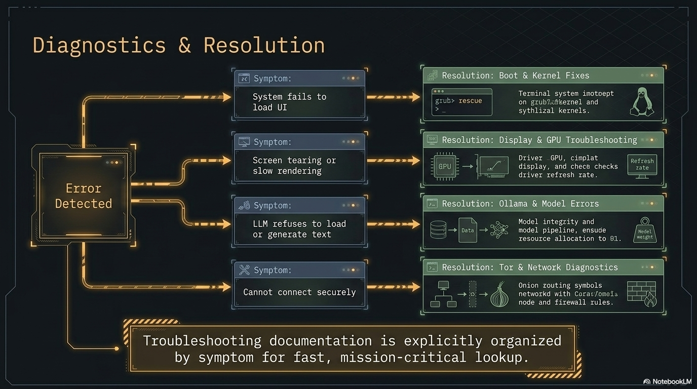
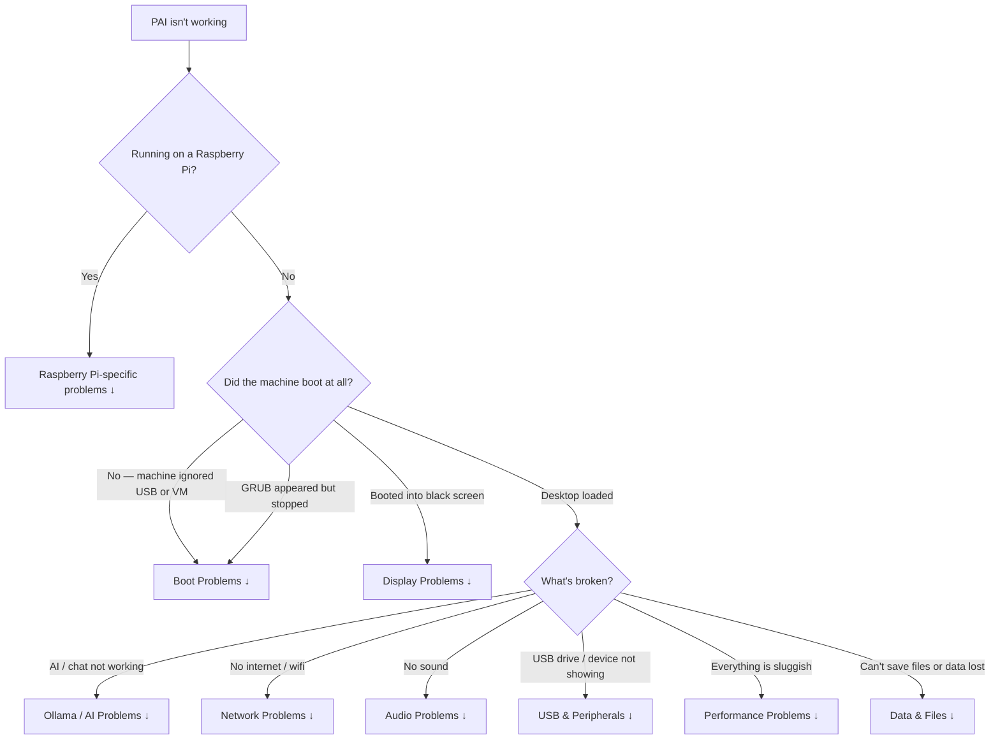

**PAI** is a bootable offline AI Linux distribution. When something goes wrong, the problem almost always falls into one of eight categories: boot, display, Ollama/AI, network, audio, USB/peripherals, performance, or data. This guide is organized strictly by what you observe — not by what might be causing it — so you can jump directly to your symptom and follow the fix.

**Good news first:** PAI is immutable and boots from a read-only image. That means "broken" is almost always fixable by rebooting, re-flashing, or toggling one setting — you can't corrupt the OS, and you can't break the host machine. If a session misbehaves, power off, plug in, and try again; you're back to a known-good state in about 30 seconds. Most of the issues below are one-line fixes.



In this guide:
- Triage flowchart to identify which section applies to your problem
- Step-by-step fixes for every common failure mode
- Diagnostic commands to run before filing a GitHub issue
- Escalation paths when standard fixes don't work
- A complete diagnostic bundle for issue reports

**Prerequisites**: PAI downloaded and either flashed to USB or running in a VM. If PAI never loaded at all, start at [the boot section](#boot-problems).

---

## Which section should I read first?

Use this triage flowchart to find your section before reading further.



---

## Boot problems

### The machine ignores the USB drive

**What you see**: The machine boots into Windows, macOS, or its existing OS instead of PAI. The BIOS/UEFI screen may flash briefly or not appear at all.

**Likely causes**:
- Secure Boot is enabled and blocking unsigned kernels
- Fast Boot is skipping the USB device scan
- The USB was flashed incorrectly (ISO mode instead of DD mode)
- The USB port is faulty or incompatible
- UEFI-only firmware with an MBR-formatted USB (or vice versa)

**Diagnostic steps**:

1. Interrupt the boot and enter your firmware settings. The key is usually `Del`, `F2`, `F10`, or `F12` — it flashes on screen for one to two seconds at power-on. If you miss it, power off and try again.

2. In the firmware menu, look for **Secure Boot** and confirm whether it is enabled.

3. Look for **Fast Boot**, **Ultra Fast Boot**, or **Boot Boost** and confirm whether it is enabled.

4. Check the **Boot Order** list. Is the USB drive listed? If not, it was not detected.

**Fix — Secure Boot**:

1. In firmware settings, navigate to Security → Secure Boot.
2. Set Secure Boot to **Disabled**.
3. Save and exit (`F10` on most machines).
4. Attempt to boot from USB again.

**Fix — Fast Boot**:

1. In firmware settings, find Fast Boot (may be under Advanced or Boot).
2. Set it to **Disabled**.
3. Save and exit, then retry.

**Fix — Incorrectly flashed USB**:

!!! danger

    Reflashing overwrites all data on the USB drive. Confirm you have selected the correct drive in `flash.ps1`, the graphical Rufus tool, or `dd` before proceeding.


On Windows, run `irm https://pai.direct/flash.ps1 | iex` in an elevated PowerShell — it always writes in raw/DD mode. As a graphical alternative, open the Rufus tool, select the PAI ISO, select your USB drive, and under **Partition scheme** choose the one matching your firmware (GPT for UEFI, MBR for Legacy BIOS). Under **Image option**, select **DD Image** — not ISO Image. Click Start.

On Linux or macOS:

```bash
# Replace /dev/sdX with your USB device — confirm with lsblk or diskutil list
sudo dd if=pai-VERSION-amd64.iso of=/dev/sdX bs=4M status=progress conv=fsync
```

**Fix — USB port issues**:

Try a different USB port. USB 3.0 ports (blue) sometimes have compatibility issues with older firmware — try a USB 2.0 port (black) instead. Also try the USB drive in a different machine to rule out a defective drive.

**If none of this works**: Check the [system requirements](../general/system-requirements.md) page. Some machines with unusual firmware implementations cannot boot from USB at all. A VM is the alternative path.

---

### GRUB appears but the kernel fails to load

**What you see**: The GRUB boot menu loads. You select PAI and press Enter. The screen shows kernel loading messages, then stops with an error or hangs.

**Likely causes**:
- "initrd too big" error: older BIOS firmware cannot handle a large initial ramdisk
- "couldn't find squashfs" error: the USB was incompletely written
- Kernel panic immediately after GRUB: hardware incompatibility

**Fix — "initrd too big"**:

Switch the firmware from Legacy BIOS to UEFI mode. UEFI handles large initrds without restriction. If your machine is BIOS-only and cannot be switched, PAI requires a machine that supports UEFI.

**Fix — "couldn't find squashfs"**:

The USB write was interrupted or the ISO was corrupt. Reflash using the steps above. Before reflashing, verify the ISO checksum:

```bash
sha256sum pai-VERSION-amd64.iso
```

Compare the output against the checksum posted on the PAI releases page. If they don't match, re-download the ISO.

---

### Black screen after GRUB

**What you see**: You select PAI at the GRUB menu. The screen goes black. The machine is not frozen — you can hear disk activity or fan changes — but nothing appears on screen.

**Likely causes**:
- The kernel loaded a display driver incompatible with your GPU
- In a VM: the emulated display card doesn't support the graphics mode PAI requests
- The display output is on a different port than expected

**Fix — add `nomodeset` to the kernel command line**:

1. At the GRUB menu, press `e` to edit the boot entry.
2. Find the line beginning with `linux` and ending with `quiet splash` or similar.
3. Move to the end of that line and add a space followed by `nomodeset`.
4. Press `Ctrl+X` or `F10` to boot with the modified command line.

`nomodeset` tells the kernel to use a basic framebuffer driver instead of trying to initialize the GPU. PAI will boot in lower resolution but will be usable.

**Fix — VM display card (UTM)**:

1. Shut down the VM.
2. Open the VM settings in UTM.
3. Under **Display**, change **Emulated Display Card** from `virtio-gpu-gl-pci` to `virtio-gpu-pci` (removes OpenGL acceleration).
4. Start the VM again.

!!! note

    If the screen is black but PAI did load (you can hear audio or see a brief flash of the desktop), check that your display cable is connected to the correct port. Machines with both integrated and discrete GPU sometimes output to different ports depending on which is active.


---

### Stuck at "Loading initial ramdisk" for several minutes

**What you see**: Progress messages stop at "Loading initial ramdisk" (or similar). The machine is not frozen but nothing advances.

**Likely causes**:
- USB 2.0 speed: loading a large initrd from USB 2.0 can take 2 to 4 minutes — this is normal
- Genuine hang: hardware incompatibility or bad USB

**Fix**: Wait. On USB 2.0, loading the initrd legitimately takes 2 to 4 minutes. If 5 minutes pass with no sign of progress (no disk LED activity, no fan change), the system is likely hung. Try a different USB port, a different USB drive, or a different machine.

---

## Display problems

### Screen resolution is wrong

**What you see**: PAI boots but the desktop is at the wrong resolution — too small, too large, or stretching in a VM.

**Fix — change resolution immediately** (without rebooting):

```bash
# List available outputs and modes
wlr-randr

# Apply a specific resolution to an output
wlr-randr --output HDMI-A-1 --mode 1920x1080
```

Expected output from `wlr-randr`:

```
HDMI-A-1 "Some Monitor" (connected)
  1920x1080 @ 60.000 Hz (preferred, current)
  1280x720 @ 60.000 Hz
```

**Fix — persistent resolution** (survives PAI restarts in the same session):

Open the Sway config at `/etc/skel/.config/sway/config` and add:

```
output HDMI-A-1 resolution 1920x1080 position 0,0
```

**Via the GUI**: open Settings → Display and pick your resolution from the dropdown.

---

### Sway desktop loads but waybar is missing

**What you see**: PAI loads into the desktop but there is no status bar at the bottom (no app launcher, no clock, no battery indicator).

**Diagnostic commands**:

```bash
# Check if waybar is running
pgrep waybar

# If not running, start it manually with verbose logging
waybar -l debug 2>&1 | head -50
```

**Likely cause**: A JSON syntax error in the waybar configuration file. The output of `waybar -l debug` will point to the exact line.

**Fix**:

```bash
# Validate the config file with jq
jq . /etc/skel/.config/waybar/config
```

If `jq` reports an error, the line number in the error points to the bad configuration. Fix the JSON, then:

```bash
# Restart waybar
waybar &
```

---

### Cursor is invisible in UTM

**What you see**: PAI boots in UTM, the desktop loads, but the mouse cursor is invisible. You can click and move, but you can't see where the pointer is.

This is a known UTM quirk with certain display card settings. The cursor often reappears after a second or two of mouse movement.

**Fix**:

1. Move the mouse continuously for five to ten seconds.
2. If the cursor doesn't appear, shut down the VM.
3. In UTM VM settings, change **Emulated Display Card** to a different option (try `virtio-gpu-pci` if currently on `virtio-gpu-gl-pci`, or vice versa).
4. Start the VM again.

---

## Ollama / AI problems

### "No models available" in Open WebUI

**What you see**: You open Open WebUI at `localhost:8080` and the model dropdown shows "No models available" or is empty.

**Likely causes**:
- Ollama service hasn't finished starting yet (takes 15 to 30 seconds after boot)
- Ollama service crashed
- No models are downloaded yet

**Diagnostic commands**:

```bash
# Check if Ollama is running
systemctl status ollama

# List installed models directly via Ollama
ollama list
```

Expected output when Ollama is healthy:

```
NAME               ID              SIZE      MODIFIED
llama3.2:1b        a2af6cc6c18c    1.3 GB    2 days ago
```

**Fix — service not started yet**: Wait 30 seconds after boot and refresh Open WebUI.

**Fix — service crashed**:

```bash
# Restart Ollama
sudo systemctl restart ollama

# Watch the logs to confirm it started cleanly
journalctl -u ollama -f
```

**Fix — no models downloaded**: Open a terminal and pull a model:

```bash
# Pull the smallest default model (1.3 GB)
ollama pull llama3.2:1b
```

!!! note

    On a live system without persistence, models must be re-downloaded each session. Enable [persistence](../persistence/introduction.md) to keep downloaded models across reboots.


---

### Open WebUI shows "Connection Error" or blank page

**What you see**: You navigate to `localhost:8080` and see a "Connection Error", a loading spinner that never resolves, or a blank white page.

**Diagnostic commands**:

```bash
# Check if Open WebUI service is running
systemctl status open-webui

# Check what's listening on port 8080
ss -tlnp | grep 8080

# Check recent Open WebUI logs
journalctl -u open-webui -n 50
```

**Fix — service not running**:

```bash
sudo systemctl start open-webui
sudo systemctl status open-webui  # confirm it's now active
```

**Fix — port conflict**: If something else is on port 8080, identify it:

```bash
ss -tlnp | grep 8080
# The last column shows the process name and PID
```

Stop the conflicting process, then restart Open WebUI.

---

### Model responses are extremely slow

**What you see**: You submit a prompt and the response trickles in at one or two tokens per minute, or the machine becomes unresponsive.

**Likely causes**:
- The model is too large for your available RAM
- You are running in a VM without GPU passthrough
- CPU thermal throttling

**Diagnostic commands**:

```bash
# Check available RAM
free -h

# Check CPU usage and temperature
htop

# Check for thermal throttling events
journalctl -k | grep -i throttl | tail -20
```

**Fix — model too large**: Switch to a smaller model. The general rule is that the model's file size must be less than 60% of your available RAM to leave headroom for the OS and Open WebUI.

| Available RAM | Recommended max model size | Example model |
|---|---|---|
| 4 GB | 2 GB | llama3.2:1b (1.3 GB) |
| 8 GB | 4 GB | llama3.2:3b (2.0 GB) |
| 16 GB | 8 GB | llama3.1:8b (4.7 GB) |
| 32 GB | 20 GB | llama3.1:70b-q4 |

See [choosing a model](../ai/choosing-a-model.md) for a full comparison.

**Fix — VM without GPU**: This is expected behavior. VMs without GPU passthrough run inference on CPU only, which is significantly slower. Use the smallest model that meets your needs.

---

### Downloaded a model but it disappeared after reboot

**What you see**: You pulled a model with `ollama pull` and it worked. After rebooting PAI, the model is gone.

This is expected behavior on a live system. PAI runs entirely in RAM by default. When you shut down, everything in RAM — including downloaded models — is erased. This is a core privacy feature.

**Fix**: Enable [persistence](../persistence/introduction.md) to create an encrypted partition where Ollama models and other data survive reboots.

---

### Ollama generation cuts off mid-sentence

**What you see**: The model's response stops abruptly in the middle of a sentence or thought, without completing the answer.

**Fix — increase context in Open WebUI**:

1. In Open WebUI, open Settings (gear icon).
2. Navigate to Advanced Parameters.
3. Increase **Context Length** from the default to 4096 or 8192.
4. Submit your prompt again.

Alternatively, if the model hit its maximum output token limit, the response is complete — ask it to "continue" in the chat.

---

## Network problems

### Wi-Fi not appearing in network settings

**What you see**: The network settings show no wireless adapters. The Wi-Fi toggle does nothing.

**Diagnostic commands**:

```bash
# Check if the adapter is blocked by rfkill
rfkill list

# Check if the adapter is visible to the kernel
ip link show

# Check if a driver is loaded
lspci -v | grep -A 10 -i network
```

**Fix — rfkill block**:

```bash
rfkill unblock wifi
```

**Fix — MAC address spoofing conflict**:

PAI randomizes your MAC address at boot for privacy. Occasionally this conflicts with driver initialization.

```bash
sudo systemctl stop pai-mac-spoof
sudo systemctl restart NetworkManager
```

**Fix — missing firmware**: Some Wi-Fi cards require proprietary firmware that is not included in PAI by default. If you have an ethernet connection:

```bash
# Identify the firmware package needed
sudo dmesg | grep -i firmware | tail -20

# Install it (this will be lost on next reboot without persistence)
sudo apt install firmware-iwlwifi  # Intel
sudo apt install firmware-realtek  # Realtek
```

!!! warning

    Installing firmware requires a temporary internet connection via ethernet. The installed firmware will not persist across reboots unless you have enabled persistence.


---

### Connected to Wi-Fi but no internet access

**What you see**: PAI shows a Wi-Fi connection with full signal. Browsing doesn't work. Some apps say "no network."

**Diagnostic commands**:

```bash
# Test raw IP connectivity — bypasses DNS
ping -c 3 1.1.1.1

# Test DNS resolution
resolvectl query example.com

# Check current DNS servers
cat /etc/resolv.conf
```

**Fix — DNS failure** (ping works but browsing doesn't):

```bash
# Temporarily set a working DNS server
echo "nameserver 1.1.1.1" | sudo tee /etc/resolv.conf
```

**Fix — captive portal**: Some networks (hotels, airports) require you to sign in through a browser before allowing traffic. Open Firefox and try navigating to any HTTP (not HTTPS) address — the captive portal redirect usually only works on plain HTTP.

---

### Privacy mode is on but traffic isn't going through Tor

**What you see**: You enabled privacy mode but want to confirm traffic is routed through Tor.

**Diagnostic commands**:

```bash
# Test Tor routing — should return a Tor exit node IP, not your real IP
curl --socks5 localhost:9050 https://check.torproject.org/api/ip

# Check Tor service status
systemctl status tor

# Watch Tor logs
journalctl -u tor -f
```

Expected output from the `curl` command:

```json
{"IsTor": true, "IP": "185.220.101.x"}
```

**Fix — Tor service not running**:

```bash
sudo systemctl start tor
# Wait 20–30 seconds for Tor to establish circuits, then test again
```

---

## Audio problems

### No sound

**What you see**: PAI is running but there is no audio output. Media players show audio playing but nothing comes out of speakers or headphones.

**Diagnostic commands**:

```bash
# Check PipeWire audio state
wpctl status

# List audio output devices
pactl list sinks short
```

Expected output from `wpctl status`:

```
Audio
 ├─ Devices:
 │     55. Built-in Audio  [alsa]
 ├─ Sinks:
 │     57. Built-in Audio Analog Stereo  [vol: 1.00]
 └─ Sources: ...
```

**Fix — device muted**:

```bash
# Unmute the default output
wpctl set-mute @DEFAULT_AUDIO_SINK@ 0

# Set volume to 80%
wpctl set-volume @DEFAULT_AUDIO_SINK@ 0.8
```

**Fix — wrong output device**: Open `pavucontrol` from the application launcher. Click **Output Devices**. Right-click the device you want and select **Set as Fallback**.

---

### Microphone not working

**What you see**: Voice input in apps doesn't work. Recording produces silence.

**Diagnostic commands**:

```bash
# Check input devices
pactl list sources short

# Test microphone recording (records 5 seconds, plays back)
arecord -d 5 /tmp/test.wav && aplay /tmp/test.wav
```

**Fix — input levels**: Open `pavucontrol`, click **Input Devices**, and check that the input level meter shows activity when you speak and the volume is not at zero.

**Fix — USB microphone not recognized**:

```bash
# Load the USB audio kernel module
sudo modprobe snd-usb-audio

# Verify it was recognized
dmesg | tail -20 | grep -i usb
```

---

## USB and peripheral problems

### External USB drive not appearing in the file manager

**What you see**: You plug in a USB drive but it doesn't appear in Thunar or on the desktop.

**Diagnostic commands**:

```bash
# Check if the kernel detected the device
lsblk

# Check for errors during device recognition
dmesg | tail -30
```

Expected output from `lsblk` with a connected drive:

```
NAME   MAJ:MIN RM   SIZE RO TYPE MOUNTPOINT
sda      8:0    0 238.5G  0 disk
├─sda1   8:1    0   512M  0 part /boot/efi
sdb      8:16   1  14.9G  0 disk        ← your USB drive
└─sdb1   8:17   1  14.9G  0 part
```

**Fix — not mounted**: Click the drive in Thunar, or mount it manually:

```bash
udisksctl mount -b /dev/sdb1
```

**Fix — encrypted LUKS drive**:

```bash
# Unlock the encrypted partition (prompts for passphrase)
udisksctl unlock -b /dev/sdb1

# Then mount the unlocked partition
udisksctl mount -b /dev/dm-0
```

!!! danger

    Never run `fsck` or other filesystem repair tools on a mounted partition. Always unmount first with `udisksctl unmount -b /dev/sdb1` before attempting repair.


---

### YubiKey or smart card not detected

**What you see**: You insert a YubiKey or other smart card but `gpg --card-status` shows "No card" or returns an error.

**Diagnostic commands**:

```bash
# Check if the USB device is visible to the kernel
lsusb | grep -i yubikey

# Check GPG card status
gpg --card-status

# Check PC/SC daemon
pcscd --debug --foreground 2>&1 | head -30
```

**Fix**:

```bash
# Restart the PC/SC daemon
sudo systemctl restart pcscd

# Verify card status again
gpg --card-status
```

In Kleopatra: open Tools → Manage Smart Cards and click **Reload**.

---

## Performance problems

### Everything is sluggish — desktop, apps, and AI

**What you see**: PAI feels slow across the board. The desktop lags, apps take a long time to open, and AI responses are very slow.

**Diagnostic commands**:

```bash
# Check available RAM
free -h

# Check CPU and memory usage
htop

# Check for OOM (Out of Memory) events
journalctl -k | grep -i "out of memory" | tail -10

# Check for thermal throttling
cat /sys/class/thermal/thermal_zone*/temp 2>/dev/null
```

**Fix — low RAM**: Close applications you're not using. Ollama models stay in RAM after loading. Unload the model:

```bash
# List running models
ollama ps

# Unload a specific model to free RAM
ollama stop llama3.2:1b
```

**Fix — VM RAM allocation**: Shut down the PAI VM, open the VM settings, and increase the RAM allocation to at least 8 GB. Changes take effect on the next start.

**Fix — thermal throttling**: Let the machine cool for 10 to 15 minutes. Ensure ventilation is not blocked. On laptops, using a cooling pad helps during extended inference sessions.

---

### Firefox or apps crash frequently

**What you see**: Applications quit unexpectedly. Firefox shows crash recovery dialogs frequently.

**Diagnostic commands**:

```bash
# Check for OOM kills
journalctl -k | grep -i "out of memory" | tail -20

# Check available memory right now
free -h
```

If the OOM killer is firing, the machine is running out of RAM. The kernel is terminating processes to free memory.

**Fix**: Close Ollama models you're not using (see above), reduce the number of open tabs, or increase RAM allocation in your VM settings.

---

## Data and file problems

### "Read-only filesystem" error when saving files

**What you see**: You try to save a file or install something and get "Read-only file system" or "Permission denied."

This is expected behavior. PAI's root filesystem is a compressed squashfs image — it is read-only by design. You cannot write to it directly.

**Where you can write**:

| Location | Persists across reboots? | Notes |
|---|---|---|
| `/tmp` | No | Cleared at shutdown |
| `/home/user` | No | RAM-backed, cleared at shutdown |
| External USB drive | Yes | Must be mounted |
| Persistence partition | Yes | Requires [persistence setup](../persistence/introduction.md) |

```bash
# Check where a directory lives
df -h /path/to/directory
```

---

### Files disappeared after reboot

**What you see**: Files you created or downloaded during a session are gone after rebooting.

This is expected behavior. PAI is a live system — all session data lives in RAM and is erased on shutdown. This is intentional and is a core privacy feature.

**Fix**: To keep files across reboots, either:
1. Copy them to an external USB drive before shutting down, or
2. Set up [persistence](../persistence/introduction.md) — an encrypted partition where specified paths survive reboots.

!!! tip

    Before shutting down, always copy any important files to an external drive. PAI will not warn you that unsaved data will be lost.


---

## Raspberry Pi-specific problems

Problems on a Raspberry Pi cross several of the categories above but share a small number of Pi-only root causes — EEPROM bootloader version, under-voltage, and missing onboard Wi-Fi firmware. Check these first before deeper debugging. The full Pi install reference is [Install PAI on Raspberry Pi](../first-steps/using-raspberry-pi-imager.md).

### Pi 4 won't boot from USB

The original Pi 4 EEPROM bootloader (2019) only boots from the SD card. Update the EEPROM from Raspberry Pi OS, then re-try:

```bash
sudo rpi-eeprom-update -a
sudo reboot
sudo raspi-config    # Advanced Options → Boot Order → USB Boot
```

Pi 5 and Pi 400 boot from USB by default; no EEPROM steps are required.

### Pi boots to a rainbow screen and halts

The firmware on the Pi's EEPROM is too old to load the kernel. Boot Raspberry Pi OS from a different card, run `sudo rpi-eeprom-update -a`, reboot, then re-try PAI.

### Pi shows a lightning-bolt icon or reboots under load

Under-voltage. The Pi's `vcgencmd get_throttled` reports it — anything non-zero means the supply or cable is dropping voltage under load. Use the official Pi 5 (5 V / 5 A) or Pi 4 (5 V / 3 A) power supply. Third-party supplies that advertise the right amperage but ship with under-spec cables are the most common culprit.

```bash
vcgencmd get_throttled
# Expected healthy: throttled=0x0
# Anything else: decode the bits per https://www.raspberrypi.com/documentation/
```

### Wi-Fi missing or unstable on a new Pi model

PAI ships the Broadcom firmware for the supported Pi models at build time. If a brand-new Pi revision ships with a chip variant PAI's firmware doesn't cover:

```bash
dmesg | grep -i brcm
```

A line like `brcmfmac: firmware file not found` identifies the missing blob. Options: boot a newer PAI image (the firmware is updated each release), or install `firmware-brcm80211` inside PAI with [persistence](../persistence/introduction.md) enabled so the install survives reboot.

### Raspberry Pi Imager's "OS Customization" dialog asked about Wi-Fi and SSH

Those presets (hostname, Wi-Fi, SSH key injection) target Raspberry Pi OS specifically and are ignored by PAI. Click **No** or **Skip** at the prompt. Configure Wi-Fi through waybar and enable SSH inside PAI after boot:

```bash
sudo systemctl enable --now ssh
sudo passwd user
```

### Pi Zero 2 W fails to reach the desktop

The Zero 2 W has 512 MB of RAM. Sway plus Ollama plus the default 1B model does not fit. Either run the Pi Zero 2 W headlessly and interact with Ollama over SSH, or switch to a much smaller model (sub-1B, heavily quantized). See [Install PAI on Raspberry Pi — Expected first boot](../first-steps/using-raspberry-pi-imager.md#expected-first-boot) for the recommended Zero 2 W workflow.

---

## Tutorial: diagnosing a broken PAI session in under five minutes

**Goal**: collect enough information to understand and fix a problem, or to file a useful bug report.

**What you need**: PAI running (even if something is broken), a terminal open.

1. Open a terminal (`Super+Return` in Sway, or right-click the desktop).

2. Capture system information:
   ```bash
   inxi -Fxz 2>&1 | tee /tmp/sysinfo.txt
   ```
   This produces a comprehensive hardware and software summary. The `-z` flag redacts sensitive information like serial numbers.

3. Capture the boot log:
   ```bash
   journalctl -b > /tmp/boot.log
   ```

4. Capture PCI device list:
   ```bash
   lspci -vv > /tmp/lspci.log
   ```

5. If the problem involves Ollama, capture Ollama logs:
   ```bash
   journalctl -u ollama -n 200 > /tmp/ollama.log
   ```

6. Combine into a single bundle:
   ```bash
   tar czf /tmp/pai-debug-bundle.tar.gz /tmp/sysinfo.txt /tmp/boot.log /tmp/lspci.log /tmp/ollama.log 2>/dev/null
   echo "Bundle saved to /tmp/pai-debug-bundle.tar.gz"
   ```

7. Copy the bundle to an external drive:
   ```bash
   # Replace /media/user/DRIVE with your external drive mount point
   cp /tmp/pai-debug-bundle.tar.gz /media/user/DRIVE/
   ```

**What just happened?** You collected the four most useful pieces of diagnostic data: hardware profile, boot log, PCI devices, and service logs. Attach `pai-debug-bundle.tar.gz` when filing a GitHub issue.

**Next steps**: [File an issue on GitHub](https://github.com/nirholas/pai/issues) with the bundle attached.

---

## Diagnostic info bundle — full command list

Run these before filing a GitHub issue. They produce no output to the screen that can reveal sensitive data.

```bash
# Full system hardware and software profile (sensitive info redacted)
inxi -Fxz

# Boot log for the current session
journalctl -b

# Kernel messages only
journalctl -k

# Ollama service logs
journalctl -u ollama -n 200

# Open WebUI service logs
journalctl -u open-webui -n 100

# PCI devices (GPU, network cards)
lspci -vv

# USB devices
lsusb -v 2>/dev/null | head -100

# Memory usage
free -h

# Disk usage
df -h

# Running processes
ps aux --sort=-%mem | head -30

# Network interfaces
ip link show
ip addr show
```

---

## When NOT to file a GitHub issue

Before filing, check:

- Is your hardware in the [known-incompatible list](../general/system-requirements.md)? Hardware incompatibility is not a bug.
- Are you running a custom build or fork? Issues on forks belong in that fork's tracker.
- Is the problem reproducible only after you changed non-default configuration? Document your changes and include them in the report.
- Is the question answered elsewhere in the docs? Check [the FAQ](../reference/faq.md) and use the search bar.

If none of those apply, file the issue with your diagnostic bundle at [https://github.com/nirholas/pai/issues](https://github.com/nirholas/pai/issues).

For security-sensitive problems (potential vulnerabilities, credential exposure), do not file a public issue. See `SECURITY.md` in the repository root instead.

---

## Frequently asked questions

### Why doesn't PAI boot on my machine even though it meets the system requirements?

System requirements cover the minimum hardware specifications, not all possible firmware configurations. UEFI/BIOS firmware varies widely between manufacturers and even between firmware versions on the same hardware. The most common causes are Secure Boot, Fast Boot, or USB mode mismatches. Work through the [boot troubleshooting section](#boot-problems) above, disabling Secure Boot and Fast Boot as the first two steps.

### PAI not working after I updated my BIOS — what happened?

BIOS updates sometimes re-enable Secure Boot or reset boot order settings to factory defaults. Re-enter your firmware settings, disable Secure Boot and Fast Boot, set the USB drive first in the boot order, and try again.

### Why does Ollama not start in PAI?

Ollama is a system service that starts automatically at boot. If it's not responding, the service may still be initializing (wait 30 seconds) or it may have crashed. Run `systemctl status ollama` to check its state. If it shows "failed," run `sudo systemctl restart ollama` and then `journalctl -u ollama -n 50` to read the error. The most common cause is insufficient available RAM.

### Can I run PAI offline AI on 4 GB of RAM?

Yes, with limitations. 4 GB RAM can run llama3.2:1b (1.3 GB) with the operating system overhead using most of the remaining RAM. You will not be able to run larger models. The AI will work, but performance will be slow, and you should avoid opening many applications simultaneously. See the [system requirements](../general/system-requirements.md) for the full breakdown.

### Why did my downloaded model disappear after I rebooted PAI?

PAI is a live system — all session data, including downloaded Ollama models, lives in RAM and is erased at shutdown. This is a deliberate privacy feature. Enable [persistence](../persistence/introduction.md) to keep models (and other data) across reboots in an encrypted partition.

### PAI black screen fix — how do I get past a black screen after GRUB?

Press `e` at the GRUB menu to edit the boot entry. Find the line starting with `linux` and add `nomodeset` to the end of it. Press `Ctrl+X` to boot. This disables GPU mode-setting and uses a basic framebuffer driver, which resolves compatibility issues with most GPUs. In a VM, also try changing the emulated display card in VM settings.

### What should I do if PAI boots but the desktop never appears?

If GRUB loaded and the kernel started but you never see the Sway desktop, the display compositor likely failed. Boot with `nomodeset` (see above). If the desktop appears with `nomodeset`, the issue is GPU driver compatibility. If it doesn't appear even with `nomodeset`, check `journalctl -b | grep -i sway` for error messages.

### Ollama not starting PAI — what's the difference between Ollama stopped and Ollama crashed?

`systemctl status ollama` tells you: `active (running)` means it's healthy, `active (exited)` means it's still initializing, `failed` means it crashed. For a crashed service, `journalctl -u ollama -n 50` shows the error. Common crash causes are out-of-memory conditions (model too large for available RAM) and file permission errors.

### Why is Wi-Fi missing after boot on my machine?

Some Wi-Fi adapters require proprietary firmware not included in PAI. Connect via ethernet, then install the firmware package for your adapter (`firmware-iwlwifi` for Intel, `firmware-realtek` for Realtek). Run `dmesg | grep -i firmware` to identify what your adapter needs. Note that firmware installed in a live session is lost at reboot unless you have persistence enabled.

### PAI UTM problem — cursor is invisible, what do I do?

This is a known UTM display driver quirk. Move the mouse for five to ten seconds — the cursor usually reappears. If it doesn't, shut down the VM and change the emulated display card in UTM settings. Switching between `virtio-gpu-pci` and `virtio-gpu-gl-pci` resolves this in most cases.

### How do I know if my traffic is actually going through Tor in privacy mode?

Run `curl --socks5 localhost:9050 https://check.torproject.org/api/ip` in a terminal. The JSON response should show `"IsTor": true`. If it shows `false` or the command fails, run `systemctl status tor` and check the logs with `journalctl -u tor -n 50`.

### Can I install software permanently on PAI?

On a live system without persistence, any `apt install` command works for the current session only. After reboot, the installation is gone. With [persistence](../persistence/introduction.md) enabled, you can configure persistent paths that survive reboots, though the standard persistence configuration does not cover all OS paths by default.

### Why is the AI so slow — is my hardware broken?

Slow AI generation is almost always a RAM or model size mismatch, not broken hardware. Check `free -h` — if less than 2 GB is available when running a 3 GB+ model, the system will be very slow. Unload the current model with `ollama stop MODEL_NAME` and try a smaller model. In a VM, also check your RAM allocation in VM settings.

### What happens if I accidentally write to /etc or other system paths?

PAI's root filesystem is read-only squashfs. Any writes to `/etc`, `/usr`, or other system paths go to a RAM-backed overlay. They are effective for the current session but disappear at reboot — the underlying filesystem is never modified. This means you cannot permanently damage PAI by misconfiguring it.

### How do I report a security vulnerability in PAI?

Do not file a public GitHub issue for security vulnerabilities. Instead, follow the process in `SECURITY.md` at the root of the repository. For less sensitive issues, use the standard [GitHub issue tracker](https://github.com/nirholas/pai/issues) with your diagnostic bundle attached.

### Why does PAI reboot sometimes instead of shutting down when I press power?

PAI honors standard ACPI power events. If your machine reboots when you press power, check your firmware's power button behavior setting — some are set to restart rather than power off by default. You can always shut down from the Sway menu or by running `sudo poweroff` in a terminal.

---

## Related documentation

- [**System Requirements**](../general/system-requirements.md) — Minimum hardware and known-incompatible configurations
- [**Installing and Booting PAI**](../first-steps/installing-and-booting.md) — Step-by-step first boot walkthrough
- [**Starting on Mac**](../first-steps/starting-on-mac.md) — UTM setup for Apple Silicon and Intel Macs
- [**Persistence**](../persistence/introduction.md) — How to keep files and models across reboots
- [**Warnings and Limitations**](../general/warnings-and-limitations.md) — Known issues and intentional design constraints
- [**How PAI Works**](../general/how-pai-works.md) — Architecture overview for understanding why things behave as they do
