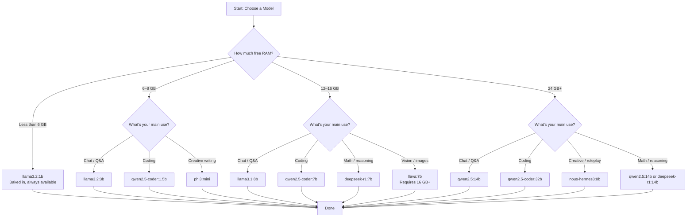

Picking the wrong model is the single most common reason PAI feels slow or produces low-quality answers. This page gives you a straight answer: given your available RAM and the task you want to do, which model should you run? The hardware-to-model table below is the fastest path to that answer, followed by a task-by-task guide, a quantization explainer, and a side-by-side tutorial so you can evaluate models yourself.

**Good news first:** PAI runs Ollama locally, which means you have access to hundreds of open-weight models — everything from tiny 1B chat models that fly on a 4 GB laptop to 70B reasoning models on a workstation. No API keys, no quotas, no rate limits. Whatever hardware you have, there's a model that feels fast on it.

In this guide:
- The RAM-to-model decision table (the fastest path to a good pick)
- A Mermaid decision flowchart for RAM, task, and use-case branching
- A task-by-task guide covering 10+ distinct use cases
- Quantization explained: `q4_K_M` vs `q8_0` vs `fp16`
- Speed vs. quality trade-offs at a glance
- Tutorial: test three models side-by-side on the same prompt
- Signs you need to switch models and how to evaluate before committing

**Prerequisites**: PAI booted and running. Familiarity with a terminal is helpful but not required — every command is shown in full.

---

## Which model should I run? Start here

The two numbers that determine what you can run are your **available RAM** (not total RAM — what's free after PAI boots) and your **model's parameter count**. The rule of thumb for 4-bit quantized models (the default) is roughly **1 billion parameters ≈ 1 GB RAM**. A 7B model wants about 8 GB of free RAM; a 13B model wants about 14 GB.

PAI boots using roughly 1–2 GB of RAM itself, so subtract that from your total when reading the table.

| RAM available | Best default | Runners-up | Notes |
|---|---|---|---|
| 4 GB | `llama3.2:1b` | — | Baked-in model; nothing larger fits reliably |
| 6–8 GB | `llama3.2:3b` | `phi3:mini`, `gemma2:2b` | Good balance of speed and quality |
| 12–16 GB | `llama3.1:8b` | `mistral:7b`, `qwen2.5:7b` | Noticeable quality jump |
| 24–32 GB | `qwen2.5:14b` | `gemma2:9b`, `phi3:medium` | Strong all-around performance |
| 48–64 GB | `qwen2.5:32b` | `llama3.1:70b` (slow on CPU) | GPU needed for real-time generation |
| 64 GB+ | `llama3.1:70b` | `qwen2.5:72b` | Excellent quality; CPU only is slow |

!!! warning

    Running a model that exceeds your available RAM causes your machine to swap memory to disk. You will see each token take several seconds to generate, and your system fan will run constantly. If this happens, switch to a smaller model immediately.


---

## Decision flowchart: which model should I pick?

Use this flowchart if you're unsure where to start. It branches on RAM, use case, and whether you need offline-only capability (all models on PAI run offline — this branch covers whether you want to *pull* a new model, which requires a network connection).



---

## Task-by-task model guide

Different tasks have different requirements. A coding model trained on code repositories will outperform a general chat model on programming tasks even if both have the same parameter count. Use this section to match your task to the right model family.

### General chat and Q&A

For open-ended conversation, factual questions, and everyday assistant tasks, the Llama and Mistral families are the most well-rounded.

- **Best small option** (under 8 GB RAM): `llama3.2:3b` — fast, coherent, good instruction following
- **Best mid-size option** (8–16 GB RAM): `llama3.1:8b` or `mistral:7b` — noticeably stronger reasoning, longer context retention
- **Best large option** (24 GB+ RAM): `qwen2.5:14b` — strong across all categories

### Coding and programming

Coding-specific models are fine-tuned on code repositories and understand syntax, debugging, and code review far better than general models.

- **Under 4 GB RAM**: `qwen2.5-coder:1.5b` — surprisingly capable for its size
- **8 GB RAM**: `qwen2.5-coder:7b` — best coding model for its size class; outperforms many larger general models on code
- **32 GB+ RAM**: `qwen2.5-coder:32b` — production-grade code assistance

!!! tip

    For coding tasks, always prefer a purpose-trained coding model over a general model of the same size. `qwen2.5-coder:7b` will beat `llama3.1:8b` on most programming tasks despite being technically smaller.


### Summarization and document analysis

General mid-size models handle summarization well. The key factor is **context window** — how much text the model can consider at once.

- **Best option**: `gemma2:9b` — handles 8K context comfortably, strong summarization
- **Alternative**: `qwen2.5:7b` — also strong on summarization with good instruction following
- **Long documents**: look for models with `:ctx` variants that extend the context window

### Creative writing and roleplay

Creative models are fine-tuned for storytelling, character voice, and imaginative tasks. General models can feel stiff for this use case.

- **Best option**: `nous-hermes3:8b` — strong creative instincts, flexible voice
- **Alternative**: `dolphin-llama3:8b` — uncensored fine-tune, good for mature creative writing
- **Budget option** (under 8 GB): `phi3:mini` — punches above its weight on creative tasks

### Math and logical reasoning

Reasoning-focused models use chain-of-thought training to work through problems step by step. They are significantly better than general models on math, logic puzzles, and structured problem-solving.

- **Best option**: `deepseek-r1:7b` — reasoning-focused architecture, explicit thinking steps
- **Alternative**: `qwen2.5:14b` — strong math and logic in a general-purpose package
- **Large**: `deepseek-r1:14b` or `qwen2.5:32b` for demanding problems

### Tool use and function calling

If you're building applications on top of Ollama's API and need the model to call tools or return structured JSON, use models explicitly trained for tool use.

- **Best option**: `llama3.1:8b` — tool-use trained; handles function calling reliably
- **Alternative**: `qwen2.5:7b` — also supports structured output well

### Vision and image understanding

Vision models accept both text and image inputs. They require significantly more RAM than text-only models of the same parameter count.

- **Best option**: `llama3.2-vision:11b` — strong image understanding, good instruction following; requires 16 GB+ RAM
- **Alternative**: `llava:7b` — smaller footprint (around 10 GB RAM), adequate for basic image Q&A
- **Minimum RAM**: 12 GB free; 16 GB+ strongly recommended

!!! warning

    Vision models cannot run on 8 GB RAM machines. If you try, the model will either fail to load or reduce your system to a crawl. Verify your free RAM before pulling a vision model.


### Foreign language conversations

Most large models support dozens of languages, but quality degrades significantly at smaller sizes. For non-English tasks, prefer the Qwen family — it has particularly strong multilingual training data covering Asian and European languages.

- **Best multilingual option**: `qwen2.5:7b` or `qwen2.5:14b` — excellent coverage of Chinese, Japanese, Korean, Arabic, Spanish, French, and more
- **Alternative**: `mistral:7b` — strong European language support
- **Avoid**: very small models (1B–3B) for non-English tasks; quality drops sharply

### Offline-only tasks (no future internet access)

All PAI models run offline once pulled. However, if you want to pull a model without an internet connection at all — for example, you're copying ISOs to an air-gapped machine — you need a model that ships with PAI or one you've already pulled during a previous session with persistence enabled.

- **Always available without internet**: `llama3.2:1b` — baked into the PAI image
- **With persistence + prior pull**: any model you've previously downloaded
- **Planning ahead**: pull models before going offline; they persist across reboots if you use the [persistence layer](../persistence/creating-persistence.md)

### Translation

- **Best option**: `qwen2.5:7b` — strong translation quality across language pairs
- **Alternative**: `mistral:7b` — good European-language translation
- **Note**: dedicated translation models are rare in the Ollama library; general multilingual models handle this well

### Code review and refactoring

For reviewing existing code, explaining what code does, or suggesting improvements:

- **Best option**: `qwen2.5-coder:7b` — strong at explaining and critiquing code
- **Alternative**: `llama3.1:8b` — reasonable code review with good natural language explanations
- **Large**: `qwen2.5-coder:32b` for complex multi-file review

---

## CPU vs GPU: what this means for your speed

PAI runs Ollama on your CPU by default. This is what "offline AI" means in practice — no GPU required, but generation speed is slower than cloud-based AI.

| Setup | Typical speed | Notes |
|---|---|---|
| CPU-only (default in PAI) | 5–20 tokens/sec for small models | Comfortable for 1B–3B models |
| CPU-only (large models) | 1–5 tokens/sec for 7B–13B | Usable but noticeably slower |
| NVIDIA GPU (persistence + drivers) | 30–100+ tokens/sec | Requires driver setup; see [GPU setup guide](../advanced/gpu-passthrough.md) |
| Apple Silicon (UTM/macOS) | N/A inside PAI | Apple Silicon GPU only accelerates native macOS apps; PAI inside UTM uses CPU |

!!! note

    "Tokens per second" translates roughly to words per second — most English words are one to two tokens. A speed of 10 tokens/sec means you see about five to ten words generated per second, which feels conversational for most users.


---

## Speed vs quality at a glance

This table maps common models against two axes: how fast they generate on a typical 16 GB RAM CPU machine, and how strong their output quality is relative to other models in the same size class.

```
Quality
  ▲
  │                              ● qwen2.5:14b
  │                   ● llama3.1:8b
  │         ● mistral:7b   ● qwen2.5:7b
  │   ● llama3.2:3b  ● qwen2.5-coder:7b (coding)
  │ ● phi3:mini
  │ ● llama3.2:1b
  └──────────────────────────────────────────► Speed
    Fast (20 tok/s+)        Slow (1–5 tok/s)
```

The sweet spot for most PAI users on 8–16 GB machines is the middle band: `llama3.2:3b` for speed-sensitive tasks and `llama3.1:8b` or `mistral:7b` when quality matters more.

---

## Quantization explained

**Quantization** reduces the precision of a model's internal weights to shrink the file size and speed up inference. The default Ollama tag uses `q4_K_M` (4-bit quantization), which is a good balance of size, speed, and quality for most use cases.

| Format | Bits per weight | Relative size | Speed | Quality | Best for |
|---|---|---|---|---|---|
| `fp16` | 16-bit float | ~2x `q8_0` | Slowest | Highest | Benchmarking, research |
| `q8_0` | 8-bit integer | ~2x `q4_K_M` | Moderate | Very high | Quality-sensitive tasks; slower machines tolerable |
| `q4_K_M` | 4-bit (mixed) | Baseline | Fast | High | Default; best all-around choice |
| `q4_0` | 4-bit | Similar to `q4_K_M` | Slightly faster | Slightly lower | Speed-first on very constrained machines |
| `q2_K` | 2-bit | ~0.5x `q4_K_M` | Fastest | Noticeably lower | Extreme RAM constraints only |

To pull a specific quantization variant, append it to the model tag:

```bash
# Pull the q8_0 variant of mistral:7b for higher quality
ollama pull mistral:7b-instruct-q8_0

# Pull the default (q4_K_M) — this is what you get without a suffix
ollama pull mistral:7b
```

!!! tip

    If your model's responses feel vague or inconsistent, try upgrading from `q4_K_M` to `q8_0` before switching to a larger model. You get a quality boost with a smaller RAM increase than stepping up a full size class.


---

## Benchmark numbers on common hardware

These are approximate figures from testing on real machines. Your results will vary based on other running processes, thermal throttling, and RAM speed.

| Hardware | Model | Tokens/sec | First-response lag |
|---|---|---|---|
| M3 MacBook Pro (UTM, 8 cores, 16 GB RAM) | `llama3.2:3b` | ~18 | ~3s |
| M3 MacBook Pro (UTM, 8 cores, 16 GB RAM) | `llama3.1:8b` | ~7 | ~6s |
| Intel i7-12700H laptop (16 GB RAM) | `llama3.1:8b` | ~9 | ~5s |
| Intel i7-12700H laptop (16 GB RAM) | `mistral:7b` | ~10 | ~4s |
| Ryzen 7 5700X desktop (32 GB RAM) | `qwen2.5:14b` | ~5 | ~8s |
| RTX 3090 (GPU passthrough, VRAM offload) | `llama3.1:8b` | ~85 | <1s |

!!! note

    UTM on Apple Silicon uses CPU emulation for the x86 PAI image, which is significantly slower than native. If you need faster generation on Apple hardware, run Ollama natively on macOS alongside PAI for chat, and use PAI for privacy-sensitive tasks.


---

## How to know if a model will fit before downloading it

Downloading a 4 GB model only to discover it doesn't fit in your RAM wastes time and bandwidth. Use these checks first.

**Check your free RAM:**

```bash
# Show available RAM in human-readable format
free -h
```

Expected output:
```
               total        used        free      shared  buff/cache   available
Mem:            15Gi        2.1Gi        11Gi        45Mi       1.8Gi        12Gi
```

The **available** column (not `free`) is what matters — that's what Ollama can use. In this example, roughly 12 GB is available.

**Estimate model size before pulling:**

Visit [ollama.com/library](https://ollama.com/library) on a connected machine and look at the model's listed size. A 7B model at `q4_K_M` is typically 4–5 GB on disk and needs roughly 6–8 GB RAM to run (disk size plus overhead for the context buffer).

A rough formula:

```
required RAM ≈ (disk size × 1.2) + 1 GB context overhead
```

**Try a smaller quantized version first:**

```bash
# Instead of pulling the full 7B model first, try the smaller quantized version
ollama pull qwen2.5:7b-instruct-q4_0   # smallest 4-bit variant
ollama run qwen2.5:7b-instruct-q4_0 "Tell me one short joke."
```

If that runs smoothly, the full `q4_K_M` variant will also fit.

---

## Signs you need a different model

| Symptom | Likely cause | Fix |
|---|---|---|
| Responses feel shallow or repetitive | Model is too small for the task | Try one size class up |
| Each token takes 2+ seconds to generate | Model is swapping to disk; not enough RAM | Switch to a smaller model |
| Machine freezes or fan runs at full speed | Out of RAM | Switch to smaller model immediately |
| Long pause, then garbled output | Model may be over-quantized | Try `:q8_0` variant |
| Model refuses reasonable requests | Heavy safety tuning | Try `mistral:7b` or an uncensored fine-tune |
| Correct syntax but wrong logic (coding) | Using a general model for code | Switch to `qwen2.5-coder:7b` |

---

## Trying models without committing: the "sample first" pattern

Ollama model pulls are resumable — if you interrupt a pull and restart it, it picks up where it left off. But if you want to evaluate a model before pulling the full version, the fastest path is pulling a smaller quantized variant first.

```bash
# Step 1: Pull the smallest quantized version to test behavior quickly
ollama pull llama3.1:8b-instruct-q4_0

# Step 2: Run a test prompt
ollama run llama3.1:8b-instruct-q4_0 "Explain what a kernel is in one paragraph."

# Step 3: If you like it, pull the higher-quality default version
ollama pull llama3.1:8b

# Step 4: Remove the test version to free disk space
ollama rm llama3.1:8b-instruct-q4_0
```

On a session without persistence, a reboot wipes all pulled models — so there's no cleanup cost to experimenting freely during a session.

!!! tip

    Use the `-v` flag with `ollama pull` to see download progress. Large models pull in layers, so progress updates frequently even for slow connections.


---

## Tutorial: test three models side-by-side

**Goal**: Pull two additional models alongside the baked-in `llama3.2:1b`, run the same prompt on all three, and compare output quality and speed.

**What you need**:
- PAI booted and running
- Internet connection for the model pulls (or models pre-pulled with persistence)
- A terminal (press `Super + Enter` in the Sway desktop)

1. Confirm the baked-in model is available:

   ```bash
   ollama list
   ```

   Expected output:
   ```
   NAME               ID              SIZE      MODIFIED
   llama3.2:1b        a2af6cc6c18c    1.3 GB    2 days ago
   ```

2. Pull two additional models. Choose based on your available RAM (check with `free -h`):

   ```bash
   # For 8 GB RAM machines — pull both of these
   ollama pull llama3.2:3b
   ollama pull phi3:mini
   ```

   Each pull will show layer-by-layer progress. `llama3.2:3b` is about 2 GB; `phi3:mini` is about 2.2 GB. Wait for both to finish.

3. Define a test prompt you'll run on all three. Use something that exercises reasoning — a single sentence is too easy to distinguish quality differences:

   ```bash
   PROMPT="You are a helpful assistant. Explain the difference between RAM and disk storage in plain English. Use an analogy. Keep it under 100 words."
   ```

4. Run the prompt on `llama3.2:1b` and note the time:

   ```bash
   time ollama run llama3.2:1b "$PROMPT"
   ```

   Expected: fast (under 5 seconds total), short answer, may be slightly imprecise.

5. Run the same prompt on `llama3.2:3b`:

   ```bash
   time ollama run llama3.2:3b "$PROMPT"
   ```

   Expected: a few seconds slower, noticeably more coherent and structured.

6. Run the same prompt on `phi3:mini`:

   ```bash
   time ollama run phi3:mini "$PROMPT"
   ```

   Expected: similar speed to `llama3.2:3b`, sometimes more concise.

7. Compare the three outputs side by side in your terminal. Evaluate:
   - Which answer was clearest?
   - Which used the analogy most effectively?
   - Was the speed difference worth the quality trade-off?

8. Keep the model you prefer and remove the others:

   ```bash
   # Remove models you don't want to keep (optional — reboot also clears them)
   ollama rm llama3.2:1b
   ollama rm phi3:mini
   ```

**What just happened?** You ran the same prompt across three models and compared output quality against generation speed. This is the standard workflow for evaluating a new model: pull, test on a real task, keep or discard.

**Next steps**: See [Using Ollama on PAI](using-ollama.md) for more on running models from the terminal, or [Open WebUI Guide](using-open-webui.md) to switch models from a browser interface.

---

## Opinionated picks

These are direct recommendations based on typical PAI hardware configurations:

- **Best default for most PAI users** (8 GB RAM): `llama3.2:3b` — fast, coherent, good instruction following
- **Best small model**: `phi3:mini` — stronger reasoning than its size suggests
- **Best 7B all-rounder**: `mistral:7b` for general use; `qwen2.5-coder:7b` if you write code
- **Best reasoning model**: `deepseek-r1:7b` for math and logic on 16 GB machines
- **Best vision model**: `llama3.2-vision:11b` if you have 16 GB+ RAM
- **Best multilingual model**: `qwen2.5:7b` for non-English conversations
- **Best chat experience overall** (if RAM allows): `llama3.1:8b` — well-rounded, widely tested

---

## Frequently asked questions

### Is a bigger model always better?

No. A larger model is better *only if your hardware can run it without swapping to disk*. A 7B model running in RAM is faster and often produces better output than a 13B model that's half-swapped to disk. Match the model size to your available RAM first, then optimize for quality within that constraint.

### What model is best for coding on PAI?

`qwen2.5-coder:7b` is the strongest coding model for machines with 8–16 GB RAM. It outperforms most general-purpose 7B and even some 13B models on code generation, debugging, and explanation tasks. If you have 32 GB+ RAM, `qwen2.5-coder:32b` is significantly more capable. Avoid using general chat models for serious coding tasks.

### What's the fastest model for low-RAM machines?

`llama3.2:1b` is baked into PAI and is the fastest model available. It generates 20–30 tokens per second on most CPU-only machines and fits in 4 GB RAM. For slightly more quality with minimal speed cost, `phi3:mini` is also fast and fits in 6–8 GB RAM.

### Can I run GPT-4 locally?

No. GPT-4 is a proprietary model owned by OpenAI and is not available for local download or offline use. However, open-weight models like `llama3.1:70b` and `qwen2.5:72b` approach GPT-4-class performance on many benchmarks — they require 64 GB+ RAM and are slow on CPU. For most practical tasks, `llama3.1:8b` or `qwen2.5:14b` provide excellent results without needing cloud access.

### What model should I use for foreign language conversations?

The Qwen 2.5 family (`qwen2.5:7b`, `qwen2.5:14b`) has the strongest multilingual performance across Asian and European languages. Mistral 7B is a good second choice for European languages. Avoid small models (1B–3B parameters) for non-English tasks — their multilingual training data is too sparse at that size to maintain quality.

### How do I know if my machine can handle a model before downloading it?

Run `free -h` and check the **available** column. Use the formula: required RAM ≈ (model disk size × 1.2) + 1 GB. If your available RAM exceeds that estimate, the model should load without swapping. You can also pull the smallest quantized variant first (e.g., `model:tag-q4_0`) to test behavior cheaply before committing to the full default version.

### What model works best offline without internet?

All models work offline once pulled — PAI never sends your prompts to the internet. The model that works offline *without any prior downloading* is `llama3.2:1b`, which is baked into the PAI image. For offline use with better quality, pull `llama3.2:3b` or `llama3.1:8b` during a session with internet access, then enable persistence so those models survive reboots. See the [persistence setup guide](../persistence/creating-persistence.md).

### Why does my model give short, low-quality answers?

Three common causes: the model is too small for the task, the prompt is too vague, or the system has low available RAM and is throttling the context window. Try rephrasing your prompt with more detail, switch to a larger model if RAM allows, or check `free -h` to make sure you're not close to the memory limit.

### What's the difference between llama3.2:1b and llama3.2:3b?

Both are from Meta's Llama 3.2 family. The 1B model has one billion parameters and fits in about 1.5 GB RAM; the 3B model has three billion parameters and needs about 3–4 GB RAM. The 3B model produces noticeably more coherent and detailed answers, handles follow-up questions better, and maintains context across longer conversations. If you have 8 GB RAM, `llama3.2:3b` is a better default than `llama3.2:1b`.

### Can I run multiple models at the same time?

Ollama loads one model into memory at a time by default. Switching models unloads the previous one. On machines with 32 GB+ RAM you can configure Ollama to keep multiple models in memory simultaneously, but this is an advanced setup. See the [Using Ollama guide](using-ollama.md) for `OLLAMA_MAX_LOADED_MODELS` configuration.

---

## Related documentation

- [**Using Ollama on PAI**](using-ollama.md) — Running models from the terminal, the Ollama HTTP API, and Modelfiles
- [**Managing Models**](managing-models.md) — How to pull, list, copy, and remove Ollama models
- [**System Requirements**](../general/system-requirements.md) — Minimum and recommended hardware for PAI
- [**Open WebUI Guide**](using-open-webui.md) — Using the browser-based chat interface to switch and compare models
- [**Persistence Setup**](../persistence/creating-persistence.md) — Keep pulled models across reboots with the encrypted persistence layer
- [**Warnings and Limitations**](../general/warnings-and-limitations.md) — What PAI cannot do and realistic expectations for local AI
