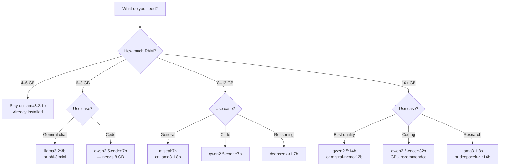
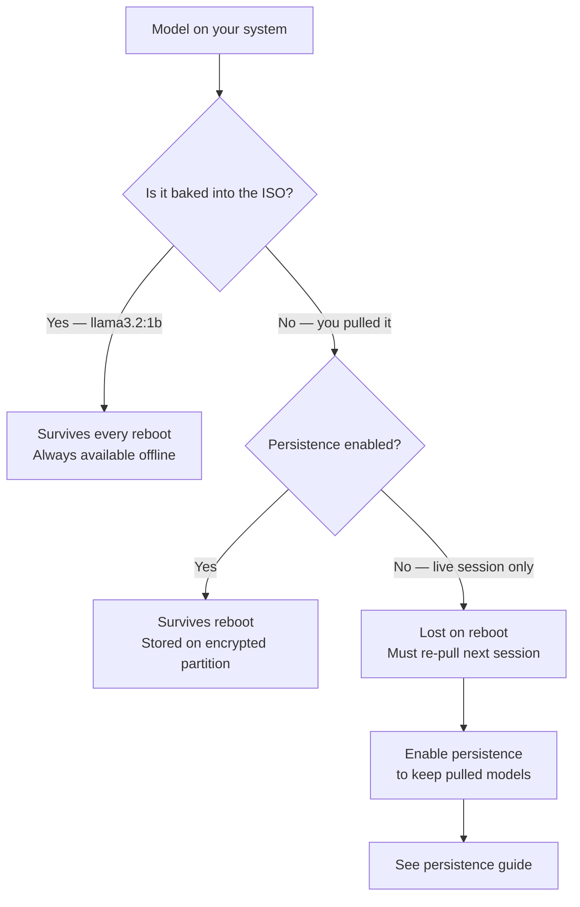

PAI ships with **Ollama**, the local LLM runtime, and a pre-baked model ready to use from the first boot — no internet required. This guide covers everything you need to know about managing local AI models on PAI: what comes built in, how to pull additional models, how to switch between them, and the critical RAM and persistence constraints unique to a live USB system.

In this guide:
- What model ships with PAI and how to verify it is installed
- Pulling new models from the Ollama registry with CLI or Open WebUI
- Switching models in chat and understanding context behavior
- How live-system RAM limits affect model management
- Which models survive a reboot — and which do not
- Freeing RAM, removing models, and using custom Hugging Face models

**Prerequisites**: PAI booted and running. No programming experience needed. Familiarity with the terminal is helpful for CLI sections but not required for the Open WebUI sections.

---

## What model ships with PAI out of the box

PAI includes **`llama3.2:1b`** pre-pulled and baked directly into the ISO image at build time. This model is approximately 1.3 GB, trained by Meta, and runs on any hardware that meets the [minimum system requirements](../general/system-requirements.md). It loads in seconds on 8 GB RAM and produces coherent answers across a wide range of tasks.

**[Offline ready]** `llama3.2:1b` is always available, even without an internet connection, even on the very first boot.

This is the model that Open WebUI uses by default when you open `localhost:8080`. You do not need to do anything to activate it.

!!! note

    `llama3.2:1b` is deliberately conservative — it is small enough to run on the widest range of hardware. If your machine has 8 GB or more RAM, you can pull a noticeably more capable model. See the [model selection guide](#which-model-should-you-pull) below.


---

## How to list installed models

=== "Terminal"

```bash
# Show all models currently available to Ollama
ollama list
```

Expected output:

```
NAME               ID              SIZE      MODIFIED
llama3.2:1b        a2af6cc6c18c    1.3 GB    3 minutes ago
```

After pulling additional models, each one appears as a new row. The `ID` column is the model's content hash; `SIZE` shows storage on disk (or in RAM on a live system).

=== "Open WebUI"

1. Open Firefox and navigate to `localhost:8080`.
2. Click the model selector at the top of the chat interface (it shows the currently active model name).
3. A dropdown lists every installed model.

Any model visible in that dropdown is ready to use — no further steps needed.


---

## How to pull a new model

Pulling a model downloads it from `https://registry.ollama.ai` — this requires an internet connection for the first pull. After the model is downloaded, it is available offline for that session (or permanently, if you have [persistence enabled](../persistence/introduction.md)).

!!! warning

    **Live system gotcha — pulled models are lost on reboot.** On a live PAI session without persistence, the downloaded model lives in RAM-backed storage. When you reboot, all pulled models are erased. Only `llama3.2:1b` survives because it is baked into the ISO. If you want downloaded models to persist across reboots, [set up the persistence layer](../persistence/introduction.md) before pulling.


=== "Terminal"

```bash
# Pull llama3.2:3b — a good balance of quality and RAM usage
ollama pull llama3.2:3b
```

Expected output during download:

```
pulling manifest
pulling 74701a8c35f6... 100% ▕████████████████▏ 2.0 GB
pulling 966de95ca8a6... 100% ▕████████████████▏ 1.4 KB
verifying sha256 digest
writing manifest
success
```

Ollama supports resuming interrupted pulls. If the download stops, run the same `ollama pull` command again — it picks up where it left off.

=== "Open WebUI"

1. Open `localhost:8080` in Firefox.
2. Click your user avatar in the top-right corner, then select **Admin Panel**.
3. Navigate to **Models** in the left sidebar.
4. In the **Pull a model** field, type the model name (for example, `llama3.2:3b`) and press Enter.
5. A progress bar tracks the download. When it completes, the model appears in your model list.


---

## Comprehensive model catalog

The table below covers the most commonly used models. RAM requirement is the minimum to load the model comfortably; more RAM improves response speed. Speed rating is relative on a 2023-era laptop CPU with 16 GB RAM.

| Model | Size | Min RAM | Best for | Speed | Availability |
|---|---|---|---|---|---|
| `llama3.2:1b` | 1.3 GB | 4 GB | Quick answers, testing | Very fast | **[Offline ready]** |
| `llama3.2:3b` | 2.0 GB | 6 GB | General chat, balanced quality | Fast | **[Needs internet first pull]** |
| `llama3.1:8b` | 4.7 GB | 10 GB | Deep reasoning, long context | Moderate | **[Needs internet first pull]** |
| `llama3.3:70b` | 43 GB | 48 GB | Research-grade quality | Slow | **[GPU recommended]** |
| `phi-3:mini` | 2.3 GB | 6 GB | Reasoning, code, fast | Fast | **[Needs internet first pull]** |
| `phi-4:14b` | 9.1 GB | 14 GB | Strong reasoning and code | Moderate | **[Needs internet first pull]** |
| `mistral:7b` | 4.1 GB | 8 GB | General use, strong instruction following | Moderate | **[Needs internet first pull]** |
| `mistral-nemo:12b` | 7.1 GB | 12 GB | Multilingual, long context | Moderate | **[Needs internet first pull]** |
| `gemma3:4b` | 3.3 GB | 8 GB | Google model, good at following instructions | Fast | **[Needs internet first pull]** |
| `gemma3:12b` | 8.1 GB | 12 GB | Higher quality Gemma | Moderate | **[Needs internet first pull]** |
| `qwen2.5:7b` | 4.7 GB | 8 GB | Multilingual, Chinese + English | Moderate | **[Needs internet first pull]** |
| `qwen2.5:14b` | 8.7 GB | 16 GB | High quality, very capable | Moderate-slow | **[Needs internet first pull]** |
| `qwen2.5:32b` | 20 GB | 32 GB | Near-frontier quality | Slow | **[GPU recommended]** |
| `qwen2.5-coder:7b` | 4.7 GB | 8 GB | Code generation, debugging | Moderate | **[Needs internet first pull]** |
| `qwen2.5-coder:32b` | 20 GB | 32 GB | Elite coding assistant | Slow | **[GPU recommended]** |
| `deepseek-r1:7b` | 4.7 GB | 8 GB | Chain-of-thought reasoning | Moderate | **[Needs internet first pull]** |
| `deepseek-r1:14b` | 9.0 GB | 14 GB | Strong analytical reasoning | Moderate-slow | **[Needs internet first pull]** |
| `nous-hermes3:8b` | 4.9 GB | 8 GB | Creative writing, roleplay | Moderate | **[Needs internet first pull]** |

The full catalog of available models is at [ollama.com/library](https://ollama.com/library).

---

## Which model should you pull?



For a detailed breakdown of every model's strengths, see the [choosing a model guide](choosing-a-model.md).

---

## Which models survive a reboot?



!!! warning

    If you regularly use a model larger than `llama3.2:1b`, enable [persistence](../persistence/introduction.md) before you pull it. Pulling a 4–9 GB model over a slow connection every session is painful, and on a metered connection it is expensive.


---

## How to switch models

=== "Terminal"

```bash
# Start an interactive session with a specific model
ollama run llama3.2:3b

# One-shot query — no interactive session
ollama run llama3.2:3b "Explain quantum entanglement in plain language"
```

To exit an interactive Ollama session, type `/bye` or press `Ctrl+D`.

=== "Open WebUI"

1. Open `localhost:8080` in Firefox.
2. Click the model name at the top of the chat window.
3. Select any installed model from the dropdown.
4. Start a new chat — the selected model handles all new messages.

!!! note

    Switching models mid-conversation in Open WebUI prompts you to start a new chat. Conversation context does not transfer between models — each model starts with a clean context window.


---

## How to remove a model

Removing a model frees up the storage it occupies — on a live PAI session, that means freeing RAM.

```bash
# Remove a specific model by name
ollama rm mistral:7b
```

Expected output:

```
deleted 'mistral:7b'
```

To confirm the model is gone:

```bash
ollama list
```

The removed model no longer appears in the list.

!!! tip

    Remove models you are not using. On a live session, each pulled model consumes RAM from the same pool your running model uses. Keeping several large models pulled at once can make response generation noticeably slower.


---

## How to free up RAM when a model is slow

Even after you stop chatting, Ollama keeps the model loaded in RAM for five minutes in case you send another message. To force-unload a model immediately:

```bash
# See what is currently loaded into memory
ollama ps
```

Expected output:

```
NAME           ID              SIZE      PROCESSOR    UNTIL
llama3.2:3b    a80c4f17a7c7    2.0 GB    100% CPU     4 minutes from now
```

```bash
# Force-unload a model by setting keep_alive to 0
curl -s -X POST http://localhost:11434/api/generate \
  -d '{"model": "llama3.2:3b", "keep_alive": 0}' | head -1
```

As a last resort, restart the Ollama service — this unloads all models and resets all state:

```bash
systemctl restart ollama
```

---

## Model variants and tags

Ollama uses Docker-style tags: `<name>:<variant>`. The variant controls the model size and quantization:

| Tag pattern | Meaning |
|---|---|
| `:1b`, `:3b`, `:7b`, `:14b` | Parameter count — larger numbers = more capable but slower |
| `:q4_K_M` | 4-bit quantization — smaller file, slightly lower quality |
| `:q8_0` | 8-bit quantization — larger file, closer to full quality |
| `:fp16` | Full 16-bit precision — largest file, highest quality |
| `:latest` | Default tag — Ollama chooses the recommended quantization |

If you do not specify a tag, Ollama pulls `:latest`, which is the recommended balance for most hardware. Stick with the default unless you have a specific reason to use a quantized or full-precision variant.

---

## How to use custom and Hugging Face models

You can pull models directly from Hugging Face using Ollama's experimental HF support:

```bash
# Pull a GGUF model from Hugging Face (experimental)
ollama pull hf.co/<username>/<model-name>
```

To use a GGUF file you already have on disk, create a Modelfile:

```bash
# Create a Modelfile pointing to your GGUF
cat > Modelfile <<'EOF'
FROM /path/to/your-model.gguf
SYSTEM "You are a helpful assistant."
EOF

# Build and register the model with Ollama
ollama create my-custom-model -f Modelfile
```

```bash
# Verify it appears in the model list
ollama list
```

!!! warning

    PAI does not sandbox custom models. Running a third-party GGUF file carries the same trust considerations as running any executable. Only use models from sources you trust.


---

## Managing models with the pai-models wrapper

PAI includes a `pai-models` convenience wrapper around common Ollama operations:

```bash
# List installed models (same as ollama list)
pai-models list

# Pull a model
pai-models pull llama3.2:3b

# Re-pull the built-in default model if it was accidentally removed
pai-models pull-default

# Remove a model
pai-models remove mistral:7b
```

`pai-models pull-default` is useful if you somehow removed `llama3.2:1b` and need to restore the baseline offline-ready model without knowing its exact name.

---

## Tutorial: Pull your first larger model and compare quality

**Goal**: Pull `llama3.2:3b`, verify it works in Open WebUI, and compare its response quality against `llama3.2:1b` on the same prompt.

**What you need**:
- PAI booted and connected to the internet
- At least 6 GB RAM free (check with `free -h`)
- About 10 minutes for the download on a typical broadband connection

1. Open a terminal and check available RAM before pulling:

   ```bash
   free -h
   ```

   Expected output (you need at least 6 GB free in the `available` column):

   ```
                 total        used        free      shared  buff/cache   available
   Mem:           15Gi       3.2Gi       9.1Gi       312Mi       2.8Gi      11.6Gi
   ```

2. Pull `llama3.2:3b`:

   ```bash
   ollama pull llama3.2:3b
   ```

   This downloads approximately 2.0 GB. The pull supports resume — if it stops, run the command again.

3. Confirm the model is installed:

   ```bash
   ollama list
   ```

   Expected output:

   ```
   NAME               ID              SIZE      MODIFIED
   llama3.2:1b        a2af6cc6c18c    1.3 GB    2 hours ago
   llama3.2:3b        a80c4f17a7c7    2.0 GB    1 minute ago
   ```

4. Open Firefox and go to `localhost:8080`. Click the model selector at the top of the chat and choose `llama3.2:1b`. Type the following prompt and send it:

   ```
   Explain the difference between supervised and unsupervised machine learning
   in three paragraphs.
   ```

   Note the quality and depth of the response.

5. Now switch to `llama3.2:3b` using the same model selector. Start a new chat and send the identical prompt. Compare the two responses — the 3B model typically produces more detailed, nuanced explanations.

6. To set `llama3.2:3b` as the default model for new chats in Open WebUI, click your user avatar, select **Settings**, navigate to **Interface**, and set your default model.

**What just happened?** You pulled a larger model variant from the Ollama registry, verified it is available to both the CLI and Open WebUI, and observed the quality difference that comes with a larger parameter count — at the cost of about 700 MB more RAM.

**Next steps**: See the [choosing a model guide](choosing-a-model.md) to understand when to reach for each model, or set up [persistence](../persistence/introduction.md) so `llama3.2:3b` survives your next reboot.

---

## How to troubleshoot common model problems

**"pull: connection refused" or download fails immediately**

Ollama cannot reach the registry. Check internet access:

```bash
curl -I https://registry.ollama.ai
```

If this returns an error, you do not have internet access in this session. Models that require an internet connection cannot be pulled. The built-in `llama3.2:1b` is still available.

**Pull is very slow**

Large models over slow connections take time. A 4.7 GB model at 10 Mbps takes about 60 minutes. You can cancel with `Ctrl+C` and resume by re-running `ollama pull <name>` — it continues from where it left off.

**"no space left on device" during pull**

On a live PAI session, RAM is your disk. The model download fills the same pool your running system uses. Free up RAM by removing unused models (`ollama rm <name>`) or unloading the current model (`systemctl restart ollama`), then try again.

**Model refuses to load or Ollama crashes immediately after load**

The model is too large for available RAM. Check:

```bash
free -h
```

Compare the `available` value to the model's size in `ollama list`. You need approximately 1.5× the model's file size in available RAM to run it comfortably.

**Model disappeared after rebooting**

This is expected behavior on a live PAI session without persistence. Only `llama3.2:1b` survives reboots because it is baked into the ISO. All pulled models live in RAM-backed storage and are erased on shutdown. See the [persistence guide](../persistence/introduction.md) to keep pulled models across sessions.

---

## Frequently asked questions

### Why did my model disappear after rebooting?

PAI runs as a live Linux system — by default, everything lives in RAM and is erased when you shut down. Models you pull during a session are written to `~/.ollama/models`, which is a RAM-backed tmpfs filesystem. When the system powers off, that storage disappears. Only `llama3.2:1b` survives because it is embedded in the ISO image itself, not in the live filesystem. To keep pulled models across reboots, set up the [persistence layer](../persistence/introduction.md) before pulling.

### How do I make a downloaded model the default in Open WebUI?

Open `localhost:8080`, click your user avatar in the top-right corner, choose **Settings**, navigate to the **Interface** tab, and set your preferred model in the default model selector. This setting is saved in Open WebUI's database and persists for the current session. If you have persistence enabled, the setting also survives reboots.

### Can I pull models without an internet connection?

You can use any model already installed. On a fresh PAI boot, only `llama3.2:1b` is available offline. Pulling additional models requires an internet connection for the first download. If you pull models on one session and have persistence enabled, those models are available offline on subsequent boots without re-downloading.

### How do I free up RAM if the model is slow?

First, check what is loaded: `ollama ps`. Then force-unload the current model with:

```bash
curl -s -X POST http://localhost:11434/api/generate \
  -d '{"model": "llama3.2:3b", "keep_alive": 0}'
```

You can also run `systemctl restart ollama` to unload everything and start fresh. If the model is still slow after unloading others, consider switching to a smaller model — `llama3.2:1b` runs comfortably on 4 GB RAM.

### Can I use Hugging Face models with Ollama?

Yes, with caveats. Ollama supports pulling GGUF-format models from Hugging Face using `ollama pull hf.co/<user>/<model>`. This feature is experimental and not all Hugging Face models are in GGUF format. You can also convert a local GGUF file by creating a Modelfile and running `ollama create`. PAI does not sandbox these models — use sources you trust.

### What is the biggest model I can run on PAI?

It depends on your RAM. A rough rule: you need about 1.5× the model file size in available RAM. On a machine with 16 GB RAM, `qwen2.5:14b` (8.7 GB) is typically the ceiling for CPU inference with reasonable response speed. On a machine with 32 GB RAM, `qwen2.5:32b` (20 GB) becomes feasible, though slow without a GPU. Check the [model catalog](#comprehensive-model-catalog) above for exact RAM requirements per model.

### How long does pulling a model take?

It depends on the model size and your internet speed. Rough estimates at 50 Mbps:

| Model | Size | Approximate download time |
|---|---|---|
| `llama3.2:3b` | 2.0 GB | 5 minutes |
| `mistral:7b` | 4.1 GB | 10 minutes |
| `llama3.1:8b` | 4.7 GB | 12 minutes |
| `qwen2.5:14b` | 8.7 GB | 22 minutes |
| `qwen2.5:32b` | 20 GB | 50 minutes |

Ollama supports resuming interrupted pulls — if the download stops, re-run `ollama pull <name>` to continue.

### Does switching models in Open WebUI lose my conversation history?

Within a session, your conversation history stays in Open WebUI's database. Switching models mid-conversation prompts you to start a new chat — the new model does not receive the previous conversation's context. Previous conversations remain accessible in the sidebar regardless of which model you currently have selected.

### How do I run the same model with different system prompts?

Use Ollama's Modelfile system to create named variants:

```bash
cat > Modelfile <<'EOF'
FROM llama3.2:3b
SYSTEM "You are a concise technical assistant. Respond in bullet points."
EOF
ollama create llama3.2:3b-technical -f Modelfile
```

The new variant appears in `ollama list` and in Open WebUI's model selector as a separate entry.

---

## Related documentation

- [**Choosing a Model**](choosing-a-model.md) — Detailed comparison of every major Ollama model by use case, RAM requirement, and quality
- [**Using Ollama**](using-ollama.md) — Running models from the terminal, using the HTTP API, and building with Modelfiles
- [**Using Open WebUI**](using-open-webui.md) — Chat interface features, conversation history, and model settings in the browser
- [**Persistence**](../persistence/introduction.md) — How to keep pulled models and settings across reboots on PAI
- [**System Requirements**](../general/system-requirements.md) — Minimum hardware needed to run PAI and larger models
