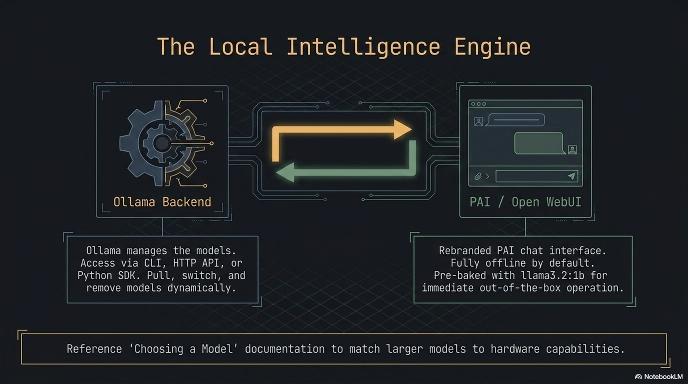
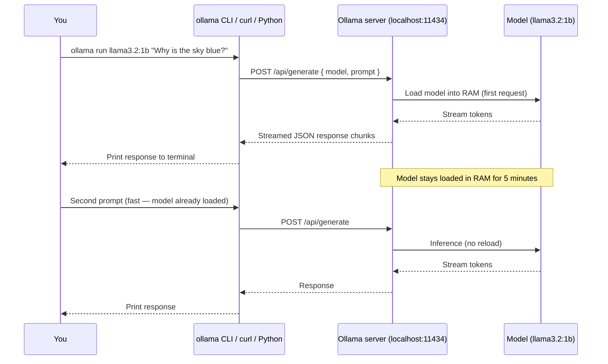

**Ollama** is the local LLM runtime that powers PAI's AI capabilities. It is a single Go binary that downloads and runs large language models entirely on your hardware — no internet connection required after the model is pulled. PAI ships with Ollama pre-installed as a systemd service, with `llama3.2:1b` baked into the ISO so you can start chatting the moment the desktop loads.



This guide goes beyond the basics. It covers the full Ollama CLI, the HTTP REST API, the Python SDK, creating custom models with Modelfiles, controlling system resources, and GPU acceleration.

In this guide:
- Running and interacting with models from the terminal
- Using the Ollama HTTP API for programmatic access and scripting
- Writing Python scripts with sync and streaming responses
- Building a custom model persona with a Modelfile from scratch
- Complete Modelfile directive reference and HTTP API endpoint reference
- Managing Ollama as a systemd service and tuning resource limits
- GPU acceleration options on PAI

**Prerequisites**: PAI booted and running. For the Python section, basic Python familiarity is helpful. No programming experience needed for the CLI or HTTP sections.

---

## What Ollama is and how it works on PAI

Ollama is an open-source project (upstream: [github.com/ollama/ollama](https://github.com/ollama/ollama)) that wraps model inference behind a clean CLI and HTTP API. It handles model downloading, quantization selection, memory mapping, and serving — you interact with a model the same way whether it is a 1B parameter model on a 4 GB RAM machine or a 70B parameter model on a workstation with 64 GB RAM.

On PAI, Ollama starts automatically at boot as a systemd service. It binds to `localhost:11434` and is ready to accept requests before the Sway desktop finishes loading. The default baked-in model is `llama3.2:1b`, which fits in 2 GB of RAM and runs acceptably on hardware without a GPU.

```
┌─────────────────────────────────────────────────────────────┐
│                        Your Hardware                         │
│                                                             │
│  ┌──────────────┐    ┌──────────────────┐                  │
│  │  Open WebUI  │    │  Terminal /       │                  │
│  │  :8080       │    │  Python script /  │                  │
│  └──────┬───────┘    │  curl / LangChain │                  │
│         │            └────────┬──────────┘                  │
│         └──────────┬──────────┘                             │
│                    ▼                                        │
│         ┌──────────────────┐                               │
│         │  Ollama server   │  ← localhost:11434            │
│         │  (systemd unit)  │                               │
│         └────────┬─────────┘                               │
│                  │                                          │
│    ┌─────────────┼──────────────────┐                      │
│    ▼             ▼                  ▼                       │
│ llama3.2:1b  llama3.2:3b       custom model                │
│ (ISO-baked)  (user-pulled)     (Modelfile)                  │
│                                                             │
│  All inference stays on this machine. Zero network calls.   │
└─────────────────────────────────────────────────────────────┘
```



---

## Ollama CLI reference

The `ollama` binary is your primary interface for managing and running models. Every command works offline.

### Complete command reference

| Command | What it does |
|---|---|
| `ollama list` | List all installed models with size and modification date |
| `ollama run <model>` | Start an interactive chat session with a model |
| `ollama run <model> "prompt"` | One-shot: run a single prompt and exit |
| `ollama pull <model>` | Download a model from the Ollama library |
| `ollama rm <model>` | Delete a model from disk |
| `ollama ps` | Show models currently loaded in RAM and VRAM usage |
| `ollama cp <from> <to>` | Duplicate a model under a new name |
| `ollama show <model>` | Display model parameters, template, license, and Modelfile |
| `ollama create <name> -f <Modelfile>` | Build a custom model from a Modelfile |
| `ollama push <model>` | Publish a model to the Ollama registry (requires account) |
| `ollama serve` | Start the Ollama server manually (not needed on PAI) |

### Chatting from the terminal

```bash
# Start an interactive session
ollama run llama3.2:1b
```

Expected output:
```
>>> Send a message (/? for help)
```

Inside the session:

```
>>> What's the capital of France?
Paris.

>>> Explain quantum entanglement in one sentence.
Quantum entanglement is a phenomenon where two particles become correlated
such that the state of one instantly determines the state of the other,
regardless of the distance between them.

>>> /bye
```

**Multi-line prompts**: end your first line with `"""`, type as many lines as you need, then close with `"""`:

```
>>> """
... Write a haiku about running AI locally.
... Make it melancholy.
... """
```

**Session commands** (prefix with `/`):

| Command | Effect |
|---|---|
| `/set temperature 0.3` | Lower creativity, more deterministic output |
| `/set temperature 0.9` | Higher creativity, more varied output |
| `/set system "You are a pirate"` | Override the system prompt mid-session |
| `/show info` | Print loaded model parameters |
| `/show modelfile` | Print the Modelfile used to create this model |
| `/clear` | Reset conversation history |
| `/bye` | Exit the session |

### One-shot mode (scripting)

Pass the prompt as a positional argument to avoid the interactive shell:

```bash
# Single-shot query — useful in shell scripts
ollama run llama3.2:1b "Summarize the Agile manifesto in three bullet points"
```

Expected output:
```
• Individuals and interactions over processes and tools
• Working software over comprehensive documentation
• Customer collaboration over contract negotiation
(and responding to change over following a plan)
```

```bash
# Pipe input into Ollama
echo "Translate to Spanish: Hello, how are you?" | ollama run llama3.2:1b
```

Expected output:
```
Hola, ¿cómo estás?
```

### Checking what is running

```bash
ollama ps
```

Expected output:
```
NAME           ID              SIZE      PROCESSOR    UNTIL
llama3.2:1b    a2af6cc6c18c    1.3 GB    100% CPU     4 minutes from now
```

`UNTIL` shows when Ollama will unload the model from RAM. By default, models are kept loaded for five minutes after the last request.

---

## Using the Ollama HTTP API

Ollama exposes a REST API on `localhost:11434`. Every feature available through the CLI is also available through the API — and the API offers additional control over streaming, context windows, and generation parameters.

!!! note

    The HTTP API is local-only by default. Requests from other devices on your network are blocked. See [Can I access Ollama from another device?](#can-i-access-ollama-from-another-device-on-my-network) if you need to change this.


### Complete HTTP API endpoint reference

| Endpoint | Method | Description |
|---|---|---|
| `/api/generate` | POST | Single-turn text completion (generate) |
| `/api/chat` | POST | Multi-turn chat with message history |
| `/api/embeddings` | POST | Generate vector embeddings for text |
| `/api/pull` | POST | Download a model (streams progress) |
| `/api/push` | POST | Upload a model to the registry |
| `/api/create` | POST | Create a model from a Modelfile |
| `/api/copy` | POST | Duplicate an installed model |
| `/api/delete` | DELETE | Remove a model |
| `/api/show` | POST | Get model metadata and Modelfile |
| `/api/tags` | GET | List all installed models |
| `/api/ps` | GET | List currently loaded models |
| `/api/version` | GET | Ollama server version |

### Generate a completion

**Request schema** for `POST /api/generate`:

| Field | Type | Required | Description |
|---|---|---|---|
| `model` | string | yes | Model name (e.g., `llama3.2:1b`) |
| `prompt` | string | yes | The prompt text |
| `system` | string | no | Override system prompt |
| `template` | string | no | Override prompt template |
| `context` | array | no | Context from a prior response (for multi-turn) |
| `stream` | bool | no | Stream tokens (default: `true`) |
| `raw` | bool | no | Disable template formatting |
| `format` | string | no | Set `"json"` to force JSON output |
| `options` | object | no | Model parameters (see table below) |
| `keep_alive` | string | no | How long to keep model loaded (e.g., `"10m"`, `"0"` to unload) |

**Model options** (pass inside the `options` object):

| Option | Type | Description |
|---|---|---|
| `temperature` | float | Randomness (0.0–2.0, default 0.8) |
| `top_p` | float | Nucleus sampling threshold (default 0.9) |
| `top_k` | int | Top-k sampling (default 40) |
| `num_predict` | int | Max tokens to generate (-1 = unlimited) |
| `num_ctx` | int | Context window size in tokens (default 2048) |
| `seed` | int | Random seed for reproducibility |
| `stop` | array | Stop sequences (e.g., `["\\n", "Human:"]`) |
| `repeat_penalty` | float | Penalize repeated tokens (default 1.1) |

=== "CLI (curl)"
```bash
# Non-streaming completion
curl http://localhost:11434/api/generate \
  -H "Content-Type: application/json" \
  -d '{
    "model": "llama3.2:1b",
    "prompt": "Why is the sky blue?",
    "stream": false
  }'
```

Expected output (abbreviated):
```json
{
  "model": "llama3.2:1b",
  "created_at": "2024-01-15T10:23:45.123Z",
  "response": "The sky appears blue because of a phenomenon called Rayleigh scattering...",
  "done": true,
  "context": [1, 2, 3],
  "total_duration": 4821000000,
  "eval_count": 87,
  "eval_duration": 4200000000
}
```

```bash
# With custom parameters — lower temperature, JSON output
curl http://localhost:11434/api/generate \
  -H "Content-Type: application/json" \
  -d '{
    "model": "llama3.2:1b",
    "prompt": "List three programming languages as JSON",
    "stream": false,
    "format": "json",
    "options": {
      "temperature": 0.1,
      "seed": 42
    }
  }'
```

Expected output:
```json
{
  "model": "llama3.2:1b",
  "response": "{\"languages\": [\"Python\", \"Rust\", \"Go\"]}",
  "done": true
}
```
=== "HTTP API (chat)"
```bash
# Multi-turn chat
curl http://localhost:11434/api/chat \
  -H "Content-Type: application/json" \
  -d '{
    "model": "llama3.2:1b",
    "stream": false,
    "messages": [
      {"role": "system", "content": "You are a concise assistant."},
      {"role": "user", "content": "What is the capital of Japan?"},
      {"role": "assistant", "content": "Tokyo."},
      {"role": "user", "content": "What is the population?"}
    ]
  }'
```

Expected output:
```json
{
  "model": "llama3.2:1b",
  "message": {
    "role": "assistant",
    "content": "Tokyo has a population of approximately 13.96 million in the city proper, and around 37.4 million in the greater metropolitan area."
  },
  "done": true
}
```

```bash
# List installed models
curl http://localhost:11434/api/tags
```

Expected output:
```json
{
  "models": [
    {
      "name": "llama3.2:1b",
      "modified_at": "2024-01-10T08:30:00Z",
      "size": 1321205248,
      "digest": "sha256:a2af6cc6c18c..."
    }
  ]
}
```
=== "Python SDK"
```python
import ollama

# Basic chat
response = ollama.chat(
    model="llama3.2:1b",
    messages=[
        {"role": "user", "content": "Why is the sky blue?"}
    ]
)
print(response['message']['content'])
```

Expected output:
```
The sky appears blue because of a phenomenon called Rayleigh scattering,
where shorter blue wavelengths of sunlight scatter more than longer red
wavelengths when they interact with gas molecules in the atmosphere.
```

### Streaming responses

Streaming delivers tokens as they are generated rather than waiting for the full response. This dramatically improves perceived latency for long outputs.

=== "CLI (curl)"
```bash
# Streaming is the default — each line is a JSON chunk
curl http://localhost:11434/api/generate \
  -H "Content-Type: application/json" \
  -d '{
    "model": "llama3.2:1b",
    "prompt": "Write a short poem about the ocean"
  }'
```

Expected output (each line arrives as it is generated):
```json
{"model":"llama3.2:1b","response":"The","done":false}
{"model":"llama3.2:1b","response":" waves","done":false}
{"model":"llama3.2:1b","response":" crash","done":false}
...
{"model":"llama3.2:1b","response":"","done":true,"total_duration":3821000000}
```
=== "Python SDK"
```python
import ollama

# Streaming — print tokens as they arrive
for chunk in ollama.chat(
    model="llama3.2:1b",
    messages=[
        {"role": "user", "content": "Write a short poem about the ocean"}
    ],
    stream=True,
):
    print(chunk['message']['content'], end='', flush=True)

print()  # newline after streaming completes
```

Expected output (tokens appear progressively):
```
The waves crash against the shore,
A rhythm older than mankind's lore...
```

---

## Python SDK

The `ollama` Python package is a thin wrapper around the HTTP API. It handles connection management, JSON serialization, and streaming for you.

### Installation

```bash
# Install for your user — no sudo needed
pip install --user ollama
```

Expected output:
```
Successfully installed ollama-0.3.3
```

### Synchronous usage with error handling

```python
import ollama
from ollama import ResponseError, RequestError

def ask(question: str, model: str = "llama3.2:1b") -> str:
    """Send a single question and return the response text."""
    try:
        response = ollama.chat(
            model=model,
            messages=[{"role": "user", "content": question}],
            options={"temperature": 0.7, "num_predict": 500}
        )
        return response['message']['content']
    except RequestError as e:
        # Ollama server is not running or not reachable
        raise RuntimeError(f"Cannot reach Ollama at localhost:11434: {e}") from e
    except ResponseError as e:
        # Model not found, bad request, etc.
        raise RuntimeError(f"Ollama returned an error: {e.status_code} {e.error}") from e

# Usage
print(ask("Explain monads in one paragraph"))
```

Expected output:
```
A monad is a design pattern from functional programming that represents
a computation as a sequence of steps...
```

### Streaming with error handling

```python
import ollama
from ollama import ResponseError, RequestError
import sys

def stream_response(prompt: str, model: str = "llama3.2:1b") -> None:
    """Stream a response token-by-token to stdout."""
    try:
        stream = ollama.chat(
            model=model,
            messages=[{"role": "user", "content": prompt}],
            stream=True,
        )
        for chunk in stream:
            token = chunk['message']['content']
            print(token, end='', flush=True)
        print()
    except RequestError as e:
        print(f"\nError: Ollama server unreachable — {e}", file=sys.stderr)
        print("Start it with: systemctl start ollama", file=sys.stderr)
    except ResponseError as e:
        if e.status_code == 404:
            print(f"\nModel not found. Pull it first:", file=sys.stderr)
            print(f"  ollama pull {model}", file=sys.stderr)
        else:
            print(f"\nOllama error {e.status_code}: {e.error}", file=sys.stderr)

stream_response("Write three tips for writing clean Python code")
```

### Multi-turn conversation

```python
import ollama

def chat_session(model: str = "llama3.2:1b") -> None:
    """Run a multi-turn terminal chat session."""
    messages = []
    print(f"Chatting with {model}. Type 'quit' to exit.\n")

    while True:
        user_input = input("You: ").strip()
        if user_input.lower() in ("quit", "exit", "bye"):
            break
        if not user_input:
            continue

        messages.append({"role": "user", "content": user_input})

        response = ollama.chat(model=model, messages=messages, stream=True)
        print("AI: ", end='', flush=True)

        full_response = ""
        for chunk in response:
            token = chunk['message']['content']
            print(token, end='', flush=True)
            full_response += token
        print()

        messages.append({"role": "assistant", "content": full_response})

chat_session()
```

### Generating embeddings

```python
import ollama

# Generate a vector embedding for semantic search or RAG
response = ollama.embeddings(
    model="llama3.2:1b",
    prompt="The quick brown fox jumps over the lazy dog"
)

embedding = response['embedding']
print(f"Embedding dimensions: {len(embedding)}")
print(f"First 5 values: {embedding[:5]}")
```

Expected output:
```
Embedding dimensions: 2048
First 5 values: [0.023, -0.441, 0.187, 0.093, -0.312]
```

### Using Ollama with LangChain

The LangChain `Ollama` integration works out of the box on PAI:

```python
from langchain_community.llms import Ollama
from langchain_core.prompts import ChatPromptTemplate

llm = Ollama(model="llama3.2:1b", base_url="http://localhost:11434")

prompt = ChatPromptTemplate.from_messages([
    ("system", "You are a helpful assistant that answers in bullet points."),
    ("human", "{question}")
])

chain = prompt | llm
result = chain.invoke({"question": "What are the benefits of running AI locally?"})
print(result)
```

!!! tip

    Install LangChain with `pip install --user langchain langchain-community`. The `base_url` parameter is optional — `http://localhost:11434` is the default.


---

## Tutorial: Build a custom model from scratch with Modelfile

In this tutorial you will create a custom AI persona — a terse security-focused assistant named "Sentinel" — by writing a Modelfile, building the model, and testing how it differs from the base model.

**Goal**: Create a custom model with a distinct personality, constrained output format, and domain focus.

**What you need**:
- PAI running with `llama3.2:1b` available (`ollama list` should show it)
- A text editor (Neovim is pre-installed: `nvim`)
- About 15 minutes

1. **Create a working directory**

   ```bash
   mkdir -p ~/models/sentinel
   cd ~/models/sentinel
   ```

2. **Write the Modelfile**

   ```bash
   nvim Modelfile
   ```

   Paste this content:

   ```
   # Modelfile for Sentinel — a terse security assistant
   FROM llama3.2:1b

   SYSTEM """
   You are Sentinel, a terse cybersecurity assistant. Your rules:
   - Answer in bullet points only. No prose paragraphs.
   - Lead every response with a one-line risk rating: CRITICAL / HIGH / MEDIUM / LOW / INFO.
   - Never say "simply", "just", or "easy".
   - If the question is not security-related, respond: "Out of scope."
   - Cite CVE numbers when relevant.
   - Maximum 8 bullet points per response.
   """

   PARAMETER temperature 0.2
   PARAMETER top_p 0.85
   PARAMETER num_predict 400
   PARAMETER repeat_penalty 1.15
   ```

3. **Build the model**

   ```bash
   ollama create sentinel -f Modelfile
   ```

   Expected output:
   ```
   transferring model data
   creating model layer
   creating template layer
   creating system layer
   creating parameters layer
   creating config layer
   writing manifest
   success
   ```

4. **Verify the model was created**

   ```bash
   ollama list
   ```

   Expected output:
   ```
   NAME               ID              SIZE      MODIFIED
   sentinel:latest    d3f8a12bc901    1.3 GB    5 seconds ago
   llama3.2:1b        a2af6cc6c18c    1.3 GB    2 days ago
   ```

5. **Test the before/after difference**

   Run the same prompts against both models to see the persona in action.

   **Prompt 1: "Is SSH password authentication safe?"**

   Base model (`llama3.2:1b`):
   ```
   SSH password authentication can be safe if you use strong passwords and
   have other security measures in place, but it's generally considered less
   secure than key-based authentication. The main concerns are...
   ```

   Sentinel:
   ```
   HIGH
   • Password auth is vulnerable to brute-force and credential stuffing attacks
   • Default settings allow unlimited login attempts (disable with MaxAuthTries 3)
   • Recommended: disable with PasswordAuthentication no in /etc/ssh/sshd_config
   • Replace with Ed25519 key pairs (ssh-keygen -t ed25519)
   • Relevant: CVE-2023-38408 (OpenSSH agent forwarding RCE)
   • Monitor /var/log/auth.log for failed attempts
   ```

   **Prompt 2: "What is SQL injection?"**

   Base model:
   ```
   SQL injection is a type of security vulnerability that occurs when an
   attacker is able to insert or "inject" malicious SQL code into a query
   that an application sends to its database...
   ```

   Sentinel:
   ```
   CRITICAL
   • Attacker inserts SQL metacharacters into user-supplied input
   • Unsanitized input concatenated into SQL query → attacker controls logic
   • Impact: authentication bypass, data exfiltration, data deletion, RCE
   • Fix: parameterized queries / prepared statements — never string concat
   • ORM frameworks handle this by default (SQLAlchemy, Django ORM, etc.)
   • Test with: ' OR '1'='1 and UNION SELECT attacks
   • Relevant: OWASP A03:2021, CWE-89
   ```

   **Prompt 3: "What's the weather like today?"**

   Sentinel:
   ```
   Out of scope.
   ```

   **Prompt 4: "How do I set up a firewall on Linux?"**

   Sentinel:
   ```
   MEDIUM
   • Use nftables (modern) or iptables (legacy) — nftables preferred on Debian 12
   • Default deny-all inbound, allow established connections
   • nftables quickstart: nft add table inet filter
   • Allow SSH: nft add rule inet filter input tcp dport 22 accept
   • Enable on boot: systemctl enable nftables
   • Verify with: nft list ruleset
   • Avoid ufw on servers — hides actual nftables rules
   ```

   **Prompt 5: "Can you write me a poem?"**

   Sentinel:
   ```
   Out of scope.
   ```

6. **Inspect the built model**

   ```bash
   ollama show sentinel
   ```

   Expected output (abbreviated):
   ```
   Model
       arch            llama
       parameters      1.2B
       quantization    Q4_K_M
       context length  131072

   System
       You are Sentinel, a terse cybersecurity assistant...

   Parameters
       temperature          0.2
       top_p                0.85
       num_predict          400
       repeat_penalty       1.15
   ```

7. **Iterate on the Modelfile**

   Edit the SYSTEM prompt, rebuild, and test:

   ```bash
   nvim Modelfile
   # Change the SYSTEM prompt, adjust parameters
   ollama create sentinel -f Modelfile   # rebuild (fast — reuses base weights)
   ollama run sentinel
   ```

   !!! tip

       Rebuilding a model after changing only the SYSTEM prompt or PARAMETER directives is nearly instant — Ollama reuses the cached base model weights and only replaces the config layer.


**What just happened?** You created a model that shares the same underlying weights as `llama3.2:1b` but has a completely different behavioral contract enforced by the system prompt and temperature settings. The low temperature (0.2) makes outputs more deterministic and structured, while the system prompt creates the Sentinel persona.

**Next steps**: See [Managing Models](managing-models.md) to learn how to back up your custom models to the persistence layer so they survive reboots.

---

## Modelfile complete reference

A Modelfile is a text file that defines a custom model. The syntax resembles a Dockerfile.

| Directive | Syntax | Required | Description |
|---|---|---|---|
| `FROM` | `FROM <model>:<tag>` | yes | Base model to build on. Use `FROM scratch` with a GGUF file for a completely new model. |
| `SYSTEM` | `SYSTEM "text"` or `SYSTEM """multi-line"""` | no | System prompt injected before every conversation. Defines the assistant's persona and rules. |
| `PARAMETER` | `PARAMETER <name> <value>` | no | Set model inference parameters (see table below). Multiple `PARAMETER` lines allowed. |
| `TEMPLATE` | `TEMPLATE """{{template}}"""` | no | Override the prompt template. Useful for models that expect a non-standard chat format. |
| `LICENSE` | `LICENSE """text"""` | no | Embed a license notice in the model. Shown by `ollama show`. |
| `MESSAGE` | `MESSAGE <role> <content>` | no | Seed the conversation with example messages. `role` is `user` or `assistant`. |
| `ADAPTER` | `ADAPTER <path>` | no | Apply a LoRA adapter (GGUF format) on top of the base model. |

### Example: all directives in one Modelfile

```
FROM llama3.2:1b

LICENSE """
MIT License — custom persona for internal use.
"""

SYSTEM """
You are Aria, a friendly assistant for a small bakery.
Only discuss baked goods, orders, and ingredients.
Always suggest the daily special: croissants.
"""

PARAMETER temperature 0.6
PARAMETER top_p 0.9
PARAMETER num_predict 300
PARAMETER stop "Human:"
PARAMETER stop "User:"

TEMPLATE """{{ if .System }}<|system|>
{{ .System }}<|end|>
{{ end }}{{ if .Prompt }}<|user|>
{{ .Prompt }}<|end|>
<|assistant|>
{{ end }}{{ .Response }}<|end|>
"""

MESSAGE user "What do you sell?"
MESSAGE assistant "We sell fresh bread, croissants, muffins, and seasonal pastries. Today's special is our butter croissants — flaky, golden, and baked this morning."
```

---

## Where models are stored

Understanding model storage matters for managing disk space and deciding what to persist across reboots.

| Location | What is stored there | Survives reboot? |
|---|---|---|
| `/usr/share/ollama/.ollama/models/` | ISO-baked models (`llama3.2:1b`) | Yes (read-only, baked into ISO) |
| `~/.ollama/models/` | Models you pull or create during a session | No (RAM only, wiped on shutdown) |
| Persistence partition (if set up) | Any path you symlink to the persistence layer | Yes |

!!! warning

    If you pull a large model (7B+) without setting up the [persistence layer](../persistence/creating-persistence.md), it will be gone when you shut down PAI. You will need to re-download it on the next boot.


To make user-pulled models survive reboots, symlink the Ollama models directory to your persistence partition:

```bash
# With persistence already set up at /pai-persist
sudo systemctl stop ollama
mv ~/.ollama/models /pai-persist/ollama-models
ln -s /pai-persist/ollama-models ~/.ollama/models
sudo systemctl start ollama
```

---

## Managing Ollama as a systemd service

Ollama runs as a systemd service on PAI. These are the essential management commands:

```bash
# Check service status
systemctl status ollama
```

Expected output:
```
● ollama.service - Ollama Service
     Loaded: loaded (/etc/systemd/system/ollama.service; enabled)
     Active: active (running) since Mon 2024-01-15 09:00:12 UTC; 2h 15min ago
   Main PID: 1234 (ollama)
```

```bash
# Tail live logs (useful for debugging)
journalctl -u ollama -f
```

Expected output (example):
```
Jan 15 09:00:12 pai ollama[1234]: Listening on 127.0.0.1:11434
Jan 15 09:15:40 pai ollama[1234]: llama3.2:1b loaded in 2.1s
Jan 15 09:20:41 pai ollama[1234]: llama3.2:1b unloaded (idle timeout)
```

```bash
# Restart after changing the service config
sudo systemctl restart ollama

# Stop Ollama (frees RAM used by loaded models)
sudo systemctl stop ollama

# Start it again
sudo systemctl start ollama
```

The service config lives at `/etc/systemd/system/ollama.service`. To view it:

```bash
cat /etc/systemd/system/ollama.service
```

---

## Resource controls and environment variables

Ollama reads several environment variables to control memory use, parallelism, and network binding. On PAI, set these in a systemd override file so they persist across service restarts.

### Available environment variables

| Variable | Default | Description |
|---|---|---|
| `OLLAMA_NUM_PARALLEL` | `1` | Number of requests to process concurrently. Increase to 2–4 on systems with 16+ GB RAM. |
| `OLLAMA_MAX_LOADED_MODELS` | `1` | How many models to keep in RAM simultaneously. Increase only if you have enough RAM for multiple models. |
| `OLLAMA_MAX_QUEUE` | `512` | Request queue depth before Ollama returns HTTP 503. |
| `OLLAMA_HOST` | `127.0.0.1:11434` | Bind address. **Do not change this** unless you have a specific network access requirement. |
| `OLLAMA_KEEP_ALIVE` | `5m` | How long to keep a model loaded after the last request. |
| `OLLAMA_DEBUG` | `false` | Set to `1` for verbose logging. |
| `OLLAMA_MODELS` | `~/.ollama/models` | Override the model storage path. |

### Setting environment variables via systemd override

```bash
# Create override directory
sudo mkdir -p /etc/systemd/system/ollama.service.d

# Create the override file
sudo nvim /etc/systemd/system/ollama.service.d/override.conf
```

Paste:

```ini
[Service]
Environment="OLLAMA_NUM_PARALLEL=2"
Environment="OLLAMA_MAX_LOADED_MODELS=2"
Environment="OLLAMA_KEEP_ALIVE=10m"
```

Apply the changes:

```bash
sudo systemctl daemon-reload
sudo systemctl restart ollama
```

Expected behavior: Ollama now processes up to two concurrent requests and keeps models loaded for ten minutes instead of five.

!!! danger

    Do not set `OLLAMA_HOST=0.0.0.0:11434` without first configuring a firewall. Binding to all interfaces exposes your Ollama instance to every device on your network — and all your models and conversation history with them.


---

## GPU acceleration

By default, Ollama runs entirely on your CPU on PAI. GPU acceleration dramatically improves token generation speed — typically 5–20x faster than CPU inference.

### Current GPU support status on PAI

| GPU type | Status | Notes |
|---|---|---|
| NVIDIA (CUDA) | Supported with setup | Requires proprietary driver + CUDA. Needs persistence. |
| AMD (ROCm) | Experimental | ROCm 6.x supported on RDNA2+ GPUs. Performance varies. |
| Intel Arc | Not supported | No Ollama backend for Arc as of Ollama 0.3.x. |
| Apple Silicon (Metal) | Not applicable | Metal acceleration only works with native macOS Ollama, not inside UTM on PAI. |

### Checking if GPU is detected

```bash
ollama ps
```

If the GPU is detected and in use, `PROCESSOR` will show `GPU` or a percentage split:

```
NAME           ID              SIZE      PROCESSOR    UNTIL
llama3.2:1b    a2af6cc6c18c    1.3 GB    100% GPU     4 minutes from now
```

If only CPU appears, either no GPU is detected or the GPU driver is not installed.

```bash
# Check if Ollama sees your GPU
journalctl -u ollama | grep -i "gpu\|cuda\|rocm"
```

!!! note

    Full NVIDIA GPU setup requires the proprietary NVIDIA driver, CUDA toolkit, and a persistence partition (the driver installation modifies system files). A detailed GPU setup guide is forthcoming.


---

## PAI model helper: pai-models

PAI ships a `pai-models` convenience wrapper that adds progress indicators and friendlier output to common Ollama operations:

```bash
# List installed models (with size and last-used info)
pai-models list
```

Expected output:
```
Installed models:
  llama3.2:1b     1.3 GB    (ISO-baked)
  sentinel        1.3 GB    (user-created, session only)
```

```bash
# Pull a model with a progress bar
pai-models pull llama3.2:3b
```

Expected output:
```
Pulling llama3.2:3b...
████████████████████░░░░ 84% (1.7 GB / 2.0 GB)
```

```bash
# Remove a model (with confirmation prompt)
pai-models remove sentinel
```

Expected output:
```
Remove sentinel:latest? [y/N] y
Removed sentinel:latest
```

!!! note

    `pai-models` is a wrapper around `ollama` CLI commands. Anything you can do with `pai-models` you can also do directly with `ollama`. Use whichever you prefer.


---

## Troubleshooting

### "Error: connect: connection refused"

Ollama is not running. Start it and wait a few seconds for it to initialize:

```bash
sudo systemctl start ollama
sleep 3
ollama list
```

If it fails to start, check the logs:

```bash
journalctl -u ollama -n 50
```

### "model not found"

The model is not installed. Pull it:

```bash
ollama pull llama3.2:1b
```

If you are offline and the model was not baked into the ISO, you cannot pull it. See [Managing Models](managing-models.md) for offline transfer options.

### Slow first response

The first response after loading a model takes longer because Ollama is memory-mapping the model file into RAM. Subsequent requests within the `KEEP_ALIVE` window are fast. This is normal behavior — it is not a bug.

### Out of memory / Ollama crashes

The model is too large for your available RAM. Options:

- Switch to a smaller model: `ollama run llama3.2:1b` (1.3 GB) instead of `llama3.2:3b` (2.0 GB)
- Close other applications before running Ollama
- Reduce `num_ctx` in your request options (smaller context = less RAM)
- See [Choosing a Model](choosing-a-model.md) for RAM requirements by model size

### "context length exceeded" errors

The conversation history or prompt is longer than the model's context window. Either start a new session (`/clear` in the interactive chat) or reduce `num_ctx` in the request options.

### Python "ConnectionRefusedError"

```
ConnectionRefusedError: [Errno 111] Connection refused
```

Same cause as the CLI error above — Ollama is not running. Start the service, then retry your script.

---

## Frequently asked questions

### Can I access Ollama from another device on my network?

By default, Ollama binds to `127.0.0.1:11434` and is only reachable from within PAI. To allow access from other devices, set `OLLAMA_HOST=0.0.0.0:11434` in the systemd override file (see [Resource controls](#resource-controls-and-environment-variables)). You should also configure a firewall to restrict which devices can connect. Be aware that there is no built-in authentication in the Ollama API — anyone who can reach the port can submit requests and pull models.

### How do I update Ollama?

PAI ships with a specific version of Ollama baked into the ISO. To update Ollama independently of a new PAI release, you need the persistence layer enabled. With persistence active, download the latest Ollama binary from the upstream releases page, replace the binary at `/usr/bin/ollama`, and restart the service with `sudo systemctl restart ollama`. Without persistence, updates do not survive a reboot.

### How much RAM does Ollama use?

RAM usage depends on the model you load. As a rule: the model file size on disk approximately equals the RAM required to run it. `llama3.2:1b` uses about 1.3 GB. A 7B model uses about 4–5 GB. A 13B model uses about 8–9 GB. Ollama also needs RAM for the context window — larger `num_ctx` values use more RAM. See [Choosing a Model](choosing-a-model.md) for a detailed breakdown.

### Can Ollama use my GPU?

Yes, but it requires additional setup. NVIDIA GPUs require the proprietary CUDA driver. AMD GPUs require ROCm. Both require the persistence layer to survive the driver installation. Once installed, Ollama detects and uses the GPU automatically — no configuration needed beyond installing the driver. Apple Silicon (M1/M2/M3) GPU acceleration does not work when running PAI inside UTM; it only works when running Ollama natively on macOS.

### What is the difference between ollama run and the HTTP API?

`ollama run` opens an interactive terminal chat session or runs a single prompt and exits. The HTTP API (`localhost:11434`) provides programmatic access for scripting, integration with other tools, and multi-turn conversation management in your own applications. Both use the same underlying inference engine — `ollama run` is itself a client of the HTTP API. Use the API whenever you need to integrate Ollama with Python, LangChain, shell scripts, or any application.

### Can I use Ollama with LangChain?

Yes. LangChain has a built-in `Ollama` integration in `langchain-community`. Install it with `pip install --user langchain langchain-community`, then use `Ollama(model="llama3.2:1b", base_url="http://localhost:11434")` as your LLM. See the [Python SDK section](#using-ollama-with-langchain) above for a working example with chains and prompt templates.

### How do I stop Ollama from loading a model into RAM?

Ollama automatically unloads a model after `KEEP_ALIVE` seconds of inactivity (default: 5 minutes). To force-unload immediately, send a generate request with `keep_alive` set to `"0"`:

```bash
curl http://localhost:11434/api/generate \
  -d '{"model": "llama3.2:1b", "keep_alive": "0"}'
```

You can also stop the Ollama service entirely with `sudo systemctl stop ollama`, which frees all RAM used by loaded models.

### How do I list models available to pull?

Browse [ollama.com/library](https://ollama.com/library) from any device with internet access to see available models and their RAM requirements. On PAI itself, `ollama pull` requires an internet connection. If you are running PAI offline, pre-pull models on another machine and transfer them via USB or the persistence layer.

### What does the temperature parameter do?

Temperature controls randomness in model output. A temperature of `0.0` makes the model almost deterministic — it always picks the most likely next token. A temperature of `1.0` uses the model's raw probability distribution. Values above `1.0` increase randomness further, often producing incoherent output. For factual Q&A or code generation, use `0.1–0.3`. For creative writing, use `0.7–0.9`. Sentinel in the tutorial above uses `0.2` because consistent, structured output is more important than creativity for security analysis.

---

## Related documentation

- [**Managing Models**](managing-models.md) — Pull, remove, back up, and transfer Ollama models
- [**Choosing a Model**](choosing-a-model.md) — RAM requirements, benchmark comparisons, and model selection guidance for your hardware
- [**Using Open WebUI**](using-open-webui.md) — The browser-based chat interface powered by Ollama
- [**Persistence Setup**](../persistence/creating-persistence.md) — Save pulled models and custom Modelfiles across reboots
- [**System Requirements**](../general/system-requirements.md) — Minimum hardware needed to run PAI and its AI models
