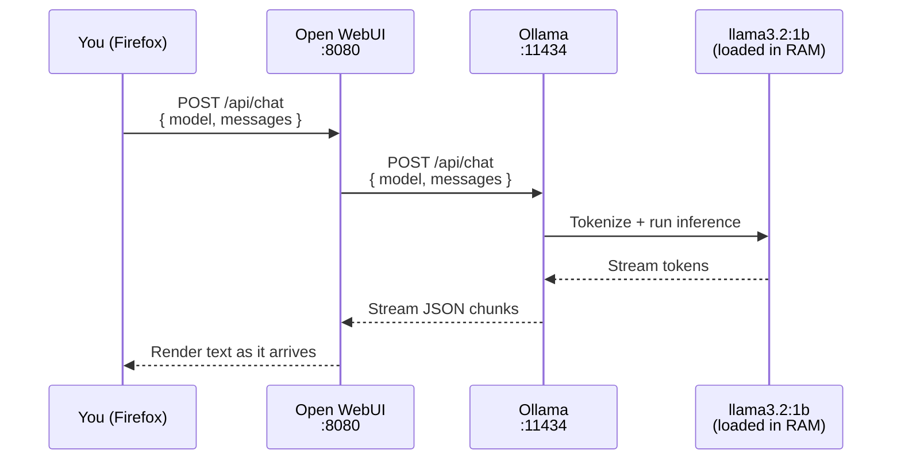

**Open WebUI** is the browser-based chat interface that PAI ships as its default AI front-end. It opens automatically in Firefox at `localhost:8080` on every boot, requires no account or internet connection, and connects directly to the [Ollama](using-ollama.md) runtime running on your machine. Everything you type stays on your hardware.

In this guide:
- Starting your first conversation with a local AI model
- Navigating the Open WebUI interface and its key controls
- Switching between installed models mid-session
- Setting system prompts to customize model behavior
- Using the system prompt cookbook for common tasks
- Exporting conversations before you reboot
- Changing Open WebUI settings via the UI and config file
- Troubleshooting the most common issues

**Prerequisites**: PAI booted and running. No prior AI or Linux experience required.

---

## How Open WebUI fits into PAI

Open WebUI is an open-source project (formerly "Ollama WebUI") that provides a polished browser UI for any Ollama-compatible backend. PAI bundles and pre-configures it so it starts automatically, skips the login screen, and never calls home.

```
┌─────────────────────────────────────────────────────────────┐
│                        Your Hardware                         │
│                                                              │
│   Firefox          Open WebUI          Ollama                │
│  ──────────►  localhost:8080  ──────►  localhost:11434       │
│                                             │                │
│                                       ┌─────▼──────┐        │
│                                       │ llama3.2:1b │        │
│                                       │  (on disk)  │        │
│                                       └────────────┘        │
│                                                              │
│   No traffic leaves this box. Ever.                          │
└─────────────────────────────────────────────────────────────┘
```

PAI makes three key changes to the default Open WebUI configuration:
- **Branding**: the interface shows "PAI" as the site name
- **Auth disabled**: `WEBUI_AUTH=False` — no signup, no login, click and go
- **Offline mode**: `OFFLINE_MODE=true` — no update checks, no telemetry, no cloud

---

## How a conversation flows from browser to model

The sequence below shows what happens from the moment you press Enter to the moment a response appears.



All four steps happen on your machine. The model is loaded into RAM by Ollama when first needed; subsequent requests to the same model are faster because it stays loaded.

---

## What you see when PAI boots

Firefox opens to `localhost:8080` within 20–30 seconds of the desktop appearing. The interface is ready when you see the chat input at the bottom of the screen.


*The Open WebUI chat screen on first boot. The model selector (top center) shows the currently loaded model. The sidebar (left) lists past conversations from this session.*

Key elements of the interface:

| Element | Location | What it does |
|---|---|---|
| Model selector | Top center | Switch the active model |
| Sidebar toggle | Top left | Show/hide conversation history |
| New chat button | Top left | Start a fresh conversation |
| Prompt input | Bottom | Type your message here |
| Stop button | Bottom (during generation) | Halt mid-stream output |
| Regenerate button | Below last response | Get a different answer |
| Settings gear | Top right | Open UI and admin settings |

!!! note

    Conversation history in the sidebar is stored in `/var/lib/open-webui` and is erased when you reboot (unless you have [persistence](../persistence/introduction.md) enabled). Export anything you want to keep before shutting down.


---

## Selecting and switching models

The model selector at the top of the screen lists every model that Ollama has downloaded. Click it to open the dropdown and select a different model.

**[Offline ready]** Model switching works entirely offline once models are downloaded.

!!! tip

    Only models you have pulled appear in the selector. If the dropdown shows only `llama3.2:1b`, that is the only model currently on disk. See [Managing Models](managing-models.md) for how to add more.


When you switch models mid-conversation, Open WebUI starts a new conversation with the selected model. The previous conversation remains in the sidebar.

---

## Features available on PAI

### Always-available features **[Offline ready]**

- Chat with any installed model
- Multi-turn conversations with full context history
- System prompts (customize model behavior at the start of a conversation)
- Edit, delete, or regenerate any message
- Stop generation mid-stream
- Export conversations to Markdown
- Model switching
- Temperature and parameter controls (Settings → Advanced)

### Features disabled in PAI **[PAI default off]**

- Web search integration (`ENABLE_RAG_WEB_SEARCH=false`)
- External image generation APIs
- OpenAI/Anthropic cloud API compatibility (`ENABLE_OPENAI_API=false`)
- Community sharing (`ENABLE_COMMUNITY_SHARING=false`)
- Usage telemetry (`ANONYMIZED_TELEMETRY=false`)

### Features that require internet **[Requires internet]**

- Pulling new models from the ollama.com registry
- Any web search or retrieval-augmented generation (RAG) feature
- Automatic Open WebUI software updates

---

## Tutorial: Have your first complete AI conversation

**Goal**: Run a multi-turn conversation, set a system prompt, switch models, and export the result.

**What you need**: PAI booted, Firefox open at `localhost:8080`.


1. **Start a conversation**

   Click the prompt input at the bottom and type a question:

   ```
   What is the capital of France, and what is it known for?
   ```

   Press **Enter** or click the send button. The model streams its response in real time. Wait for generation to finish (the stop button disappears).

2. **Continue the conversation**

   Type a follow-up in the same input box:

   ```
   What is the best time of year to visit?
   ```

   The model receives the full conversation history — it knows you are still talking about France. This is **multi-turn context**.

3. **Set a system prompt**

   Click the **gear icon** at the top right → **Settings** → scroll to **System Prompt**.

   Paste this prompt:

   ```
   You are a concise travel guide. Keep all answers under three sentences.
   Use bullet points for lists.
   ```

   Click **Save**. Start a new chat (click the **+** button in the sidebar). The model will now follow your instructions for every response in this conversation.

4. **Switch to a different model**

   Click the **model selector** (top center). If you have a second model installed, select it. The new chat starts with that model.

   !!! note

       If only `llama3.2:1b` appears, you have one model installed. See [Managing Models](managing-models.md) to pull additional models while connected to the internet.


5. **Export the conversation**

   In the sidebar, hover over the conversation you want to save. Click the **three-dot menu** → **Export** → **Markdown**.

   Firefox downloads a `.md` file. Save it to a USB drive or external storage before rebooting — the original copy inside PAI is erased on shutdown.


**What just happened?** You used Open WebUI as a stateful chat client running entirely on your machine. The system prompt shaped the model's behavior; the export preserved the result before PAI's RAM-only session ended.

**Next steps**: Read [System Prompts](#system-prompts) for more customization options, or [Choosing a Model](choosing-a-model.md) to find models suited to your tasks.

---

## System prompts

A system prompt is a set of instructions you give the model before the conversation starts. It shapes tone, format, and behavior for every response in that chat.

**How to set one**: Click the gear icon (top right) → Settings → System Prompt → paste your prompt → Save. The system prompt applies to the current conversation and any new ones you start until you clear it.

### System prompt cookbook

Five ready-to-use prompts for common PAI use cases:

**Research assistant**
```
You are a research assistant. When answering questions, cite your reasoning
step by step. Flag anything you are uncertain about with "[uncertain]".
Keep responses focused and avoid speculation beyond what is directly supported.
```

**Code helper**
```
You are a senior software engineer. When writing code, always include inline
comments explaining non-obvious logic. After each code block, write a brief
"What this does" summary. If you spot a potential bug or security issue in
code I show you, flag it immediately.
```

**Writing editor**
```
You are a copy editor. When I give you text, return an edited version with
improvements to clarity, grammar, and flow. After the edited text, provide
a brief list of the main changes you made and why.
```

**Language tutor**
```
You are a patient language tutor. I am learning [TARGET LANGUAGE]. Respond
to everything I write in [TARGET LANGUAGE], then provide an English
translation below. Correct any mistakes I make with a brief explanation.
```

**Note-taking companion**
```
You are a note-taking assistant. Your job is to help me think through and
organize information. When I give you raw notes or ideas, return a
structured outline with headers and bullet points. Ask clarifying questions
if something is ambiguous.
```

!!! tip

    System prompts persist for the duration of a session (until you clear them or start a new chat). For the language tutor prompt, replace `[TARGET LANGUAGE]` with the language you are studying before you paste it in.


---

## Saving and exporting conversations

**[Offline ready]** Export works entirely offline.

Without [persistence](../persistence/introduction.md) enabled, all conversations are stored in RAM at `/var/lib/open-webui` and erased on reboot.

**To export a conversation before rebooting**:

1. In the sidebar, hover over the conversation title.
2. Click the **three-dot menu** → **Export** → **Markdown**.
3. Save the downloaded file to an external drive or a mounted USB stick.

**With persistence enabled**, conversations survive reboots automatically. See the [persistence guide](../persistence/introduction.md) for setup instructions.

!!! warning

    If you close PAI without exporting, your conversation history is gone. There is no recycle bin or recovery option for RAM-only sessions.


---

## Changing Open WebUI settings

=== "UI settings (current session)"

    Access settings through the gear icon (top right) → **Settings**.

    Key settings available in the UI:

    | Setting | Where to find it | What it does |
    |---|---|---|
    | System Prompt | Settings → System Prompt | Default instructions for the model |
    | Temperature | Settings → Advanced | Controls randomness (0 = focused, 1+ = creative) |
    | Context length | Settings → Advanced | How much conversation history the model sees |
    | Theme | Settings → Interface | Light or dark mode |

    Because `WEBUI_AUTH=False`, you are already the admin. All admin settings are accessible at Settings → **Admin Settings**.

    !!! note

        UI settings apply to the current browser session only. Without persistence, they reset on reboot.


=== "Config file (persistent)"

    The persistent configuration file is `/etc/pai/open-webui.env`. Editing it requires the [persistence layer](../persistence/introduction.md) to be set up, or you can edit it and rebuild the ISO.

    ```bash
    # Open the config file in a text editor
    sudo mousepad /etc/pai/open-webui.env

    # After saving, restart the service to apply changes
    sudo systemctl restart open-webui
    ```

    **Environment variables and what they do**:

    | Variable | Default | Purpose |
    |---|---|---|
    | `WEBUI_NAME` | `PAI` | Name shown in the browser tab and header |
    | `WEBUI_URL` | `http://localhost:8080` | Base URL Open WebUI thinks it is hosted at |
    | `DATA_DIR` | `/var/lib/open-webui` | Where conversations and config are stored |
    | `OLLAMA_BASE_URL` | `http://127.0.0.1:11434` | Address of the Ollama API |
    | `ENABLE_OLLAMA_API` | `true` | Allows Open WebUI to talk to Ollama |
    | `ENABLE_OPENAI_API` | `false` | Disables cloud AI API calls |
    | `WEBUI_AUTH` | `False` | Disables login screen — single-user mode |
    | `ENABLE_SIGNUP` | `false` | Prevents account creation (irrelevant without auth) |
    | `OFFLINE_MODE` | `true` | Disables update checks and external asset loading |
    | `ANONYMIZED_TELEMETRY` | `false` | No usage metrics sent anywhere |
    | `DO_NOT_TRACK` | `true` | Sends DNT header; also disables internal tracking |
    | `SCARF_NO_ANALYTICS` | `true` | Disables Scarf package analytics |
    | `ENABLE_COMMUNITY_SHARING` | `false` | Disables the Open WebUI community sharing feature |
    | `ENABLE_MESSAGE_RATING` | `false` | Removes thumbs-up/down rating buttons |

    The full list of supported variables is at `https://docs.openwebui.com/getting-started/env-configuration` (requires internet to access).

    !!! warning

        Changing `OLLAMA_BASE_URL` to point at a remote host sends your prompts over the network. Leave it at `127.0.0.1` unless you have a specific reason to change it.


---

## Tips and patterns

These are things new users typically learn the hard way:

- **llama3.2:1b has a short context window.** Conversations longer than roughly 2,000 tokens cause the model to start "forgetting" earlier messages. For long research sessions, switch to a larger model or start a new chat and paste in only the context you need.

- **Chain conversations.** Copy a useful output from one chat into a new chat with a focused role prompt. This keeps individual conversations short and the model's attention sharp.

- **For code, always ask for comments.** Small models make subtle mistakes. Inline comments force the model to explain its reasoning, making errors easier to catch.

- **Lower temperature for facts, higher for creativity.** Settings → Advanced → Temperature. Use 0.1–0.3 for factual Q&A and summaries; use 0.7–1.0 for creative writing and brainstorming.

- **Regenerate, don't re-ask.** If a response is close but not quite right, click **Regenerate** rather than typing the same question again. Regenerate samples a different token sequence from the same prompt.

---

## Troubleshooting Open WebUI on PAI

### "No models available" in the model selector

Ollama has not finished starting, or it has crashed.

```bash
# Check Ollama's service status
systemctl status ollama
```

Wait 30 seconds after the PAI desktop appears before opening Firefox. Ollama loads the model into RAM on first use, which takes a moment.

### Responses are very slow

The model is large for your available RAM, or you are running PAI in a VM without GPU passthrough.

```bash
# Check how much RAM is free
free -h
```

Switch to `llama3.2:1b` if it is not already selected — it requires roughly 1.3 GB of RAM. See [Choosing a Model](choosing-a-model.md) for guidance on which models fit which hardware.

### "Connection refused" when opening localhost:8080

Open WebUI has not finished starting yet.

```bash
# Check Open WebUI's service status
systemctl status open-webui
```

Expected output when healthy:

```
● open-webui.service - Open WebUI
     Loaded: loaded (/etc/systemd/system/open-webui.service; enabled)
     Active: active (running) since ...
```

If the service shows `failed`, restart it:

```bash
sudo systemctl restart open-webui
```

### Blank white page in Firefox

The Open WebUI frontend assets failed to load. Clear the Firefox cache:

1. Press **Ctrl+Shift+Delete** → Clear Cookies and Cache → Clear Now.
2. Reload `localhost:8080`.

If the blank page persists, restart the service with `sudo systemctl restart open-webui` and reload.

### The interface shows a login screen

`WEBUI_AUTH` has been changed from `False` to `True`. Edit `/etc/pai/open-webui.env`, set it back to `False`, and restart the service.

---

## Frequently asked questions

### Is Open WebUI the same as ChatGPT?

No. Open WebUI is an open-source browser interface that connects to models running on your own hardware. ChatGPT sends your prompts to OpenAI's servers; Open WebUI on PAI sends your prompts to a model loaded in your own RAM. The interface looks similar, but nothing leaves your machine.

### Can I access Open WebUI from my phone?

Yes, if your phone is on the same local network as the machine running PAI. Find PAI's local IP address with `ip addr` in the terminal, then open `http://<PAI-IP>:8080` in your phone's browser. Note that traffic between your phone and PAI travels over your local network — it does not leave your home network, but it is not encrypted.

### Why is there no login page?

PAI sets `WEBUI_AUTH=False` because it is a single-user, single-machine system. There is no cloud account to protect and no other users on the device. Removing the login screen means you can start chatting immediately after boot.

### How do I save my conversations?

Export them to Markdown before rebooting: hover over a conversation in the sidebar, click the three-dot menu, and choose Export → Markdown. Save the file to external storage. Alternatively, enable [persistence](../persistence/introduction.md) to have conversations survive reboots automatically.

### Can I use multiple models in the same conversation?

Not within a single conversation thread. Each conversation is tied to the model selected when it started. To compare models, start separate conversations with the same prompt and switch the model selector before beginning each one.

### What happens to my chat history when I reboot?

Without persistence, everything stored in `/var/lib/open-webui` — all conversations, settings, and uploaded files — is erased when PAI shuts down. This is by design: PAI runs from RAM to protect your privacy. Enable [persistence](../persistence/introduction.md) if you want history to survive reboots.

### Can Open WebUI access the internet to search?

Not by default on PAI. Web search integration (`ENABLE_RAG_WEB_SEARCH`) is disabled in `/etc/pai/open-webui.env`. You can enable it if you have an internet connection and a supported search API key, but this would send your queries to an external search service.

### How do I run AI locally without internet?

Boot PAI. Open Firefox. Type your question. That is it — `llama3.2:1b` is baked into the ISO and runs without any network connection. For more powerful models, you need to pull them once while connected to the internet; after that, they work offline. See [Managing Models](managing-models.md).

### What is the best local LLM for 8 GB RAM?

On PAI with 8 GB of RAM, `llama3.2:3b` offers a good balance of quality and speed. `llama3.2:1b` is faster and uses less memory. Models in the 7B–8B range (such as `llama3.1:8b`) require approximately 5–6 GB of RAM and run slowly on machines without a GPU. See [Choosing a Model](choosing-a-model.md) for a full comparison table.

### Can I run Open WebUI on a bootable USB?

Yes — that is exactly what PAI is. PAI is a privacy-focused AI Linux OS on a USB drive with Open WebUI pre-installed and pre-configured. See [Installing and Booting PAI](../first-steps/installing-and-booting.md) to get started.

---

## Related documentation

- [**Using Ollama**](using-ollama.md) — How the Ollama runtime works and how to use it from the terminal
- [**Managing Models**](managing-models.md) — How to pull, switch, and remove Ollama models
- [**Choosing a Model**](choosing-a-model.md) — Which model fits your hardware and use case
- [**First Boot Walkthrough**](../first-steps/first-boot-walkthrough.md) — What to expect the first time you boot PAI
- [**Persistence**](../persistence/introduction.md) — How to make conversations and settings survive reboots
- [**System Requirements**](../general/system-requirements.md) — Minimum hardware needed to run PAI
