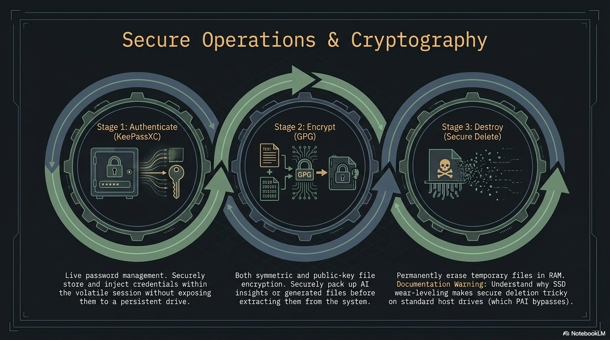
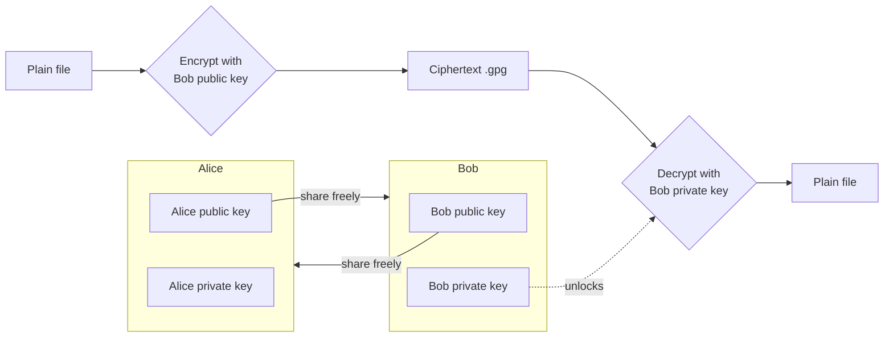

**GnuPG** (the GNU Privacy Guard, usually shortened to **GPG**) is the industry-standard free-software tool for encrypting, decrypting, signing, and verifying files. PAI ships with GPG preinstalled on every edition, plus **Kleopatra**, a graphical front-end for users who prefer clicking to typing. This guide walks a complete beginner from "I have never encrypted a file" to "I can exchange encrypted documents with a colleague and verify signatures on software I download."



In this guide:
- Every GPG term defined on first use — no prior knowledge assumed
- Symmetric (passphrase-only) encryption for the 90% single-user case
- Public-key encryption for sharing files with other people
- Signing and verifying so you can prove a file has not been tampered with
- A tutorial that takes you end-to-end on a single sensitive document
- A 10-recipe cookbook of ready-to-paste one-liners
- How to keep a long-term GPG identity on a live, amnesiac system like PAI

**Prerequisites**: PAI booted from USB. No previous GPG experience needed. A terminal window open (launch **Foot** from the app launcher with `Alt+D`, or press `Mod+Return` on the Sway desktop).

## Why GPG matters on an offline, private AI system

PAI's threat model is simple: no data should leave your machine unless you decide it does. GPG is how you protect files once they leave PAI's RAM-only environment — to a backup drive, to a collaborator, to your email.

GPG is audited open-source software with a 28-year track record, portable across every major OS, and dual-mode: it works as a single-user password tool (**symmetric**) or a sharing tool (**asymmetric** / **public-key**). Everything in the GUI is also a shell command.

!!! tip

    If you only need to protect files on your own machine, use **symmetric** encryption — a single strong passphrase, no keypair management. Public-key encryption is for sharing with other people or for long-term identity.


## Key concepts, defined once

Before any commands, four terms appear everywhere in GPG docs. Learn them once:

- **Keyring** — the database of public and private keys GPG manages for you. Lives in `~/.gnupg/` on PAI. On a RAM-only boot, it is erased when you shut down.
- **Keypair** — a matched pair of keys: a **public key** you share freely and a **private key** (also called a **secret key**) you never share. Anything encrypted to the public key can only be decrypted by the private key.
- **Passphrase** — the password that unlocks your private key. A long passphrase is mandatory; a private key without one is a plaintext file.
- **ASCII armor** — a text-safe encoding (`.asc` files) of otherwise binary GPG output. Use armor when pasting into email or chat; skip it when writing to disk to save space.
- **Detached signature** — a signature stored in a separate file (`.sig` or `.asc`) alongside the original, as opposed to wrapping the original inside the signature. Detached signatures let you distribute the original file unmodified.
- **Fingerprint** — a 40-character hex string that uniquely identifies a key. You verify fingerprints out-of-band (phone call, in person) to confirm a public key belongs to the person you think it does.

## How public-key encryption works



The rule: **encrypt with the recipient's public key, decrypt with your own private key.** Signing is the mirror image: **sign with your own private key, verify with your public key.** A file can be both encrypted and signed in one step.

!!! warning

    Your private key plus its passphrase is your identity. Treat it like a house key that unlocks every encrypted file ever sent to you. Losing the private key means those files are unrecoverable; losing control of it means an attacker can impersonate you.


## Symmetric encryption: the 90% case

Symmetric encryption uses one passphrase for both encrypt and decrypt. No keypair, no keyring, no sharing model. This is the right tool for "I want to stash this tax return on a USB stick."


1. Encrypt a file with AES-256, the strongest symmetric cipher GPG offers:

   ```bash
   # -c is shorthand for --symmetric
   gpg -c --cipher-algo AES256 tax-return-2025.pdf
   ```

   GPG prompts twice for a passphrase and writes `tax-return-2025.pdf.gpg` next to the original.

2. Verify the encrypted file exists and check its type:

   ```bash
   file tax-return-2025.pdf.gpg
   ```

   Expected output:
   ```
   tax-return-2025.pdf.gpg: GPG symmetrically encrypted data (AES256 cipher)
   ```

3. Delete the plaintext — see [secure file deletion](secure-delete.md) for why `rm` alone is not enough on some filesystems:

   ```bash
   shred -uz tax-return-2025.pdf
   ```

4. Decrypt when you need the file back:

   ```bash
   gpg -d tax-return-2025.pdf.gpg > tax-return-2025.pdf
   ```

   GPG prompts for the passphrase and writes the decrypted file to the path you specify.


!!! tip

    Use a passphrase generator like `diceware` or combine six random words from a large wordlist. A six-word diceware passphrase provides roughly 77 bits of entropy — more than enough against offline attacks on AES-256.


## Public-key encryption: sharing files with others

Public-key mode requires a one-time setup: generate a keypair, export your public key, import theirs.

### Generating your keypair


1. Launch the interactive key wizard:

   ```bash
   gpg --full-generate-key
   ```

2. At the prompts, choose:
   - Kind of key: **(1) RSA and RSA**
   - Key size: **4096** bits
   - Expiry: **0** (never) for now, or **1y** for a one-year key you will renew
   - Real name and email: what other people will see attached to the key
   - Passphrase: a long, unique one — write it down in your [password manager](password-management.md)

3. List the key GPG just made:

   ```bash
   gpg --list-secret-keys --keyid-format=long
   ```

   Expected output (truncated):
   ```
   sec   rsa4096/ABCD1234EFGH5678 2026-04-20 [SC]
         9A8B7C6D5E4F3G2H1I0J9K8L7M6N5O4P3Q2R1S0T
   uid   [ultimate] Your Name <you@example.com>
   ssb   rsa4096/0T1S2R3Q4P5O6N7M 2026-04-20 [E]
   ```

   The 40-character hex string is your **fingerprint**. Share it when people ask "how do I know this public key is really yours?"

4. Export the public half so you can give it to others:

   ```bash
   gpg --armor --export you@example.com > you.asc
   ```

   `you.asc` is safe to email, post on a website, or hand out on a USB. It is not a secret.


### Encrypting to a recipient


1. Import the recipient's public key (they sent you `alice.asc`):

   ```bash
   gpg --import alice.asc
   ```

2. Confirm GPG sees the key:

   ```bash
   gpg --list-keys alice@example.com
   ```

3. Encrypt a file to Alice, with ASCII armor so the output is email-safe:

   ```bash
   gpg --encrypt --armor --recipient alice@example.com contract.pdf
   ```

   Output: `contract.pdf.asc` — send this anywhere. Only Alice's private key can read it.

4. Alice decrypts on her end:

   ```bash
   gpg --decrypt contract.pdf.asc > contract.pdf
   ```


!!! note

    When you encrypt to a recipient GPG does not use your private key at all. You can encrypt files for people without ever generating your own keypair — though without one, you cannot sign, and they cannot reply encrypted to you.


## Signing and verifying

A **signature** proves a file came from the holder of a given private key and has not changed since. Verifying a signature uses only the signer's public key.


1. Create a detached signature over a file:

   ```bash
   gpg --detach-sign --armor release-v1.0.tar.gz
   ```

   Output: `release-v1.0.tar.gz.asc` — distribute it alongside the original archive.

2. Anyone with your public key verifies both files:

   ```bash
   gpg --verify release-v1.0.tar.gz.asc release-v1.0.tar.gz
   ```

   Expected output:
   ```
   gpg: Good signature from "Your Name <you@example.com>"
   ```

3. Combine signing and encryption in one step — the most common real-world pattern:

   ```bash
   gpg --sign --encrypt --armor --recipient alice@example.com proposal.md
   ```

   The resulting `.asc` both proves you sent it and keeps it unreadable to anyone except Alice.


## Tutorial: encrypt a sensitive document and decrypt it back

A complete end-to-end exercise you can run in under five minutes.

**Goal**: encrypt a text file symmetrically, delete the plaintext, confirm you cannot read the encrypted file without the passphrase, then decrypt and recover the original.

**What you need**:
- PAI booted
- A terminal window (Foot)


1. Create a plaintext test file:

   ```bash
   echo "My bank account number is 0000-0000-1234" > secret.txt
   cat secret.txt
   ```

2. Encrypt with AES-256 and an armor-encoded output so you can see what a GPG message looks like:

   ```bash
   gpg -c --armor --cipher-algo AES256 secret.txt
   ```

   Enter a passphrase (twice). Output: `secret.txt.asc`.

3. Inspect the encrypted file — it should be unreadable:

   ```bash
   cat secret.txt.asc
   ```

   Expected output starts with:
   ```
   -----BEGIN PGP MESSAGE-----
   ```

4. Securely erase the plaintext:

   ```bash
   shred -uz secret.txt
   ls secret*
   ```

   Only `secret.txt.asc` remains.

5. Attempt to decrypt with a wrong passphrase first — GPG fails cleanly:

   ```bash
   gpg -d secret.txt.asc
   ```

   Enter a wrong passphrase. GPG prints `gpg: decryption failed: Bad session key`.

6. Decrypt with the correct passphrase:

   ```bash
   gpg -d secret.txt.asc > secret.txt
   cat secret.txt
   ```

   Output: `My bank account number is 0000-0000-1234`.


**What just happened?** You encrypted a file with a symmetric cipher, verified the ciphertext was unreadable, and recovered the plaintext using your passphrase. Everything happened in RAM on PAI — nothing was written to the host machine.

**Next steps**: try the same round-trip with public-key encryption by generating a keypair and encrypting to yourself (`--recipient you@example.com`).

## Kleopatra: the graphical front-end

**Kleopatra** is a Qt-based GUI for GPG, shipped on every PAI edition. It wraps the same commands you ran above behind menus.


1. Launch Kleopatra from the app launcher (`Alt+D`, type `kleopatra`).

2. Create a key: **File → New OpenPGP Key Pair**, fill in name and email, set a passphrase.

3. Import someone's public key: **File → Import**, select their `.asc` file.

4. Encrypt a file: **File → Sign/Encrypt**, pick the file, choose recipients, click Sign/Encrypt.

5. Decrypt or verify: drag the `.gpg` or `.asc` file onto the Kleopatra window, enter your passphrase if prompted.


*Kleopatra main window on PAI. Certificates you trust appear in the centre; the Sign/Encrypt and Decrypt/Verify buttons handle the common operations.*


*The Kleopatra new-key wizard. Advanced Settings lets you pick RSA 4096 and set expiry.*


*Right-click integration: encrypt files directly from the Thunar file manager.*

## Long-term keys on a live system

PAI is **amnesiac by default** — everything in `~/.gnupg/` disappears on shutdown unless you enable [persistence](../persistence/introduction.md). That is fine for one-off symmetric encryption, but public-key identities are supposed to last for years. You need a strategy.

### The external-USB pattern

The recommended pattern keeps your keyring off the PAI stick entirely:

```
┌──────────────────┐          ┌─────────────────────┐
│  PAI boot USB    │          │  Key USB (LUKS)     │
│  (amnesiac RAM)  │◄─import──│  ~/.gnupg backup    │
│                  │          │  master keypair     │
└──────────────────┘          └─────────────────────┘
```


1. Create a separate **LUKS**-encrypted USB (LUKS is the Linux full-disk encryption standard) and store a tarball of `~/.gnupg/` on it.

2. At the start of each PAI session, plug in the key USB, unlock the LUKS volume, and mount it.

3. Import your keyring:

   ```bash
   cp -r /media/keys/.gnupg ~/.gnupg
   chmod 700 ~/.gnupg
   ```

4. Use GPG normally for the session.

5. At shutdown, everything in RAM is wiped — your keys and any decrypted plaintext vanish. The originals remain safe on the LUKS USB.


!!! danger

    Never store an unencrypted copy of your private key. The LUKS passphrase is the only thing between an attacker with physical access and your GPG identity.


Alternatively, enable PAI [persistence](../persistence/introduction.md) and check the "GPG keyring" option during setup — `~/.gnupg/` then survives reboots on the PAI stick itself.

## One-liner cookbook

Ten ready-to-paste recipes for common tasks.

```bash
# 1. Encrypt a whole directory with symmetric AES-256
tar -cz mydir | gpg -c --cipher-algo AES256 > mydir.tar.gz.gpg

# 2. Decrypt and extract that archive in one pipe
gpg -d mydir.tar.gz.gpg | tar -xz

# 3. Encrypt to multiple recipients at once
gpg --encrypt --armor -r alice@example.com -r bob@example.com -r charlie@example.com doc.pdf

# 4. Sign and encrypt, armor-wrapped for pasting into an email body
gpg --sign --encrypt --armor -r alice@example.com message.txt

# 5. Detached signature over a release tarball, using a specific key
gpg --local-user you@example.com --detach-sign --armor release.tar.gz

# 6. Verify a signature downloaded from the internet
gpg --verify package.tar.gz.asc package.tar.gz

# 7. Shred plaintext immediately after encryption (one atomic shell step)
gpg -c secret.pdf && shred -uz secret.pdf

# 8. Encrypt + write to clipboard (wl-copy on PAI's Wayland desktop)
gpg --encrypt --armor -r alice@example.com message.txt && wl-copy < message.txt.asc

# 9. Export public key and show fingerprint for out-of-band verification
gpg --armor --export you@example.com > you.asc && gpg --fingerprint you@example.com

# 10. Encrypt to yourself as an offline backup (round-trip test)
gpg --encrypt --armor --recipient you@example.com backup.sql
```

!!! note

    Recipes 1 and 2 are the simplest way to encrypt an entire folder — GPG itself does not walk directories, but `tar` streams the contents through the pipe.


## Common pitfalls

- **"No secret key"** on decrypt — you do not hold the private key this file was encrypted to. Check `gpg --list-secret-keys`.
- **"No usable configuration for key X"** — the key has expired, been revoked, or is in a format GPG does not recognise. Run `gpg --edit-key X`.
- **Passphrase prompt never appears in a terminal** — add `export GPG_TTY=$(tty)` to the current shell. PAI sets this in `/etc/profile`, but subshells may lose it.

## Frequently asked questions

### What is the difference between GPG and LUKS?
GPG encrypts individual files or messages, one at a time. **LUKS** encrypts an entire block device — a USB stick, a disk partition — and presents it as a normal filesystem once unlocked. Use LUKS to protect an entire drive; use GPG to protect a single file you want to email or carry off the drive.

### Can I use my existing GPG key on PAI?
Yes. Export the secret key from your other machine with `gpg --export-secret-keys --armor you@example.com > you-secret.asc`, copy it onto an encrypted USB, and on PAI run `gpg --import you-secret.asc`. See the [long-term keys section](#long-term-keys-on-a-live-system) for a persistent workflow.

### Is GPG the same as PGP?
Practically, yes. **PGP** (Pretty Good Privacy) is the original commercial product from 1991; **OpenPGP** is the open standard derived from it (RFC 4880 and RFC 9580); **GPG** is the free-software OpenPGP implementation maintained by the GnuPG project. Files produced by any of them are interoperable. You will see people use the terms interchangeably.

### How do I share my public key?
Export it with `gpg --armor --export you@example.com > you.asc` and send the resulting `.asc` file by any means — email, website, chat, USB stick. It is a public document. Always share your **fingerprint** (`gpg --fingerprint`) over a separate channel so the recipient can confirm the key was not swapped in transit.

### What happens if I lose my private key?
Any files encrypted to that key are unrecoverable. There is no backdoor. This is by design — GPG has no key escrow. Back up your private key on at least two encrypted storage devices kept in separate physical locations, and test restoring it at least once a year.

### How strong is GPG encryption?
The default RSA 4096 keypair and AES-256 symmetric cipher are beyond reach of any publicly known attack. The practical weaknesses are always at the edges: a short passphrase, a compromised endpoint, or a user tricked into signing the wrong key. The cryptography itself is not the weak link.

### Can I encrypt emails with PAI?
Yes, but PAI does not include a graphical mail client by default. The supported patterns are: (1) compose your message in a text editor, encrypt it with `gpg --encrypt --armor`, and paste the ciphertext into a webmail interface; or (2) install Thunderbird with the built-in OpenPGP support on a persistent PAI install. See the [privacy introduction](../privacy/introduction-to-privacy.md) for threat-model guidance on mail.

### Can I encrypt a file for someone who does not use GPG?
Only with symmetric encryption — share the passphrase with them over a separate channel (a phone call, a signed note). They will need GPG or a compatible tool (like 7-Zip on Windows, which reads `.gpg` files) to decrypt. For ongoing collaboration, walk them through generating a keypair; it takes ten minutes.

## Related documentation

- [**Password Management with KeePassXC**](password-management.md) — Where to store your GPG passphrase and key backups
- [**Secure File Deletion**](secure-delete.md) — How to erase plaintext after encrypting so it cannot be recovered
- [**Persistence Setup**](../persistence/introduction.md) — Keep `~/.gnupg/` across PAI reboots without an external USB
- [**Introduction to Privacy**](../privacy/introduction-to-privacy.md) — PAI's threat model and how file encryption fits in
- [**System Requirements**](../general/system-requirements.md) — Minimum hardware to run PAI and its crypto tooling
