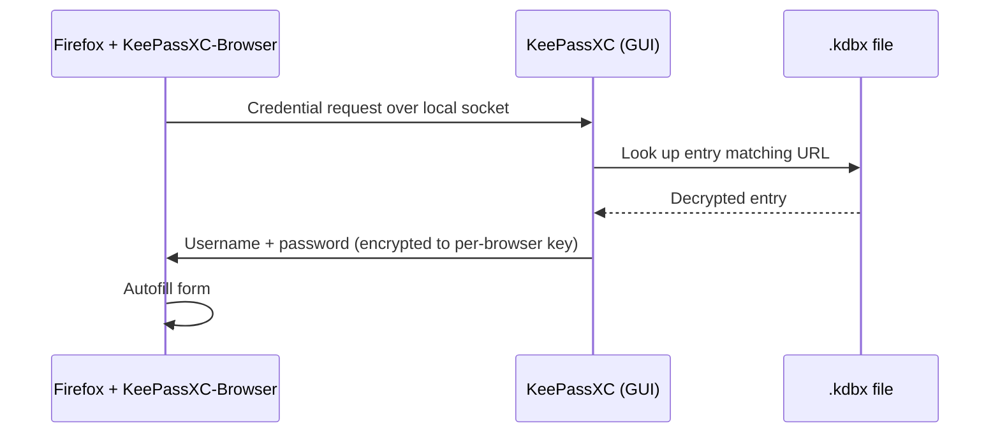

PAI ships with **KeePassXC**, an open source password manager that keeps every credential you own inside a single encrypted `.kdbx` file on disk. There is no cloud account, no subscription, no telemetry, and no background service reaching out to the internet. This guide walks you from a blank PAI session to a working password vault with browser autofill, two-factor codes, and a durable storage plan across reboots.

In this guide:
- Why KeePassXC fits PAI's offline-first model
- Launching KeePassXC and creating your first database
- Deciding where to store the `.kdbx` file so you don't lose it on reboot
- A hands-on tutorial with five entries, auto-type, and Firefox integration
- Generating a diceware master passphrase from the shell
- Replacing Google Authenticator with built-in TOTP
- Backups, recovery, and the command-line interface

**Prerequisites**: PAI booted to the desktop. No Linux experience required for the GUI sections; a little comfort with the terminal helps for the diceware and `keepassxc-cli` sections.

---

## Why KeePassXC on PAI

KeePassXC is the default password manager because it matches PAI's values exactly. It is fully open source (GPL v3), stores data in a single portable file, uses audited cryptography (**AES-256** with **Argon2** key derivation), and never requires an account or network connection. The same `.kdbx` file opens on Linux, macOS, Windows, iOS (Strongbox, KeePassium), and Android (KeePassDX, Keepass2Android), so your vault is portable without being cloud-hosted.

Contrast this with cloud password managers: those encrypt your vault too, but they also hold your ciphertext, your device fingerprint, your IP history, and your login metadata. KeePassXC holds nothing because there is no server.

!!! tip

    If you only remember one thing from this page, remember this: **your `.kdbx` file and your master passphrase are your entire security model.** Back up the file, never reuse the passphrase, and don't store both in the same place.


---

## Launching KeePassXC on PAI

KeePassXC is preinstalled. You can open it three ways:

- Press `Alt+D` (wofi launcher) and type `keepassxc`
- Open the **Settings** menu on waybar and click **Passwords**
- Run `keepassxc` from a terminal

On first launch the window is empty because no database exists yet. You either **Create new database** or **Open existing database**.

```
┌────────────────────────────────────────────────┐
│  KeePassXC  —  [ empty workspace ]             │
│                                                │
│    [ + Create new database ]                   │
│    [   Open existing database ]                │
│    [   Import from KeePass 1 / CSV / 1PUX ]    │
└────────────────────────────────────────────────┘
```


*KeePassXC on first launch. No database is open, so the toolbar icons for entries are greyed out.*

---

## Creating your first database


1. Click **Database → New Database** (or press `Ctrl+Shift+N`).

2. Enter a database name such as `personal-vault` and an optional description. The name is cosmetic only; the filename on disk can be anything.

3. On the **Encryption Settings** screen, leave the defaults: **AES-256** cipher, **Argon2id** key derivation, and a decryption time of around one second. KeePassXC benchmarks your CPU and picks iteration counts that take roughly that long — a deliberate slowdown that makes brute force attacks expensive.

4. On the **Database Credentials** screen, enter a strong **master passphrase**. See the diceware section below for a repeatable way to generate one. Optionally add a **key file** (a random file you keep separately) or a **hardware key** such as a YubiKey.

5. Choose a save location. **Do not save the `.kdbx` inside `/home/live`** unless you are running PAI with persistence — that directory evaporates on reboot. See [Where to store the .kdbx](#where-to-store-the-kdbx) for the decision matrix.

6. Click **Save**. The database opens and you are ready to add entries.


!!! warning

    The encryption settings screen has a slider that can lower Argon2's memory and time cost. Do not drop it below one second. Faster unlocks are also faster brute force attempts against your master key.


*The encryption settings step. The green checkmark means the settings meet modern recommendations.*

---

## Generating a diceware master passphrase

A diceware passphrase is six or more random words drawn from a large dictionary. A seven-word diceware phrase from a 100,000-word list has roughly 116 bits of entropy — strong enough that even a well-funded attacker running Argon2 at full speed would need longer than the age of the universe to brute force it.

PAI includes `/usr/share/dict/words`, which is exactly the kind of list we need. Run this in any terminal:

```bash
# Pick seven random words, lowercase, join with hyphens
shuf -n 7 /usr/share/dict/words | tr '[:upper:]' '[:lower:]' | paste -sd-
```

Expected output (yours will differ — that is the point):

```
pebble-anchor-ferment-quartz-lantern-drift-marigold
```

A shorter variant with only common words:

```bash
# Restrict to 4-8 letter lowercase words, pick six
grep -E '^[a-z]{4,8}$' /usr/share/dict/words | shuf -n 6 | paste -sd-
```

Expected output:

```
basin-choir-falcon-reap-tundra-wisp
```

!!! tip

    Say the passphrase out loud a few times while you type it. Your memory binds better to rhythm and sound than to a row of characters. Write it on paper **once**, keep that paper in a different physical location from any backup of the database, and destroy the paper once the phrase is committed to memory.


!!! danger

    If you forget your master passphrase, **no one can recover it** — not us, not the KeePassXC developers, not a forensic lab. That is the entire point of the system. See [What if I forget the master password?](#frequently-asked-questions) in the FAQ.


---

## Where to store the .kdbx

This is the most important decision on this page. A `.kdbx` file saved to the PAI live stick's RAM overlay disappears when you shut down. Pick a storage location deliberately.

### Decision matrix

| Option | Privacy | Convenience | Durability | Recommended for |
|---|---|---|---|---|
| **A. Encrypted external USB (LUKS)** | Excellent — ciphertext inside ciphertext, unplug to physically isolate | Medium — plug in, unlock, mount each session | Excellent — survives reboots, portable to any OS | Most users, most of the time |
| **B. PAI persistence partition** | Excellent — LUKS-encrypted, same stick as PAI | High — transparent across reboots | High — tied to the PAI stick itself | Users who have enabled [persistence](../persistence/introduction.md) and only ever use PAI |
| **C. Cloud sync (Syncthing, Nextcloud)** | Acceptable — file is encrypted, but metadata and access patterns leak | High — automatic across devices | High — multiple copies | Users who need phone access and accept the tradeoff |
| **D. Session-only (RAM)** | Excellent — gone on reboot | Low — re-enter everything each session | None — wiped on shutdown | Testing, demos, or temporary throwaway credentials |


=== "Option A — External USB (LUKS)"

Buy a cheap USB stick dedicated to the vault. Format it with LUKS so the whole device is encrypted at rest:

```bash
# Replace sdX with the correct device — verify with lsblk first
sudo cryptsetup luksFormat /dev/sdX1
sudo cryptsetup open /dev/sdX1 vault
sudo mkfs.ext4 /dev/mapper/vault
sudo mkdir -p /mnt/vault
sudo mount /dev/mapper/vault /mnt/vault
```

Save your `.kdbx` to `/mnt/vault/personal.kdbx`. When finished:

```bash
sudo umount /mnt/vault
sudo cryptsetup close vault
```

Unplug the stick and store it somewhere safe. This is the gold-standard option because the device is encrypted both at the filesystem level (LUKS) and at the file level (the `.kdbx` itself).


=== "Option B — Persistence"

If you have set up [PAI persistence](../persistence/introduction.md), save the database to `~/Documents/personal.kdbx` inside the persistent home. It survives reboots automatically and is already protected by the persistence LUKS passphrase. The tradeoff is that the file only exists on the PAI stick, so losing the stick loses the vault unless you back it up elsewhere.


=== "Option D — Session-only"

For a throwaway session, save the database to `/tmp/test.kdbx`. Everything in `/tmp` lives in RAM and is wiped on shutdown. Useful for trying KeePassXC out, generating a one-off password, or demoing the app. Do not rely on it for real credentials.


!!! note

    Option C (cloud sync) is covered in the FAQ but not shown as a tab, because PAI's defaults discourage persistent network services. If you choose it, run Syncthing on a persistent host and use PAI only as a read-write client.


---

## Tutorial: Set up KeePassXC for daily use with PAI

**Goal**: go from a blank PAI session to a working KeePassXC database with five entries, working auto-type, and Firefox browser integration — in under ten minutes.

**What you need**:
- PAI booted to the desktop
- An encrypted USB for the vault (Option A) or persistence enabled (Option B)
- A terminal open for the diceware step
- Firefox open for the browser integration step
- Ten minutes


1. **Generate your master passphrase.** In a terminal:

   ```bash
   shuf -n 7 /usr/share/dict/words | tr '[:upper:]' '[:lower:]' | paste -sd-
   ```

   Copy the output to a scrap of paper. You will type it into KeePassXC in a moment.

2. **Create the database.** Launch KeePassXC (`Alt+D`, type `keepassxc`), click **Create new database**, name it `personal-vault`, accept the encryption defaults, paste the diceware phrase into both credential boxes, and save to `/mnt/vault/personal.kdbx` (Option A) or `~/Documents/personal.kdbx` (Option B).

3. **Add five starter entries.** Press `Ctrl+N` to open the **New Entry** dialog. Fill in title, username, password, and URL. Press `Ctrl+G` to generate a random password. Save with `Ctrl+S`. Repeat for at least:
   - `email-primary` (your main email)
   - `bank-main` (your bank login)
   - `router-admin` (your home router)
   - `github` (version control)
   - `ssh-laptop` (your SSH private key passphrase)

4. **Try auto-type.** Open Firefox, navigate to a login page for one of your entries, and click into the username field. Switch back to KeePassXC, select the matching entry, and press `Ctrl+V` (the KeePassXC "perform auto-type" shortcut, not the paste shortcut). KeePassXC types the username, tabs to the password field, types the password, and presses Enter.

   Expected output: you are logged in without ever copying the password to the clipboard.

5. **Install the browser extension.** In Firefox, visit [addons.mozilla.org/en-US/firefox/addon/keepassxc-browser](https://addons.mozilla.org/en-US/firefox/addon/keepassxc-browser/) and click **Add to Firefox**. Back in KeePassXC, go to **Tools → Settings → Browser Integration**, tick **Enable browser integration**, and tick **Firefox**. Restart Firefox, click the new KeePassXC icon in the toolbar, and click **Connect**. A dialog appears in KeePassXC asking you to approve the connection and name it (e.g. `firefox-pai`).

6. **Test autofill.** Visit a login page. The KeePassXC icon in the username field turns green. Click it, confirm the entry, and Firefox fills both fields automatically.

7. **Lock the database.** Press `Ctrl+L`. The database locks and the workspace grays out. Press any key or click **Unlock**, re-enter your passphrase, and the database reopens.


**What just happened?** You now have an encrypted vault on durable storage, a browser that autofills without ever sending credentials through a cloud sync service, and a locked database that only opens with a passphrase only you know.

**Next steps**: enable [TOTP](#totp-two-factor-authentication-in-keepassxc) for every account that supports it, and read [backing up and recovery](#backing-up-and-recovery) below.

---

## Browser integration in depth

KeePassXC-Browser talks to KeePassXC over a local Unix socket — never over the network. The extension negotiates a per-browser encryption key on first connect. If you reinstall Firefox or the extension, you get a fresh key and must approve the connection again.



!!! note

    Persistence is effectively required for browser integration. Without persistence, you reinstall the extension each boot and re-approve the connection every time. With persistence, Firefox profile and KeePassXC connection keys both survive reboots.


---

## TOTP (two-factor authentication) in KeePassXC

KeePassXC generates the same six-digit TOTP codes as Google Authenticator, Authy, or a hardware token. Storing TOTP secrets inside KeePassXC means your 2FA codes are backed up, portable, and never tied to a specific phone.


1. On the site you want to secure (GitHub, for example), enable two-factor authentication and choose **Authenticator app**. The site displays a QR code and a text secret (a base32 string like `JBSWY3DPEHPK3PXP`).

2. In KeePassXC, open the matching entry (or create one), click **Advanced**, then **TOTP → Setup TOTP**. Paste the secret and leave the defaults (6 digits, 30 seconds, SHA-1).

3. Back in the entry, press `Ctrl+T` to copy the current code, paste it into the site to confirm setup, and save.

4. From now on, pressing `Ctrl+T` on any entry copies its current TOTP code to the clipboard for ten seconds.


!!! warning

    Storing passwords and TOTP secrets in the same database means a single compromised master passphrase defeats both factors for that entry. If you want true factor separation, keep TOTP in a hardware token (YubiKey OATH) and passwords in KeePassXC.


---

## Day-to-day shortcuts

| Shortcut | Action |
|---|---|
| `Ctrl+N` | New entry |
| `Ctrl+B` | Copy username |
| `Ctrl+C` | Copy password (auto-clears after 10 s) |
| `Ctrl+T` | Copy TOTP code |
| `Ctrl+U` | Open URL in browser |
| `Ctrl+V` | Perform auto-type (global, configurable) |
| `Ctrl+L` | Lock database |
| `Ctrl+F` | Search |
| `Ctrl+S` | Save database |

Set an auto-lock timeout in **Tools → Settings → Security → Lock databases after inactivity of**. Five minutes is a reasonable default for a public environment; thirty is fine at home.

---

## Backing up and recovery

A `.kdbx` file is a single blob. Back it up the way you would back up a tax return: multiple copies, multiple locations, at least one offline.

Recommended pattern:

1. Primary copy on your working USB (Option A) or persistence partition (Option B).
2. Second copy on a different encrypted USB stored in a drawer.
3. Third copy in an encrypted archive on a trusted machine — you can use GPG:

```bash
# Encrypt the .kdbx further before it ever leaves your hands
gpg --symmetric --cipher-algo AES256 personal.kdbx
# Produces personal.kdbx.gpg — move this copy freely
```

See [Encrypting files with GPG](encrypting-files-gpg.md) for the full workflow.

!!! tip

    Copy the `.kdbx` to a new location **before** you make major edits. KeePassXC saves atomically, but human error (deleting a group, accidentally clearing a field) is the most common form of data loss. A five-minute-old backup has saved more vaults than any filesystem feature.


---

## Using keepassxc-cli from the terminal

The `keepassxc-cli` binary is installed on every PAI image. It is useful for scripts, shell aliases, and quick lookups without opening the GUI.

```bash
# Open the database interactively
keepassxc-cli open /mnt/vault/personal.kdbx
```

Expected output:

```
Enter password to unlock /mnt/vault/personal.kdbx:
personal.kdbx> ls
/
/Email
/Banking
/Servers
personal.kdbx> show /Email/work
Title: work
UserName: you@example.org
Password: PROTECTED
URL: https://mail.example.org
```

Common one-shot invocations:

```bash
# Show an entry (prompts for password, prints username + password)
keepassxc-cli show -s /mnt/vault/personal.kdbx Email/work

# Generate a password without opening a database
keepassxc-cli generate -L 24 -l -u -n -s

# Add a new entry non-interactively
keepassxc-cli add -u "alice" -p /mnt/vault/personal.kdbx Servers/homelab
```

---

## Frequently asked questions

### Is KeePassXC the same as KeePass?
Not quite. **KeePass** is the original Windows-only .NET application started in 2003. **KeePassXC** is a C++ cross-platform rewrite focused on Linux and macOS support, a cleaner UI, and faster release cadence. Both read and write the same `.kdbx` file format, so you can switch between them or share a database across platforms. PAI ships KeePassXC because it is native to Linux and does not require Mono or Wine.

### Can I import from 1Password?
Yes. 1Password exports to `.1pux` (current) or `.csv` (legacy). KeePassXC reads both via **Database → Import → 1Password 1PUX** or **CSV Import**. TOTP seeds from 1Password are preserved in the 1PUX export and become KeePassXC TOTP entries automatically. Bitwarden (JSON export), LastPass (CSV export), and KeePass 1.x databases are also supported.

### Can I sync my KeePass database across devices?
Yes, but it is your responsibility, not KeePassXC's. The recommended PAI-aligned approach is a shared encrypted USB or a Syncthing cluster over Tailscale or your LAN. The `.kdbx` file is already encrypted, so even a careless sync (Dropbox, Google Drive) does not expose passwords — though it does leak metadata like filename and modification times. If you sync, never open the same database from two devices at the same time; KeePassXC does not arbitrate concurrent writes and you can end up with a merge conflict.

### What if I forget the master password?
Your data is gone. There is no back door, no recovery email, no reset link, and no support ticket that will help. This is the deliberate design of the system: if an attacker cannot recover the database without the passphrase, then neither can you. Write the passphrase on paper and store the paper somewhere physically separate from every copy of the database. If you use a key file as a second factor, losing the key file has the same effect.

### Is it safe to store my passwords in KeePassXC?
Yes, with two qualifications. The cryptography is sound — AES-256 with Argon2id is the same stack used by modern disk encryption systems. The risks are behavioral: a weak master passphrase, a leaked `.kdbx` backup on an unencrypted cloud drive, or a keylogger on the host OS. PAI mitigates the host-OS risk by running from read-only media; you still have to pick a strong passphrase and protect backups.

### Can I access KeePassXC from my phone?
Yes. Copy the `.kdbx` to your phone and open it with **KeePassDX** (Android, F-Droid), **Keepass2Android** (Android, Play Store), **Strongbox** (iOS), or **KeePassium** (iOS). All four are open source and maintained. For transfer, use Syncthing over your LAN, an SD card, or a USB-C stick — avoid cloud pipes unless you understand the metadata tradeoffs.

### How do I back up my database?
At minimum: copy the `.kdbx` file to a second encrypted USB stick on a schedule you will actually follow (weekly is a good default). Better: three copies in two locations, one of them offline. Best: the three-two-one pattern plus a periodic `gpg --symmetric` archive so the file is double-encrypted when it travels. See [Backing up and recovery](#backing-up-and-recovery) above.

### Does KeePassXC ever talk to the internet?
Not by default. KeePassXC can optionally check Have I Been Pwned for compromised passwords (off by default, prompts before sending hashed prefixes) and can download favicons for entries (off by default). Both features are opt-in and labeled clearly in **Tools → Settings**. The core functions — open, edit, save, lock — are entirely local.

### Can I use a YubiKey with KeePassXC on PAI?
Yes. Insert the YubiKey before creating or unlocking the database. On the credentials screen, tick **Use hardware key** and pick a challenge-response slot (slot 2 by default, configured with `ykman`). PAI includes the udev rules that let an unprivileged user access the YubiKey, so no `sudo` is needed.

---

## Related documentation

- [**Encrypting files with GPG**](encrypting-files-gpg.md) — Double-encrypt your `.kdbx` backups before they travel
- [**Persistence introduction**](../persistence/introduction.md) — Set up an encrypted home directory so KeePassXC settings and browser extension survive reboots
- [**Privacy model**](../privacy/introduction-to-privacy.md) — How PAI's offline-first design complements an offline password manager
- [**System requirements**](../general/system-requirements.md) — Hardware needed to run PAI, including USB stick guidance
- [**Features included**](../general/features-included.md) — Full list of applications preinstalled on the PAI image
