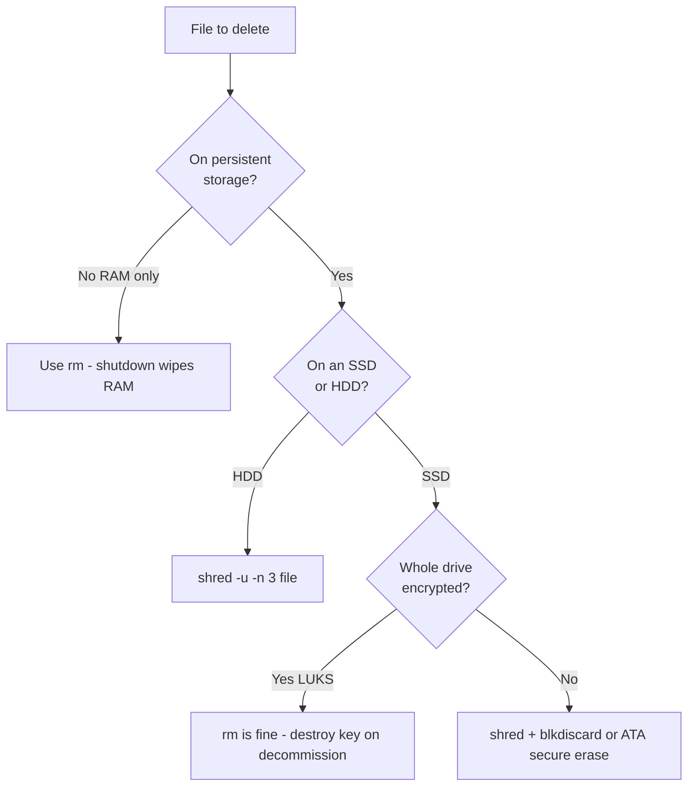

Deleting a file on Linux with `rm` or a file manager does not erase its contents. It only unlinks the name and marks the blocks as free; the actual bytes sit on disk until something else overwrites them. This guide shows how to use **`shred`**, **`srm`**, and **`sfill`** on PAI to destroy file contents beyond normal recovery, explains why the rules change on SSDs, and tells you when secure deletion is worth the trouble and when PAI's RAM-only default already handled it for you.

**Worth knowing first:** most of the time, you don't have to think about this at all. PAI is amnesic by default — any file you create in a regular session lives in RAM and is gone the moment you shut down. Secure delete matters when you're writing to persistent storage, a USB drive, or a mounted external disk. For those cases, PAI ships `shred`, `srm`, and `sfill` ready to go.

In this guide:
- Why `rm` is not a privacy tool
- The two secure-delete toolkits bundled in PAI
- A decision matrix for "when to bother vs when not to"
- Platform-aware recipes for HDDs versus SSDs
- A copy-paste cookbook of eight ready-to-run commands
- A tutorial for shredding a folder of sensitive documents, with verification
- The metadata corners that linger after a file is gone

**Prerequisites**: PAI booted, a terminal open, and basic comfort with the command line. No programming experience required. Running on [persistent storage](../persistence/introduction.md) or an external drive is where this matters most.

---

## Why regular delete is not enough

When you run `rm secret.txt`, the filesystem does three things: it removes the directory entry, decrements the inode's link count, and flags the file's data blocks as available. **Not one of those steps touches the bytes themselves.** The contents of `secret.txt` stay on disk exactly where they were, waiting for some future write to land in the same spot.

Forensic recovery tools like `photorec`, `extundelete`, and `testdisk` exploit this. On a spinning hard disk drive (HDD) with free space, a file deleted minutes ago is typically recoverable in full. On a lightly used drive, files deleted weeks ago often come back intact. The recycle bin on a graphical desktop does not change this equation: emptying the bin runs the same `unlink()` call.

!!! warning

    On PAI's default **live session** (no [persistence](../persistence/introduction.md) configured), every file you create lives in RAM, not on disk. When you shut down, the contents vanish physically — no forensic tool can recover RAM that has lost power. You only need the techniques in this guide when you are writing to a persistent partition, an external drive, or a USB stick that survives reboot.


---

## The two secure-delete toolkits in PAI

PAI ships with two overlapping toolsets. Both are preinstalled and both work offline.

| Tool | Package | What it does | Default passes |
|---|---|---|---|
| `shred` | GNU coreutils | Overwrites a file's blocks with pseudo-random data, then optionally unlinks it | 3 |
| `srm` | `secure-delete` | Overwrites with a Gutmann-inspired pattern, renames, truncates, unlinks | 38 |
| `sfill` | `secure-delete` | Fills the free space on a mounted filesystem with random data | 38 |
| `sswap` | `secure-delete` | Wipes a swap partition | 38 |
| `sdmem` | `secure-delete` | Wipes unallocated RAM | varies |

`shred` is the workhorse — fast, universally available, and good enough for the overwhelming majority of threat models. The `secure-delete` suite is useful when you want to wipe **free space** (not individual files) or when you need a single command that also scrubs filenames and sizes from directory metadata.

!!! tip

    If you are unsure which to reach for: use `shred -u -n 3 filename` for files, and `sfill -lv /mountpoint` to scrub the free space afterwards. That covers 95% of the real work.


---

## When to bother vs when not to

Secure deletion has a cost: time, disk wear, and the cognitive overhead of remembering to do it. The point of this section is to help you skip it when it does not matter.

| Situation | Secure delete needed? | Why |
|---|---|---|
| Live PAI session, no persistence, file in `~/Downloads` | No | Lives in RAM; gone at shutdown |
| About to run `pai-memory-wipe` and power off | No | RAM wipe covers everything in your session |
| File on an encrypted [persistent partition](../persistence/introduction.md) you will keep using | Optional | Encryption protects against offline attackers; shred defends against future live-session compromise |
| File on a persistent partition on a laptop you are about to sell | Yes — but wipe the **key**, not the files | Destroying the LUKS header is faster and more complete |
| File on an unencrypted external HDD | Yes | Classic shred target; recovery is trivial otherwise |
| File on an unencrypted external SSD | Yes, with caveats | See the SSD section below |
| USB stick you are about to dispose, sell, or hand off | Yes — wipe the whole device | Per-file shredding is not enough |
| Regulatory deletion (HIPAA, GDPR right-to-erasure) | Yes | Document the procedure as well |
| "My roommate might open the file manager" | No | Normal `rm` is fine |



---

## The SSD caveat: why shredding is weaker on flash

!!! warning

    **Shredding individual files on an SSD does not reliably overwrite the original data.** This is the single most important fact on this page. If your threat model assumes a forensic adversary with access to the raw flash chips, per-file shredding on an SSD is not sufficient. Use full-disk encryption instead.


Here is what is going on in plain English. A spinning hard drive stores each logical block in a fixed physical location on a platter. When `shred` writes random bytes to the "file's blocks," those bytes land exactly where the original data was, destroying it.

Solid-state drives do not work that way. Flash memory cells can only be erased a limited number of times before they fail, so SSD controllers use **wear leveling**: they silently remap writes to spread them across the chip. When you overwrite a file, the new data is written to a fresh physical cell and the original cell is marked "stale" — still holding your secrets, still readable by a forensic tool that bypasses the controller, and completely invisible to `shred`.

**TRIM** helps in theory. It is a signal from the filesystem to the SSD saying "these blocks are free, you can erase them whenever you like." Most Linux filesystems on PAI issue TRIM, either continuously or via a weekly timer. But TRIM is advisory — the controller decides when (or whether) to actually zero the cell. You have no guarantee and no visibility.

The practical consequence is a two-tier strategy:

1. **Encrypt first.** If the drive is [LUKS-encrypted](../persistence/introduction.md) from the start, the wear-leveled stale blocks hold ciphertext, not plaintext. Destroying the 512-byte LUKS header at decommission time renders every block on the drive unreadable in one operation.
2. **If you cannot encrypt,** use `blkdiscard` on the whole device, or the drive's built-in ATA secure-erase via `hdparm --security-erase`. Both tell the controller to issue an erase command to every cell it knows about.

### HDD vs SSD shredding recipes

=== "HDD (spinning disk)"
    ```bash
    # Shred a single file in place and remove it (3 passes + final zero)
    shred -u -z -n 3 /mnt/backup/tax-return.pdf

    # Shred every file in a directory, recursively
    find /mnt/backup/old-receipts -type f -exec shred -u -z -n 3 {} \;

    # After shredding, scrub the free space to cover deleted-but-not-shredded files
    sudo sfill -lv /mnt/backup
    ```
    On an HDD, `shred` overwrites the exact physical sectors that held your data. Three passes is enough for any non-nation-state threat model.
=== "SSD (flash)"
    ```bash
    # Per-file shred on an SSD is best-effort only — use for defense in depth
    shred -u -n 1 ~/persistent/secret.pdf

    # Issue TRIM manually on the whole mounted filesystem
    sudo fstrim -v /persistent

    # Whole-device erase (destroys ALL data — verify the device name first)
    sudo blkdiscard -f /dev/sdX

    # ATA secure erase — the nuclear option
    sudo hdparm --user-master u --security-set-pass p /dev/sdX
    sudo hdparm --user-master u --security-erase p /dev/sdX
    ```
    For single files on an SSD, one `shred` pass plus `fstrim` is the best the OS can offer. For real confidence, encrypt the drive or wipe the whole device.

---

## One-liner cookbook

Copy, paste, adjust paths. Every command here assumes you have already confirmed the path.

```bash
# 1. Shred a single file, remove it, hide that shredding happened
shred -u -z -n 3 ~/persistent/notes/passwords.txt

# 2. Shred every file in Downloads before shutdown
shred -u -n 3 ~/Downloads/*

# 3. Shred recursively through a directory tree
find ~/persistent/case-files -type f -print0 | xargs -0 shred -u -n 3

# 4. Secure-remove a file with srm (renames + truncates + overwrites)
srm -rv ~/persistent/old-keys/

# 5. Scrub free space on a mounted persistent partition
sudo sfill -lv /persistent

# 6. Wipe the swap partition (only if you have added swap; PAI has none by default)
sudo sswap /dev/sdX5

# 7. Wipe a whole USB stick (DESTROYS EVERYTHING — check the device name)
sudo shred -v -n 1 -z /dev/sdX

# 8. Issue a manual TRIM on an SSD-backed filesystem
sudo fstrim -v /persistent
```

!!! danger

    Recipe 7 destroys every byte on the target device. Always run `lsblk` first, confirm you are pointing at the external USB and not your internal disk or the PAI boot stick, and read the device name out loud before pressing Enter. There is no undo.


---

## Tutorial: Securely delete a folder of sensitive documents

**Goal**: You have a folder `~/persistent/legal-docs/` on your encrypted persistent partition containing PDFs and scans you no longer need. You want them gone in a way that resists a future `photorec`-style recovery.

**What you need**:
- PAI booted with [persistence](../persistence/introduction.md) unlocked
- A terminal
- The folder path confirmed with `ls`

1. **Confirm what you are about to destroy.** Never shred a path you have not inspected.

   ```bash
   ls -la ~/persistent/legal-docs/
   du -sh ~/persistent/legal-docs/
   ```

   Expected output:
   ```
   total 14M
   -rw------- 1 pai pai 4.2M Apr 19 09:13 affidavit.pdf
   -rw------- 1 pai pai 8.8M Apr 19 09:14 evidence-scans.pdf
   -rw------- 1 pai pai 1.1M Apr 19 09:14 letter.pdf
   14M /home/pai/persistent/legal-docs/
   ```

2. **Shred every file in the folder recursively.** The `-v` flag shows progress so you can verify every file was touched.

   ```bash
   find ~/persistent/legal-docs/ -type f -print0 \
     | xargs -0 shred -u -z -n 3 -v
   ```

   Expected output (abridged):
   ```
   shred: /home/pai/persistent/legal-docs/affidavit.pdf: pass 1/4 (random)...
   shred: /home/pai/persistent/legal-docs/affidavit.pdf: pass 2/4 (random)...
   shred: /home/pai/persistent/legal-docs/affidavit.pdf: pass 3/4 (random)...
   shred: /home/pai/persistent/legal-docs/affidavit.pdf: pass 4/4 (000000)...
   shred: /home/pai/persistent/legal-docs/affidavit.pdf: removing
   shred: /home/pai/persistent/legal-docs/affidavit.pdf: removed
   ```

3. **Remove the now-empty directory.** `shred` does not delete directories themselves.

   ```bash
   rmdir ~/persistent/legal-docs/
   ```

4. **Scrub the metadata corners.** Thumbnails, recent-files caches, and trash all leave traces.

   ```bash
   shred -u -n 1 ~/.cache/thumbnails/*/legal-docs* 2>/dev/null
   shred -u -n 1 ~/.local/share/recently-used.xbel 2>/dev/null
   rm -rf ~/.local/share/Trash/files/legal-docs
   ```

5. **Scrub the free space on the partition.** This overwrites any remnants from files you may have deleted normally in the past.

   ```bash
   sudo sfill -lv /persistent
   ```

   This is slow — it writes random data until the disk is full, then deletes it. Expect tens of minutes on a large partition.

6. **Verify.** Run a recovery tool against the partition. If `photorec` finds nothing that looks like your documents, the wipe succeeded.

   ```bash
   sudo photorec /d /tmp/recovery-test /dev/mapper/pai-persistent
   ```

   Let `photorec` run for a few minutes, then cancel and inspect `/tmp/recovery-test`. On an HDD after the steps above, you should see no recognizable content.

**What just happened?** You overwrote each file's blocks three times with random bytes, renamed and unlinked them, cleared the cached thumbnails and recent-file pointers, then overwrote every unused byte on the partition. On an HDD this is forensically complete. On an SSD it is best-effort — the [SSD caveat](#the-ssd-caveat-why-shredding-is-weaker-on-flash) still applies.

**Next steps**: If the documents were regulated, record the procedure and timestamp in your deletion log. If this was a one-time cleanup and you are done with the persistent partition altogether, destroying the LUKS header with `cryptsetup luksErase` is faster and more complete than shredding files one by one.

---

## Metadata corners: traces that linger after a shred

A shredded file is only as private as the metadata trail you leave behind. On a persistent PAI system, check these locations after any sensitive deletion.

- **Thumbnails** — `~/.cache/thumbnails/large/`, `~/.cache/thumbnails/normal/`. Image viewers and file managers auto-generate previews that live independently of the original file.
- **Recent files list** — `~/.local/share/recently-used.xbel` (XDG), plus application-specific lists in `~/.config/`. Opening a PDF once puts its full path in this file.
- **Shell history** — `~/.bash_history`, `~/.zsh_history`. If you typed the filename at a prompt, it is logged. Run `shred -u ~/.bash_history` or `history -c; history -w`.
- **Editor backups and swap** — `*~`, `.*.swp`, `~/.vim/undo/`, `~/.config/nano/`. Editors routinely save copies.
- **Systemd journal** — `/var/log/journal/`. Filenames passed to `sudo` or logged by apps leak into `journalctl`. Run `sudo journalctl --vacuum-time=1s` to truncate.
- **Clipboard** — the Wayland clipboard holds whatever you last copied. Clear it with `wl-copy --clear`.
- **Trash** — `~/.local/share/Trash/files/` and `~/.local/share/Trash/info/`. "Empty trash" does not shred; do it manually.

!!! note

    On a **RAM-only** PAI session, every item above is already volatile. Shutdown is your metadata wipe. This list only matters if you are running with persistence, or writing to an external drive that survives the session.


---

## Shredding an entire USB stick

To wipe a USB stick before disposal, you overwrite the block device, not individual files.

1. **List block devices and identify the USB stick.** Confirm by size, model, or by unplugging and re-running.

   ```bash
   lsblk -o NAME,SIZE,MODEL,MOUNTPOINT
   ```

2. **Unmount any partitions on the device.**

   ```bash
   sudo umount /dev/sdX* 2>/dev/null
   ```

3. **Overwrite the whole device once with random data, then zero it.**

   ```bash
   sudo shred -v -n 1 -z /dev/sdX
   ```

4. **On SSDs (including modern "USB SSDs"), prefer ATA secure erase if supported.**

   ```bash
   sudo hdparm -I /dev/sdX | grep -i erase
   sudo hdparm --user-master u --security-erase NULL /dev/sdX
   ```

!!! danger

    Replacing the `X` in `/dev/sdX` with the wrong letter will destroy your internal disk or your PAI boot stick. Read the device name out loud. Run `lsblk` twice. Unplug and replug the USB to confirm its device node. There is no recovery.


---

## Frequently asked questions

### Does `rm -rf` securely delete files?
No. `rm -rf` unlinks files from the directory tree and marks their blocks as free, but the bytes stay on disk until something else overwrites them. Standard forensic tools can reconstruct files deleted with `rm` in seconds. Use `shred -u` or `srm -r` when you actually need the contents gone.

### Can I recover a file after shredding?
On a hard drive: practically no. `shred` overwrites the exact physical sectors that held the file, and three passes of random data defeats every commercial recovery tool. On an SSD: sometimes yes, because wear leveling may have preserved the original flash cells under a different address. That is why the SSD section of this guide recommends full-disk encryption as the primary defence.

### How many overwrite passes do I need?
For nearly all threat models, one pass of random data is enough. Three passes (the `shred` default when you pass `-n 3`) is a historical convention that dates to 1990s magnetic-media concerns that no longer apply. The 35-pass Gutmann scheme that `srm` defaults to is theoretical overkill on modern hardware — it wastes time and shortens SSD lifespan without adding real security.

### Does shredding work on encrypted drives?
On a [LUKS-encrypted](../persistence/introduction.md) partition, individual file shredding still works the same way — the plaintext blocks get overwritten with random data inside the encrypted container. But for decommissioning an encrypted drive, a far faster option is to destroy the LUKS header with `cryptsetup luksErase /dev/sdX`. Without the key, every byte on the drive is indistinguishable from random noise. One small operation wipes the entire drive.

### How do I wipe an entire USB stick?
Use `sudo shred -v -n 1 -z /dev/sdX` after verifying the device name with `lsblk`. For SSD-based USB sticks, prefer `sudo blkdiscard -f /dev/sdX` or ATA secure erase via `hdparm --security-erase`. See the [USB wipe section](#shredding-an-entire-usb-stick) above for the full procedure.

### What does secure-delete do that `rm` doesn't?
The `secure-delete` suite (`srm`, `sfill`, `sswap`, `sdmem`) does four things `rm` never does: overwrites the file's data blocks with random patterns, renames the file to hide the original name from directory metadata, truncates the file to zero length before unlink, and offers companion tools for wiping free space, swap, and RAM. `rm` does only the directory unlink.

### Do I need to secure-delete on a live PAI session?
No. Files created during a [live (non-persistent) PAI session](../first-steps/first-boot-walkthrough.md) live entirely in RAM. When you shut down — especially with [`pai-memory-wipe`](../first-steps/shutting-down.md) — the cells are overwritten and power is cut. Nothing a forensic tool could read ever touched a disk.

### Will shredding damage my SSD?
Not meaningfully for occasional use. Modern SSDs are rated for hundreds of terabytes of writes. A few-gigabyte shred or an occasional `sfill` is a rounding error. Running `sfill` on a full partition daily would eventually matter; running it once before selling a laptop will not.

---

## Related documentation

- [**Shutting Down PAI Safely**](../first-steps/shutting-down.md) — How `pai-memory-wipe` wipes RAM and why it is often the only secure-delete you need
- [**Introduction to Persistence**](../persistence/introduction.md) — Why LUKS-encrypted persistence is the first line of defence for any sensitive data
- [**Introduction to Privacy on PAI**](../privacy/introduction-to-privacy.md) — How PAI's RAM-only default interacts with the techniques on this page
- [**First Boot Walkthrough**](../first-steps/first-boot-walkthrough.md) — What a live PAI session looks like and what data never touches disk
- [**System Requirements**](../general/system-requirements.md) — Hardware considerations, including SSD vs HDD, that affect secure-delete behaviour
