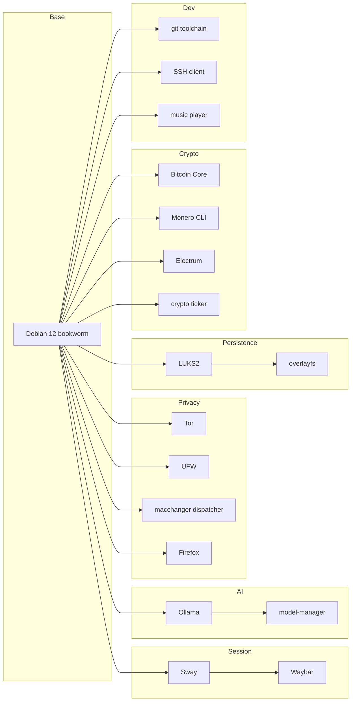

# Components

One section per runtime component. For the higher-level picture see
[overview.md](overview.md); for traced interactions see
[data-flow.md](data-flow.md).

## Debian base

- **Purpose**: OS, package manager, kernel, init.
- **Upstream**: debian.org.
- **Version**: pinned to Debian 12 (`bookworm`) via `debootstrap`; security
  updates pulled at build time, no runtime `apt` on the live image.
- **Config**: chroot built by [Dockerfile.build](../../Dockerfile.build);
  package set in [scripts/](../../scripts/) (see
  [prompts/02-base-system.md](../../prompts/02-base-system.md)).
- **Customisation**: minimal task selection, no desktop task, no
  recommended packages by default.
- **Swap**: for a Trixie rebase, bump the suite string in the build
  scripts and rebuild — no other component pins the codename.

## Sway

- **Purpose**: Wayland compositor and session root.
- **Upstream**: swaywm.org.
- **Version**: whatever bookworm ships; tracks stable.
- **Config**: [config/sway/](../../config/sway/).
- **Customisation**: autostart of Waybar, `mako`, `nm-applet`, PAI-branded
  lockscreen and wallpaper; no screen-sharing portal by default.
- **Swap**: replace with Hyprland or labwc by swapping `greetd`'s
  `session` command and providing a matching compositor config.
- **Prompt**: [prompts/04-sway-session.md](../../prompts/).

## Waybar

- **Purpose**: Status bar with Ollama / Tor / network / battery modules.
- **Upstream**: github.com/Alexays/Waybar.
- **Version**: tracks bookworm.
- **Config**: [config/waybar/](../../config/waybar/).
- **Customisation**: custom Tor module (`scripts/waybar-tor.sh`) and
  Ollama module (`scripts/waybar-ollama.sh`) that hit local sockets.
- **Swap**: any Wayland bar (`yambar`, `eww`) — the scripts work over
  plain stdout.

## Ollama

- **Purpose**: Local LLM inference runtime.
- **Upstream**: ollama.com.
- **Version**: pinned by sha256 in [scripts/install-ollama.sh]
  (re-pinned per release).
- **Config**: `systemd --user` unit; models in
  `~/.ollama/` which is under the persistence overlay.
- **Customisation**: binds to `127.0.0.1` only; firewall drops all
  non-loopback access.
- **Swap**: replace with `llama.cpp server` or `llamafile` by editing
  the user unit and the Waybar module.
- **Prompt**: [prompts/12-ollama-integration.md](../../prompts/12-ollama-integration.md).

## model-manager

- **Purpose**: Pull, list, and remove models without memorising Ollama
  subcommands; show disk usage against available persistence space.
- **Upstream**: in-tree (`scripts/model-manager`).
- **Version**: tracked with the repo.
- **Config**: none — reads `~/.ollama/models`.
- **Customisation**: all of it; this is PAI-specific glue.
- **Swap**: delete and use `ollama pull` directly.
- **Prompt**: [prompts/13-model-manager.md](../../prompts/).

## Tor

- **Purpose**: Anonymising transport for browser and wallets.
- **Upstream**: torproject.org.
- **Version**: Debian bookworm-backports for the current stable Tor.
- **Config**: `/etc/tor/torrc` assembled in
  [prompts/11-tor-privacy-mode.md](../../prompts/11-tor-privacy-mode.md);
  state under `/var/lib/tor` (persisted).
- **Customisation**: `SocksPort 9050`, `ControlPort 9051` with cookie
  auth; no exit relays; no hidden services by default.
- **Swap**: disable `tor.service`; apps that require it will fail closed
  because of the firewall kill switch.

## UFW

- **Purpose**: Default-deny egress and ingress firewall.
- **Upstream**: launchpad.net/ufw (nftables backend on bookworm).
- **Version**: distro.
- **Config**: rules generated in
  [prompts/06-firewall-hardening.md](../../prompts/06-firewall-hardening.md).
- **Customisation**: allow-list for Tor, DHCP, loopback; explicit drop of
  IPv6 when the user opts out.
- **Swap**: plain `nftables` rules in `/etc/nftables.conf` — UFW is just
  a thin front end.

## macchanger (NetworkManager dispatcher)

- **Purpose**: Randomise MAC at every interface-up.
- **Upstream**: macchanger (GNU) + NetworkManager dispatcher hook.
- **Version**: distro.
- **Config**: `/etc/NetworkManager/dispatcher.d/10-mac-randomise`.
- **Customisation**: random vendor OUI from a curated allow-list to
  avoid drawing attention with obviously-random prefixes.
- **Swap**: NetworkManager's built-in `wifi.cloned-mac-address=random`
  works if you trust it; the dispatcher also covers wired NICs.
- **Prompt**: [prompts/05-mac-spoofing.md](../../prompts/05-mac-spoofing.md).

## LUKS2 persistence

- **Purpose**: Encrypted second partition on the USB for stateful data.
- **Upstream**: cryptsetup.
- **Version**: distro (LUKS2 header format, argon2id KDF).
- **Config**: created at first boot by
  [scripts/setup-persistence.sh](../../scripts/); labelled `pai-persist`.
- **Customisation**: `--sector-size 4096`, `--pbkdf argon2id`, default
  iteration cost tuned for 2 s on a modern laptop.
- **Swap**: drop to plain dm-crypt for systems where LUKS2 headers are
  unsupported — but you lose header-based recovery.
- **Prompt**: [prompts/10-encrypted-persistence.md](../../prompts/10-encrypted-persistence.md).

## overlayfs

- **Purpose**: Stack the writable upper layer over the read-only
  squashfs.
- **Upstream**: Linux kernel.
- **Version**: whatever the shipped kernel provides.
- **Config**: assembled by `live-boot` in initramfs; persistence paths in
  `persistence.conf`.
- **Customisation**: only the listed paths are unioned; the rest of `/`
  is a tmpfs upper so leaks into `/tmp`, `/run`, etc. are wiped at
  reboot.
- **Swap**: tmpfs-only (amnesic) mode is the zero-config alternative.

## Firefox (+ policies)

- **Purpose**: Browser.
- **Upstream**: mozilla.org ESR.
- **Version**: Debian's `firefox-esr`.
- **Config**: enterprise policies at
  [config/firefox/policies.json](../../config/firefox/); `user.js`
  overlays under the same directory.
- **Customisation**: telemetry off, Pocket off, DNS-over-HTTPS off (Tor
  handles DNS), WebRTC disabled, letterboxing on, uBlock Origin and
  NoScript pre-installed.
- **Swap**: Mullvad Browser or Tor Browser — drop the policy file in
  their respective distribution paths.

## Bitcoin Core

- **Purpose**: Full-node reference wallet.
- **Upstream**: bitcoincore.org.
- **Version**: pinned by signed release tarball hash in the build
  scripts.
- **Config**: `~/.bitcoin/bitcoin.conf`; datadir under persistence.
- **Customisation**: `proxy=127.0.0.1:9050`, `onlynet=onion`,
  `listen=0` by default — wallet only, no inbound.
- **Swap**: `btcd` or `knots` work with the same config knobs.

## Monero CLI

- **Purpose**: Monero node / wallet.
- **Upstream**: getmonero.org.
- **Version**: pinned by signed release hash.
- **Config**: `~/.bitmonero/`, `monero-wallet-cli` configs.
- **Customisation**: `--proxy 127.0.0.1:9050`, `--anonymous-inbound`
  disabled, remote-node list pinned to onion endpoints.
- **Swap**: `monero-gui` for a graphical alternative.

## Electrum

- **Purpose**: Lightweight Bitcoin wallet for users without full-node
  disk budget.
- **Upstream**: electrum.org.
- **Version**: pinned `.tar.gz` with signed hash check.
- **Config**: `~/.electrum/config`.
- **Customisation**: forced Tor proxy; server list trimmed to onion
  endpoints.

## crypto-price ticker

- **Purpose**: Small Waybar module showing prices from a chosen source
  over Tor.
- **Upstream**: in-tree.
- **Version**: tracked with repo.
- **Config**: `config/ticker/ticker.toml`.
- **Customisation**: coin list, fiat, refresh interval, source
  (CoinGecko by default, onion mirrors supported).
- **Swap**: delete the Waybar module to remove.

## music player

- **Purpose**: Local audio; MPD + ncmpcpp by default.
- **Upstream**: musicpd.org.
- **Version**: distro.
- **Config**: `~/.config/mpd/mpd.conf`; library path under persistence.
- **Customisation**: no network backends enabled; HTTP streaming off.
- **Swap**: any CLI/TUI player — `mpv`, `cmus`.

## SSH client

- **Purpose**: Outbound SSH for dev workflows.
- **Upstream**: openssh.com.
- **Version**: distro.
- **Config**: `~/.ssh/config`; known_hosts under persistence.
- **Customisation**: `ProxyCommand` template for routing through Tor
  where needed; `HashKnownHosts yes`; no agent forwarding by default.
- **Swap**: `dropbear` is not recommended — OpenSSH is the baseline.

## Git toolchain

- **Purpose**: Source control client and signing.
- **Upstream**: git-scm.com + GnuPG + `git-lfs`.
- **Version**: distro.
- **Config**: `~/.gitconfig`; GPG keys under persistence in `~/.gnupg`.
- **Customisation**: commit signing on by default if a key is present;
  `http.proxy` pre-wired for Tor when privacy mode is active.
- **Swap**: `jj` (Jujutsu) coexists cleanly if you want to add it.
