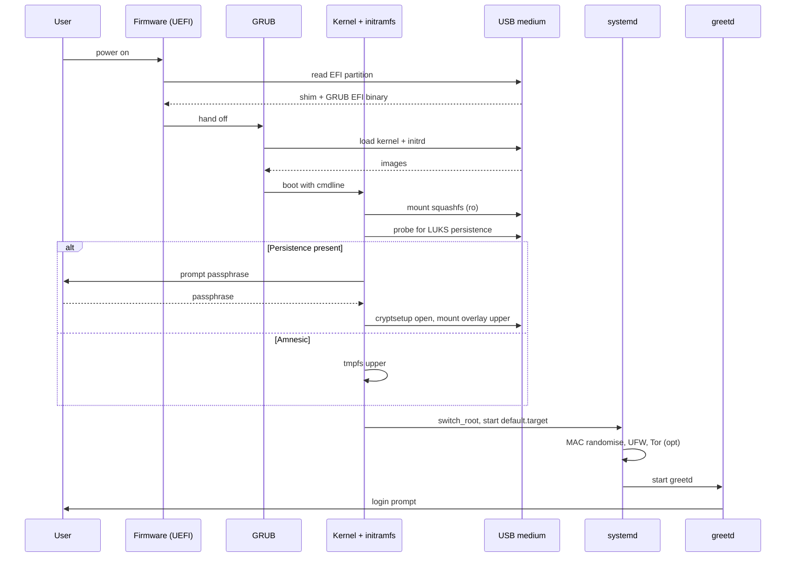
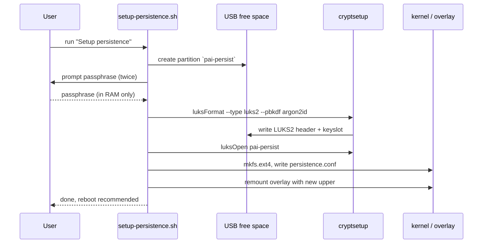
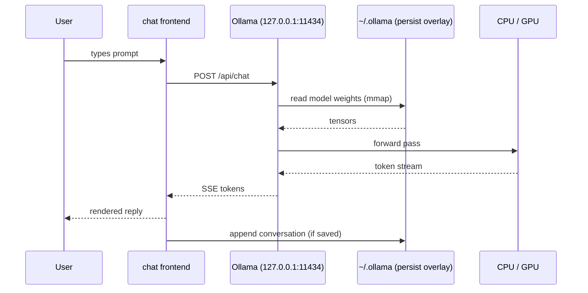
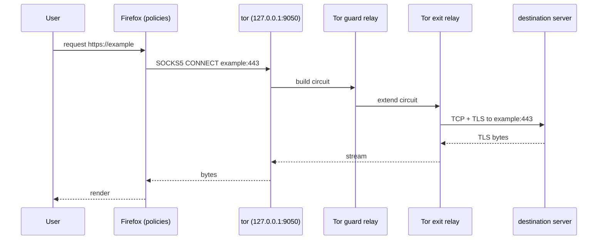
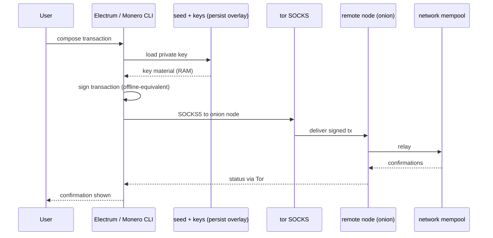
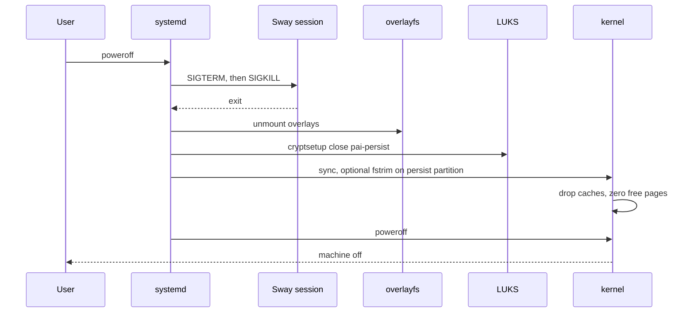

# Data Flow

Each section below traces a single end-to-end flow. The markers are:

- **[persist]** — data is written to the LUKS persistence overlay and
  survives reboot.
- **[leaves]** — data crosses the device boundary (network, display,
  removable media).
- **[wipe]** — data is dropped or actively scrubbed.

See [overview.md](overview.md) for the static picture and
[components.md](components.md) for the subsystems named below.

## 1. Boot sequence

- **[persist]** only `/home`, `/var/lib`, NetworkManager connections,
  Tor state, Ollama models (if persistence unlocked).
- **[leaves]** nothing yet — networking is brought up with a randomised
  MAC and a default-deny firewall before any user code runs.
- **[wipe]** tmpfs upper is empty on every amnesic boot; initramfs is
  discarded after `switch_root`.

## 2. First-boot persistence creation

- **[persist]** LUKS2 header, keyslot, `persistence.conf`,
  `ext4` superblock — all on the USB medium.
- **[leaves]** nothing. Passphrase is read from the local keyboard and
  never written or transmitted.
- **[wipe]** passphrase buffer is freed after `cryptsetup`; argon2
  working memory is zeroed by the library.

## 3. AI inference

- **[persist]** model weights under `~/.ollama/models`; conversation
  history only if the user explicitly saves it.
- **[leaves]** nothing — the firewall blocks Ollama from binding or
  reaching any interface other than loopback.
- **[wipe]** KV cache in RAM is released when the session ends;
  unsaved conversations vanish on logout.

## 4. Private browsing

- **[persist]** nothing by default. Firefox profile is under the
  overlay; with persistence it keeps bookmarks and logins, without it
  the profile is thrown away at reboot.
- **[leaves]** encrypted traffic to the Tor guard (ISP sees only "this
  IP talks to Tor"), and the final TLS stream from the exit to the
  destination.
- **[wipe]** cache, cookies, history on Firefox exit (policy-enforced
  in amnesic mode).

## 5. Crypto transaction

- **[persist]** seed, xpub/xpriv, wallet db under
  `~/.bitcoin`, `~/.electrum`, `~/.bitmonero` — always behind LUKS.
- **[leaves]** only the **signed** transaction, carried via Tor to an
  onion endpoint. No IP, no seed, no unsigned key material leaves the
  device.
- **[wipe]** private key buffers are zeroed by the wallet after
  signing; RAM is dropped at shutdown (§ 6).

## 6. Shutdown

- **[persist]** whatever has already been written by running processes
  is flushed by `sync` and then sealed when LUKS closes.
- **[leaves]** nothing — network is torn down before filesystems.
- **[wipe]** tmpfs upper (if amnesic), page cache, swap (PAI disables
  swap by default), and — with `fstrim` — freed blocks on the
  persistence partition if the USB controller honours TRIM. DRAM
  contents decay once power is removed; PAI does not attempt to defend
  against cold-boot attacks on unlocked RAM.
