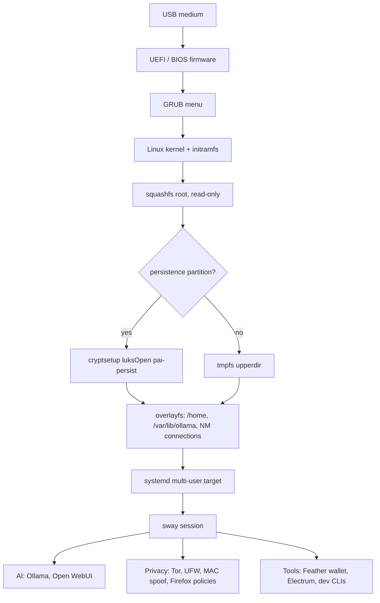
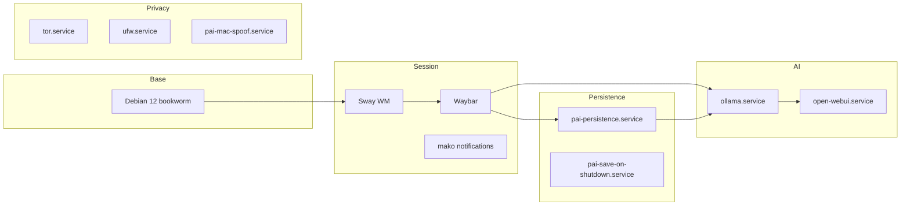
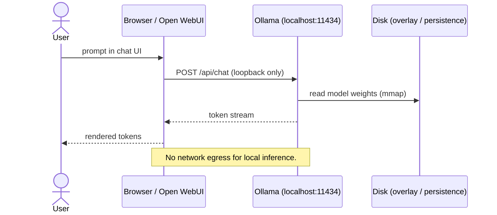
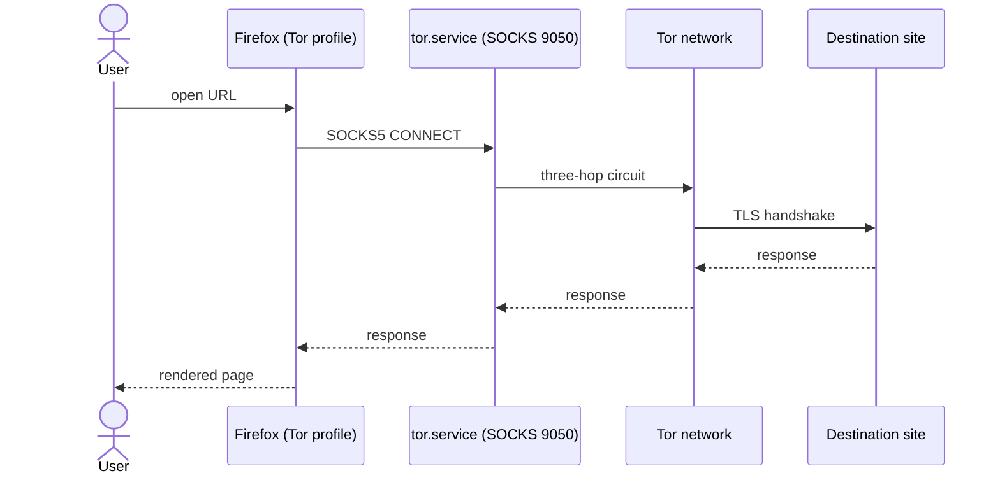
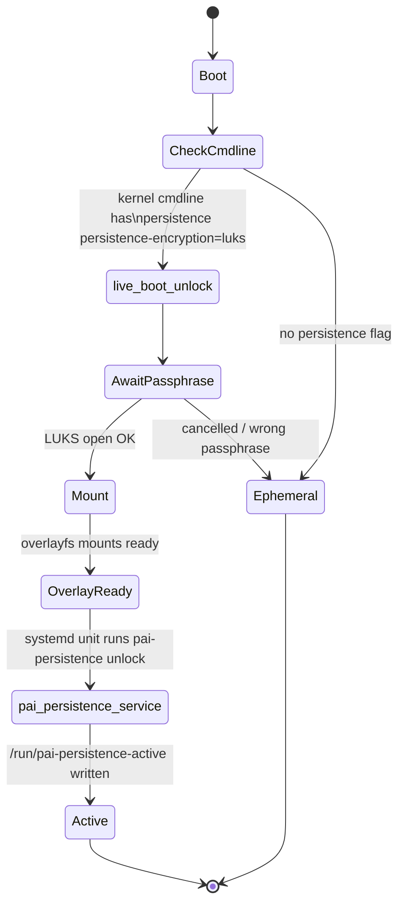

# Architecture Diagrams

Visual references for PAI's architecture. All diagrams are authored in
Mermaid so they stay diffable alongside the rest of the docs.

## System overview

End-to-end view from removable boot medium to a running session.
See the textual walkthrough in [overview.md](overview.md).

## Component graph

Process-level view of the services that start by default. See
[components.md](components.md) for per-service reference.

## Data flow

Request path for a local LLM interaction and for a Tor-routed web
request. See [data-flow.md](data-flow.md) for the full narrative.

## Persistence unlock

How a persisted session reaches "ACTIVE" at boot time.

## Contributing diagrams

- Keep source authored in Mermaid inside the same `.md` file that
  references the diagram — diffs show architectural intent alongside
  prose changes.
- For exported SVG assets, store them next to the document and check
  the source fence in too.
- Prefer small, composable diagrams over a single mega-diagram. Each
  page here owns one conceptual layer.
