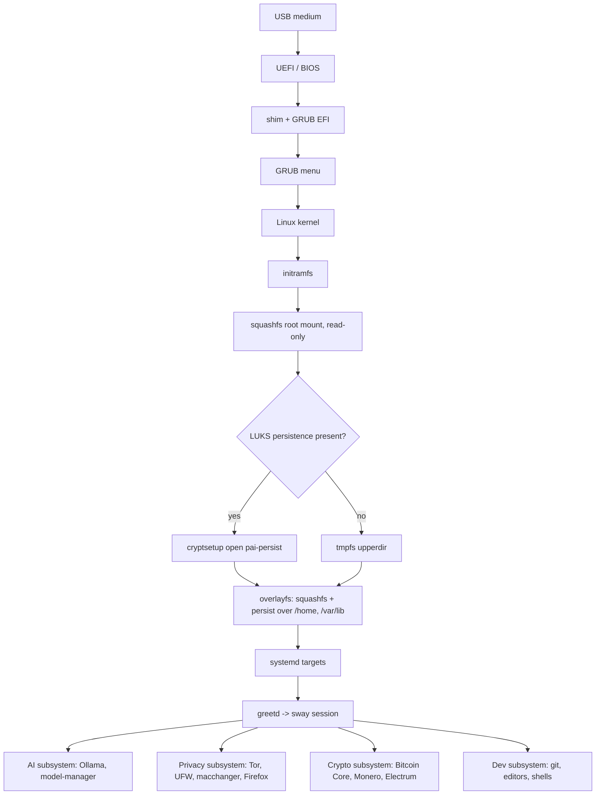

# Architecture Overview

This is the extended tour. The [root ARCHITECTURE.md](../../ARCHITECTURE.md)
is a one-screen summary; the page you are reading goes one level deeper and
points into [components.md](components.md) and [data-flow.md](data-flow.md)
for specifics.

## System at a glance



## Boot chain

1. **Firmware** selects the USB medium and loads `EFI/BOOT/BOOTX64.EFI`
   (or `BOOTAA64.EFI` on ARM64). Secure Boot chains through `shim` where
   present.
2. **GRUB** reads `grub.cfg` baked into the ISO and presents a short menu
   (default, safe graphics, memtest). Kernel cmdline carries
   `boot=live components persistence persistence-encryption=luks`.
3. **Kernel + initramfs** do hardware detection, load the squashfs via
   `overlay`, and hand off to systemd. The initramfs is the component that
   knows how to find and unlock the persistence partition.
4. **systemd** runs early units: MAC randomisation, firewall, time sync,
   Tor (if enabled), then `greetd` which launches the Sway session.

See [data-flow.md#boot](data-flow.md#1-boot-sequence) for the full
sequence diagram.

## Root filesystem

The root is an **overlayfs** stack:

- **Lower layer**: squashfs shipped on the ISO, strictly read-only. This
  is every package, config, and asset captured at build time.
- **Upper layer**: either a tmpfs (amnesic mode) or the
  **persistence** LUKS volume mounted at `/lib/live/mount/persistence`.
- **Merged view**: what user-space sees at `/`.

Writes go to the upper layer. Reboots without persistence drop the upper
layer entirely — that is the amnesic guarantee.

## Persistence overlay

When the user chooses persistence at first boot, [scripts for
prompt 10](../../prompts/10-encrypted-persistence.md) create a second
partition on the USB, format it as **LUKS2** (argon2id, `--sector-size
4096`), and write a `persistence.conf` inside that selects which paths get
overlaid. The defaults are:

```
/home        union
/var/lib     union
/etc/NetworkManager/system-connections    union
/var/lib/tor    union
/var/lib/ollama union
```

Everything outside those paths is still served from squashfs and vanishes
on reboot. This is why Ollama model weights survive but `/tmp` does not.

## Session

`greetd` autostarts Sway after a successful LUKS unlock (or immediately in
amnesic mode). The session is defined by `config/sway/config` in the repo
and includes:

- Waybar with Tor / Ollama / battery / network indicators.
- `mako` for notifications, `swaylock` for screen lock.
- A curated launcher (`fuzzel`) with entries for the AI, Privacy, Crypto,
  and Dev subsystems.

Details per component: [components.md](components.md).

## Networking posture

- **Default-deny** egress via UFW. Only Tor, DHCP, NTP-over-Tor, and
  explicitly allow-listed LAN services get out.
- **MAC randomisation** at interface-up via a NetworkManager dispatcher.
- **Tor** is optional but wired so that Firefox, crypto wallets, and the
  package manager can route through it without per-app configuration.
- **Kill switch**: if Tor is required for a given profile and `tor.service`
  is not active, the firewall drops all non-loopback traffic.

## Update model

PAI does not self-update the running system. Updates are **new ISOs**:
re-flash, keep the same persistence partition, carry your state forward.
The persistence format is versioned in `persistence.conf` so a newer ISO
can detect and migrate older layouts. See
[MIGRATION.md](../MIGRATION.md).

## Security perimeter

The trust boundary is the **physical device + its LUKS passphrase**.
PAI defends against:

- Passive network observers (Tor, HTTPS-only, no telemetry).
- Forensic recovery after seizure, if persistence is locked (LUKS2).
- Cross-session tracking via MAC address or browser state (amnesic
  defaults).

PAI does **not** defend against:

- Malicious firmware, Thunderbolt/PCIe DMA attacks with the lid open.
- Hardware keyloggers or a compromised host reading USB traffic.
- Users who disable the firewall or run unsigned binaries.

See [SECURITY.md](../security.md) for the full threat model.

## Where to look in the repo

| Concept                    | Path                                                                               |
| -------------------------- | ---------------------------------------------------------------------------------- |
| Build entry points         | [build.sh](../../build.sh), [arm64/build.sh](../../arm64/build.sh)                 |
| Chroot builder image       | [Dockerfile.build](../../Dockerfile.build)                                         |
| Per-step prompts           | [prompts/](../../prompts/)                                                         |
| Per-step scripts (AMD64)   | [scripts/](../../scripts/)                                                         |
| Per-step scripts (ARM64)   | [arm64/scripts/](../../arm64/scripts/)                                             |
| Config overlay             | [config/](../../config/)                                                           |
| MAC spoof dispatcher       | [prompts/05-mac-spoofing.md](../../prompts/05-mac-spoofing.md)                     |
| Firewall rules             | [prompts/06-firewall-hardening.md](../../prompts/06-firewall-hardening.md)         |
| LUKS persistence           | [prompts/10-encrypted-persistence.md](../../prompts/10-encrypted-persistence.md)   |
| Tor integration            | [prompts/11-tor-privacy-mode.md](../../prompts/11-tor-privacy-mode.md)             |
| Ollama + model manager     | [prompts/12-ollama-integration.md](../../prompts/12-ollama-integration.md)         |
| Firefox policies           | [config/firefox/policies.json](../../config/firefox/)                              |
| Sway / Waybar              | [config/sway/](../../config/sway/), [config/waybar/](../../config/waybar/)         |

See also [components.md](components.md) for per-component detail and
[data-flow.md](data-flow.md) for traced flows.
