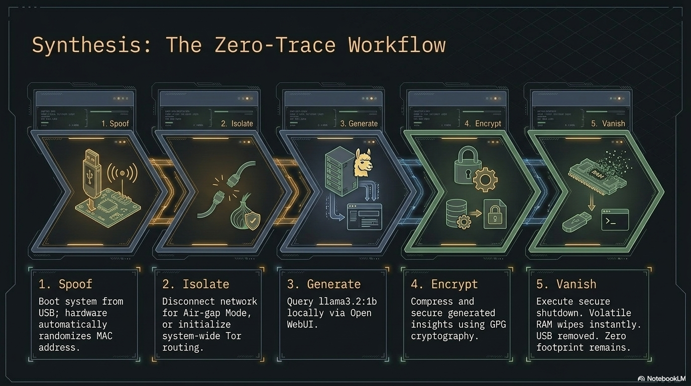

# Real-world use cases

**PAI earns its keep in the field, not in the brochure.** Journalists filing from the road, researchers interviewing sources, developers auditing signed transactions on hardware they don't control — these are the people PAI was built for. The vignettes below show how the pieces come together in practice.

Each vignette is a sketch, not a prescription. The caveats matter as
much as the setup: PAI is a tool, not a guarantee. If you intend to rely
on any of these flows for safety, read
[../../SECURITY.md](../security.md),
[../../PRIVACY.md](../PRIVACY.md), and
[../../ETHICS.md](../ETHICS.md) first.

For step-by-step setup, start at
[getting-started.md](getting-started.md) and then work through the
scenario-specific guides:

- [getting-started.md](getting-started.md) — build a private
  research workstation on a USB stick (the baseline).
- [travel-and-network-hardening.md](travel-and-network-hardening.md) —
  configure PAI for travel and hostile networks (privacy / OPSEC).
- [crypto-cold-signing.md](crypto-cold-signing.md) — run a disposable
  signing session with a hardware wallet (crypto).
- [local-ai-assistant.md](local-ai-assistant.md) — private RAG over
  your own documents with a local LLM (AI).

For breakage, see [../troubleshooting.md](../advanced/troubleshooting.md) and
[../../KNOWN_ISSUES.md](../KNOWN_ISSUES.md).

---

## 1. Journalist working from a hostile network on assignment

**Who:** A freelance reporter on assignment in a region where the local
ISP is known to inspect traffic and coerce device searches at the
border.

**Problem:** Needs to take notes, draft stories, and communicate with an
editor without leaving forensic traces on a laptop that may be examined.

**How PAI helps:** Boots from USB on a clean host; all session state
lives in RAM. Persistence holds drafts under LUKS. Tor-routed Firefox
provides a hardened browsing profile. Pulling the USB makes the machine
look untouched.

**Caveats / risks:** A border examiner who sees the USB can still compel
the passphrase. Metadata from messaging apps can de-anonymize even over
Tor. Keystroke and screen logging on a compromised host defeats
everything.

---

## 2. Traveling contractor who needs a local LLM on shared hotel Wi-Fi

**Who:** A contractor doing client work from hotel rooms and coworking
spaces.

**Problem:** Needs an LLM for code review and writing assistance but
cannot send client code to cloud providers under the engagement's NDA.

**How PAI helps:** Ollama runs locally; nothing leaves the device.
Persistence keeps model weights so there's no re-download per trip.
Sessions can be used offline on flights.

**Caveats / risks:** Small models hallucinate more than large cloud
models. Performance on a travel laptop is limited; check
[../../BENCHMARKS.md](../../BENCHMARKS.md) before committing. Hotel
Wi-Fi is still untrusted for anything else you do.

---

## 3. Researcher doing offline literature synthesis on a long flight

**Who:** A graduate student with a 12-hour flight and a pile of PDFs.

**Problem:** Wants to summarize and cross-reference papers without
airline Wi-Fi and without sending drafts to a cloud provider.

**How PAI helps:** Papers and notes sit in the persistence volume. A
local LLM runs summarization and Q&A entirely offline. Sway's tiling
keeps a PDF viewer, editor, and LLM terminal side-by-side on a small
screen.

**Caveats / risks:** LLM summaries of papers can silently drop nuance;
verify claims against the source. Battery life drops sharply under
sustained LLM load.

---

## 4. Privacy-conscious parent teaching a teenager about OPSEC

**Who:** A parent who wants their teenager to understand online privacy
through practice, not lectures.

**Problem:** Needs a hands-on environment where mistakes are cheap and
no long-term trail is left on a shared family laptop.

**How PAI helps:** A shared USB with persistence disabled makes every
session start fresh. The teen can try Tor, hardened Firefox, and
password hygiene without touching the host OS. Screenshots and notes
from each session can optionally be saved to a separate, clearly-labeled
USB.

**Caveats / risks:** PAI is not a substitute for conversation about
threat models. Teenagers will find the clever parts faster than you do —
plan what you'd like them to learn before sitting down.

---

## 5. Crypto user doing cold-sign flows on a disposable session

**Who:** A self-custody user who signs transactions occasionally from
their desktop.

**Problem:** Wants to reduce the attack surface during signing — no
browser extensions from the daily driver OS, no long-lived session with
clipboard history.

**How PAI helps:** Boot PAI, unlock persistence for the wallet only,
connect the hardware wallet, sign, power off. The daily-driver OS is
never involved.

**Caveats / risks:** A compromised USB defeats this entirely —
verify the image every time. Hardware wallets still require you to
confirm the destination address **on the device screen**, not on the
PAI display. A shoulder surfer during unlock is still a threat.

---

## 6. Community workshop instructor teaching Linux + AI fundamentals

**Who:** A volunteer running a weekend workshop at a library or hacker
space.

**Problem:** Needs 10 identical environments that don't depend on
whatever OS is on the shared machines, and that don't retain student
data after the workshop.

**How PAI helps:** Flash 10 sticks from one image. Each student gets the
same Sway session, the same Ollama setup, the same Firefox. Without
persistence, the session evaporates on shutdown — no cleanup, no
leftover accounts.

**Caveats / risks:** Model pulls eat bandwidth; pre-pull one stick and
clone its persistence volume if the venue's uplink is slow. Some venue
machines have firmware that refuses USB boot; confirm before the
workshop.

---

Have your own use case? Open a PR adding it. Keep vignettes short
(≤15 lines), include the caveats honestly, and cross-link to
[../troubleshooting.md](../advanced/troubleshooting.md) or
[../../KNOWN_ISSUES.md](../KNOWN_ISSUES.md) where relevant.
