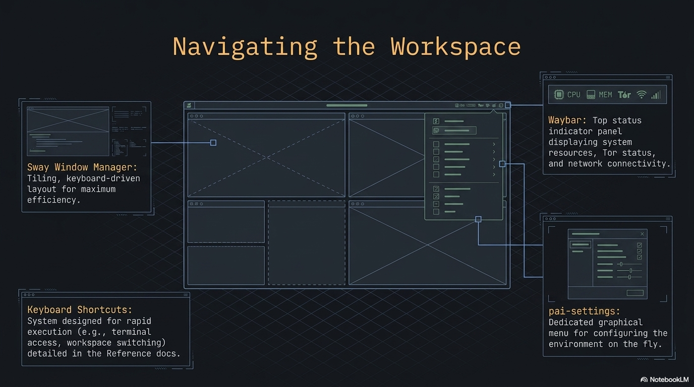

PAI uses **Sway**, a keyboard-driven tiling window manager, as its desktop environment. Instead of dragging overlapping windows around, Sway automatically arranges open apps side by side and gives you instant keyboard access to every action. The **waybar** status bar at the bottom puts app launchers, AI status, system stats, and settings one click away.



In this guide:
- Every keyboard shortcut organized by category
- How tiling and workspaces work, with diagrams
- Waybar anatomy: every module, what it shows, what clicking does
- PAI settings menu and app launcher
- Tutorial: master the PAI desktop in 10 minutes
- Equivalents for Windows, macOS, and traditional Linux users

**Prerequisites**: PAI booted and running. No prior Linux experience needed.

---

## What is a tiling window manager?

Most operating systems use a **stacking** model: windows float and overlap, and you drag them around manually. Sway uses a **tiling** model: every window automatically takes up a defined slice of your screen with no overlap.

When you open a second app, Sway splits the current window and places the new one beside it. A third app splits again. You navigate between them with `Alt+Arrow` instead of clicking a taskbar. This approach keeps every pixel visible and every action reachable from the keyboard.

The **modifier key** for all Sway shortcuts is `Alt` (the left Alt key on most keyboards). Every shortcut in this guide starts with `Alt`.

```
┌──────────────────────────────────────────────────────────┐
│                    Workspace 1                            │
│                                                           │
│  ┌───────────────────────┐  ┌──────────────────────────┐ │
│  │                       │  │                          │ │
│  │    Firefox /          │  │   Terminal (foot)        │ │
│  │    Open WebUI         │  │                          │ │
│  │                       │  │   $ ollama list          │ │
│  │                       │  │   llama3.2:1b  1.3 GB    │ │
│  │                       │  │                          │ │
│  └───────────────────────┘  └──────────────────────────┘ │
│                                                           │
├──────────────────────────────────────────────────────────┤
│  PAI 🌐 💻 📁 📝 [🟢 llama3.2]  ··· ⚡85% 🧠42% 14:32 ⚙ │
└──────────────────────────────────────────────────────────┘
```

The waybar lives at the bottom. Everything above it is your tiling workspace.

---

## Essential keyboard shortcuts

The complete set of shortcuts from the Sway config and active profile.

### App launch shortcuts

| Shortcut | Action |
|---|---|
| `Alt+Return` | Open terminal (foot) |
| `Alt+D` | App launcher (wofi — search all installed apps) |
| `Alt+S` | PAI settings menu |
| `Alt+B` | Firefox → Open WebUI (localhost:8080) |
| `Alt+E` | Thunar file manager |
| `Alt+P` | Drawing (image editor) |
| `Alt+Shift+B` | Electrum Bitcoin wallet |
| `Alt+Shift+P` | Firefox → Phantom wallet |
| `Alt+Shift+F` | Firefox → pump.fun |
| `Alt+Shift+T` | Tor Browser |
| `Alt+Shift+G` | Aisleriot (solitaire) |

!!! note

    App shortcuts marked with `Shift` are profile-specific. They come from `/etc/sway/profile.d/active.conf` and change depending on which PAI profile is loaded. The shortcuts above reflect the default **full** profile.


### Window management shortcuts

| Shortcut | Action |
|---|---|
| `Alt+F4` | Close the focused window |
| `Alt+Left / Right / Up / Down` | Move focus to the window in that direction |
| `Alt+Shift+Left / Right / Up / Down` | Move the focused window in that direction |
| `Alt+R` | Enter resize mode (then use Arrow keys, `Esc` or `Enter` to exit) |
| `Alt+F` | Toggle fullscreen for the focused window |
| `Alt+Shift+Space` | Toggle floating mode for the focused window |

### Workspace shortcuts

| Shortcut | Action |
|---|---|
| `Alt+1` | Switch to workspace 1 |
| `Alt+2` | Switch to workspace 2 |
| `Alt+3` | Switch to workspace 3 |
| `Alt+Shift+1` | Move focused window to workspace 1 |
| `Alt+Shift+2` | Move focused window to workspace 2 |
| `Alt+Shift+3` | Move focused window to workspace 3 |

### System shortcuts

| Shortcut | Action |
|---|---|
| `Alt+L` | Lock screen (black screen, requires no password in default config) |
| `Alt+Shift+E` | Shutdown menu (pai-shutdown) |
| `Print` | Full-screen screenshot saved to `~/Pictures/` |
| `Shift+Print` | Region screenshot — drag to select area |
| `XF86AudioPlay` | Play/pause media |
| `XF86AudioNext` | Next track |
| `XF86AudioPrev` | Previous track |
| `XF86AudioRaiseVolume` | Volume up 5% |
| `XF86AudioLowerVolume` | Volume down 5% |
| `XF86AudioMute` | Mute/unmute |
| `XF86MonBrightnessUp` | Screen brightness up 5% (laptops) |
| `XF86MonBrightnessDown` | Screen brightness down 5% (laptops) |

!!! tip

    Screenshots are saved automatically as `screenshot-YYYYMMDD-HHMMSS.png` in `~/Pictures/`. Use `Alt+P` to open Drawing and annotate them immediately after capture.


---

## If you're coming from Windows, macOS, or another Linux

=== "Windows"
    | Windows action | PAI equivalent |
    |---|---|
    | Click taskbar icon | Click the icon in waybar, or use `Alt+D` and type the app name |
    | `Win+D` (show desktop) | `Alt+1` / `Alt+2` / `Alt+3` to switch workspace |
    | `Alt+F4` (close app) | `Alt+F4` — same shortcut |
    | `Win+Arrow` (snap window) | Windows tile automatically; use `Alt+Arrow` to move focus |
    | Task Manager | `Alt+S` → Processes (lxtask) |
    | Right-click desktop | Not available in Sway — use `Alt+D` to launch apps |
    | `PrintScreen` | `Print` key — saves to `~/Pictures/` automatically |
    | `Win+L` (lock) | `Alt+L` |
    | Start → Shutdown | `Alt+Shift+E` |
=== "macOS"
    | macOS action | PAI equivalent |
    |---|---|
    | Spotlight (`Cmd+Space`) | `Alt+D` — wofi app launcher |
    | Dock click | Click icon in waybar, or `Alt+D` and type |
    | `Cmd+W` (close window) | `Alt+F4` |
    | Mission Control / Spaces | Workspaces 1–3, switch with `Alt+1/2/3` |
    | `Cmd+Tab` (app switch) | `Alt+Arrow` to move focus between tiled windows |
    | System Preferences | `Alt+S` — PAI settings menu |
    | `Cmd+Shift+3` (screenshot) | `Print` key |
    | `Cmd+Shift+4` (region shot) | `Shift+Print` |
    | `Ctrl+Cmd+Q` (lock) | `Alt+L` |
    | Apple menu → Shut Down | `Alt+Shift+E` |
=== "GNOME / KDE"
    | GNOME/KDE action | PAI equivalent |
    |---|---|
    | Activities / Launcher | `Alt+D` — wofi drun |
    | `Super+Arrow` (tile snap) | Tiling is automatic; `Alt+Arrow` moves focus |
    | `Super+H/V` (split) | Windows split automatically as you open them |
    | `Alt+F4` (close) | `Alt+F4` — same |
    | Virtual desktops | Workspaces 1–3 (`Alt+1/2/3`) |
    | Settings panel | `Alt+S` — PAI settings menu |
    | `PrintScreen` | `Print` key |
    | `Super+L` (lock) | `Alt+L` |
    | Session menu | `Alt+Shift+E` |

---

## How workspaces and tiling work

```mermaid
flowchart TD
    A[PAI Desktop] --> W1[Workspace 1\nAlt+1]
    A --> W2[Workspace 2\nAlt+2]
    A --> W3[Workspace 3\nAlt+3]

    W1 --> T1[Tiling layout]
    T1 --> App1[First app\nfull width]
    T1 --> App2[Second app opens\nhorizontal split]
    T1 --> App3[Third app opens\nfurther split]

    W2 --> T2[Independent layout]
    W3 --> T3[Independent layout]

    App1 -- Alt+Shift+2 --> W2
    style W1 fill:#1a3a5c
    style W2 fill:#1a3a5c
    style W3 fill:#1a3a5c
```



Each workspace is a completely independent tiling container. Apps you open on workspace 1 stay on workspace 1 until you move them. Use workspaces to organize your session: workspace 1 for Open WebUI, workspace 2 for the terminal, workspace 3 for files or notes.

To move a window from one workspace to another, focus it with `Alt+Arrow` and then press `Alt+Shift+<number>`.

!!! tip

    A suggested workflow: keep Open WebUI in workspace 1 (`Alt+B` to open), a terminal in workspace 2 (`Alt+Return`), and Thunar or a text editor in workspace 3. Switch between them instantly with `Alt+1`, `Alt+2`, `Alt+3`.


---

## Waybar: the bottom status bar

The waybar sits at the bottom of the screen and is divided into a left group (launchers and status) and a right group (system info and settings).

### Left side modules

| Module | Icon | What it shows | Click action |
|---|---|---|---|
| `custom/logo` | `PAI` | Always visible — the PAI logo | Opens wofi app launcher |
| `custom/browser` | 🌐 | Firefox shortcut | Opens Firefox |
| `custom/terminal` | 💻 | Terminal shortcut | Opens foot terminal |
| `custom/files` | 📁 | File manager shortcut | Opens Thunar |
| `custom/editor` | 📝 | Text editor shortcut | Opens Mousepad |
| `custom/ollama` | dynamic | 🟡 when Ollama idle; 🟢 + model name when a model is generating | — |

### Right side modules

| Module | Icon | What it shows | Click / hover |
|---|---|---|---|
| `custom/media` | ♪ | Currently playing artist and title (30 char max) | Click to play/pause |
| `custom/crypto` | — | BTC and ETH prices from CoinGecko | Hover for details |
| `network` | 📶 / ETH | Wifi signal strength % or "ETH" for wired; "Off" if disconnected | — |
| `cpu` | ⚡ | Live CPU usage % | — |
| `memory` | 🧠 | Live RAM usage % | — |
| `clock` | — | Current time in HH:MM format | — |
| `custom/settings` | ⚙ | Settings launcher | Opens PAI settings menu |

!!! note

    The crypto module (`custom/crypto`) polls CoinGecko every 60 seconds and requires an internet connection. In offline or privacy mode sessions, it will show no data or an error state.


!!! warning

    If you activate privacy mode (Tor routing), a 🧅 indicator appears in the waybar. This module (`pai-waybar-privacy`) is separate from the standard waybar config and confirms that traffic is routed through Tor. See the [privacy mode guide](../privacy/privacy-mode-tor.md) for details.


---

## The PAI settings menu

Press `Alt+S` or click the ⚙ gear in waybar. A wofi dmenu appears with quick access to system tools:

| Entry | App launched | Purpose |
|---|---|---|
| ⌨️ Terminal | foot | Command-line access |
| 🔊 Audio | pavucontrol | Volume levels, output device routing |
| 🖥️ Display | wdisplays | Resolution, refresh rate, scaling |
| 📶 Network | nm-connection-editor | WiFi networks, VPN connections |
| 🔵 Bluetooth | blueman-manager | Pair and manage Bluetooth devices |
| 💾 Disks | gnome-disks | View drives, format, mount USB devices |
| 🎨 Appearance | lxappearance | GTK theme and icon set |
| ⚙️ Processes | lxtask | Running processes, CPU/RAM per process |
| 🔒 Passwords | KeePassXC | Password manager |
| 🗂️ Files | Thunar | Graphical file manager |

Type the first few letters of a menu item to filter. Press `Enter` to launch, `Escape` to close without opening anything.

---

## The app launcher (wofi)

Press `Alt+D` or click the **PAI** logo in waybar to open the wofi app launcher.

- Start typing to filter all installed applications
- Use `↑` / `↓` arrows to highlight an entry
- Press `Enter` to launch
- Press `Escape` to close


*The wofi launcher. Type to filter installed apps instantly.*

!!! tip

    wofi searches by both app name and description. If you know what a tool does but not its name, try typing a keyword like "password" or "bluetooth" to find the right app.


---

## Tiling tips and window control

### How new windows are placed

Sway splits the current workspace horizontally by default when you open a new window. The active window shrinks to make room. As you open more windows, Sway keeps splitting:

```
One window:          Two windows:         Three windows:
┌────────────┐       ┌──────┬──────┐      ┌──────┬──┬──┐
│            │       │      │      │      │      │  │  │
│    app1    │  →    │ app1 │ app2 │  →   │ app1 │2 │3 │
│            │       │      │      │      │      │  │  │
└────────────┘       └──────┴──────┘      └──────┴──┴──┘
```

### Resizing windows

Press `Alt+R` to enter resize mode. The focused window can now be resized with the arrow keys. Press `Escape` or `Enter` to exit resize mode.

### Floating windows

Some apps (dialogs, image viewers) open in floating mode automatically. To toggle any window between tiling and floating: `Alt+Shift+Space`.

A floating window sits above the tiling layout and can be moved and resized freely with the mouse.

### Fullscreen

Press `Alt+F` to make the focused window fill the entire screen, hiding the waybar. Press `Alt+F` again to return to the tiled layout.

---

## Terminal and preinstalled CLI tools

PAI's default terminal is **foot**, a lightweight Wayland-native terminal. Open it with `Alt+Return` or click 💻 in waybar.

The default shell is **bash**. Useful preinstalled CLI tools:

| Tool | Command | What it does |
|---|---|---|
| htop | `htop` | Interactive process viewer, better than `top` |
| tree | `tree` | Visual directory tree |
| bat | `bat` | `cat` with syntax highlighting and line numbers |
| ripgrep | `rg` | Fast recursive search (better than `grep`) |
| fd-find | `fdfind` | Fast file finder (better than `find`) |
| fzf | `fzf` | Fuzzy finder for files, history, and more |
| tmux | `tmux` | Terminal multiplexer — multiple sessions in one window |

!!! tip

    foot supports OSC 52 clipboard integration, true-color output, and font ligatures. If you paste text from the clipboard, use `Ctrl+Shift+V` inside foot.


---

## File management

Open **Thunar** with `Alt+E` or click 📁 in waybar. User directories (`Downloads`, `Documents`, `Pictures`, `Music`, `Videos`) are created automatically on first boot by `xdg-user-dirs-update`.

!!! warning

    PAI runs entirely in RAM by default. Files you save to `~/Documents` or `~/Downloads` exist only until shutdown. They are **not** written to any disk and will be gone when you power off. Set up the optional [persistence layer](../persistence/introduction.md) if you need files to survive across sessions.


---

## Taking and managing screenshots

| Action | Shortcut | Result |
|---|---|---|
| Full-screen screenshot | `Print` | Saved to `~/Pictures/screenshot-YYYYMMDD-HHMMSS.png` |
| Region screenshot | `Shift+Print` | Click and drag to select area, then saved |
| Annotate screenshot | `Alt+P` | Opens Drawing image editor |
| View screenshot | — | Open Thunar → `~/Pictures/`, double-click to open in imv |


*Screenshots land in `~/Pictures/` with automatic timestamps. Open Drawing with `Alt+P` to annotate.*

---

## Tutorial: Master the PAI desktop in 10 minutes

**Goal**: get comfortable with tiling, workspaces, the launcher, and the settings menu through a structured practice session.

**What you need**: PAI booted and running. No other setup required.


1. **Open the terminal**

   Press `Alt+Return`. A foot terminal fills the screen.

   ```bash
   # Verify you're in a terminal
   echo "PAI desktop ready"
   ```

   Expected output:
   ```
   PAI desktop ready
   ```

2. **Open a second app and see tiling**

   Press `Alt+B` to open Firefox with Open WebUI. The terminal and Firefox now share the screen side by side.

   Your layout now looks like:
   ```
   ┌──────────────────┬───────────────────┐
   │   foot terminal  │  Firefox/Open WebUI│
   │                  │                   │
   └──────────────────┴───────────────────┘
   ```

3. **Navigate between windows**

   Press `Alt+Left` to focus the terminal. Press `Alt+Right` to focus Firefox. Notice the colored border moves to show which window is active.

4. **Move a window to workspace 2**

   Focus the terminal with `Alt+Left`. Press `Alt+Shift+2` to move it to workspace 2. The terminal disappears and Firefox expands to fill the screen.

   Press `Alt+2` to switch to workspace 2 and see the terminal there. Press `Alt+1` to return to workspace 1 with Firefox.

5. **Use the app launcher**

   Press `Alt+D`. The wofi launcher appears. Type `thunar` and press `Enter`. Thunar opens as a third window in workspace 1.

6. **Resize a window**

   Focus any window with `Alt+Arrow`. Press `Alt+R` to enter resize mode. Press the left or right arrow key several times to resize. Press `Escape` to exit resize mode.

7. **Open the settings menu**

   Press `Alt+S`. The PAI settings menu appears. Use the arrow keys or type `audio` and press `Enter` to open pavucontrol. Close it with `Alt+F4`.

8. **Take a screenshot**

   Press `Print`. Check `~/Pictures/` in Thunar — your screenshot is there with a timestamp filename.

9. **Try fullscreen**

   Focus Firefox with `Alt+Right`. Press `Alt+F`. Firefox fills the entire screen including over the waybar. Press `Alt+F` again to return to the tiled layout.

10. **Lock and return**

    Press `Alt+L` to lock the screen. The screen goes black. Click anywhere or press any key to return to your session.


**What you just did**: opened multiple apps, navigated between them without a mouse, moved windows between workspaces, resized, took a screenshot, and used the settings menu. These patterns cover 90% of daily PAI desktop use.

**Next steps**: open [Open WebUI](../ai/using-open-webui.md) and run your first AI model, or explore the [terminal tools](../ai/using-ollama.md) for working with Ollama directly.

---

## Frequently asked questions

### How do I resize windows in Sway?

Press `Alt+R` to enter resize mode. While in resize mode, use the arrow keys to grow or shrink the focused window. Press `Escape` or `Enter` to exit resize mode and return to normal navigation.

### How do I move a window to another monitor?

PAI supports multiple monitors. With two displays connected, Sway treats them as separate outputs. Press `Alt+Shift+Arrow` (left or right) to move the focused window to the adjacent monitor. You can configure display arrangement in the Display settings: `Alt+S` → Display (wdisplays).

### Can I use a mouse instead of keyboard shortcuts?

Yes. You can click on windows to focus them, drag tiled windows to rearrange them (hold and drag the title bar area), and click waybar icons to launch apps. The keyboard shortcuts are faster but not required. Floating windows (`Alt+Shift+Space`) can be dragged and resized with the mouse freely.

### How do I change the wallpaper?

The current wallpaper is set in the Sway config at `/etc/skel/.config/sway/config` on the `output * bg` line. To change it for your session, open a terminal and run:

```bash
swaymsg output \* bg /path/to/your/image.jpg fill
```

This change lasts until you reboot. To make it permanent across sessions, you need the [persistence layer](../persistence/introduction.md) set up, then edit `~/.config/sway/config`.

### Can I run apps in floating mode?

Yes. Press `Alt+Shift+Space` to toggle any window between tiling and floating. Floating windows sit above the tiled layout and can be moved by dragging their title bar and resized by dragging their edges. Press `Alt+Shift+Space` again to return the window to the tiled layout.

### Why are my windows arranged in tiles instead of overlapping?

PAI uses Sway, a tiling window manager. This design means every open window is always fully visible — no app gets buried behind another. It's especially useful when running Open WebUI alongside a terminal, because both stay visible and accessible without constant alt-tabbing. If you prefer overlapping windows, toggle individual windows to floating mode with `Alt+Shift+Space`.

### How do I take a screenshot?

Press `Print` for a full-screen screenshot. Press `Shift+Print` to select a region by clicking and dragging. Both save automatically to `~/Pictures/screenshot-YYYYMMDD-HHMMSS.png`. Open Drawing with `Alt+P` to annotate the screenshot immediately after taking it.

### How do I close an app?

Press `Alt+F4` to close the focused window. This is the same shortcut as on Windows. Alternatively, click the close button in the window's title bar if it has one.

### What does the 🟢 indicator in waybar mean?

The green dot with a model name in the waybar's left section is the Ollama status indicator. It turns green and shows the active model name when Ollama is generating a response. It shows 🟡 yellow when Ollama is running but idle. If it shows nothing, Ollama may not be running — open a terminal and check with `ollama list`.

### How do I switch between open apps?

Focus windows directly with `Alt+Left`, `Alt+Right`, `Alt+Up`, `Alt+Down`. Sway does not have a traditional alt-tab switcher, but because all windows are tiled and visible, you can always see what's open and navigate to it by direction. Use workspaces (`Alt+1/2/3`) to organize apps into logical groups.

### How do I open apps that aren't in the waybar?

Press `Alt+D` to open the wofi launcher and search for any installed app by name or keyword. The PAI settings menu (`Alt+S`) also lists common system tools. For command-line apps, open a terminal with `Alt+Return` and run them directly.

### Is there a way to have more than three workspaces?

By default PAI configures three workspaces, which covers most use cases. You can switch to any workspace number — `Alt+4`, `Alt+5`, and so on — and Sway creates them on demand. To make these persistent or add keybindings, edit `~/.config/sway/config` (requires the [persistence layer](../persistence/introduction.md)).

---

## Related documentation

- [**First Boot Walkthrough**](./installing-and-booting.md) — What to expect when PAI starts for the first time
- [**Using Open WebUI**](../ai/using-open-webui.md) — Chat with local AI models in the browser interface
- [**Using Ollama**](../ai/using-ollama.md) — Run and manage AI models from the terminal
- [**Privacy Mode and Tor**](../privacy/privacy-mode-tor.md) — Route all traffic through Tor and what the 🧅 waybar indicator means
- [**Shutting Down PAI**](./shutting-down.md) — What data survives shutdown and how the RAM-only model works
