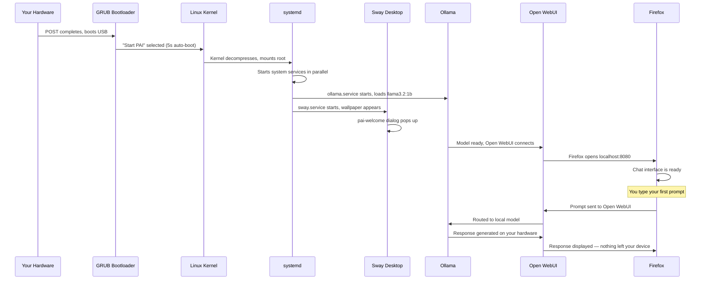

PAI boots from your USB drive into a complete, private AI workstation in 20 to 90 seconds — no installation, no accounts, no internet required. This guide walks you through every step from pressing the power button to having your first multi-turn AI conversation, so you know exactly what to expect and how to navigate the desktop.

In this guide:
- The complete boot sequence from power-on to desktop
- Understanding the welcome dialog and what it tells you
- Navigating the PAI desktop and waybar
- Sending your first prompt in Open WebUI
- What persists and what is erased when you shut down
- How to shut down safely

**Prerequisites**: You have a PAI USB drive prepared and your computer is set to boot from USB. If you haven't done that yet, see the [installing and booting guide](installing-and-booting.md) for instructions.

---

## How the full boot sequence works

From the moment you press power to the moment you can chat with an AI, PAI runs through a series of stages automatically. Understanding this sequence helps you recognize what's normal and what to expect at each step.



!!! note

    No internet required at any point in this sequence. Every step runs on your hardware using software baked into the ISO.


---

## What you see during boot

### The GRUB boot menu

After your BIOS/UEFI hands off control to the USB drive, the GRUB menu appears on a dark screen. You will see one primary option:

- **Start PAI** — selected by default with a five-second countdown

If you do nothing, PAI boots automatically after the countdown. If you want to pass kernel parameters or boot in a specific mode, press any key to pause the countdown.

!!! tip

    On most machines, you don't need to interact with GRUB at all. Let the countdown run and PAI starts itself.


*The GRUB menu. PAI auto-selects "Start PAI" after five seconds.*

### The boot splash

After GRUB hands off to the kernel, a brief boot splash with the PAI logo appears. The kernel and systemd are loading services in the background during this time. You won't see kernel log messages under normal conditions.

### The desktop appears

The Sway desktop loads and your wallpaper appears. This is the signal that systemd has finished its critical services. Within a second or two, the welcome dialog pops up automatically.

**Typical boot times:**
- USB 3.0 on modern hardware: 20 to 30 seconds
- USB 2.0 or slower drives: 60 to 90 seconds
- Virtual machines (UTM, VirtualBox): 45 to 90 seconds

---

## The welcome dialog

The **pai-welcome** dialog appears automatically on every boot. It gives you an orientation to the session and confirms which PAI profile is active.


*The welcome dialog. Note the active profile in the top line and the keyboard shortcuts listed below.*

The dialog shows:
- **Active profile** — typically "full" on a standard PAI USB
- **Four essential shortcuts** you need to navigate the desktop
- A **Get Started** button that closes the dialog

| Shortcut | Action |
|---|---|
| `Alt + Return` | Open a terminal (foot) |
| `Alt + D` | Open the app launcher (wofi) |
| `Alt + Shift + E` | Open the shutdown menu |
| Click **PAI** in waybar | Open the app launcher |

Click **Get Started** to dismiss the dialog. A marker at `/tmp/.pai-welcomed` prevents it from reappearing during the same session.

!!! note

    The welcome dialog reappears on every fresh boot because PAI starts clean each time. If you've set up [persistence](../persistence/introduction.md), you can configure it to skip the dialog after the first time.


---

## Open WebUI on first launch

Moments after the desktop loads, Firefox opens automatically to `localhost:8080`, which is the **Open WebUI** interface.

!!! note

    Firefox opens automatically because Open WebUI is the primary reason most people boot PAI. You can close it and use any other app — this is just the default starting point.


*Open WebUI on first launch. The model selector in the top bar shows llama3.2:1b, which is baked into the ISO.*

What you see:
- **No login screen** — PAI ships with `WEBUI_AUTH=False`. There are no accounts or passwords.
- **llama3.2:1b selected** — this one-billion-parameter model is pre-baked into the ISO and loads without any internet connection or download.
- **Empty chat window** — ready to accept your first prompt.

!!! note

    Nothing you type here leaves your device. Open WebUI communicates only with Ollama running locally. There are no cloud API calls, no telemetry, no accounts.


---

## Understanding the PAI desktop

The PAI desktop uses **Sway**, a tiling window manager. The bar at the bottom of the screen is **waybar**, which provides app launchers and live system status.


*The PAI desktop. Waybar runs along the bottom. Firefox with Open WebUI fills the main workspace.*

### What every waybar element does

<CardGrid>
  <Card title="PAI (top-left)" icon="laptop">
    Click to open the **wofi** app launcher. You can search for and launch any app installed on PAI from here.
  </Card>
  <Card title="🌐 Firefox" icon="external">
    Launches Firefox. By default it opens Open WebUI at localhost:8080.
  </Card>
  <Card title="💻 Terminal" icon="terminal">
    Launches the **foot** terminal emulator. You can also press `Alt + Return` from anywhere on the desktop.
  </Card>
  <Card title="📁 File Manager" icon="document">
    Launches **Thunar** file manager. Browse files in your current RAM session.
  </Card>
  <Card title="📝 Text Editor" icon="pencil">
    Launches **Mousepad** text editor. Useful for drafting notes or viewing files — remember they won't persist after shutdown unless persistence is enabled.
  </Card>
  <Card title="Ollama status (🟡/🟢)" icon="star">
    Shows Ollama's state: 🟢 means a model is loaded and ready; 🟡 means Ollama is running but no model is active. Displays the number of loaded models and the active model name.
  </Card>
</CardGrid>

| Element | Position | What it shows | Click action |
|---|---|---|---|
| **PAI** | Far left | — | Opens wofi app launcher |
| 🌐 | Left | — | Opens Firefox |
| 💻 | Left | — | Opens foot terminal |
| 📁 | Left | — | Opens Thunar |
| 📝 | Left | — | Opens Mousepad |
| **Ollama status** | Center-left | Model name + count | — |
| **Music note** | Center | Current track via playerctl | — |
| **₿ ticker** | Center | BTC/ETH price | Requires internet |
| **Network** | Right | Wifi/ethernet status | — |
| **CPU** | Right | Live CPU usage % | — |
| **RAM** | Right | Live RAM usage | — |
| **Clock** | Right | HH:MM | — |
| **⚙ Gear** | Far right | — | Opens PAI settings menu |

!!! tip

    The ⚙ gear icon in the top-right corner opens the PAI settings menu. From there you can adjust display settings, change profiles, and access the shutdown menu. See [desktop-basics.md](desktop-basics.md) for the full settings menu reference.


---

## Tutorial: Your first AI conversation

This tutorial takes you from a freshly booted PAI to a complete multi-turn conversation with the local AI model. It takes about five minutes.

**Goal**: Send several messages to llama3.2:1b, understand the response quality, and know how to continue the conversation.

**What you need**:
- PAI booted to the desktop
- Firefox open at localhost:8080 (it opens automatically)
- No internet connection required


1. **Confirm Open WebUI is loaded**

   Firefox should already show the Open WebUI interface at `localhost:8080`. If Firefox isn't open, click the 🌐 icon in waybar.

   In the top bar of Open WebUI, confirm the model selector shows **llama3.2:1b**. If Ollama is still loading (🟡 in waybar), wait a few seconds until the status turns 🟢.

2. **Send your first prompt**

   Click the message input at the bottom of the screen and type:

   ```
   What can you help me with today?
   ```

   Press `Enter` or click the send button.

   You'll see a typing indicator, then a response appears within one to three seconds on most hardware. llama3.2:1b is a small model — it's fast.

   Expected response: a list of capabilities (writing, coding, answering questions, summarizing text, brainstorming). The exact wording varies.

3. **Try a coding prompt**

   In the same conversation, type:

   ```
   Write a Python function that takes a list of numbers and returns the top 3 largest values without using the sort() method.
   ```

   Expected response: a working Python function, likely using a heap or manual comparison loop, with a brief explanation.

   !!! note

       This code was generated entirely on your hardware. No code was sent to any external server.


4. **Ask a follow-up question**

   Continue the conversation by asking:

   ```
   Can you rewrite that using a max-heap from Python's heapq module?
   ```

   The model uses the conversation history to give a contextually relevant answer. This is what "multi-turn conversation" means — the model remembers what was said earlier in the session.

5. **Try a summarization prompt**

   Paste a paragraph from any document, article, or text you have handy, then add:

   ```
   Summarize this in three bullet points:
   [your text here]
   ```

   Expected response: three concise bullet points capturing the key ideas.

6. **Try a reasoning prompt**

   ```
   I have 5 tasks to do today. How should I decide what order to do them in?
   ```

   Expected response: a structured decision-making framework (urgency vs. importance, time estimates, dependencies). The model can reason about abstract problems without any internet access.


**What just happened?** Every word of every response was generated by llama3.2:1b running in Ollama on your local hardware. The text went from your keyboard to Open WebUI to Ollama and back — no cloud, no API keys, no network traffic.

**Next steps**: llama3.2:1b is small and fast but limited in depth. For more nuanced responses, pull a larger model. See [managing models](../ai/managing-models.md) for how to download and switch between models.

---

## Five first prompts to try on PAI

These prompts are chosen to showcase what a local LLM does well, even on a small model.

!!! note

    All five prompts work entirely offline. Nothing leaves your device.


### 1. Explain a concept from scratch

```
Explain how public-key cryptography works to someone who has never studied math.
```

llama3.2:1b handles conceptual explanations well. Try asking follow-up questions to go deeper.

### 2. Write functional code

```
Write a bash script that finds all files larger than 100MB in the current directory and prints their sizes.
```

For code tasks, llama3.2:1b produces short, working scripts reliably. For larger programs, pull a bigger model.

### 3. Summarize something long

Paste in a long email, article, or document and ask:

```
Summarize this in five sentences. Focus on the key decisions and action items.
```

Summarization is one of the tasks where small models perform well above expectations.

### 4. Brainstorm ideas

```
Give me 10 names for a productivity app aimed at freelancers who work offline.
```

Brainstorming and list generation are fast, useful, and work well even on 1B parameter models.

### 5. Draft a short document

```
Write a brief privacy policy for a local-only journaling app that stores all data on the user's device and never connects to the internet.
```

Drafting structured text — policies, emails, outlines — is another strength of local LLMs.

---

## What doesn't persist after shutdown

PAI runs entirely in RAM by default. When you shut down, everything is erased. This is a feature, not a bug — it guarantees a clean state on every boot.

The following are **lost on every reboot**:

- Chat history and conversations in Open WebUI
- Wifi passwords and network configurations
- Files you downloaded, created, or edited
- Ollama models you pulled during the session
- Browser bookmarks and history
- Screenshots and clipboard contents

!!! warning

    If you pull a large model (7B, 13B, or larger) during a session, it is deleted when you shut down. You would need to re-download it on the next boot. Set up [persistence](../persistence/introduction.md) if you want models to survive reboots.


!!! note

    The pre-baked llama3.2:1b model is always available — it's built into the ISO, not stored in RAM. You never need to re-download it.


---

## How to shut down PAI safely

There are two ways to shut down:

**Option 1: Keyboard shortcut**

Press `Alt + Shift + E` from anywhere on the desktop. The `pai-shutdown` menu appears with three options:

- **Shutdown** — powers off the machine
- **Restart** — reboots (back to GRUB on next boot)
- **Memory Wipe + Shutdown** — overwrites RAM before shutting down for maximum privacy

**Option 2: Settings menu**

Click the ⚙ gear icon in waybar → navigate to the shutdown options.

!!! warning

    When PAI shuts down, all RAM is cleared. This means your prompts, browser history, downloaded files, and any changes you made are gone. This is intentional. If you want data to survive, set up [persistence](../persistence/introduction.md) before your session.


For a full reference on shutdown options including the memory wipe feature, see [shutting-down.md](shutting-down.md).

---

## What happens on your second boot

Every future PAI boot starts in the same factory-fresh state:

- The welcome dialog appears again (same shortcuts, same orientation)
- llama3.2:1b is ready immediately — it's baked into the ISO
- Open WebUI opens with an empty chat history
- No wifi passwords, no saved files, no history from previous sessions

!!! tip

    This predictability is useful for privacy-sensitive work. You always know exactly what state the system is in before you start.


---

## Frequently asked questions

### Why does Firefox open automatically?

Firefox opens to Open WebUI at `localhost:8080` as part of the default PAI startup sequence. The system assumes most users boot PAI to use the local AI. If you close Firefox and use a different app, that's fine — the AI is still running in the background and Firefox can reopen it any time.

### Where are my files?

Files you create or download during a PAI session exist only in RAM. They are accessible in Thunar (the file manager, 📁 in waybar) during your session. When you shut down, they are erased. If you need files to persist across sessions, set up the [persistence layer](../persistence/introduction.md), which stores selected paths on an encrypted partition.

### How do I change the AI model?

In Open WebUI, click the model selector in the top bar of the chat interface. Models you've pulled appear in the dropdown. To pull a new model, open a terminal (`Alt + Return`) and run `ollama pull <model-name>`. For a full guide to pulling and switching models, see [managing models](../ai/managing-models.md).

### Is the AI connected to the internet?

No. Ollama runs the AI model entirely on your hardware. Open WebUI communicates only with Ollama at `localhost:11434`. There are no cloud API calls, no model servers, no telemetry, and no data leaving your machine. You can boot PAI with no network connection at all and it works identically.

### Can I install apps?

You can install apps during a session using `apt` in the terminal, but they will be erased on shutdown because PAI runs from RAM. For session-only tools this is fine. If you need an app to persist, it should either be added to the PAI ISO build (see [building from source](../advanced/building-from-source.md)) or saved to a persistence-enabled path.

### Why is there no login screen?

PAI is a single-user, RAM-based OS designed for personal, private use. There is no multi-user scenario to protect against on a fresh boot. The trade-off is that there is no password barrier between someone who physically has your device and the session. For that reason, physical security of your USB drive matters more than a login password. The [warnings and limitations guide](../general/warnings-and-limitations.md) covers the full threat model.

### What if the welcome dialog doesn't appear?

If the welcome dialog doesn't pop up on boot, the most likely causes are:

1. **Sway compositor is still loading** — wait a few extra seconds and it may appear.
2. **The marker file exists** — if `/tmp/.pai-welcomed` was created somehow (for example, an improper shutdown recovery), the dialog suppresses itself. Open a terminal and run `rm /tmp/.pai-welcomed`, then run `pai-welcome &` to launch it manually.
3. **Profile mismatch** — some minimal PAI profiles ship without the welcome script. Check which profile you're running by looking at the top line of the expected dialog location or by running `cat /etc/pai/profile`.

### How do I get a better AI model?

llama3.2:1b is fast and offline-ready but limited in depth. For better reasoning and longer outputs, pull a larger model. Open a terminal and try:

```bash
ollama pull llama3.2:3b
```

Expected output:
```
pulling manifest
pulling a2af6cc6c18c... 100% 2.0 GB
verifying sha256 digest
writing manifest
success
```

See [managing models](../ai/managing-models.md) for a full comparison of available models and their hardware requirements.

### What does "running in RAM" mean?

It means the entire PAI operating system — all of its files, settings, and running programs — exists only in your computer's memory (RAM). Nothing is written to your hard drive or SSD. When power is cut, RAM loses its data, so PAI leaves no trace on the host machine. The downside is that anything you create during the session is also lost.

---

## Related documentation

- [**Installing and Booting PAI**](installing-and-booting.md) — How to flash the USB drive and configure BIOS to boot PAI
- [**Desktop Basics**](desktop-basics.md) — Full reference for the Sway desktop, waybar settings menu, and keyboard shortcuts
- [**Using Open WebUI**](../ai/using-open-webui.md) — In-depth guide to the chat interface, conversation management, and settings
- [**Managing Models**](../ai/managing-models.md) — How to pull, switch between, and remove Ollama models
- [**Persistence — Introduction**](../persistence/introduction.md) — How to set up encrypted persistent storage so your data survives reboots
- [**Warnings and Limitations**](../general/warnings-and-limitations.md) — What PAI does not protect against, and the honest threat model
