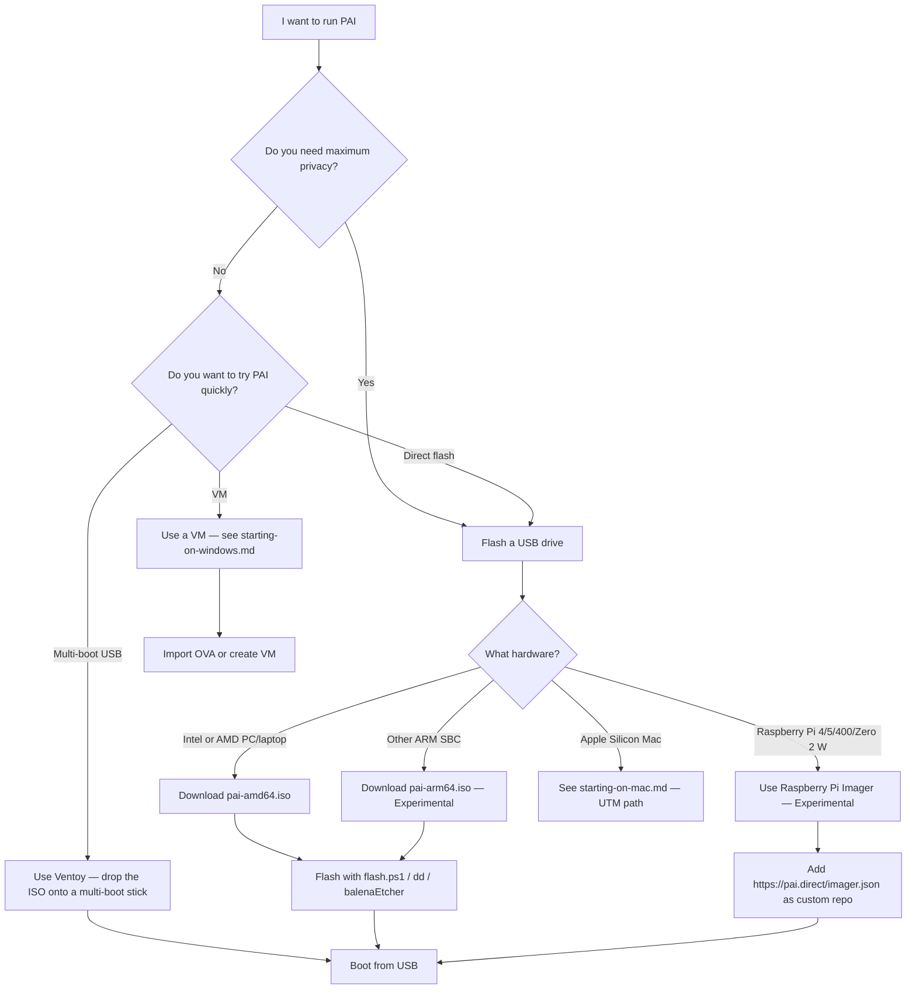

**PAI** is a bootable Linux operating system that runs entirely from a USB drive — no installation required, no changes to your existing computer. This guide walks you through downloading the PAI ISO, verifying it, flashing it to a USB drive, and booting your first session on a PC or laptop.

**What to expect.** About ten minutes from now, you'll have a working local-AI Linux desktop booting from a USB drive. Download the ISO, confirm the checksum with a one-line command, flash it with a tool you already have (or the copy-paste script), and boot. PAI's flasher confirms the target drive before writing a single byte, and the process leaves your host computer completely untouched — no partitioning, no dual boot, no files moved. It is genuinely hard to break anything.

In this guide:
- Choosing the right architecture ISO for your hardware
- Verifying your download with SHA256 checksums
- Flashing the ISO on Windows, macOS, or Linux
- Configuring your BIOS to boot from USB
- What to expect on your first boot
- Troubleshooting black screens, missing USB entries, and Secure Boot

**Prerequisites**: A USB drive with at least 8 GB of storage and a PC or laptop with a 64-bit Intel or AMD processor. macOS users on Apple Silicon should read [Starting PAI on a Mac](starting-on-mac.md) instead.

---

## Should you flash a USB or use a virtual machine?

Before flashing anything, decide which path is right for you:



!!! note

    A VM keeps PAI contained inside your existing OS. A USB boot gives you a fully isolated environment — nothing from PAI touches your host machine's storage, and nothing from your host machine leaks into PAI's RAM session.


!!! tip

    **Prefer not to wipe your USB?** Use Ventoy — a drag-and-drop multi-boot loader that preserves existing files on the drive and lets you carry multiple ISOs. See [Using Ventoy](using-ventoy.md).


---

## How to choose the right PAI architecture

PAI ships two ISO variants. Pick the one that matches your CPU:

| Your hardware | ISO to download |
|---|---|
| Modern Intel or AMD PC, laptop, or NUC | `pai-<version>-amd64.iso` |
| Raspberry Pi 4, 5, 400, or Zero 2 W | Use [Raspberry Pi Imager — see using-raspberry-pi-imager.md](using-raspberry-pi-imager.md) **[Experimental]** |
| Other ARM single-board computer | `pai-<version>-arm64.iso` **[Experimental]** |
| Apple Silicon Mac (M1/M2/M3/M4) | Use [UTM — see starting-on-mac.md](starting-on-mac.md) |
| Intel Mac | `pai-<version>-amd64.iso` |

!!! tip

    If you're not sure, you almost certainly have an Intel or AMD CPU. The amd64 ISO runs on both Intel and AMD processors — the name is historical, not vendor-specific.


!!! note

    **On a Raspberry Pi?** Use Raspberry Pi Imager instead — see [Install PAI on Raspberry Pi](using-raspberry-pi-imager.md). It's faster, does the SHA256 verification for you, and handles Pi-specific bootloader config.


---

## How to download and verify the PAI ISO

### Download from the official release page

Always download PAI from the [official release page](https://github.com/nirholas/pai/releases). The release page lists the current stable version alongside SHA256 checksums and a GPG signature.

Files to download:
- `pai-<version>-amd64.iso` (or `arm64` variant)
- `SHA256SUMS` — the checksum file
- `SHA256SUMS.sig` — optional GPG signature for the checksum file

!!! danger

    Never run an ISO you cannot verify. A tampered ISO could compromise the privacy guarantees PAI is designed to provide. Always check the SHA256 checksum before flashing.


### How to verify the SHA256 checksum

After downloading both the ISO and the `SHA256SUMS` file into the same directory, run the verification command for your platform:

=== "Linux"
    ```bash
    # Verify the ISO against the checksum file
    sha256sum -c SHA256SUMS --ignore-missing
    ```

    Expected output:
    ```
    pai-1.0.0-amd64.iso: OK
    ```

    If you see `FAILED` instead of `OK`, delete the ISO and re-download it.
=== "macOS"
    ```bash
    # Compute the checksum of the downloaded ISO
    shasum -a 256 pai-1.0.0-amd64.iso
    ```

    Expected output (example — your version's hash will differ):
    ```
    a1b2c3d4e5f6...  pai-1.0.0-amd64.iso
    ```

    Compare the printed hash character-by-character against the value in `SHA256SUMS`. They must match exactly.
=== "Windows"
    Open **PowerShell** (not Command Prompt) and run:

    ```powershell
    # Compute the SHA256 hash of the downloaded ISO
    Get-FileHash .\pai-1.0.0-amd64.iso -Algorithm SHA256 | Select-Object Hash
    ```

    Expected output:
    ```
    Hash
    ----
    A1B2C3D4E5F6...
    ```

    Open `SHA256SUMS` in Notepad and compare the hash values. PowerShell output is uppercase; the checksum file may be lowercase — both are equivalent.

---

## What USB drive do you need?

| Requirement | Minimum | Recommended |
|---|---|---|
| Storage | 8 GB | 16 GB or more |
| Interface | USB 2.0 | USB 3.0 or faster |
| Speed class | Any | 90 MB/s read or faster |

!!! tip

    Boot speed is limited by your USB drive's read speed, not your CPU. A USB 3.0 drive will boot PAI in 20–30 seconds. A slow USB 2.0 drive can take 90 seconds or more. The 16 GB minimum gives room for the optional [persistence layer](../persistence/introduction.md).


---

## How to flash the PAI ISO to a USB drive

### Want a no-wipe, drag-and-drop alternative?

[Ventoy](using-ventoy.md) installs on a USB drive once and lets you boot any ISO by copying it as a file. If you want to keep other files on the drive, carry multiple ISOs, or upgrade PAI by dragging a new ISO, start there.

If you want the most tamper-evident install — the drive **is** PAI and nothing else — use one of the direct-flash methods below.

!!! danger

    **`dd`, `flash.ps1`, and the graphical Rufus tool in DD mode all write directly to block devices. If you select the wrong drive, you will permanently erase that drive's contents.** Triple-check the device path or drive letter before confirming. There is no undo.


!!! note

    **On a Raspberry Pi?** Use Raspberry Pi Imager instead — see [Install PAI on Raspberry Pi](using-raspberry-pi-imager.md). It's faster, does the SHA256 verification for you, and handles Pi-specific bootloader config.


=== "Windows"
    ### PowerShell one-liner (recommended)

    Open **PowerShell as Administrator** and run:

    ```powershell
    irm https://pai.direct/flash.ps1 | iex
    ```

    The script downloads the latest PAI ISO, verifies its SHA256, lets you pick your USB drive, writes it raw, and verifies the result. The whole flow usually takes three to seven minutes on a USB 3.0 drive.

    **Prerequisites**:
    - Windows 10 (build 17763) or Windows 11
    - PowerShell 5.1 or newer (included in every supported Windows)
    - Administrator access
    - An internet connection (to download the ISO)
    - A USB drive with 8 GB or more of storage

    Expected result: the script prints a green "Flash complete" banner, lists the device path it wrote to (for example `\\.\PhysicalDrive2`), and tells you it is safe to remove the drive.

    
    *`flash.ps1` mid-run: the script downloads and verifies the ISO, then writes it raw to the USB drive.*

    
    *The success banner tells you which `PhysicalDriveN` was written and that it is safe to remove.*

    ### Rufus (graphical alternative)

    If you prefer a graphical tool, **Rufus** is a good fallback. It is free and open source.

    1. Download the Rufus graphical tool from [rufus.ie](https://rufus.ie) and run it (no installation needed).

    2. Plug in your USB drive. The Rufus graphical tool detects it automatically. Confirm the **Device** dropdown shows your USB drive — check the size to be sure.

    3. Click **SELECT** next to "Boot selection" and browse to your `pai-<version>-amd64.iso` file.

    4. When prompted "ISOHybrid image detected", select **Write in DD Image mode**. This is critical — ISO mode will produce a non-bootable drive.

       
       *Always choose DD Image mode. ISO Image mode produces a drive that will not boot PAI.*

    5. Confirm the **Partition scheme** shows GPT (preferred) or MBR.

    6. Click **START**. The graphical Rufus tool warns you that the USB drive will be erased. Confirm and wait — flashing takes two to five minutes.

    Expected result: The USB drive appears in File Explorer as a drive labeled `PAI` (or similar). It may show as unreadable in Windows Explorer — this is normal for Linux filesystems.

    ### Verify before run (advanced)

    If you want to read `flash.ps1` before running it — recommended whenever you pipe a remote script into `iex` — download and verify it against its published SHA256 first:

    ```powershell
    $url = 'https://pai.direct/flash.ps1'
    irm "$url.sha256" -OutFile flash.ps1.sha256
    irm $url -OutFile flash.ps1
    Get-FileHash flash.ps1 -Algorithm SHA256
    # Compare the printed hash against the contents of flash.ps1.sha256, then:
    powershell -ExecutionPolicy Bypass -File .\flash.ps1
    ```

    The `.sha256` sidecar is regenerated on every release, so its value changes each time `flash.ps1` changes — always fetch the pair together.
=== "macOS — dd"
    1. Plug in your USB drive.

    2. Open **Terminal** and list attached disks:

       ```bash
       diskutil list
       ```

       Expected output (look for your USB by size):
       ```
       /dev/disk0 (internal, physical):
          #:                       TYPE NAME                    SIZE
          0:      GUID_partition_scheme                        500.1 GB
          ...
       /dev/disk2 (external, physical):
          #:                       TYPE NAME                    SIZE
          0:      GUID_partition_scheme                        32.0 GB   <- your USB
       ```

       Note the disk number — in this example it's `disk2`.

    3. Unmount the USB drive (replace `2` with your disk number):

       ```bash
       diskutil unmountDisk /dev/disk2
       ```

       Expected output:
       ```
       Unmount of all volumes on disk2 was successful
       ```

    4. Flash the ISO using `rdisk` (the raw device path, which is faster than `disk`):

       ```bash
       # Replace 2 with your disk number and update the ISO filename
       sudo dd if=pai-1.0.0-amd64.iso of=/dev/rdisk2 bs=4m status=progress
       ```

       The `r` prefix in `rdisk2` bypasses the block buffer and doubles write speed. This step takes two to eight minutes depending on drive speed.

    5. Eject when complete:

       ```bash
       diskutil eject /dev/disk2
       ```
=== "Linux — dd or balenaEtcher"
    **Option A: dd (command line)**

    1. Plug in your USB drive and find its device path:

       ```bash
       # Filter to USB storage devices only
       lsblk -d -o NAME,SIZE,MODEL,TRAN | grep usb
       ```

       Expected output:
       ```
       sdb    32G   SanDisk Ultra    usb
       ```

       The device is `/dev/sdb` in this example.

    2. Confirm the drive is not mounted:

       ```bash
       lsblk /dev/sdb
       ```

       If any partition shows a mountpoint, unmount it first: `sudo umount /dev/sdb1`

    3. Flash the ISO:

       ```bash
       # Replace sdX with your actual device (sdb, sdc, etc.) — NOT a partition like sdb1
       sudo dd if=pai-1.0.0-amd64.iso of=/dev/sdX bs=4M status=progress conv=fsync
       ```

       `conv=fsync` ensures all data is flushed to the drive before `dd` exits. This step takes two to six minutes.

    4. Wait for the command prompt to return before removing the drive.

    **Option B: balenaEtcher (graphical)**

    Download [balenaEtcher](https://etcher.balena.io), select your ISO, select your USB drive, and click Flash. balenaEtcher validates the flash automatically after writing.

---

## How to verify the USB before booting

After flashing, confirm the drive is ready:

=== "Linux"
    ```bash
    # The USB should show a partition labeled PAI or similar
    lsblk -o NAME,SIZE,LABEL /dev/sdX
    ```

    Expected output:
    ```
    NAME   SIZE LABEL
    sdb    32G
    sdb1   3.9G PAI
    sdb2   300M
    ```
=== "macOS"
    ```bash
    diskutil list /dev/disk2
    ```

    Look for a partition labeled `PAI` or similar.
=== "Windows"
    Open **Disk Management** (press `Win+X`, select Disk Management). The USB should show as a disk with one or two partitions. Windows may show the partitions as unreadable — this is expected for Linux ext4 partitions.

---

## How to enter the boot menu on your computer

Reboot your computer with the USB drive plugged in. Press the boot menu key during the first second or two of the POST screen (the manufacturer logo).

### Boot menu and BIOS keys by vendor

| Vendor | Boot menu key | BIOS / UEFI setup key | Notes |
|---|---|---|---|
| Dell | F12 | F2 | Hold F12 before the Dell logo |
| HP | F9 or Esc | F10 | Esc opens a "Startup Menu"; choose F9 from there |
| Lenovo (ThinkPad) | F12 | F1 | May need to hold Fn+F12 |
| Lenovo (IdeaPad/Yoga) | Fn+F12 | F2 or Novo button | Novo is a small pinhole button |
| ASUS | F8 or Esc | Del or F2 | |
| Acer | F12 | F2 | Some models: Esc |
| MSI | F11 | Del | |
| Gigabyte | F12 | Del | |
| ASRock | F11 | F2 or Del | |
| Samsung | F2 | F2 | Boot priority in BIOS; no separate boot menu |
| Toshiba / Dynabook | F12 | F2 | |
| Sony VAIO | F11 | F2 | VAIO boot manager at F11 |
| Surface (Pro/Go/Laptop) | Hold Volume Down while pressing Power | Hold Volume Up while pressing Power | Surface UEFI, not standard BIOS |
| Generic / unlisted | F12 (most common) | Del or F2 | Check your motherboard manual |

!!! note

    If you miss the window, just reboot and try again. The key must be pressed within the first one to two seconds — before the OS starts loading.


### What to do if your USB drive doesn't appear in the boot menu

Three BIOS settings commonly block USB boot on newer hardware:

1. **Secure Boot** — PAI does not currently ship signed UEFI shims. Disable Secure Boot in your BIOS settings to allow PAI to boot. Look for "Secure Boot" under the Security or Boot tab.

2. **Fast Boot** — Some firmware skips USB enumeration when Fast Boot is enabled. Disable it in the Boot settings.

3. **CSM / Legacy BIOS mode** — Most PAI ISOs boot in UEFI mode. If your hardware is older than 2012, you may need to enable CSM (Compatibility Support Module) to see the USB in the boot list. Conversely, if you have a very new machine, ensure Legacy/CSM is disabled and Secure Boot is the only thing preventing boot.


*Disable Secure Boot to allow PAI to boot on UEFI systems.*

---

## What you'll see when PAI boots

1. **GRUB menu** — A text menu appears with "Start PAI" highlighted. Press Enter or wait three seconds.

   
   *The PAI GRUB menu. Press Enter to boot or wait for the countdown.*

2. **Kernel boot messages** — Text scrolls past on a black background. This is normal. Duration: 10–30 seconds depending on USB speed.

3. **Sway desktop loads** — A clean tiling window manager desktop appears. A welcome dialog opens automatically.

4. **Open WebUI opens in Firefox** — The AI chat interface loads at `localhost:8080`, connected to your local Ollama instance.

5. **You're ready** — Type a prompt in Open WebUI to start your first offline AI conversation.

!!! tip

    Boot time depends heavily on USB drive speed. A USB 3.0 drive plugged into a USB 3.0 port typically boots in 20–30 seconds. A USB 2.0 drive in a USB 2.0 port can take 60–90 seconds. Use the fastest port available — usually marked in blue.


---

## Tutorial: Download, flash, and boot PAI from scratch

**Goal**: Get from zero to PAI's desktop with an AI model responding to prompts.

**What you need**:
- A PC or laptop with an Intel or AMD 64-bit CPU
- 8 GB of RAM minimum (16 GB recommended for larger models)
- A USB drive with 8 GB or more storage
- A Windows, macOS, or Linux computer to flash the drive
- 15–30 minutes total

1. **Download the ISO** — *(~3–10 minutes depending on connection)*

   Go to the [PAI releases page](https://github.com/nirholas/pai/releases). Download `pai-<latest-version>-amd64.iso` and `SHA256SUMS` into the same folder.

2. **Verify the checksum** — *(~1 minute)*

   Run the SHA256 verification command for your platform (see [How to verify the SHA256 checksum](#how-to-download-and-verify-the-pai-iso) above). Confirm you see `OK`. If not, re-download.

3. **Flash the USB** — *(~3–8 minutes)*

   Follow the flashing steps for your platform above. On Windows: run `irm https://pai.direct/flash.ps1 | iex` in an elevated PowerShell (or use Rufus in DD mode as a graphical alternative). On macOS: use `dd` to `/dev/rdiskN`. On Linux: use `dd` to `/dev/sdX` or use balenaEtcher.

4. **Plug in the USB and reboot** — *(~1 minute)*

   Safely eject the USB drive, then plug it into the computer you want to boot PAI on. Reboot.

5. **Enter the boot menu** — *(~1 minute)*

   Press the boot menu key (see vendor table above) immediately after the manufacturer logo appears. Select the USB drive from the list.

6. **Disable Secure Boot if needed** — *(~2–5 minutes, first time only)*

   If the USB is not listed, reboot into BIOS (see vendor table for BIOS key), disable Secure Boot, save and exit, then repeat step 5.

7. **Boot to the PAI desktop** — *(~20–90 seconds)*

   At the GRUB menu, press Enter or wait. Watch the boot messages scroll. The Sway desktop loads.

8. **Start chatting** — *(immediate)*

   Open WebUI opens in Firefox at `localhost:8080`. Type a message in the chat box. The default model responds within a few seconds on most modern hardware.

**What just happened?** PAI loaded an entire Linux operating system from your USB drive into RAM. Ollama — a lightweight local LLM runtime — started automatically in the background. Open WebUI provides the chat interface. Nothing was written to your computer's internal drive.

**Next steps**: Explore [First Boot Walkthrough](first-boot-walkthrough.md) for a tour of the desktop, or read [Managing Models](../ai/managing-models.md) to pull additional AI models.

---

## How to fix common boot problems

### Black screen after the GRUB menu

This usually means the kernel's graphics driver is incompatible with your GPU. Fix it by adding `nomodeset` to the kernel command line:

1. At the GRUB menu, press `e` to edit the boot entry.
2. Find the line beginning with `linux` (it contains `vmlinuz`).
3. Add `nomodeset` to the end of that line.
4. Press `Ctrl+X` or `F10` to boot with the modified parameters.

`nomodeset` tells the kernel not to switch to a hardware-accelerated graphics mode. You'll get a lower resolution but the system will boot. This is a common fix for older AMD/Intel GPUs and some Nvidia cards.

### USB drive not detected in the boot menu

Try these in order:

1. Disable **Secure Boot** in BIOS (most common cause on UEFI systems)
2. Disable **Fast Boot** in BIOS
3. Try a different USB port — preferably USB 3.0 (blue port)
4. Re-flash the USB using DD mode, not ISO mode
5. Try a different USB drive (some drives have firmware quirks)

### "No bootable device found" error

Your firmware doesn't see a valid EFI boot entry on the USB. Confirm:
- Secure Boot is disabled
- The BIOS boot order has the USB listed above the internal drive
- The USB was flashed in DD mode, not ISO mode

For full troubleshooting steps, see [Troubleshooting PAI Boot Issues](../advanced/troubleshooting.md).

---

## Frequently asked questions

### Do I need to install PAI to use it?

No. PAI is designed to run entirely from a USB drive without installing anything to your computer's internal storage. Plug in the USB, boot from it, and PAI loads into RAM. When you shut down, nothing persists on the host machine. If you want data to survive reboots, you can set up the optional [persistence layer](../persistence/introduction.md).

### Can I run PAI from an SD card?

Yes, but it is not recommended for daily use. PAI boots from any block storage device visible to your BIOS, including SD cards and microSD cards in adapters. SD cards are typically slower than USB drives and have a shorter write lifespan, which matters if you use the persistence layer. A USB 3.0 thumb drive or a USB SSD gives significantly better performance.

### What USB size do I need?

8 GB is the minimum — the PAI ISO is approximately 3–4 GB, and you need some overhead. 16 GB is recommended if you plan to enable persistence or download large AI models onto the persistent partition. 32 GB or more is ideal for running models larger than 7 billion parameters from persistent storage.

### Will PAI work on my old laptop?

PAI runs on most Intel and AMD 64-bit laptops made after 2010. The minimum practical RAM is 4 GB (for small models like `llama3.2:1b`); 8 GB or more is strongly preferred. Laptops that are too old to boot UEFI ISOs may require enabling CSM/Legacy mode in BIOS. See [System Requirements](../general/system-requirements.md) for a full compatibility table.

### How do I know the download isn't corrupted?

Use the SHA256 checksum verification described in this guide. The `SHA256SUMS` file on the release page lists the expected hash for every released ISO. If your computed hash matches the expected hash, the file is identical to what was published — bit for bit. A mismatch means the file is corrupted or tampered with; re-download it.

### Does flashing erase my USB drive?

Yes. Flashing writes the PAI ISO directly to the entire drive, overwriting all existing partitions and data. Back up anything on the USB drive before flashing. The USB drive will no longer function as a regular FAT32 storage device in Windows — it will be formatted with Linux partitions. To restore it to normal use, reformat it with Disk Management (Windows) or `diskutil eraseDisk` (macOS).

### Can I use PAI and keep my existing OS?

Yes. PAI boots independently from your USB drive without touching your internal drive at all. Your existing OS — Windows, macOS, Linux, or anything else — remains intact. You select PAI at the boot menu, use it, shut it down, remove the USB, and your computer boots normally next time. The two systems are completely separate.

### What happens to my files when PAI shuts down?

By default, everything is erased. PAI runs in RAM. When the system powers off, all files, conversations, downloads, and settings disappear. This is a feature, not a bug — it gives you a clean, trackable-free session each time. To persist data across reboots, configure the [persistence layer](../persistence/introduction.md), which stores encrypted data on a separate partition of the USB drive.

### Why does Secure Boot block PAI?

Secure Boot is a UEFI feature that only allows bootloaders that carry a cryptographic signature from a trusted certificate authority (usually Microsoft or the hardware vendor). PAI does not currently ship a signed bootloader shim. Disabling Secure Boot allows unsigned bootloaders — including PAI — to run. This does not weaken your security in any meaningful way when booting a known-good, verified PAI ISO.

### What is the difference between dd, flash.ps1, and the Rufus graphical alternative?

All three write an ISO image directly to a USB drive, just on different platforms. `dd` is a Unix command-line tool available on macOS and Linux. `flash.ps1` is PAI's Windows PowerShell flasher — it downloads the latest ISO, verifies its SHA256, and writes it raw in one step (`irm https://pai.direct/flash.ps1 | iex`). Rufus is a Windows graphical application and is kept as a fallback for users who prefer a GUI. The key requirement for all three is to use "raw" or "DD image" mode — this writes the ISO byte-for-byte to the drive rather than unpacking it as a filesystem. Rufus in ISO image mode will produce a drive that does not boot; `flash.ps1` and `dd` always write in raw mode, so you can't pick the wrong option.

### Can I use Ventoy instead of flashing directly?

Yes, and for many users it's the better choice. See [Using Ventoy](using-ventoy.md). The short version: Ventoy lets you keep multiple ISOs on one USB stick and upgrade PAI by dragging a new ISO onto the drive. The tradeoff is a slightly larger boot-time trust surface (Ventoy's own boot loader runs before PAI's).

### Can I install PAI permanently to my hard drive?

PAI is designed as a live OS, not a permanently installed distribution. There is no supported installer to put PAI on an internal drive. If you want a permanent local AI Linux setup, consider using the [persistence layer](../persistence/introduction.md) on the USB, which gives you many of the same benefits without installing to internal storage.

---

## Related documentation

- [**First Boot Walkthrough**](first-boot-walkthrough.md) — A tour of the PAI desktop, Sway window manager, and Open WebUI on your first session
- [**Starting PAI on a Mac**](starting-on-mac.md) — How to run PAI in UTM on Apple Silicon and Intel Macs
- [**Starting PAI on Windows**](starting-on-windows.md) — Running PAI in a Windows VM without flashing a USB
- [**System Requirements**](../general/system-requirements.md) — Minimum hardware needed to run PAI and model compatibility
- [**Persistence Layer**](../persistence/introduction.md) — How to configure encrypted persistent storage so your data survives reboots
- [**Troubleshooting**](../advanced/troubleshooting.md) — Full troubleshooting reference for boot failures, black screens, and hardware compatibility
