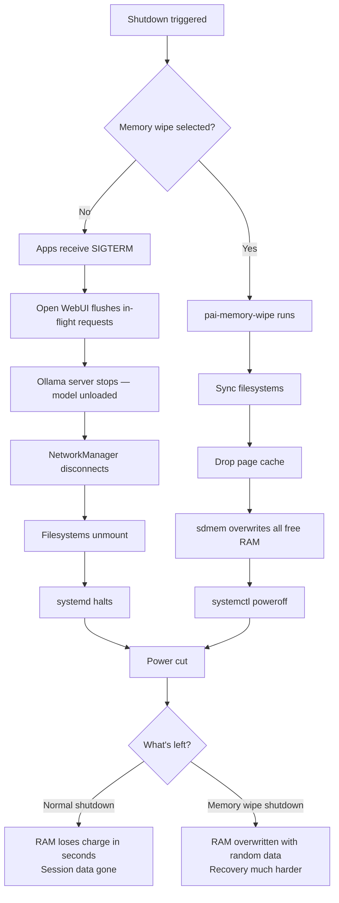

PAI runs entirely from RAM. When you shut down, every conversation, downloaded file, saved password, and browser history is erased — not moved to a recycle bin, permanently gone. This is PAI's core privacy guarantee: the host machine is returned to exactly the state it was in before you booted. For sessions involving sensitive work, PAI also offers a **memory-wipe shutdown** that overwrites RAM with random data before powering off, defending against cold-boot attacks.

In this guide:
- The three ways to trigger the shutdown menu
- What each shutdown menu option does and when to use it
- What the `pai-memory-wipe` script does and how long it takes
- What a cold-boot attack is and why memory wipe defends against it
- Exactly which data survives shutdown (and which never does)
- What to do if PAI freezes and won't shut down normally

**Prerequisites**: PAI is booted and you have an active session. No technical background required.

---

## Why shutdown is a privacy event in PAI

Most operating systems write your data to a disk. PAI does not. Every piece of data in your session — your [Open WebUI](../ai/using-open-webui.md) conversations, pulled [Ollama models](../ai/managing-models.md), browser history, wifi passwords, and files — lives only in your computer's RAM.

RAM is volatile memory. The moment power is removed, it begins losing its charge. Within a few seconds to a few minutes (depending on temperature and chip design), all values are gone. PAI exploits this property deliberately: shutdown is not a cleanup step, it is the cleanup itself.

This means PAI shutdown is more significant than closing a normal app. Choosing when and how to shut down affects your privacy posture.

---

## How to open the shutdown menu

PAI gives you three ways to reach the same shutdown menu:

### Keyboard shortcut

Press `Alt+Shift+E` from anywhere in the Sway desktop. The `pai-shutdown` wofi menu appears immediately.

### Power button

Press your laptop or desktop's physical power button briefly (do not hold it down). A brief press signals PAI to show the shutdown menu, not to hard-cut power.

### Command line

Open a terminal and run the commands directly, bypassing the menu:

```bash
# Normal shutdown — immediate
sudo shutdown -h now
```

```bash
# Restart — boots a fresh PAI session
sudo shutdown -r now
```

```bash
# Memory-wipe then shutdown — for sensitive sessions
pai-memory-wipe && sudo shutdown -h now
```

!!! note

    Running `pai-memory-wipe` directly requires root. The menu version handles `sudo` automatically via `foot` terminal.


---

## The shutdown menu — what each option does

When you open the shutdown menu, you see four options:


*The PAI shutdown menu, invoked with Alt+Shift+E or a brief power button press.*

### Shutdown **[Default]**

Powers off the machine normally. The Linux kernel signals running processes to close, unmounts filesystems, and cuts power. RAM is cleared by the OS during the shutdown sequence, but a small amount of residual charge may remain in the DRAM chips for a few seconds after power-off. For most use cases, this is sufficient.

### Shutdown + Wipe Memory **[Recommended for sensitive sessions]**

Runs `pai-memory-wipe` before powering off. A terminal window opens showing progress through a four-step sequence, then the system powers off. This takes 20 to 60 seconds depending on how much RAM your machine has. Use this when you have been working with sensitive material or are shutting down on hardware you don't fully trust.

### Reboot

Restarts the machine. PAI boots a completely fresh session — nothing from the previous session carries over. Equivalent to shutting down and powering back on.

### Cancel

Closes the menu and returns you to your session. Nothing happens.

---

## What happens during a normal PAI shutdown

When you select **Shutdown**, PAI works through this sequence:

```
Normal shutdown sequence
────────────────────────
1. Running apps receive SIGTERM → Firefox, foot, etc. close
2. Open WebUI flushes any in-flight chat requests
3. Ollama server shuts down → model is unloaded from RAM
4. NetworkManager disconnects all network interfaces
5. Filesystems unmount (including any persistence partition)
6. systemd sends SIGKILL to any remaining processes
7. Kernel halts → BIOS/UEFI cuts power
8. RAM loses charge → all session data gone in seconds
```



---

## Memory wipe (`pai-memory-wipe`) — what it does and why it matters

### What a cold-boot attack is

Modern DRAM chips retain their values for seconds to minutes after power is removed — longer if the chips are cold. A cold-boot attack exploits this: an attacker powers off your machine, quickly removes or freezes the RAM, and reads the residual values with specialized hardware or software. This can reveal encryption keys, passwords, and even text from recent conversations.

Cold-boot attacks are not theoretical. They have been demonstrated against BitLocker, FileVault, and LUKS-encrypted systems in real-world conditions. For most PAI users, the risk is low. For journalists, activists, or anyone handling sensitive data on shared or confiscated hardware, it is a real threat.

### How `pai-memory-wipe` defends against it

The `pai-memory-wipe` script works through four steps:

```
[1/4] Syncing filesystems...
[2/4] Dropping page cache, dentries, and inodes...
[3/4] Wiping free RAM (single pass)...
[4/4] Memory wiped. Shutting down...
```

Step 3 uses `sdmem` with the `-l -l` flag (double-low), which performs a single overwrite pass with random data. This is faster than a multi-pass wipe (roughly 20 to 60 seconds on 8–32 GB of RAM) and is sufficient for all but the most adversarial threat models. After step 4, `systemctl poweroff` is called automatically — you do not need to press anything.

!!! tip

    Use **Shutdown + Wipe Memory** any time you have been working with sensitive prompts, handling encrypted files, or shutting down on hardware that isn't yours — a library computer, a shared office machine, or a borrowed laptop. The extra 20 to 60 seconds is worth it.


*The memory-wipe terminal shows progress. The system powers off automatically when complete.*

---

## What data persists vs. disappears — a complete comparison

The table below covers four scenarios. "Persistence partition" refers to the optional encrypted partition described in [Setting Up Persistence](../persistence/introduction.md).

| Data type | No persistence + normal shutdown | No persistence + memory-wipe | Persistence + normal shutdown | Persistence + memory wipe |
|---|---|---|---|---|
| Open WebUI conversations | Gone | Gone (overwritten) | **Saved** | **Saved** |
| Browser history and cookies | Gone | Gone (overwritten) | Depends on config | Depends on config |
| Files saved to Desktop/Downloads | Gone | Gone (overwritten) | **Saved** | **Saved** |
| Ollama models pulled this session | Gone | Gone (overwritten) | **Saved** | **Saved** |
| Wifi passwords entered | Gone | Gone (overwritten) | **Saved** | **Saved** |
| GPG session keys | Gone | Gone (overwritten) | **Saved** | **Saved** |
| Passwords entered (KeePassXC) | Gone | Gone (overwritten) | KeePassXC DB saved | KeePassXC DB saved |
| PAI system itself (the ISO) | **Unchanged** (read-only) | **Unchanged** | **Unchanged** | **Unchanged** |
| Files on external USB/SD card | **Unchanged** (you wrote them) | **Unchanged** | **Unchanged** | **Unchanged** |
| Data sent over the network | Out of PAI's control | Out of PAI's control | Out of PAI's control | Out of PAI's control |
| Residual RAM values after power-off | Present for seconds | Overwritten before power-off | Present for seconds | Overwritten before power-off |

!!! warning

    Data you sent over the network — uploaded files, messages sent, API calls made — is outside PAI's control once it leaves the device. Shutdown cannot recall it. PAI's privacy model applies to local data only.


---

## Tutorial: Your first secure shutdown

**Goal**: Walk through the shutdown menu, understand each option, and complete a memory-wipe shutdown.

**What you need**: A running PAI session.


1. **Open the shutdown menu.**

   Press `Alt+Shift+E`. The wofi shutdown menu appears in the center of your screen with four options: Shutdown, Shutdown + Wipe Memory, Reboot, Cancel.

2. **Read each option before choosing.**

   - **Shutdown** — normal power-off; appropriate for most sessions.
   - **Shutdown + Wipe Memory** — overwrites RAM before power-off; use for sensitive sessions.
   - **Reboot** — fresh PAI session on the same hardware.
   - **Cancel** — return to your session.

3. **For this tutorial, select "Shutdown + Wipe Memory".**

   A terminal window titled "PAI — Wiping Memory" opens and displays progress:

   ```
     PAI — Secure Memory Wipe
     ─────────────────────────

     Wiping RAM before shutdown...
     This takes 20–60 seconds depending on your RAM.

   [1/4] Syncing filesystems...
   [2/4] Dropping page cache, dentries, and inodes...
   [3/4] Wiping free RAM (single pass)...
   [4/4] Memory wiped. Shutting down...
   ```

4. **Wait for the wipe to complete.**

   Do not press anything. The system powers off automatically when the wipe finishes. On a machine with 16 GB of RAM, expect roughly 30 to 45 seconds.

5. **Verify the machine is fully off.**

   The screen goes dark and fans stop. Your session — conversations, models, browser history — is gone. The host machine is back to its pre-PAI state.


**What just happened?** PAI ran `sdmem` to overwrite all free RAM pages with random data before calling `systemctl poweroff`. Even if someone immediately powered the machine back on and tried to read residual DRAM values, they would find random noise rather than your session data.

**Next steps**: Learn about [setting up a persistence partition](../persistence/introduction.md) if you want to keep data across sessions, or read [how PAI handles your privacy](../general/how-pai-works.md) for a deeper look at the security model.

---

## Emergency shutdown — when PAI freezes

If PAI becomes completely unresponsive and the shutdown menu cannot be reached:

**Hold the power button for 5 or more seconds.** This triggers a hardware-forced power cut regardless of what the OS is doing. On a live system like PAI — where nothing is written to the host machine's disk — a hard power cut is safe. There is nothing to corrupt. Your session data disappears, same as a normal shutdown.

If your hardware supports **SysRq keys** and they are enabled, you can also use:

```
Alt + SysRq + B
```

This triggers an immediate kernel reboot, bypassing the shutdown sequence. It is faster than a hard power cut and slightly more graceful, but both are acceptable for a live system.

!!! danger

    Do NOT yank the USB drive while PAI is running. The USB stick is PAI's root filesystem. Removing it while the system is running will crash PAI immediately — equivalent to pulling a hard drive mid-operation. Always shut down fully first, then remove the USB after the machine powers off. If you are using PAI in a VM, close the VM window instead.


---

## Restarting PAI

Selecting **Reboot** from the shutdown menu restarts the machine and boots a fresh PAI session. Everything from the previous session is gone — including any models you pulled, conversations you had, and files you saved (unless you have [persistence](../persistence/introduction.md) configured).

On restart, you go through the same boot sequence described in [Installing and Booting PAI](installing-and-booting.md): GRUB loads, PAI decompresses into RAM, Sway starts, and Open WebUI becomes available at `localhost:8080`.

---

## Removing the USB stick after shutdown

Once the machine is fully powered off — screen dark, fans stopped, power light off — it is safe to remove the PAI USB drive. The USB contains only the read-only ISO image. Nothing was written to it during your session.

If you are running PAI in a virtual machine (UTM on macOS, VirtualBox, etc.), closing the VM window is equivalent to shutdown. You do not need to remove any physical USB drive.

---

## Frequently asked questions

### Can someone recover my AI conversations after I shut down PAI?

Not under normal shutdown conditions. PAI conversations live only in RAM. When PAI shuts down, the OS clears RAM as part of the halt sequence, and the residual charge dissipates within seconds to a minute. If you used **Shutdown + Wipe Memory**, RAM is actively overwritten with random data before power-off, making recovery significantly harder even with forensic hardware.

### How long does memory wipe take?

The wipe takes 20 to 60 seconds on most hardware. On a machine with 8 GB of RAM expect around 20 seconds; on a machine with 32 GB expect closer to 60 seconds. The terminal shows a progress indicator so you know it is working. The system powers off automatically when done.

### What if PAI freezes and won't shut down normally?

Hold the physical power button for 5 or more seconds to force a hardware power cut. On a live system like PAI — where nothing is written to your host machine's disk — a hard power cut is safe. All session data disappears as usual. If your keyboard is still responding but the display is frozen, try `Alt + SysRq + B` for an immediate kernel reboot.

### Does removing the USB drive while PAI is running wipe the data?

No — and it will crash your session. The USB drive is PAI's root filesystem; yanking it mid-session is like pulling a hard drive. Data is not wiped by removing the USB. Data disappears only when the machine loses power. Always shut down properly before removing the USB.

### Can I hibernate PAI?

No. Hibernation writes RAM contents to a swap partition on disk so the system can resume later. PAI does not use a swap partition on the host machine, and enabling hibernation would undermine the core privacy model — your session data would end up on the host disk. If you need to pause your work, use the **Lock** option (available via the power menu in the Sway taskbar) to lock the screen while keeping PAI running.

### What is the difference between shutdown and memory-wipe shutdown?

Both erase your session data. The difference is timing and thoroughness. **Normal shutdown** lets the OS clear RAM in the ordinary way, and residual DRAM charge dissipates naturally over seconds. **Memory-wipe shutdown** runs `sdmem` to actively overwrite all free RAM pages with random data before cutting power, making cold-boot recovery much harder. For everyday use, normal shutdown is fine. For sensitive sessions or shutting down on untrusted hardware, use memory-wipe.

### Does shutdown remove the Ollama models I pulled?

Yes — if you do not have a [persistence partition](../persistence/introduction.md) configured. Models pulled with `ollama pull` are stored in RAM during the session. When PAI shuts down, they are gone. On your next session you will need to pull them again. With persistence configured and the Ollama model directory mapped to the persistence partition, models survive across sessions.

### What data does PAI leave on my host machine after shutdown?

None. PAI never writes to your host machine's internal storage. It runs entirely from the USB drive and RAM. After shutdown, your host machine's SSD or hard drive is identical to what it was before you booted PAI. Boot records are not modified; no files are written; no cache is left behind.

### Is memory wipe the same as secure erase?

Not exactly. `pai-memory-wipe` uses `sdmem` with a single overwrite pass — this is fast and appropriate for defending against cold-boot attacks on DRAM. It is not the same as a multi-pass DoD wipe of a hard drive, and it is not intended for permanent media. RAM by nature loses its charge; the wipe simply accelerates and ensures that process before power-off.

### What happens to my persistence partition during shutdown?

The persistence partition is unmounted cleanly during the shutdown sequence before power is cut. If you used **Shutdown + Wipe Memory**, the memory wipe targets RAM, not the persistence partition — your saved data on the persistence partition is preserved. See [Setting Up Persistence](../persistence/introduction.md) for details.

---

## Related documentation

- [**Installing and Booting PAI**](installing-and-booting.md) — How to flash the ISO and boot your first session
- [**How PAI Works**](../general/how-pai-works.md) — PAI's privacy model, RAM-only architecture, and what "offline" means
- [**Warnings and Limitations**](../general/warnings-and-limitations.md) — Cold-boot attacks, physical access risks, and what PAI cannot protect against
- [**Setting Up Persistence**](../persistence/introduction.md) — How to keep data across sessions using an encrypted LUKS partition
- [**Managing Ollama Models**](../ai/managing-models.md) — Pulling, switching, and removing models, including making them persist across sessions
