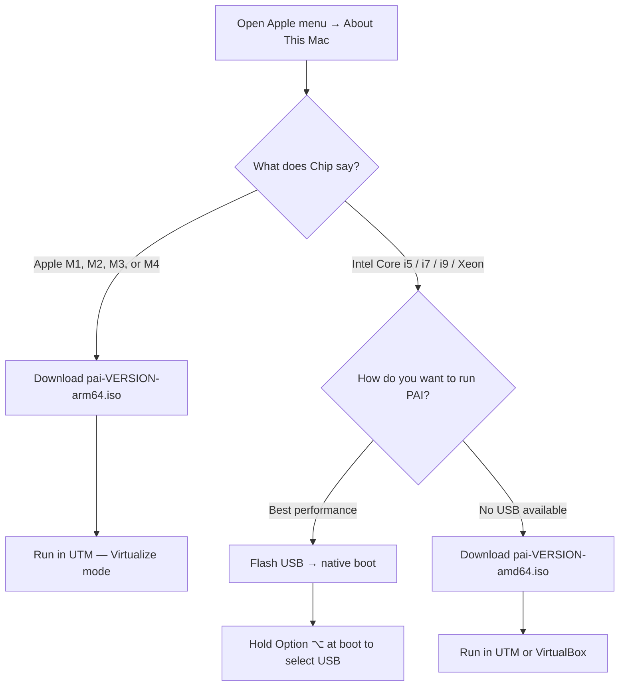

**PAI** runs on any Mac — Apple Silicon or Intel — using **UTM**, a free and open-source virtual machine app for macOS. Apple Silicon Macs (M1/M2/M3/M4) run the arm64 ISO at near-native speed inside UTM. Intel Macs can boot PAI natively from a USB drive or run it inside UTM or VirtualBox using the amd64 ISO. This guide walks you through every step, from choosing the right ISO to chatting with your first AI model.

In this guide:
- Identifying your Mac chip to pick the correct ISO
- Installing UTM and creating a PAI virtual machine
- Configuring the critical display settings that prevent a black screen
- Running PAI on Intel Macs — native boot and VM options
- Performance tuning and model size recommendations by chip

**Prerequisites**: a Mac running macOS 12 Monterey or later, and a downloaded PAI ISO (covered below). No prior Linux experience is required.

---

## Which PAI download do I need?

The ISO you download depends on your Mac's processor. To check which chip your Mac has, click the **Apple menu** () → **About This Mac** and look at the **Chip** or **Processor** field.



!!! tip

    Apple Silicon Macs virtualize arm64 Linux at near-native speed. The arm64 ISO is the recommended path for M-series Macs — do not use the amd64 ISO on Apple Silicon.


---

## How to run PAI on Apple Silicon vs Intel Mac

=== "Apple Silicon (M1/M2/M3/M4)"

## Apple Silicon: running PAI offline AI in UTM

**UTM** virtualizes the arm64 Linux kernel directly on Apple Silicon. CPU-bound tasks like Ollama model inference run at roughly 70–80% of native macOS Ollama speed, which is fast enough for productive use with 3B–8B parameter models.

### Install UTM on your Mac

Download UTM from [mac.getutm.app](https://mac.getutm.app). A free download is available directly from the site. The Mac App Store version is identical software and the purchase price is a voluntary donation to the UTM project.

!!! note

    UTM requires macOS 12 Monterey or later on Apple Silicon. If you are on an older macOS, update before continuing.


### Download and verify the arm64 ISO

1. Go to the PAI releases page and download `pai-<version>-arm64.iso`.
2. Verify the SHA256 checksum before continuing:

```bash
# Verify the downloaded ISO matches the published checksum
shasum -a 256 pai-<version>-arm64.iso
```

Expected output: a 64-character hex string that matches the `.sha256` file published alongside the ISO. If the checksums differ, re-download the ISO — do not boot a corrupted image.

### Tutorial: complete UTM setup from download to your first AI chat

**Goal**: create a UTM virtual machine running PAI and open a conversation with an AI model.

**What you need**:
- UTM installed (from above)
- `pai-<version>-arm64.iso` downloaded and verified
- At least 16 GB free disk space
- 10–15 minutes

1. **Launch UTM** and click **Create a New Virtual Machine**.

   
   *UTM's welcome screen. Click Create a New Virtual Machine to begin.*

2. **Select Virtualize** (not Emulate).

   Virtualize runs the arm64 kernel directly on your M-series chip. Emulate translates x86 instructions in software and is 5–10 times slower. Always choose Virtualize for PAI on Apple Silicon.

   
   *Choose Virtualize. Emulate is for running x86 software on Apple Silicon and is not needed here.*

3. **Select Linux** as the operating system.

4. **Set Boot ISO Image**: click Browse and select `pai-<version>-arm64.iso`.

5. **Set Memory to 8192 MB minimum** (8 GB). 16384 MB (16 GB) is recommended if your Mac has 16 GB or more of unified memory.

   !!! warning

       Do not allocate more than 60–70% of your Mac's total unified memory to the VM. macOS and UTM themselves need headroom. On a 16 GB Mac, set the VM to 10–12 GB at most.


6. **Set CPU Cores to 4 or more**. Leave "Force Multicore" unchecked — UTM handles scheduling automatically.

7. **Set Storage to 20 GB**. PAI is a live system, but Ollama writes downloaded model files to disk. 20 GB gives you room for two or three models.

8. **Shared Directory**: optional. You can add a Mac folder here to share files with the VM. Leave blank for now — it can be added later.

9. Click **Save**. The new VM appears in UTM's sidebar.

### Configure the display card — most important setting

After creating the VM, you must change the display adapter before booting. Skipping this step is the single most common cause of a black screen in PAI.

!!! warning

    **Before you click Play**: open the VM settings, navigate to **Devices → Display**, and set **Emulated Display Card** to `virtio-gpu-gl-pci (GPU Supported)`.

    If you boot with the wrong display setting, PAI's Sway/Wayland compositor fails to initialize and you see a black screen or cursor-only output.


1. In UTM's sidebar, right-click your PAI VM and select **Edit**.
2. Click **Devices** in the left column.
3. Select the **Display** device.
4. Change **Emulated Display Card** to `virtio-gpu-gl-pci (GPU Supported)`.

   
   *Set Emulated Display Card to virtio-gpu-gl-pci (GPU Supported). This enables hardware-accelerated rendering for Wayland.*

5. Click **Save**.

If after booting you still see a black screen, try switching to `virtio-gpu-pci` (without GL) as a fallback. Some UTM versions have a driver-level quirk that makes the GL variant unstable on certain macOS releases.

### Network settings

UTM's default **Shared Network** mode gives the VM internet access via NAT from your Mac. PAI works offline for AI inference — internet is only needed to pull new models.

If the VM has no internet connectivity, open **UTM → Edit VM → Network** and confirm **Network Mode** is set to **Shared Network**.

### Boot PAI and open your first chat

1. Click the **Play** button in UTM's toolbar.
2. The **GRUB boot menu** appears. Select **Start PAI** and press Enter (or wait for the timer).
3. PAI boots into the **Sway desktop** in about 20–30 seconds.
4. A **first-boot welcome dialog** opens automatically, along with **PAI UI** in Firefox.
5. Type a message in the chat box. Your first prompt triggers the model to load — expect a 10–30 second pause on first load while the model warms up.


*PAI running in UTM on Apple Silicon. The Sway desktop fills the VM window. PAI UI is open and ready for a conversation.*

**What just happened?** UTM started a virtual arm64 Linux machine from the ISO. PAI's live system booted into RAM. Ollama loaded the default model and is now serving inference requests to PAI UI, all on your local hardware — no internet involved.

**Next steps**: see [Choosing a Model](../ai/choosing-a-model.md) to switch to a larger model, or [First Boot Walkthrough](first-boot-walkthrough.md) for a tour of what's on the desktop.

### Known UTM quirks on Apple Silicon

| Quirk | Fix |
|---|---|
| Mouse pointer captured in VM | Press `Ctrl+Opt` (⌃⌥) to release the mouse |
| Clipboard not shared | Enable in UTM → Edit VM → Sharing → Clipboard Sharing |
| UI appears blurry on Retina display | Uncheck **Retina Mode** in UTM display settings |
| Sound not working | Requires UTM 4.5 or later with `virtio-sound` — update UTM |
| Black screen on boot | Change display card to `virtio-gpu-gl-pci` or fallback `virtio-gpu-pci` |

=== "Intel Mac"

## Intel Mac: native USB boot (recommended)

Native boot gives you full hardware performance — all CPU cores, all RAM, and no virtualization overhead. This is the best option for Intel Macs if you have a USB drive available.

### Prepare your USB drive

The Intel Mac uses the **amd64 ISO** (`pai-<version>-amd64.iso`). Flash it to a USB drive using `dd` or Balena Etcher. The full flashing instructions are in [Installing and Booting PAI](installing-and-booting.md).

To identify your USB drive on macOS:

```bash
# List all disks and identify your USB drive by size
diskutil list
```

Expected output (your drive letter will differ):

```
/dev/disk2 (external, physical):
   #:                       TYPE NAME                    SIZE       IDENTIFIER
   0:     FDisk_partition_scheme                        *32.0 GB    disk2
```

!!! danger

    Flashing overwrites everything on the USB drive. Confirm the disk identifier carefully before running the flash command. Flashing to the wrong disk will destroy data on that disk.


### Enable booting from USB on an Intel Mac

Intel Macs with a T2 security chip (most 2018–2020 models) restrict boot sources by default. You need to allow external boot once:

1. Shut down your Mac completely.
2. Hold **Cmd+R** (⌘R) while pressing the power button to boot into **macOS Recovery**.
3. In Recovery, open **Utilities → Startup Security Utility**.
4. Under **Allowed Boot Media**, select **Allow booting from external or removable media**.
5. Optionally, set **Secure Boot** to **No Security** (required if PAI's kernel isn't signed for your T2).
6. Restart.

!!! note

    Macs without a T2 chip (pre-2018 Intel models) do not need this step. You can boot from USB immediately.


### Boot from the PAI USB drive

1. Insert the flashed USB drive.
2. Press the power button and immediately hold **Option (⌥)**.
3. The **Mac startup disk picker** appears. Select the PAI USB drive (labeled "EFI Boot" or "PAI").
4. GRUB loads → select **Start PAI** → Sway desktop loads.


*Hold Option at boot to see the startup disk picker. Select the PAI USB drive.*

## Intel Mac: run PAI in a VM

If you prefer not to reboot your Mac, or don't have a spare USB drive, you can run PAI in UTM or VirtualBox on Intel.

### UTM on Intel Mac

UTM works on Intel Macs. The setup is the same as the Apple Silicon section above, with these differences:

- Download the **amd64 ISO** (`pai-<version>-amd64.iso`)
- In the UTM new VM wizard, select **Virtualize** → **Linux**
- Display card: `virtio-gpu-gl-pci` still applies — same setting, same reason
- RAM: 8 GB minimum, 12 GB recommended on Intel

### VirtualBox on Intel Mac

**VirtualBox** is a free alternative from Oracle. Use VirtualBox 7.x:

- Download the amd64 ISO
- New VM → Linux → Debian 12 (64-bit)
- Memory: 8192 MB minimum
- Graphics: **VBoxVGA**, 128 MB video memory
- Storage: 20 GB virtual disk
- Network: NAT (default)

!!! note

    VirtualBox does not support Apple Silicon. It runs only on Intel Macs. If you have an M-series Mac, use UTM.


---

## Performance table: which Mac can run which model sizes?

Model speed inside a VM depends on RAM allocation, CPU cores, and whether Apple Silicon's unified memory bus is in use. These are practical estimates for interactive use (tokens per second fast enough for a real-time conversation).

| Mac chip | VM RAM | Recommended model | Expected speed | Notes |
|---|---|---|---|---|
| M1 (8 GB total) | 6 GB | llama3.2:1b | 20–30 tok/s | Tight — close other apps |
| M1 (16 GB total) | 10 GB | llama3.2:3b | 15–25 tok/s | Good daily-driver config |
| M2 / M3 (16 GB) | 12 GB | llama3.2:3b or mistral:7b | 15–30 tok/s | 7B models usable |
| M2 Pro / M3 Pro (18–36 GB) | 16 GB | mistral:7b or llama3:8b | 20–35 tok/s | Comfortable 7B experience |
| M2 Max / M3 Max / M4 Pro (32–64 GB) | 24 GB | llama3:8b or codellama:13b | 25–40 tok/s | 13B models become viable |
| Intel Core i5/i7 (16 GB) — VM | 8 GB | llama3.2:1b | 5–12 tok/s | CPU only; stay on 1–3B |
| Intel Core i5/i7 (16 GB) — native | all 16 GB | llama3.2:3b | 10–18 tok/s | Native boot > VM on Intel |

!!! tip

    Ollama on CPU uses all cores. Allocating 4+ virtual CPU cores to the VM significantly improves throughput on larger models. Check UTM's CPU core setting if inference feels slow.


!!! note

    GPU acceleration (Apple Metal) is not available inside a UTM virtual machine. Ollama runs on CPU only in the VM. For GPU-accelerated inference, you would need native macOS Ollama — but that means the model runs outside PAI's privacy boundary.


---

## How to run AI locally without internet on a Mac

Once PAI is booted in UTM, all AI inference is entirely local. No internet connection is required or used for model inference. Your prompts never leave your machine — Ollama receives them over the local loopback interface and returns completions without any network call.

To confirm there are no outbound connections during inference, you can run:

```bash
# Inside PAI terminal — show active network connections while running a prompt
ss -tp | grep ollama
```

The output shows only loopback connections (`127.0.0.1`) — no external IPs.

---

## Troubleshooting UTM and PAI on Mac

### Black screen after boot

**Cause**: incorrect display card setting.

**Fix**: power off the VM, open Edit VM → Devices → Display, and set Emulated Display Card to `virtio-gpu-gl-pci (GPU Supported)`. If that doesn't resolve it, try `virtio-gpu-pci` (without GL).

### "Operating system not found" on boot

**Cause**: UTM is not booting from the ISO — it may be trying to boot from the empty virtual disk.

**Fix**: open Edit VM → Drives. Confirm the ISO file is listed as a CD/DVD drive. If it shows as a disk image, remove it and re-add it as a CD/DVD device.

### Sway loads but cursor is a cross or display is garbled

**Cause**: wrong display card (often `ramfb` or `virtio-ramfb` instead of `virtio-gpu-gl-pci`).

**Fix**: same as black screen fix above.

### PAI is very sluggish / model inference extremely slow

Possible causes:

- **Too little RAM**: increase VM RAM to at least 8 GB.
- **Too few cores**: set CPU cores to 4 or more in UTM settings.
- **Model too large**: on M1 8 GB Macs, stick to `llama3.2:1b`. Run `ollama list` inside PAI to see installed models.
- **Mac under memory pressure**: close other macOS apps before booting the VM.

### Intel Mac won't boot from USB (shows "No bootable device")

- Confirm you flashed the ISO in DD mode, not ISO mode — the graphical Rufus tool on Windows defaults to ISO mode for UEFI, which doesn't work for PAI. (PAI's `flash.ps1` always writes in raw/DD mode.)
- On a T2 Mac, confirm you enabled external boot in Startup Security Utility (see the Intel section above).
- Try a different USB port (use USB-A if you have a USB-C-only hub — some hubs don't expose the drive to UEFI).

### Clipboard doesn't work between Mac and PAI

Enable clipboard sharing in UTM: Edit VM → Sharing → check **Share Clipboard**.

---

## Frequently asked questions

### Can PAI run natively on a Mac?

PAI is a Linux operating system — it cannot run natively on macOS. On Apple Silicon, Apple's Secure Boot architecture prevents booting arbitrary Linux on the bare hardware without disabling platform security features. UTM virtualization is the supported and recommended approach. On Intel Macs, native USB boot works because Intel Macs use standard UEFI firmware.

### Do I need to pay for UTM?

No. UTM is free and open-source software. You can download it at no cost from [mac.getutm.app](https://mac.getutm.app). The Mac App Store listing charges a small fee, but that is an optional donation — the software is identical to the free download.

### Which ISO do I need for an M1 Mac?

Download `pai-<version>-arm64.iso`. M1, M2, M3, and M4 chips are all arm64 processors. Do not use the amd64 ISO on any Apple Silicon Mac — the amd64 ISO is compiled for Intel x86_64 and will not run on M-series hardware.

### Why is PAI slow in UTM on my Mac?

The most common reasons are insufficient RAM allocation (set at least 8 GB), too few CPU cores (set at least 4), or a model that is too large for your hardware. On M1 Macs with 8 GB total unified memory, use `llama3.2:1b` — larger models will cause the VM to page swap and become very slow. See the [performance table](#performance-table-which-mac-can-run-which-model-sizes) above.

### Can I use my Mac's GPU inside UTM?

Not for AI inference. UTM does not pass through Apple Metal or any GPU compute capability to the virtual machine. Ollama in PAI runs exclusively on CPU inside the VM. The `virtio-gpu-gl-pci` display card provides 2D graphics acceleration for the Wayland compositor — it does not expose GPU compute to Ollama. For Metal-accelerated inference, you would need to run Ollama directly on macOS, outside PAI.

### How much RAM should I give the PAI VM?

A practical formula: take your Mac's total unified memory, subtract 4 GB for macOS and UTM overhead, and allocate the rest to the VM up to 16 GB. On a 16 GB Mac, allocate 10–12 GB. On an 8 GB Mac, allocate 6 GB and use only 1B parameter models. On a 32 GB Mac, 16–20 GB gives you comfortable 7B–13B model performance.

### Does PAI work on an Intel Mac?

Yes. Intel Macs can run PAI two ways: native USB boot (best performance — all RAM and CPU available to PAI) or inside UTM or VirtualBox using the amd64 ISO. T2-chip Intel Macs (2018–2020 models) need a one-time Startup Security Utility change to allow USB boot. See the [Intel Mac section](#intel-mac-native-usb-boot-recommended) for step-by-step instructions.

### Is my data deleted when I close the UTM VM?

Yes, by default. PAI runs entirely in RAM. When you power off the VM, everything — conversations, browser history, downloaded files — is erased from the VM's memory. Only the Ollama model files stored on the virtual disk persist between sessions (because they are written to the 20 GB virtual disk, not RAM). To persist your home directory and settings across sessions, see [PAI Persistence](../persistence/introduction.md).

### What is the best local LLM for 8 GB RAM on a Mac?

`llama3.2:1b` is the best starting point on a constrained Mac. It fits entirely in 6 GB of VM RAM and responds fast enough for real-time conversation. If you have 10+ GB to give the VM, `llama3.2:3b` provides noticeably better reasoning at 1–3 tokens per second slower. Run `ollama pull llama3.2:3b` inside PAI to download it. See [Choosing a Model](../ai/choosing-a-model.md) for a full comparison.

### How do I get back to my Mac from inside the UTM VM?

Press `Ctrl+Opt` (⌃⌥) to release the mouse cursor from the VM window. You can then click on any macOS window normally. To re-enter the VM, click inside the UTM window.

---

## Related documentation

- [**Installing and Booting PAI**](installing-and-booting.md) — Full USB flashing instructions for Linux, macOS, and Windows
- [**First Boot Walkthrough**](first-boot-walkthrough.md) — What to expect on your first PAI session: the welcome dialog, PAI UI, and desktop layout
- [**Choosing a Model**](../ai/choosing-a-model.md) — How to pick the right Ollama model for your hardware and use case
- [**PAI Persistence**](../persistence/introduction.md) — How to keep your data between sessions with an encrypted persistence container
- [**Privacy Mode**](../privacy/privacy-mode-tor.md) — How to route all traffic through Tor for maximum privacy
