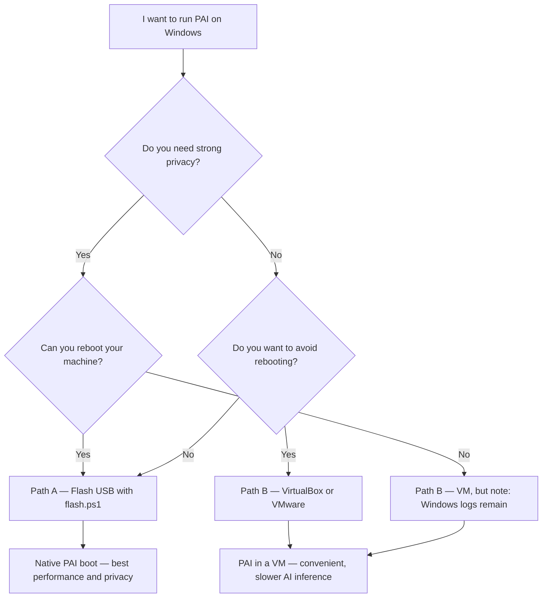

!!! tip "Just want a USB?"

    Skip the VM and run the PowerShell one-liner in an **elevated** PowerShell window:

    ```powershell
    irm https://pai.direct/flash.ps1 | iex
    ```

    See [Installing and Booting PAI](installing-and-booting.md) for the full walkthrough, prerequisites, and a verify-before-run flow.


PAI is a bootable Linux operating system that runs **local AI models entirely offline** — no cloud, no account, no data leaving your machine. On Windows, you have two ways to run it: flash a USB drive (one PowerShell command with `flash.ps1`, or Rufus as a graphical alternative) and boot PAI natively (best for privacy and performance), or load the PAI ISO into a virtual machine without rebooting (fastest way to try it). This guide walks through both paths, helps you choose the right one, and gets you to your first AI response.

In this guide:
- Choosing between a native USB boot and a virtual machine
- Flashing a PAI USB drive on Windows with the `flash.ps1` PowerShell one-liner (or Rufus as a graphical alternative)
- Setting up PAI in VirtualBox, VMware Workstation Player, and Hyper-V
- Disabling Secure Boot and configuring BIOS/UEFI for USB boot
- End-to-end VirtualBox tutorial from download to first AI response
- Troubleshooting the most common Windows setup failures

**Prerequisites**: A Windows 10 or Windows 11 machine with at least 8 GB of RAM, a PAI ISO downloaded from the [release page](../index.md), and an internet connection for the initial download only. No Linux experience required.

---

## Flash USB or use a VM — which should you choose?



### Comparison: which setup method fits your needs?

| Dimension | Native USB (flash.ps1 or graphical Rufus) | VirtualBox | VMware Player | Hyper-V |
|---|---|---|---|---|
| **Privacy** | Best — host OS sees nothing | Windows retains VM logs | Windows retains VM logs | Windows retains VM logs |
| **AI performance** | Full hardware speed | Slower — CPU only, no GPU passthrough by default | Slower — CPU only | Slower — CPU only |
| **Setup complexity** | Medium (BIOS change needed) | Low | Low | Medium (Pro/Enterprise only) |
| **Cost** | Free | Free | Free for personal use | Included with Windows Pro |
| **GPU support** | Full (native drivers) | No (software rendering) | Limited (no Ollama GPU) | No |
| **Recommended for** | Privacy work, daily use | Testing, evaluation | Testing, evaluation | Enterprise users |

**[Recommended]** **For real privacy work**: flash a USB (Path A). PAI boots from the USB, uses RAM only, and leaves no trace on the Windows machine after shutdown.

**[Easiest]** **For a quick test**: use VirtualBox (Path B). No BIOS changes, no rebooting, up in five minutes.

---

## Path A — Flash a USB drive (native boot)

**[~10 minutes]**

Writing the PAI ISO directly to a USB drive produces a native boot environment with full CPU and GPU access, complete RAM isolation, and no footprint on the Windows host. The recommended way to do this on Windows is the PowerShell one-liner `flash.ps1`; a graphical alternative using Rufus is documented below as a fallback.

### What you need for a PAI USB on Windows

- Windows 10 (build 17763) or Windows 11
- A USB drive with 16 GB or more of storage (the drive will be fully overwritten)
- Administrator rights on the Windows machine
- An internet connection for the initial download

### Disable Secure Boot before flashing

PAI does not include signed UEFI boot shims in early releases. You must disable Secure Boot in your BIOS/UEFI firmware before the USB will boot. Enter firmware setup at startup (the key varies by vendor — common keys are Del, F2, F10, or F12 during the POST screen) and change these settings:

- **Secure Boot**: Disabled
- **Fast Boot**: Disabled (prevents the firmware from skipping USB detection)
- **Boot order**: move USB / Removable Media above the internal drive

Save and exit. You can re-enable Secure Boot after you are done using PAI.

!!! warning

    Write down your original BIOS settings before changing them. On some enterprise laptops, Secure Boot is enforced by policy and cannot be disabled without a supervisor password. Contact your IT department if the option is grayed out.


### Flash PAI with the PowerShell one-liner (recommended)

Open **PowerShell as Administrator** — right-click Start, choose *Windows PowerShell (Admin)* or *Terminal (Admin)* — and run:

```powershell
irm https://pai.direct/flash.ps1 | iex
```

The script walks you through:

1. Fetching the latest release metadata from GitHub
2. Downloading `pai-<version>-amd64.iso` with a progress bar
3. Verifying its SHA256 against the published sidecar
4. Showing every removable USB drive it sees and asking you to pick one
5. Writing the ISO raw to the selected drive
6. Re-reading the partition table so Windows sees the new labels

The whole flow takes three to seven minutes on a USB 3.0 drive. When it prints a green "Flash complete" banner you can safely remove the USB and reboot.

If you want to read the script before running it, see [Installing and Booting PAI → Verify before run (advanced)](installing-and-booting.md#how-to-flash-the-pai-iso-to-a-usb-drive) for the SHA256-pin flow.

### Flash PAI with Rufus (graphical alternative)

Rufus is a free, portable graphical tool. Use it when you want a GUI or when `flash.ps1` can't run in your environment.


1. Download the **Rufus** graphical tool from [rufus.ie](https://rufus.ie). The portable version (no install) works fine. Run it as Administrator.

2. Insert your USB drive. The Rufus graphical tool detects it automatically in the **Device** dropdown. Confirm it shows the correct drive before proceeding — the Rufus graphical tool will erase everything on it.

3. Under **Boot selection**, click **SELECT** and browse to your `pai-<version>-amd64.iso` file.

4. Set **Partition scheme** to MBR for older BIOS systems, or GPT for modern UEFI-only systems. If you are unsure, choose MBR — it works on both.

5. Leave **File system** and **Cluster size** at their defaults.

6. Click **START**.

7. The Rufus graphical tool will ask which write mode to use. **Choose "Write in DD Image mode"** and click OK.

   !!! danger

       You must select **DD Image mode** — not ISO Image mode. ISO mode creates a partially-written drive that looks complete in Windows but will not boot. This is the single most common reason a PAI USB fails to boot. If your USB was already flashed in ISO mode, reflash it in DD mode — there is no fix short of reflashing.


8. Click **OK** through the warning that the drive will be erased. The Rufus graphical tool writes the image — this takes three to seven minutes depending on your USB speed.

9. When the status bar shows **READY**, close the Rufus graphical tool. Do not eject the USB yet.


### Boot PAI from the USB

With the USB still inserted, restart Windows. As the machine starts up, press the boot menu key (commonly F11, F12, or Esc — check the vendor table in [Installing and Booting PAI](installing-and-booting.md) for a full list). Select the USB entry from the boot menu. PAI loads into RAM and the Sway desktop appears within about 30 seconds.

!!! tip

    If the USB entry does not appear in the boot menu, Secure Boot may still be enabled, or Fast Boot is preventing USB detection. Re-enter firmware setup and confirm both are disabled.


---

## Path B — Run PAI in a virtual machine

**[~5 minutes]**

A virtual machine runs PAI inside Windows without rebooting. This is the fastest way to evaluate PAI, run it alongside your normal workflow, or develop and test against its APIs. AI responses are slower than native because Ollama uses the CPU instead of a GPU, but for testing on `llama3.2:1b` or `gemma3:1b` the experience is usable.

=== "VirtualBox"

**VirtualBox** is free, open source, and runs on any edition of Windows 10/11. It is the most widely tested VM for PAI.

**Requirements**: VirtualBox 7.0 or later. If you have Hyper-V or WSL2 enabled, see the troubleshooting section — they conflict with VirtualBox's hardware virtualization.


1. Download and install **VirtualBox** from [virtualbox.org](https://virtualbox.org). Accept the default options.

2. Open VirtualBox Manager and click **New**.

3. Set:
   - **Name**: PAI
   - **Type**: Linux
   - **Version**: Debian (64-bit)
   - Click **Next**.

4. Set **Memory size** to at least **8192 MB** (8 GB). For better performance with larger models, use 12288 MB or more. Click **Next**.

5. Select **Create a virtual hard disk now**, click **Create**. Choose **VDI** and **Dynamically allocated**, set size to **20 GB**, click **Create**.

6. With the new VM selected, click **Settings**.

7. Under **Storage**: click the empty CD/DVD icon under "Controller: IDE", then click the disc icon on the right and choose **Choose a disk file**. Browse to your `pai-<version>-amd64.iso`.

8. Under **System → Processor**: set **Processors** to 4 or more.

9. Under **Display**: set **Graphics Controller** to **VBoxSVGA**, **Video Memory** to **128 MB**, and enable **3D Acceleration**.

10. Under **Network**: leave the default **NAT** adapter — this gives PAI internet access through Windows if needed for the initial model pull.

11. Click **OK**, then click **Start**. PAI boots and the Sway desktop appears.


!!! tip

    The VirtualBox Guest Additions do not need to be installed for PAI to work. The desktop, clipboard, and shared folders are not needed for AI use.


=== "VMware Player"

**VMware Workstation Player** is free for personal use and often performs slightly better than VirtualBox on Windows hosts due to tighter hypervisor integration.


1. Download **VMware Workstation Player** from [vmware.com](https://www.vmware.com/products/workstation-player.html). Install with default options. A free personal-use license is applied automatically.

2. Open VMware Player and click **Create a New Virtual Machine**.

3. Select **Installer disc image file (iso)**: browse to your `pai-<version>-amd64.iso`. Click **Next**.

4. Select **Linux** and **Debian 12.x 64-bit**. Click **Next**.

5. Name the VM **PAI** and choose a storage location. Click **Next**.

6. Set **Maximum disk size** to **20 GB** and choose **Store virtual disk as a single file**. Click **Next**.

7. Click **Customize Hardware**:
   - **Memory**: 8192 MB minimum
   - **Processors**: 4 cores, 1 processor
   - **Display**: leave defaults (VMware handles graphics automatically)
   Click **Close**, then **Finish**.

8. Click **Play virtual machine**. PAI boots within 30 seconds.


!!! note

    VMware may prompt you to install VMware Tools. You can skip this for PAI — the tools are designed for persistent OS installs and add no value to a RAM-only session.


=== "Hyper-V"

**Hyper-V** is Microsoft's built-in hypervisor, available on Windows 10/11 Pro, Enterprise, and Education. It is not available on Windows Home.

!!! warning

    Hyper-V and VirtualBox cannot run simultaneously on the same machine. If you enable Hyper-V, VirtualBox will stop working. Choose one or the other.


1. Enable Hyper-V: open **Windows Features** (search "Turn Windows features on or off"), check **Hyper-V**, click **OK**, and restart.

2. Open **Hyper-V Manager** from the Start menu.

3. In the right panel, click **New → Virtual Machine**. Click **Next**.

4. Name the VM **PAI**. Click **Next**.

5. Select **Generation 2**. Click **Next**.

6. Set **Startup Memory** to **8192 MB**. Uncheck **Use Dynamic Memory**. Click **Next**.

7. Leave **Connection** as **Default Switch** (gives internet access through Windows). Click **Next**.

8. Select **Create a virtual hard disk**, set size to **20 GB**. Click **Next**.

9. Select **Install an operating system from a bootable image file** and browse to your `pai-<version>-amd64.iso`. Click **Next**, then **Finish**.

10. Before starting the VM, right-click it and choose **Settings**. Under **Security**, uncheck **Enable Secure Boot** — this is required for PAI to boot.

11. Under **Integration Services**, uncheck **Guest services** (not needed for a RAM session).

12. Click **OK**. Right-click the VM and choose **Connect**, then click **Start**. PAI boots in the Hyper-V window.


!!! tip

    Use **Basic Session** rather than Enhanced Session for PAI. Enhanced Session redirects your Windows audio and clipboard, which adds complexity with no benefit for AI use.


---

## Tutorial: VirtualBox end-to-end — download to first AI response

This tutorial takes you from a fresh Windows machine to running an AI conversation in PAI using VirtualBox. Expect about 15 minutes including the model download.

**Goal**: Boot PAI in VirtualBox and get a response from a local AI model.

**What you need**:
- Windows 10 or 11 (any edition)
- 8 GB RAM available (close other heavy applications)
- 4 GB of free disk space minimum (the PAI ISO is ~3 GB)
- An internet connection (for the initial Ollama model pull only)
- The PAI ISO downloaded from the release page


1. **Install VirtualBox.** Download the Windows installer from [virtualbox.org](https://virtualbox.org). Run it and accept all defaults. Restart if prompted.

   Expected result: VirtualBox Manager opens and shows an empty VM list.

2. **Create a new VM.** Click **New**. Name it **PAI**, set Type to **Linux**, Version to **Debian (64-bit)**. Click **Next**.

3. **Allocate memory.** Set memory to **8192 MB**. If your machine has 16 GB or more, use 12288 MB for noticeably faster model responses. Click **Next**.

4. **Create a virtual disk.** Select **Create a virtual hard disk now**, click **Create**. Choose **VDI**, **Dynamically allocated**, **20 GB**. Click **Create**.

5. **Attach the PAI ISO.** Select the new PAI VM in the list and click **Settings → Storage**. Click the empty disc icon under **Controller: IDE**. Click the small disc icon on the right side of the **Optical Drive** row and choose **Choose a disk file**. Navigate to your downloaded `pai-<version>-amd64.iso` and click **Open**. Click **OK**.

6. **Configure processors and display.** Back in Settings: under **System → Processor**, set Processors to **4**. Under **Display**, set Video Memory to **128 MB** and Graphics Controller to **VBoxSVGA**. Click **OK**.

7. **Start the VM.** Click **Start**. A VirtualBox window opens and PAI boots. The Sway desktop appears in about 30 seconds.

   Expected result: A dark desktop with a status bar at the bottom. You may see a first-boot model picker dialog.

8. **Open a terminal.** Press `Super+Return` (Windows key + Enter) to open a terminal. Verify Ollama is running:

   ```bash
   ollama list
   ```

   Expected output (models already included in the ISO):
   ```
   NAME               ID              SIZE      MODIFIED
   llama3.2:1b        a2af6cc6c18c    1.3 GB    2 minutes ago
   ```

   If the list is empty, pull a model:

   ```bash
   ollama pull llama3.2:1b
   ```

9. **Open the AI chat interface.** Open Firefox from the app launcher (or press `Super+W`). Navigate to `http://localhost:8080`. Open WebUI loads.

   Expected result: The Open WebUI login page. Create an account with any username and password — this is local only.

10. **Send your first message.** Select **llama3.2:1b** from the model dropdown and type a message. Within 10–30 seconds (longer on first load), the model responds.

   Expected result: A text response generated entirely on your Windows machine, with no internet traffic.


**What just happened?** VirtualBox ran PAI as a guest operating system inside Windows. Ollama served `llama3.2:1b` locally, and Open WebUI provided the chat interface over localhost. All inference happened on your CPU inside the VM — no data left your machine.

**Next steps**: See [Choosing a Model](../ai/choosing-a-model.md) for guidance on which models work well on CPU-only setups, and [First Boot Walkthrough](first-boot-walkthrough.md) for an overview of the full PAI environment.

---

## Troubleshooting common Windows setup problems

### "No bootable device" after flashing the USB

If you used the graphical Rufus alternative, it was likely run in **ISO Image mode** instead of **DD Image mode**. Reflash the USB: either run the PowerShell one-liner (`irm https://pai.direct/flash.ps1 | iex`), which always writes in raw/DD mode, or reopen the Rufus graphical tool, select the ISO, click **Start**, and this time choose **Write in DD Image mode** when prompted. Do not click "Write in ISO Image mode" even if Rufus recommends it for this ISO.

### VirtualBox error: "VT-x is not available"

Hardware virtualization is consumed by Hyper-V or WSL2. Open **Windows Features**, uncheck **Hyper-V** and **Virtual Machine Platform** (which backs WSL2), and restart. VirtualBox requires exclusive access to VT-x/AMD-V on most Intel and AMD CPUs.

!!! warning

    Disabling Hyper-V also disables WSL2 and Windows Sandbox. If you rely on WSL2, use VMware Workstation Player instead — it can coexist with Hyper-V on Windows 11.


### VM shows a black screen after boot

Increase **Video Memory** to 128 MB in VM Settings → Display. If the screen is black with a cursor, the display driver may have failed to initialize — try switching the Graphics Controller to **VBoxSVGA** or **VMSVGA** and restarting the VM.

### AI responses are very slow in the VM

CPU-only inference is inherently slower than GPU inference. On a mid-range laptop, `llama3.2:1b` produces responses in 10–30 seconds per reply in a VM. To improve speed:

- Allocate more CPU cores to the VM (Settings → System → Processor)
- Use `llama3.2:1b` instead of larger models
- Close other applications to free memory for the VM
- Consider flashing a USB for native boot with GPU access — see [Path A](#path-a-flash-a-usb-drive-native-boot)

### USB is not detected at boot

Fast Boot in the BIOS prevents the firmware from scanning USB devices. Re-enter BIOS setup and disable both **Fast Boot** and **Secure Boot**. Also confirm the USB is connected before the machine powers on, not after POST starts.

---

## Frequently asked questions

### Do I need to disable Secure Boot to use PAI?

Yes, for native USB boot. PAI does not yet ship with signed UEFI shims, so standard Secure Boot will block the bootloader. Enter your BIOS/UEFI setup at startup (Del, F2, or F10 on most systems) and disable Secure Boot. Virtual machines (VirtualBox, VMware) do not use the host Secure Boot setting — the Hyper-V VM has its own Secure Boot setting that must also be disabled.

### Which PAI ISO should I download for Windows?

Download the `pai-<version>-amd64.iso` file. PAI uses the standard x86-64 architecture that all Intel and AMD Windows PCs run. The ARM64 ISO is for Apple Silicon and Raspberry Pi hardware. Windows on ARM (Surface Pro X, Snapdragon-based laptops) is not officially supported yet.

### VirtualBox vs VMware — which is better for PAI?

Both work well. VirtualBox is fully open source and has slightly better documentation for Linux guests. VMware Workstation Player often delivers 10–20% better CPU throughput in benchmarks, which matters for AI inference. If you already have WSL2 or Hyper-V enabled, VMware Player coexists with them on Windows 11 without requiring changes — VirtualBox does not.

### Can I run PAI in WSL2?

No. WSL2 is a Linux compatibility layer, not a full system emulator. PAI is a complete bootable operating system that requires a full virtualization layer (VirtualBox, VMware, or Hyper-V) or native hardware boot. WSL2 cannot boot an ISO or run Sway, Ollama, or the full PAI stack.

### Will PAI affect my Windows installation or files?

When run in a VM, PAI has no access to your Windows files unless you explicitly set up shared folders. When booted natively from a USB, PAI uses RAM only and cannot mount NTFS volumes by default — your Windows partition is not touched. After shutdown, nothing persists unless you have configured [PAI's optional persistence layer](../persistence/introduction.md).

### How do I exit the VM and return to Windows?

In VirtualBox, press the **Right Ctrl** key to release mouse and keyboard capture, then close the VM window. Choose **Power off the machine** for a clean shutdown. In VMware, press **Ctrl+Alt** to release the mouse, then click the X to close the window and choose **Power Off**. In Hyper-V, close the connection window and choose **Turn Off** in Hyper-V Manager.

### PAI is very slow in VirtualBox — why?

VirtualBox uses software-emulated graphics and CPU-only Ollama inference. There is no GPU passthrough by default, so every AI token is computed on your CPU through the hypervisor. This is expected behavior. To check: open a terminal in PAI and run `ollama ps` — the **Processor** column should show `cpu`. For better performance, use [Path A](#path-a-flash-a-usb-drive-native-boot) (native USB boot), which gives Ollama direct GPU access and typically produces 5–10x faster inference.

### How do I copy text between PAI in a VM and Windows?

In VirtualBox, enable the **Shared Clipboard** (Devices → Shared Clipboard → Bidirectional) after starting the VM. In VMware Player, clipboard sharing is enabled by default once VMware Tools would be installed — but since PAI is a read-only session, clipboard bridging may be limited. The most reliable method is to copy text via a file in a shared folder or over a local SSH session.

---

## Related documentation

- [**Installing and Booting PAI**](installing-and-booting.md) — Full vendor BIOS key table, Secure Boot details, and USB flashing for macOS and Linux
- [**First Boot Walkthrough**](first-boot-walkthrough.md) — What to expect on your first PAI session, including the model picker and desktop overview
- [**Choosing a Model**](../ai/choosing-a-model.md) — Which Ollama models run well on CPU-only setups and how to match model size to RAM
- [**Running PAI in a VM**](../advanced/running-in-a-vm.md) — Advanced VM configuration including network bridges, shared folders, and GPU passthrough
- [**PAI Persistence Layer**](../persistence/introduction.md) — How to set up encrypted persistent storage so your data survives reboots
