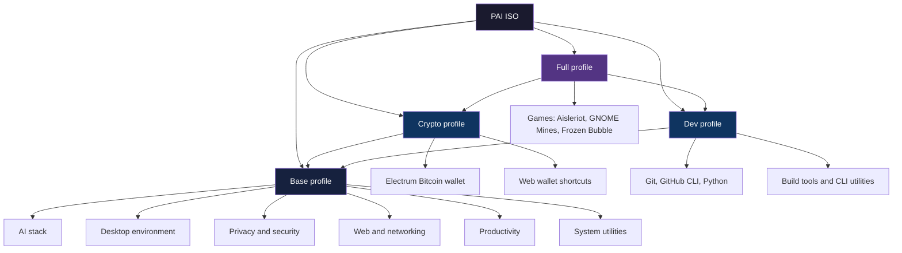

PAI ships as a complete, self-contained Linux environment — every tool listed on this page is available the moment you boot from USB, with no internet connection required. The software selection is intentional: AI inference, privacy protection, and everyday productivity are all covered out of the box, while optional categories like cryptocurrency wallets and developer tools activate based on your chosen [edition](../editions.md).

In this guide:
- The full app catalog organized by category with launch methods
- How PAI's profile system determines which apps are available
- Keyboard shortcuts for every major application
- A quick-start tutorial to explore 5 apps in your first 5 minutes
- Answers to common questions about PAI's software selection

**Prerequisites**: PAI booted and running. No technical experience needed — this page is also useful for evaluating PAI before you boot it.

## App category summary

| Category | Apps included | Profile |
|---|---|---|
| AI stack | 3 | All profiles |
| Desktop environment | 8 | All profiles |
| Web and networking | 4 | All profiles |
| File management and productivity | 9 | All profiles |
| Privacy and security | 8 | All profiles |
| Audio and video | 5 | All profiles |
| System utilities | 7 | All profiles |
| Cryptocurrency | 2 | Crypto profile |
| Development tools | 11 | Dev profile |
| Games | 3 | Full profile |

---

## How PAI profiles determine what's installed

PAI is built in multiple editions. The **base** profile includes the AI stack, desktop, privacy tools, and everyday productivity apps. The **Crypto** profile adds Bitcoin and web wallet support. The **Dev** profile adds a complete development toolchain. The **Full** profile includes all of the above plus games.



!!! note

    The edition you downloaded determines your app set. Run `cat /etc/pai-edition` at the terminal to see which edition is running.


---

## AI stack

The AI stack is the core of PAI. All three components run entirely offline — your prompts never leave your hardware.

```
┌─────────────────────────────────────────────────────┐
│                  Your Hardware                       │
│                                                     │
│  ┌─────────────┐    ┌──────────────┐               │
│  │    Ollama   │◄───│  Open WebUI  │◄──── Firefox  │
│  │  :11434     │    │  :8080       │               │
│  └─────────────┘    └──────────────┘               │
│        │                                            │
│  ┌─────▼─────┐                                     │
│  │  llama3.2 │  ← stays on your machine            │
│  │  :1b      │    never leaves                     │
│  └───────────┘                                     │
└─────────────────────────────────────────────────────┘
```

### Ollama **[Offline ready]**

**Ollama** is the local LLM runtime that powers all AI features on PAI. It runs large language models entirely on your CPU or GPU, exposes a REST API at `localhost:11434`, and ships with `llama3.2:1b` pre-pulled so you can start chatting immediately.

- **Launch**: Ollama starts automatically at boot; no action needed
- **Terminal access**: `ollama list`, `ollama run llama3.2:1b`
- **Upstream**: [ollama.com](https://ollama.com)

See [Managing Ollama Models](../models.md) for pulling and switching models.

### Open WebUI **[Offline ready]**

**Open WebUI** is the PAI-branded chat interface — a polished, browser-based frontend for Ollama. It runs at `localhost:8080` and opens automatically in Firefox on first boot.

- **Launch**: Open Firefox and navigate to `localhost:8080`, or press `Super+W`
- **Features**: conversation history, model switching, system prompt editor, file uploads
- **Upstream**: [openwebui.com](https://openwebui.com)

### pai-models script **[Offline ready]**

`pai-models` is a PAI-specific shell script for managing Ollama models from the command line. It wraps `ollama` with a cleaner interface for listing, pulling, and removing models.

- **Launch**: Open a terminal and run `pai-models`
- **Commands**: `pai-models list`, `pai-models pull <name>`, `pai-models remove <name>`

---

## Desktop environment

PAI uses **Sway**, a Wayland tiling window manager, as its desktop environment. The combination is lightweight, fast, and works without a GPU.

### Sway **[Offline ready]**

**Sway** is a Wayland compositor and tiling window manager. Windows are arranged automatically in a grid — no mouse required. It is compatible with i3 keybindings and configuration.

- **Launch**: Starts automatically at boot
- **Key bindings**: `Super+Enter` (new terminal), `Super+Q` (close window), `Super+[1-9]` (switch workspace)
- **Upstream**: [swaywm.org](https://swaywm.org)

See [Desktop Basics](../getting-started.md) for the full keybinding reference.

### Waybar **[Offline ready]**

**Waybar** is the status bar at the bottom of the PAI desktop. It shows the app launcher, clock, Ollama model status, and (in the Crypto edition) a live crypto ticker.

- **Launch**: Starts automatically with Sway
- **Upstream**: [github.com/Alexays/Waybar](https://github.com/Alexays/Waybar)

### Wofi **[Offline ready]**

**Wofi** is the application launcher and menu renderer. Press `Super+D` to open it, type a few letters of an app name, and press Enter to launch.

- **Launch**: `Super+D` or click the launcher icon in Waybar
- **Upstream**: [hg.sr.ht/~scoopta/wofi](https://hg.sr.ht/~scoopta/wofi)

### Foot **[Offline ready]**

**Foot** is the default terminal emulator — fast, GPU-accelerated under Wayland, and minimal.

- **Launch**: `Super+Enter`
- **Upstream**: [codeberg.org/dnkl/foot](https://codeberg.org/dnkl/foot)

### Mako **[Offline ready]**

**Mako** is the desktop notification daemon. It displays brief pop-up notifications in the corner of the screen for system events and app alerts.

- **Launch**: Starts automatically with Sway
- **Upstream**: [github.com/emersion/mako](https://github.com/emersion/mako)

### Supporting desktop components

| Component | Purpose | Notes |
|---|---|---|
| `swaybg` | Desktop wallpaper renderer | Loads PAI wallpaper at boot |
| `swaylock` | Screen locker | `Super+L` to lock screen |
| `swayidle` | Idle manager | Auto-locks after inactivity |
| `grim` + `slurp` | Screenshot tools | `Super+Shift+S` for region screenshot |

---

## Web and networking

### Firefox ESR **[Offline ready]**

**Firefox ESR** (Extended Support Release) is the default web browser. It opens to the Open WebUI chat interface at `localhost:8080` on first boot.

- **Launch**: `Super+B`, or click the Firefox icon in Waybar
- **Privacy settings**: third-party cookies blocked, telemetry disabled by default
- **Upstream**: [mozilla.org/firefox](https://www.mozilla.org/firefox)

!!! tip

    Firefox is the only browser you need for Open WebUI. All AI interactions stay on `localhost` — no data ever goes to the internet.


### Tor Browser **[Offline ready]**

**Tor Browser** routes all traffic through the Tor anonymity network, masking your IP address and preventing traffic analysis. It is available in all PAI editions.

- **Launch**: `Alt+Shift+T` when Privacy Mode is active, or search for "Tor Browser" in Wofi
- **Upstream**: [torproject.org](https://www.torproject.org)

See [Privacy Mode](../privacy/introduction-to-privacy.md) for how to enable system-wide Tor routing.

### NetworkManager **[Offline ready]**

**NetworkManager** with `nm-applet` handles Wi-Fi, Ethernet, and VPN connections. The `nm-applet` icon appears in Waybar.

- **Launch**: Click the network icon in Waybar, or run `nmtui` in the terminal
- **VPN**: WireGuard support included via `wireguard-tools`
- **Upstream**: [networkmanager.dev](https://networkmanager.dev)

### OnionShare **[Offline ready]**

**OnionShare** lets you share files anonymously over the Tor network. The recipient gets a `.onion` address and downloads directly — no cloud storage, no account.

- **Launch**: Search for "OnionShare" in Wofi
- **Upstream**: [onionshare.org](https://onionshare.org)

!!! warning

    OnionShare requires an active Tor connection. Make sure Privacy Mode is enabled before starting a share session.


---

## File management and productivity

### Thunar **[Offline ready]**

**Thunar** is the graphical file manager. It supports tabs, bookmarks, and archive extraction via integration with File Roller.

- **Launch**: `Super+F`, or search "Files" in Wofi
- **Upstream**: [docs.xfce.org/xfce/thunar](https://docs.xfce.org/xfce/thunar)

### Mousepad **[Offline ready]**

**Mousepad** is a lightweight text editor with syntax highlighting. It handles configuration files, notes, and code editing.

- **Launch**: Search "Mousepad" in Wofi, or right-click any text file in Thunar
- **Upstream**: [docs.xfce.org/apps/mousepad](https://docs.xfce.org/apps/mousepad)

### Drawing **[Offline ready]**

**Drawing** is a simple image editor for sketching, annotating screenshots, and basic image manipulation. Think MS Paint for Linux.

- **Launch**: Search "Drawing" in Wofi
- **Upstream**: [maoschanz.github.io/drawing](https://maoschanz.github.io/drawing)

### Zathura **[Offline ready]**

**Zathura** is a keyboard-driven PDF reader. It supports Vim-style navigation and renders PDFs efficiently even on low-power hardware.

- **Launch**: `zathura file.pdf` in the terminal, or open a PDF in Thunar
- **Key bindings**: `j`/`k` to scroll, `+`/`-` to zoom, `q` to quit
- **Upstream**: [pwmt.org/projects/zathura](https://pwmt.org/projects/zathura)

### imv **[Offline ready]**

**imv** is a fast image viewer for Wayland. It handles JPEG, PNG, WebP, and most common formats.

- **Launch**: `imv image.png` in the terminal, or open an image in Thunar
- **Upstream**: [sr.ht/~exec64/imv](https://sr.ht/~exec64/imv)

### Galculator **[Offline ready]**

**Galculator** is a graphical calculator supporting standard, scientific, and programmer modes.

- **Launch**: Search "Calculator" in Wofi
- **Upstream**: [galculator.mnim.org](http://galculator.mnim.org)

### Audacious **[Offline ready]**

**Audacious** is an audio player supporting MP3, FLAC, OGG, and other formats. It includes a plugin system for equalizers and visualizations.

- **Launch**: Search "Audacious" in Wofi
- **Upstream**: [audacious-media-player.org](https://audacious-media-player.org)

### mpv **[Offline ready]**

**mpv** is a command-line video player that handles virtually every video format. It also accepts URLs for streaming when a network connection is available.

- **Launch**: `mpv video.mp4` in the terminal, or open a video in Thunar
- **Upstream**: [mpv.io](https://mpv.io)

### tesseract-ocr **[Offline ready]**

**Tesseract OCR** extracts text from images. Useful for copying text from screenshots, scanned documents, or photos of printed material.

- **Launch**: `tesseract image.png output` in the terminal
- **Upstream**: [github.com/tesseract-ocr/tesseract](https://github.com/tesseract-ocr/tesseract)

---

## Privacy and security

PAI is designed for privacy-first computing. Every tool in this section runs entirely offline.

!!! danger

    These tools provide strong privacy protections, but no tool eliminates all risk. Read the [Privacy Mode](../privacy/introduction-to-privacy.md) doc and [Warnings and Limitations](../security.md) before relying on PAI for sensitive work.


### UFW (Uncomplicated Firewall) **[Offline ready]**

**UFW** is the system firewall. PAI ships with a default-deny inbound policy — all unsolicited incoming connections are blocked.

- **Launch**: Terminal only: `sudo ufw status`, `sudo ufw enable`
- **Upstream**: [launchpad.net/ufw](https://launchpad.net/ufw)

### Tor + Torsocks **[Offline ready]**

**Tor** routes network traffic through the Tor anonymity network. **Torsocks** wraps individual commands so they use Tor: `torsocks curl https://check.torproject.org`.

- **Launch**: Tor starts automatically in Privacy Mode; `torsocks` is a terminal command
- **Upstream**: [torproject.org](https://www.torproject.org)

### Macchanger **[Offline ready]**

**Macchanger** randomizes your network card's MAC address at boot, preventing Wi-Fi networks from tracking your device across sessions.

- **Launch**: Runs automatically at boot; manual: `sudo macchanger -r eth0`
- **Upstream**: [github.com/alobbs/macchanger](https://github.com/alobbs/macchanger)

### KeePassXC **[Offline ready]**

**KeePassXC** is an offline password manager. It stores passwords in an encrypted `.kdbx` database file — nothing syncs to a cloud service.

- **Launch**: Search "KeePassXC" in Wofi
- **Upstream**: [keepassxc.org](https://keepassxc.org)

See [KeePassXC on PAI](../apps/password-management.md) for setup and persistence tips.

### GnuPG + Kleopatra **[Offline ready]**

**GnuPG** (GNU Privacy Guard) handles encryption, decryption, and digital signing of files and messages using OpenPGP. **Kleopatra** is the graphical frontend for key management.

- **Launch**: `gpg` in the terminal; search "Kleopatra" in Wofi for the GUI
- **Upstream**: [gnupg.org](https://www.gnupg.org), [apps.kde.org/kleopatra](https://apps.kde.org/kleopatra)

See [GPG Encryption on PAI](../apps/encrypting-files-gpg.md) for generating keys and encrypting files.

### mat2 **[Offline ready]**

**mat2** strips metadata from files before you share them. Documents, images, and audio files often contain hidden data — author name, GPS coordinates, timestamps — that mat2 removes.

- **Launch**: `mat2 file.jpg` in the terminal
- **Upstream**: [0xacab.org/jvoisin/mat2](https://0xacab.org/jvoisin/mat2)

!!! tip

    Run `mat2 --check file.jpg` to see what metadata a file contains before removing it.


### cryptsetup **[Offline ready]**

**cryptsetup** manages LUKS encrypted volumes. PAI's optional [persistence layer](../persistence/introduction.md) uses cryptsetup to encrypt your persistent data partition.

- **Launch**: Terminal: `sudo cryptsetup luksOpen /dev/sdX encrypted_vol`
- **Upstream**: [gitlab.com/cryptsetup/cryptsetup](https://gitlab.com/cryptsetup/cryptsetup)

### secure-delete **[Offline ready]**

**secure-delete** overwrites files before deletion, making recovery significantly harder than standard `rm`. Use it for sensitive files you need to destroy.

- **Launch**: `srm -z sensitive-file.txt` in the terminal
- **Upstream**: [manpage: srm(1)](https://manpages.debian.org/srm)

---

## Audio and video

| App | Purpose | Launch | Profile |
|---|---|---|---|
| PipeWire | Low-latency audio server | Auto-starts at boot | All |
| PulseAudio (via PipeWire) | Application audio routing | `pavucontrol` for GUI | All |
| pavucontrol | Volume mixer GUI | Search "Volume Control" in Wofi | All |
| mpv | Video player | `mpv file.mp4` in terminal | All |
| Audacious | Music player | Search "Audacious" in Wofi | All |
| ffmpeg | Video/audio conversion | Terminal: `ffmpeg -i input output` | All |
| playerctl | Media key control | Auto, bound to keyboard media keys | All |

---

## System utilities

| App | Purpose | Launch | Notes |
|---|---|---|---|
| htop | Interactive process monitor | `htop` in terminal | Full system view |
| lxtask | Graphical task manager | Search "Task Manager" in Wofi | Simpler GUI alternative |
| baobab | Disk usage analyzer | Search "Disk Usage" in Wofi | Shows folder sizes visually |
| gnome-disk-utility | Partition manager | Search "Disks" in Wofi | Format, mount, SMART data |
| file-roller | Archive manager | Opens automatically from Thunar | ZIP, tar.gz, 7z support |
| wl-clipboard | Wayland clipboard | `wl-copy` / `wl-paste` in terminal | Pipe data to/from clipboard |
| grim + slurp | Screenshot tools | `Super+Shift+S` | Region-select screenshot |

---

## Cryptocurrency tools **[Crypto profile only]**

!!! note

    Cryptocurrency tools are included in the **Crypto** and **Full** editions of PAI. They are not present in the base or Dev editions.


### Electrum **[Offline ready]** **[Crypto profile only]**

**Electrum** is a lightweight Bitcoin wallet that verifies transactions without downloading the full blockchain. It can operate in offline mode for cold storage — generate and sign transactions without ever connecting to the internet.

- **Launch**: Search "Electrum" in Wofi
- **Cold storage**: Generate a wallet offline, record the seed phrase, never connect
- **Upstream**: [electrum.org](https://electrum.org)

!!! warning

    Always write down your Electrum seed phrase and store it somewhere safe. PAI runs in RAM by default — your wallet is lost when you shut down unless you use the [persistence layer](../persistence/introduction.md).


### Web wallet shortcuts **[Crypto profile only]**

The Crypto edition includes browser bookmarks and Waybar shortcuts for Phantom (Solana) and pump.fun. These require an internet connection and open in Firefox.

- **Phantom**: Solana wallet browser extension pre-configured in Firefox
- **pump.fun**: Token launch platform bookmark

---

## Development tools **[Dev profile only]**

!!! note

    Development tools are included in the **Dev** and **Full** editions of PAI. They are not present in the base or Crypto editions.


### Version control

| Tool | Purpose | Command |
|---|---|---|
| Git | Version control | `git` |
| Git LFS | Large file storage | `git lfs` |
| GitHub CLI | GitHub from the terminal | `gh` |
| gitg | Graphical git history viewer | `gitg` |
| OpenSSH client + server | Remote access, git over SSH | `ssh`, `sshd` |

### Python environment

PAI Dev ships with **Python 3**, `pip`, and `venv` — everything you need to build AI scripts that call the local Ollama API without managing system dependencies.

```bash
# Create an isolated Python environment
python3 -m venv myproject
source myproject/bin/activate
pip install requests
```

- **Upstream**: [python.org](https://www.python.org)

### Build tools and CLI utilities

| Tool | Purpose | Notes |
|---|---|---|
| `make` | Build automation | Standard Makefile support |
| `pkg-config` | Library detection | Required by many C projects |
| `libssl-dev` | SSL development headers | For Python `cryptography` package |
| `jq` | JSON processor | `curl localhost:11434/api/tags \| jq` |
| `tmux` | Terminal multiplexer | `Super+T` for split-pane terminal |
| `fzf` | Fuzzy finder | `Ctrl+R` for fuzzy history search |
| `ripgrep` | Fast file search | `rg "search term" .` |
| `fd-find` | Fast file finder | `fd filename` |
| `bat` | Better `cat` with syntax highlighting | `bat file.py` |
| `tree` | Directory tree view | `tree -L 2` |
| `neofetch` | System info display | `neofetch` |
| `poppler-utils` | PDF utilities | `pdftotext file.pdf` |

---

## Games **[Full profile only]**

!!! note

    Games are included in the **Full** edition only.


| Game | Genre | Launch |
|---|---|---|
| Aisleriot | Solitaire card games (80+ variants) | Search "Solitaire" in Wofi |
| GNOME Mines | Minesweeper | Search "Mines" in Wofi |
| Frozen Bubble | Bubble shooter arcade game | Search "Frozen Bubble" in Wofi |

---

## Tutorial: Launch 5 apps in your first 5 minutes

**Goal**: Get comfortable with PAI's keyboard-driven interface by launching five key apps using shortcuts alone.

**What you need**: PAI booted and showing the Sway desktop.


1. **Open a terminal** — Press `Super+Enter`. A Foot terminal window opens. You are now at a shell prompt.

   ```bash
   # Confirm Ollama is running
   ollama list
   ```

   Expected output:
   ```
   NAME               ID              SIZE      MODIFIED
   llama3.2:1b        a2af6cc6c18c    1.3 GB    2 hours ago
   ```

2. **Launch the app finder** — Press `Super+D`. The Wofi launcher appears. Type `firefox` and press Enter. Firefox opens to the Open WebUI chat interface at `localhost:8080`.

3. **Start a chat** — In Open WebUI, click the message box, type `Hello, what can you help me with?`, and press Enter. Llama3.2:1b responds entirely from your local hardware.

4. **Open the file manager** — Press `Super+D` again, type `thunar`, press Enter. Thunar opens. You now have two windows: Firefox and Thunar. Notice how Sway tiles them side by side automatically.

5. **Take a screenshot** — Press `Super+Shift+S`. Your cursor becomes a crosshair. Click and drag to select a region. The screenshot is copied to your clipboard and saved to `~/Pictures/`.

   ```bash
   # Confirm the screenshot was saved
   ls ~/Pictures/
   ```


**What just happened?** You launched every major interface type in PAI — terminal, browser, AI chat, file manager, and screenshot tool — without touching the mouse. This keyboard-first workflow is how PAI is designed to be used.

**Next steps**: Read [Desktop Basics](../getting-started.md) for the complete keybinding reference, or go to [Managing Ollama Models](../models.md) to pull a more capable model.

---

## Frequently asked questions

### Does PAI include a VPN?

PAI includes **WireGuard** (`wireguard-tools`) for VPN connectivity, but does not ship with a pre-configured VPN service. You supply your own WireGuard configuration file and import it via NetworkManager. PAI also includes **Tor** for anonymizing traffic without a VPN account. See [Privacy Mode](../privacy/introduction-to-privacy.md) for details.

### Can I install more apps?

Yes, with caveats. In a standard RAM-only session, apps installed with `apt` or `pip` exist only until you shut down. If you've set up the [persistence layer](../persistence/introduction.md), you can configure a persistent `apt` overlay so installed packages survive reboots. You can also pre-install packages into a custom ISO by forking the [build system](../advanced/building-from-source.md).

### Is Firefox the only browser?

No. Firefox ESR is the default browser, but **Tor Browser** is also pre-installed. Tor Browser is recommended for any browsing you want to be anonymous. Both browsers are available in all PAI editions. You can install Chromium in a persistent session, but it is not included by default.

### Does PAI include Bitcoin support?

The **Crypto** and **Full** editions include **Electrum**, a lightweight Bitcoin wallet that supports offline cold-storage signing. Web wallet shortcuts for Solana (Phantom) and pump.fun are also pre-configured in Firefox. The base and Dev editions do not include these tools. See the [Cryptocurrency tools](#cryptocurrency-tools) section above.

### What text editors are included?

PAI includes **Mousepad**, a graphical text editor with syntax highlighting, in all editions. The Dev edition also includes standard terminal editors available via `apt` in a pinch (`nano` is available as a Debian base dependency). There is no VS Code or similar IDE pre-installed, though you can install one in a persistent session.

### Is there an office suite?

No office suite (LibreOffice, OnlyOffice, etc.) is pre-installed. PAI's design philosophy prioritizes a lean image size and boot speed. You can install LibreOffice in a persistent session with `sudo apt install libreoffice`. For PDF reading, **Zathura** is included. For text editing, **Mousepad** handles most needs.

### What happens to installed apps when I shut down?

In a standard session, all apps installed after boot are lost when you power off — PAI runs in RAM. Only apps built into the ISO survive across sessions. If you configure [persistence](../persistence/introduction.md), you can set up an overlay that preserves `apt` installs across reboots.

### Does PAI include a password manager?

Yes. **KeePassXC** is pre-installed in all editions. It stores passwords in an encrypted database file on your local machine — nothing syncs to the internet. For the database to persist across sessions, store the `.kdbx` file on your persistent partition. See [KeePassXC on PAI](../apps/password-management.md).

### Can I run Python scripts that talk to the local AI?

Yes, and this is a common use case. In the Dev edition, Python 3 and `pip` are pre-installed. Install `requests` or `httpx`, then call `http://localhost:11434/api/generate` directly. The base edition includes Python 3 as well (as a system dependency), though you may need to install `pip` in a persistent session.

```python
import requests

response = requests.post("http://localhost:11434/api/generate", json={
    "model": "llama3.2:1b",
    "prompt": "Summarize quantum computing in two sentences.",
    "stream": False
})
print(response.json()["response"])
```

### Is there an office suite for working with documents offline?

PAI does not pre-install an office suite. **Zathura** reads PDFs, **Mousepad** edits text files, and **Tesseract OCR** extracts text from images. If you need full word processing or spreadsheet support, install LibreOffice in a persistent session: `sudo apt install libreoffice`.

### What image editing tools are included?

**Drawing** handles basic image editing — annotations, shapes, cropping, and simple color fills. For screenshot capture and region selection, `grim` and `slurp` are built in and bound to `Super+Shift+S`. **imv** is available for viewing images. For advanced editing (layers, filters), install GIMP in a persistent session.

### How do I know which edition of PAI I'm running?

Open a terminal with `Super+Enter` and run:

```bash
cat /etc/pai-edition
```

This prints the edition name: `base`, `crypto`, `dev`, or `full`.

---

## Related documentation

- [**First Boot Walkthrough**](../getting-started.md) — What to expect when you boot PAI for the first time
- [**Desktop Basics**](../getting-started.md) — Complete keybinding reference for the Sway desktop
- [**Managing Ollama Models**](../models.md) — How to pull, switch, and remove AI models
- [**Privacy Mode**](../privacy/introduction-to-privacy.md) — Enabling system-wide Tor routing and anonymous browsing
- [**Persistence**](../persistence/introduction.md) — How to preserve files, settings, and installed apps across reboots
- [**Building from Source**](../advanced/building-from-source.md) — How to customize the PAI ISO and pre-install your own packages
