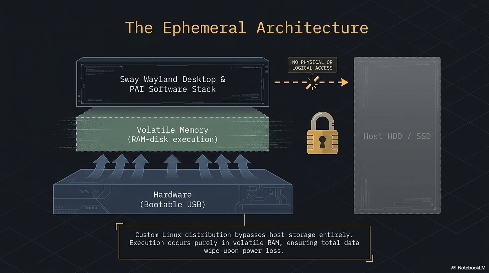
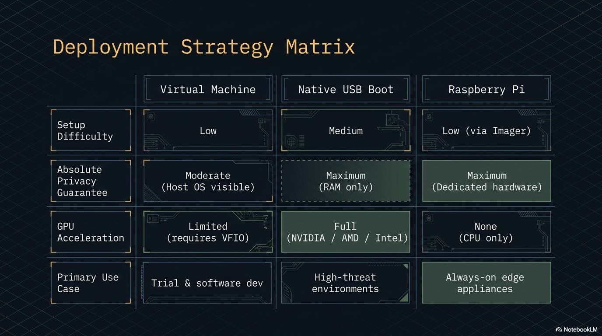
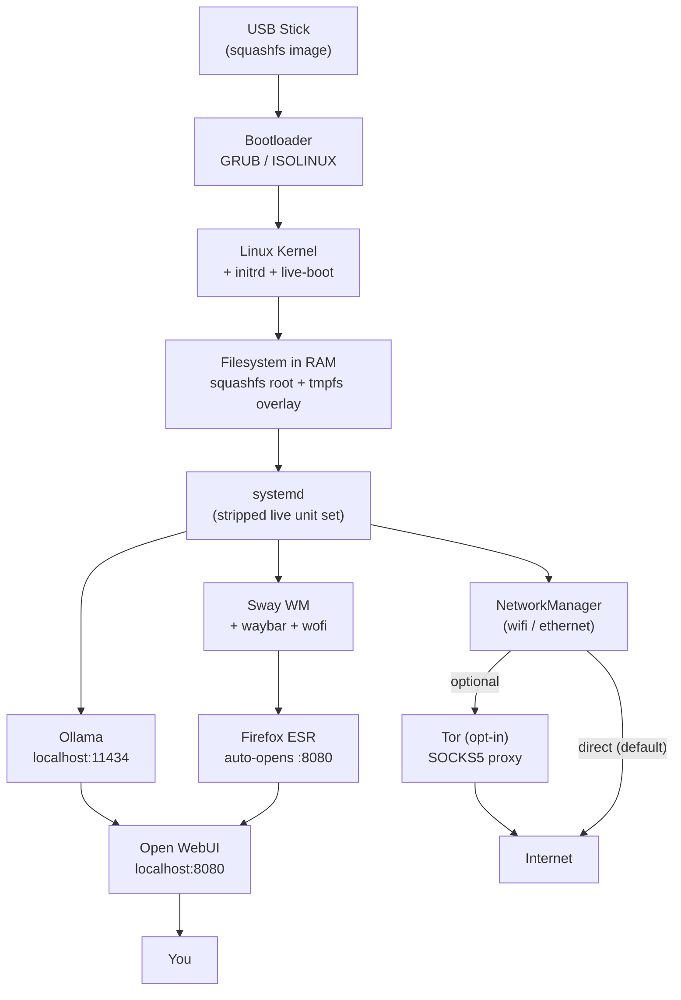
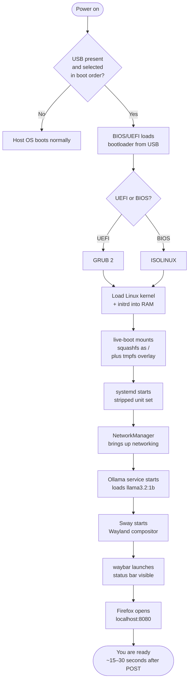

PAI is a bootable Debian 12 Linux system that lives entirely on a USB stick. You plug it in, boot from it, and run local AI models directly on your machine's hardware — nothing installs to the host computer, nothing reaches the cloud, and shutdown erases everything. This page is the definitive technical reference for how that works, layer by layer.





In this guide:
- How a live USB system works and why nothing persists by default
- The full software stack from hardware up, with links to each upstream project
- What happens during the boot sequence, step by step
- How the localhost network keeps AI traffic off the internet
- How PAI profiles change your keybindings without removing any software
- How memory is allocated and what happens when you run out
- How PAI compares to Tails, Qubes OS, and standard Debian

**Prerequisites**: No experience with Linux internals required. If you have used PAI and want to understand what's happening under the hood, this page is for you.

---

## The 30-second overview

PAI is a **live Linux system**. A live system boots entirely into RAM from a read-only image. Your host machine's storage is never touched. When you shut down, RAM is cleared — your conversations, browser history, downloaded files, and any configuration changes vanish. The machine goes back to exactly the state it was in before you plugged in the USB.

```
USB Stick (read-only squashfs image)
         │
         ▼
  BIOS / UEFI firmware
         │  finds the USB, hands off to bootloader
         ▼
  GRUB (UEFI) or ISOLINUX (BIOS)
         │  loads kernel + initrd into RAM
         ▼
  Linux kernel + live-boot
         │  mounts squashfs, adds tmpfs overlay
         ▼
  Debian 12 "bookworm" in RAM
    ┌────┴────────────────────────────────────┐
    │                                         │
    ▼                                         ▼
 Ollama :11434                         Sway desktop
 (AI model runtime)                    + waybar + wofi
    │
    ▼
 Open WebUI :8080
    │
    ▼
 Firefox (auto-opens localhost:8080)
    │
    ▼
 You (offline — no cloud, no tracking)

 ─ ─ ─ ─ ─ ─ ─ ─ ─ optional ─ ─ ─ ─ ─ ─ ─ ─ ─
 UFW → Tor SOCKS proxy → internet (opt-in only)
```

---

## System architecture diagram



---

## Boot sequence diagram



---

## The stack, layer by layer

This section walks the software stack from the hardware upward. Each layer links to its upstream project.

### Hardware

PAI runs on any x86-64 or ARM64 machine that can boot from USB. Ollama uses CPU inference by default; GPU acceleration is available for NVIDIA and AMD GPUs when the appropriate firmware is present. For the bare minimum, see the [System Requirements](system-requirements.md) page.

### Bootloader

PAI ships two bootloaders on the same USB to cover both firmware types:

- **[GRUB 2](https://www.gnu.org/software/grub/)** handles UEFI systems (most hardware made after 2012).
- **[ISOLINUX](https://wiki.syslinux.org/wiki/index.php?title=ISOLINUX)** handles legacy BIOS systems.

Both are embedded in the ISO image. No configuration is needed — the correct one is selected automatically by your firmware.

### Kernel and initrd

The Linux kernel version tracks Debian 12 stable. The `initrd` (initial RAM disk) contains the minimal environment needed to find and mount the USB during early boot. **[live-boot](https://salsa.debian.org/live-team/live-boot)** — the Debian project's live-system tooling — runs inside the initrd to set up the RAM-based root filesystem.

### Filesystem (live-boot + squashfs + tmpfs)

This is the part that makes a live system live:

1. live-boot finds the USB and mounts the **[squashfs](https://docs.kernel.org/filesystems/squashfs.html)** image (`filesystem.squashfs`) read-only.
2. It creates a **tmpfs** (RAM-backed) overlay on top of the squashfs using the **[OverlayFS](https://docs.kernel.org/filesystems/overlayfs.html)** kernel driver.
3. The combined view is mounted as `/`. Reads hit the squashfs; writes go to RAM only.

The result: the USB is never written to during a session, and the entire working filesystem disappears when RAM is cleared at shutdown.

### Base OS

**[Debian 12 "Bookworm"](https://www.debian.org/releases/bookworm/)** — the current stable release. Debian was chosen for its stability, its long-established live-system tooling, its commitment to free software, and its massive package archive. The PAI build process starts from the official Debian live base and adds only what is needed.

### Init system

**[systemd](https://systemd.io/)** is the init system, but PAI disables units that are unnecessary or wrong for a live environment — no swap, no filesystem checks, no SSH by default. Running `systemctl list-units --state=running` on a booted system shows exactly which units are active.

### Networking

**[NetworkManager](https://networkmanager.dev/)** manages wired and wireless connections. The `nmtui` terminal UI lets you connect to Wi-Fi without leaving the terminal. PAI does not auto-connect to any network — joining a network is always an explicit user action.

### Firewall

**[UFW](https://launchpad.net/ufw)** (Uncomplicated Firewall) runs with a default-deny inbound policy. All AI traffic stays on localhost. No port is exposed to the local network unless you explicitly open one.

### Display server

**[Wayland](https://wayland.freedesktop.org/)** via **[Sway](https://swaywm.org/)** — a tiling compositor that is a drop-in Wayland replacement for the i3 window manager. PAI uses Wayland exclusively; there is no X11 server running.

### Status bar and launcher

- **[waybar](https://github.com/Alexays/Waybar)** — the status bar showing time, battery, wifi, and app launchers.
- **[wofi](https://hg.sr.ht/~scoopta/wofi)** — the application launcher (bound to `$mod+d` by default).

### AI runtime

**[Ollama](https://ollama.com/)** is the AI model runtime. It is a single Go binary that:
- Serves a REST API on `localhost:11434`
- Manages model storage and loading
- Handles CPU and GPU inference
- Provides a `docker pull`-style `ollama pull` interface for downloading models

Ollama starts as a systemd service at boot and pre-loads `llama3.2:1b` — the model baked into the ISO.

### AI user interface

**[Open WebUI](https://github.com/open-webui/open-webui)** is a Python/FastAPI web application that provides the chat interface at `localhost:8080`. It communicates only with the local Ollama instance — it makes no external requests.

### Browser

**[Firefox ESR](https://www.mozilla.org/en-US/firefox/enterprise/)** — the Extended Support Release. Firefox auto-opens to `localhost:8080` at login. ESR is used for stability over the multi-year life of a PAI release.

### Privacy tools (opt-in)

- **[Tor](https://www.torproject.org/)** — routes all outbound traffic through the Tor network when privacy mode is enabled.
- **[macchanger](https://github.com/alobbs/macchanger)** — randomizes the MAC address on boot to prevent device tracking on local networks.

### Persistence (optional)

A LUKS-encrypted second partition on the USB can be used to persist files, models, and configuration across reboots. This is opt-in and documented separately in the [Persistence guide](../persistence/introduction.md).

---

## How the filesystem works

Understanding the filesystem is essential for trusting the system.

The ISO contains a compressed **squashfs** archive — think of it as a zip file that Linux can mount directly. squashfs is read-only by design; nothing can write to it. When PAI boots, live-boot mounts the squashfs as the root filesystem.

But a read-only root is not usable — many programs need to write to `/var`, `/tmp`, `/home`, and `/etc`. live-boot solves this with an **OverlayFS**: a transparent layer that sits on top of the squashfs and redirects all writes to a tmpfs (a filesystem backed by RAM).

From your perspective, the filesystem looks and behaves like a normal writable Debian system. Under the hood:
- **Reads** come from squashfs (what was baked into the ISO).
- **Writes** go to tmpfs (your RAM).

When you reboot, the tmpfs is gone. The squashfs is unchanged. PAI is exactly as it was when it left the build server — every single time you boot.

This is the same technique used by **[Tails](https://tails.boum.org/)**, **[Puppy Linux](https://puppylinux-woof-ce.github.io/)**, and **[Knoppix](http://www.knopper.net/knoppix/)**.

!!! note

    The squashfs image is compressed with zstd by default. Decompression happens on the fly as files are read. The CPU cost is minimal; the payoff is a smaller ISO and faster USB reads.


---

## How the localhost network works

AI traffic in PAI never touches the network interface. Open WebUI and Ollama communicate exclusively over the loopback interface (`lo`) at `127.0.0.1`.

```
┌──────────────────────────────────────────────────────────┐
│                    Your Hardware (RAM)                    │
│                                                          │
│   Firefox                                                │
│   (browser)                                              │
│       │  HTTP GET localhost:8080                         │
│       ▼                                                  │
│  ┌────────────┐         ┌────────────────┐               │
│  │ Open WebUI │─────────│    Ollama      │               │
│  │  :8080     │  REST   │    :11434      │               │
│  │ (Python)   │  API    │    (Go)        │               │
│  └────────────┘         └───────┬────────┘               │
│                                 │                        │
│                         ┌───────▼────────┐               │
│                         │  llama3.2:1b   │               │
│                         │  (model file   │               │
│                         │   in RAM)      │               │
│                         └────────────────┘               │
│                                                          │
│  ─ ─ ─ ─ ─ ─ ─ ─ ─ optional path ─ ─ ─ ─ ─ ─ ─ ─ ─   │
│  Firefox → UFW → NetworkManager → [Tor] → internet       │
└──────────────────────────────────────────────────────────┘
```

UFW blocks all inbound connections. The only way traffic leaves the machine is through the browser making explicit web requests — and even that can be routed through Tor with a single command.

!!! tip

    You can verify the network listeners yourself with `ss -tulpen`. You will see Ollama on `127.0.0.1:11434` and Open WebUI on `127.0.0.1:8080` — and nothing on public interfaces.


---

## How the profile system works

PAI ships with multiple **profiles** — configurations that change which applications are bound to keyboard shortcuts in Sway. Profiles do not install or remove software; all tools are always present in the squashfs.

The active profile is loaded from `/etc/sway/profile.d/active.conf` when Sway starts. Swapping which file `active.conf` points to changes your keybindings:

- `ai.conf` — Open WebUI, Ollama terminal, model management
- `crypto.conf` — GPG, KeePassXC, secure-delete utilities
- `privacy.conf` — Tor browser, network monitor, macchanger

To see which profile is active:

```bash
cat /etc/sway/profile.d/active.conf
```

To switch profiles, replace `active.conf` with a different profile file and reload Sway (`$mod+Shift+r`). Because all writes go to RAM, the switch lasts only for the current session unless you have persistence enabled.

### Writing a custom profile

A profile file is plain Sway config syntax. Minimum example:

```
# Custom profile: research tools
bindsym $mod+b exec firefox
bindsym $mod+n exec mousepad
bindsym $mod+t exec foot
```

Place it in `/etc/sway/profile.d/` and symlink it as `active.conf`.

---

## Memory allocation and the OOM killer

PAI is designed for machines with 8 GB RAM or more. Here is how that RAM is typically allocated in a session:

| Component | Approximate RAM use |
|---|---|
| Linux kernel + live system | ~300 MB |
| squashfs decompression cache | ~200–500 MB |
| Sway + waybar + wofi | ~50 MB |
| Firefox (idle) | ~300–600 MB |
| Open WebUI (Python runtime) | ~200–400 MB |
| llama3.2:1b model | ~900 MB–1.2 GB |
| llama3.2:3b model | ~2.0–2.5 GB |
| llama3.2:8b model | ~5.0–6.0 GB |

On a machine with 8 GB RAM, the default `llama3.2:1b` leaves roughly 4–5 GB for browser tabs and working memory — comfortable for most use. On 16 GB you can comfortably run an 8B model alongside a full browser and still have headroom. PAI uses RAM aggressively because that is how it stays fast and leaves zero trace on your disk — every byte of system state is right where you can see it.

!!! warning

    PAI does not configure a swap partition by default. If total memory use exceeds available RAM, the Linux OOM (out-of-memory) killer terminates the largest process — usually the AI model or the browser. You will see the application close unexpectedly. This is not a crash in the traditional sense; it is the kernel protecting system stability.


To check whether swap is active:

```bash
swapon --show
```

If the output is empty, no swap is configured. Persistence mode lets you create a swap file on the encrypted partition.

---

## The update model

PAI is **immutable**. There is no `apt upgrade` that modifies the running system and persists across reboots. The squashfs is fixed at build time.

"Updating" PAI means:

1. Downloading a new ISO from the release page.
2. Flashing it to the USB with the same tool you used initially (`flash.ps1` on Windows, `dd`, Etcher, or the graphical Rufus alternative).
3. Rebooting.

This is a deliberate design choice. Immutability means:
- No dependency drift over time.
- No broken system states from interrupted upgrades.
- Every user of version X has exactly the same system.

The cost is that you cannot install a package and have it survive a reboot without persistence mode. For a tool you need permanently, you either enable persistence and install there, or you request it be included in the next PAI release.

!!! note

    If you have persistence enabled, your persistent partition survives re-flashing as long as the partition layout on the USB does not change. Your files and models are preserved even when you update the PAI base image.


---

## PAI vs Tails vs Qubes vs standard Debian

| Dimension | PAI | Tails | Qubes OS | Standard Debian |
|---|---|---|---|---|
| **Base** | Debian 12 | Debian | Fedora (dom0) | Debian |
| **Boot medium** | USB (live) | USB (live) | Installed to disk | Installed to disk |
| **Primary purpose** | Local private AI | Anonymity / journalism | Security isolation | General-purpose OS |
| **Tor** | Opt-in | Always on (mandatory) | App-level (optional) | Manual setup |
| **AI tooling** | Built-in (Ollama + Open WebUI) | None | None | Manual install |
| **Desktop** | Sway (Wayland tiling) | GNOME | Xfce | Your choice |
| **Amnesic by default** | Yes | Yes | No (persistent) | No (persistent) |
| **Persistence** | Opt-in LUKS partition | Opt-in LUKS partition | Full disk encryption | Full disk encryption |
| **Hardware requirement** | 8 GB RAM, USB 3.0 | 2 GB RAM | 16 GB RAM, SSD | 2 GB RAM |
| **Threat model focus** | AI privacy, data sovereignty | Network surveillance | Application compromise | General use |

Tails and PAI share a Debian base and a live-USB amnesic design, but their goals diverge: Tails forces all traffic through Tor to protect against network surveillance, while PAI keeps AI traffic off the network entirely and treats Tor as an optional enhancement.

Qubes OS takes a different approach — it runs every application in its own isolated virtual machine. This protects against application-level compromise but requires significantly more RAM and a more complex mental model.

Standard Debian gives you maximum flexibility but requires you to install and configure everything yourself, and changes persist (for better and worse).

---

## Tutorial: Inspect the running PAI system

This tutorial walks you through verifying every architectural claim on this page using shell commands. No prior Linux experience is required — each command is explained.

**Goal**: Confirm that PAI is exactly what this page says it is.

**What you need**: A booted PAI session and the `foot` terminal emulator (press `$mod+Return` to open it).

1. **Confirm the base OS**

   ```bash
   cat /etc/os-release
   ```

   Expected output:
   ```
   PRETTY_NAME="Debian GNU/Linux 12 (bookworm)"
   NAME="Debian GNU/Linux"
   VERSION_ID="12"
   VERSION="12 (bookworm)"
   ```

   This confirms PAI is built on Debian 12, not a derivative or rebranded distro.

2. **Confirm you are running a live system**

   ```bash
   mount | grep overlay
   ```

   Expected output (abbreviated):
   ```
   overlay on / type overlay (rw,relatime,lowerdir=/run/live/rootfs/filesystem.squashfs/,upperdir=/run/live/overlay/rw,workdir=/run/live/overlay/work)
   ```

   You can see the squashfs as `lowerdir` (read-only) and `upperdir` as the RAM overlay (writable). This is the OverlayFS described above.

3. **Confirm nothing is installed to the host disk**

   ```bash
   lsblk
   ```

   Expected output (example — will vary by machine):
   ```
   NAME   MAJ:MIN RM   SIZE RO TYPE MOUNTPOINTS
   sda      8:0    1  29.1G  0 disk
   └─sda1   8:1    1  29.1G  0 part /run/live/medium
   ```

   Your USB appears (likely `sda` or `sdb`). The host machine's internal drive should appear with no mount points — PAI has not touched it.

4. **Confirm which systemd units are running**

   ```bash
   systemctl list-units --state=running --no-pager
   ```

   Look for `ollama.service` and `open-webui.service` in the list. You will also see `NetworkManager.service`, `sway.service`, and a small set of essential services. Compare this to a standard Debian install — the list is much shorter.

5. **Confirm Ollama is listening on localhost only**

   ```bash
   ss -tulpen | grep 11434
   ```

   Expected output:
   ```
   tcp   LISTEN 0   128   127.0.0.1:11434   0.0.0.0:*   users:(("ollama",pid=...,fd=...))
   ```

   The `127.0.0.1` confirms Ollama is bound to localhost. It is not reachable from the network.

6. **Confirm Open WebUI is listening on localhost only**

   ```bash
   ss -tulpen | grep 8080
   ```

   Expected output:
   ```
   tcp   LISTEN 0   128   127.0.0.1:8080   0.0.0.0:*   users:(("python3",pid=...,fd=...))
   ```

7. **Confirm the firewall policy**

   ```bash
   sudo ufw status verbose
   ```

   Expected output (abbreviated):
   ```
   Status: active
   Logging: on (low)
   Default: deny (incoming), allow (outgoing), disabled (routed)
   ```

   Inbound is denied by default. Your AI traffic never enters from outside.

8. **Check installed package count**

   ```bash
   dpkg -l | wc -l
   ```

   PAI ships a curated package set. Compare this number to a full Debian desktop install (typically 1500–2500 packages) to see how lean the image is.

9. **Check available and used RAM**

   ```bash
   free -h
   ```

   Expected output (example):
   ```
                 total        used        free      shared  buff/cache   available
   Mem:           15Gi        3.2Gi       9.8Gi      512Mi       2.1Gi      11.7Gi
   Swap:            0B          0B          0B
   ```

   Note that swap is `0B` — no swap partition is configured by default.

10. **Confirm the active Sway profile**

    ```bash
    cat /etc/sway/profile.d/active.conf
    ```

    This shows which profile is loaded. You can inspect other profiles in `/etc/sway/profile.d/` to see what each one configures.


**What you verified**: The live filesystem, the localhost-only AI services, the firewall policy, the package footprint, and the memory model — all from the terminal, with no need to trust this documentation blindly.

**Next steps**: See [Privacy Mode](../privacy/introduction-to-privacy.md) to learn how to route traffic through Tor, or [Managing Models](../models.md) to pull larger models for more capable responses.

---

## Frequently asked questions

### Why Debian and not Ubuntu or Arch?

Debian is the upstream for many live-system distributions, including Tails. It has the most mature live-boot tooling (`live-build`, `live-boot`, `live-config`) and a long release cycle that makes a stable, reproducible ISO feasible. Ubuntu adds a layer of changes on top of Debian that complicate live-system builds without adding value for PAI's use case. Arch is a rolling release — excellent for a daily driver, but poor for an immutable appliance that needs to produce identical ISOs months apart.

### Why Sway and not GNOME or KDE?

Sway starts in roughly one second and uses around 50 MB of RAM. GNOME uses 500 MB to 1 GB just for the shell. On a machine with 8 GB RAM, the difference matters — that extra RAM goes to your AI model. Sway also runs on Wayland natively, which is a better security boundary than the older X11 protocol. The tradeoff is a steeper initial learning curve; the keybindings follow i3 conventions documented in the [keyboard shortcuts reference](../reference/keyboard-shortcuts.md).

### Why Ollama and not llama.cpp directly?

Ollama wraps llama.cpp (and other backends) with a clean REST API, a model registry, and a `docker pull`-style CLI. Using Ollama means Open WebUI and any other tool can talk to the AI runtime over HTTP without knowing which backend is in use. llama.cpp is excellent but requires you to manage model files, quantizations, and server flags manually. Ollama handles that complexity.

### What is a live system?

A live system is a complete operating system that runs from a removable medium — a USB stick, a CD, or a virtual disk — without installing anything to the host machine. The OS loads into RAM at boot. All changes during the session are stored in RAM. When the system shuts down, RAM is cleared and the session disappears. Live systems have been used since the early 2000s for system rescue, privacy, and demonstration purposes. PAI builds on this established technique to provide an AI workstation that leaves no trace.

### How big is the PAI ISO?

The PAI ISO is typically 2–4 GB depending on which models are baked in. The base system without any models is around 1.5 GB. The `llama3.2:1b` model adds approximately 900 MB in quantized form. Larger models add proportionally more. Check the release page for the exact size of each release variant.

### Can I modify PAI or build my own version?

Yes. PAI is open source under the GPL v3. The build system is documented in [Building from Source](../advanced/building-from-source.md). You can fork the repository, add packages, change the default model, add a profile, and produce your own ISO using the same build pipeline. The build runs on standard Debian and is designed to be reproducible.

### Does PAI use Docker?

No. Ollama and Open WebUI run as native systemd services, not as Docker containers. Docker adds complexity, requires a daemon, and consumes additional RAM. Ollama is a single statically-linked Go binary that manages its own process lifecycle. Open WebUI is a Python application managed by systemd. The absence of Docker is intentional — it reduces the attack surface and the RAM footprint.

### What happens to my AI conversations when I shut down?

By default, everything is erased. Your conversation history, any models you pulled during the session, browser history, and all configuration changes are in RAM. Shutdown clears RAM. The next boot starts from the exact factory state. If you want conversations to persist, you need the optional [persistence layer](../persistence/introduction.md), which stores data on a LUKS-encrypted partition on the USB.

### Does PAI work without an internet connection?

Yes — that is the entire point. The `llama3.2:1b` model is baked into the ISO. Ollama and Open WebUI communicate over localhost. You can have a full AI session on an airplane with no wifi. An internet connection is only needed if you want to pull additional models during a session or browse the web.

### How is PAI different from running Ollama on my regular OS?

Running Ollama on your regular OS means your AI activity is mixed with everything else on that machine — browser history, installed apps, and the OS itself. PAI creates a clean, isolated environment where the only thing running is what PAI ships. When you shut down, nothing about the session remains. You also get a pre-configured interface (Open WebUI, profile system, privacy tools) without any setup work.

### Can I run PAI in a virtual machine?

Yes, with limitations. PAI boots and runs normally in VMs including UTM (macOS), VirtualBox, and QEMU. The main limitation is GPU acceleration: most VM configurations do not pass through the GPU, so inference runs on the CPU. For light use with `llama3.2:1b`, CPU inference is perfectly adequate. For larger models, bare-metal boot is recommended.

---

## Related documentation

- [**System Requirements**](system-requirements.md) — Minimum hardware needed to run PAI, including RAM, USB speed, and CPU recommendations
- [**First Boot Walkthrough**](../getting-started.md) — What to expect the first time you boot PAI, from GRUB to Open WebUI
- [**Managing Models**](../models.md) — How to pull, switch between, and remove Ollama models during a session
- [**Persistence**](../persistence/introduction.md) — How to set up the optional LUKS-encrypted partition so your data survives reboots
- [**Privacy Mode**](../privacy/introduction-to-privacy.md) — How to route all traffic through Tor and what that protects you from
- [**Building from Source**](../advanced/building-from-source.md) — How to build your own PAI ISO from the repository
