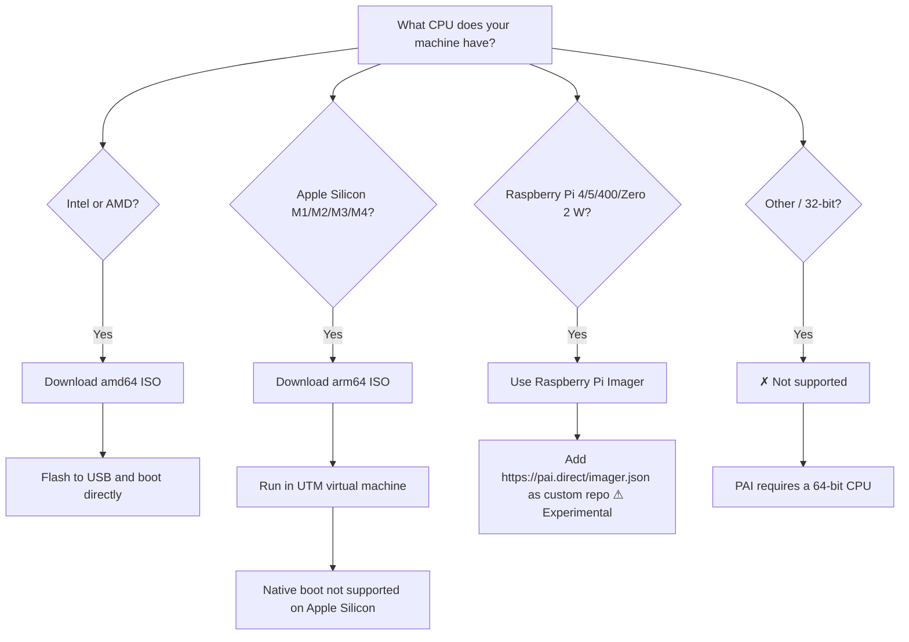

PAI is a bootable USB Linux distribution that runs **Ollama** and **Open WebUI** entirely on your own hardware — no cloud, no internet required. Before you download the ISO and flash a USB drive, use this page to confirm your machine meets the hardware requirements. Most laptops and desktops made after 2015 will work fine. The minimum bar is a 64-bit CPU and 4 GB of RAM.

In this guide:
- Minimum and recommended hardware specifications
- Which ISO to download for your CPU architecture
- Supported and unsupported CPU families
- USB stick recommendations and what to avoid
- Known incompatible hardware and workarounds
- Shell commands to verify your hardware before flashing
- GPU acceleration requirements

**Prerequisites**: No technical background required. If you can read a product page or run a terminal command, you have everything you need.

---

## Which ISO do I download?

PAI ships two ISOs: one for **amd64** (Intel and AMD x86\_64 processors) and one for **arm64** (Apple Silicon via UTM, Raspberry Pi). Use the decision flowchart below to pick the right one.



!!! tip

    Not sure which CPU you have? On macOS, click the Apple menu and choose **About This Mac**. On Windows, open **Settings → System → About** and look for "System type". On Linux, run `uname -m` — `x86_64` means amd64, `aarch64` means arm64.


---

## Minimum hardware requirements

These are the absolute floor. PAI will boot and run the baked-in `llama3.2:1b` model, but do not expect fast inference speeds.

| Component | Minimum |
|---|---|
| CPU | 64-bit (x86\_64 / AMD64 or ARM64) |
| RAM | 4 GB |
| USB port | USB 2.0 |
| USB stick capacity | 16 GB |
| Display | 1024×768 or larger |
| Internet | Not required (PAI runs fully offline) |

!!! warning

    At 4 GB RAM, PAI can only run the `llama3.2:1b` model that ships baked into the ISO. Attempting to pull larger models like `llama3.2:3b` or `mistral:7b` will fail with an out-of-memory error or cause extreme swap thrashing that makes the system unusable.


---

## Recommended hardware requirements

For a comfortable experience with larger models and faster boot times, aim for these specifications.

| Component | Recommended |
|---|---|
| CPU | Intel Core i5 (8th gen+) or AMD Ryzen 5 (3000 series+) |
| RAM | 16 GB or more |
| USB port | USB 3.0 or USB 3.1 |
| USB stick capacity | 32 GB or more |
| Display | 1920×1080 |
| GPU (optional) | NVIDIA GPU with 8 GB+ VRAM |

**Why 16 GB RAM?** The `llama3.2:3b`, `phi-3`, and `mistral:7b` models all require roughly 6–8 GB of RAM to load. With 16 GB, the model fits entirely in RAM alongside the Sway desktop and Open WebUI, giving you smooth inference without disk-backed swap.

**Why USB 3.0+?** Boot time on a USB 2.0 stick can reach 2 minutes on cold hardware. On USB 3.0, the same boot takes roughly 20 seconds. The difference is the ISO image size — at ~8–9 GB, every megabyte-per-second of read speed matters.

!!! tip

    If you plan to use [PAI persistence](../persistence/introduction.md) to save conversations and installed models across reboots, use a 32 GB or larger USB stick. The persistence partition is formatted at first boot and can grow to fill available space.


---

## Supported CPU families

**[amd64 ISO]** Intel and AMD x86\_64  
**[arm64 ISO]** Apple Silicon (UTM only), Raspberry Pi  
**[Not supported]** 32-bit CPUs

| CPU family | Architecture | Support level | Notes |
|---|---|---|---|
| Intel Core (8th gen+) | x86\_64 / amd64 | ✓ Fully supported | Tested on i5-8250U, i7-10700, i9-12900 |
| Intel Core (older, pre-2015) | x86\_64 / amd64 | ⚠ Should work | Not regularly tested; low RAM often the limiting factor |
| Intel Celeron / Pentium | x86\_64 / amd64 | ⚠ Limited | May boot; AI inference will be very slow |
| AMD Ryzen (3000 series+) | x86\_64 / amd64 | ✓ Fully supported | Tested on Ryzen 5 3600, Ryzen 7 5800X |
| AMD Ryzen (pre-3000) | x86\_64 / amd64 | ⚠ Should work | Not regularly tested |
| AMD EPYC / Threadripper | x86\_64 / amd64 | ✓ Supported | Works; workstation use only |
| Apple Silicon M1 | arm64 | ✓ Via UTM VM | No native boot; use the arm64 ISO inside UTM |
| Apple Silicon M2 | arm64 | ✓ Via UTM VM | No native boot; use the arm64 ISO inside UTM |
| Apple Silicon M3 | arm64 | ✓ Via UTM VM | No native boot; use the arm64 ISO inside UTM |
| Apple Silicon M4 | arm64 | ✓ Via UTM VM | No native boot; use the arm64 ISO inside UTM |
| Intel Mac (pre-2020) | x86\_64 / amd64 | ✓ Supported | Use the amd64 ISO; boot directly |
| Raspberry Pi 5 | arm64 | ⚠ Experimental | Recommended Pi; flash via [Raspberry Pi Imager](../first-steps/using-raspberry-pi-imager.md) |
| Raspberry Pi 4 | arm64 | ⚠ Experimental | Supported; AI inference is slow vs. a modern laptop |
| Raspberry Pi 400 | arm64 | ⚠ Experimental | Same silicon as Pi 4 |
| Raspberry Pi Zero 2 W | arm64 | ⚠ Experimental | Text-only models only — too little RAM for Sway + larger models |
| Raspberry Pi 3B / 3B+ | arm64 | ✗ Not supported | 32-bit boot ROM cannot load the arm64 image |
| ARM Cortex (generic) | arm64 | ✗ Untested | No support commitment |
| 32-bit x86 (i686) | x86 | ✗ Not supported | PAI requires a 64-bit CPU |

!!! note

    "Via UTM VM" means you run PAI as a virtual machine inside the [UTM](https://mac.getutm.app/) app on macOS — you do not boot from USB. Performance is limited compared to bare-metal, but every PAI feature works including Ollama and Open WebUI.


---

## USB sticks we recommend

Not all USB sticks are equal. Cheap or counterfeit drives have slower read speeds and higher failure rates when used as boot media. These are sticks the PAI team has tested directly:

| Model | Interface | Capacity | Approximate price | Notes |
|---|---|---|---|---|
| Lexar JumpDrive S80 | USB 3.1 | 32 GB | ~$12 | Tested; fast and reliable |
| SanDisk Ultra | USB 3.0 | 32 GB | ~$10 | Tested; widely available |
| SanDisk Extreme Pro | USB 3.2 | 64 GB | ~$25 | Tested; excellent for persistence workloads |
| Samsung BAR Plus | USB 3.1 | 32 GB | ~$13 | Tested; compact metal body |

!!! danger

    Counterfeit USB sticks are sold in large numbers on Amazon, eBay, and AliExpress — particularly for capacities of 64 GB and above at suspiciously low prices. A counterfeit drive will claim to be 64 GB but silently corrupt writes beyond 4–8 GB of actual storage. This can result in a corrupted boot image that is impossible to diagnose without specialized tools. Buy from a reputable retailer. If in doubt, use [F3](https://fight-flash-fraud.readthedocs.io/) or [h2testw](https://www.heise.de/download/product/h2testw-50539) to verify capacity before flashing.


---

## GPU acceleration

GPU acceleration is **optional**. PAI runs entirely on CPU out of the box. An NVIDIA GPU with 8 GB+ VRAM will give you dramatically faster inference — the difference between waiting 30 seconds per response and getting results in under 3 seconds on a 7B model.

| GPU tier | VRAM | What it enables |
|---|---|---|
| No GPU (CPU only) | N/A | Runs `llama3.2:1b` comfortably; `3b` slowly |
| NVIDIA GTX 1070 / RTX 2060 | 8 GB | Runs `llama3.2:3b`, `phi-3`, `mistral:7b` at speed |
| NVIDIA RTX 3080 / 4070 | 10–12 GB | Runs `llama3.2:8b`, `mistral:7b` with fast inference |
| NVIDIA RTX 3090 / 4090 | 24 GB | Runs 13B+ models; `llama3.1:13b` and above |
| AMD GPU | Varies | ROCm support is in progress; not guaranteed in v0.1 |
| Apple GPU (M-series) | Unified memory | Handled by UTM; performance depends on RAM allocation |

!!! warning

    NVIDIA GPU acceleration requires installing proprietary NVIDIA drivers **after booting PAI**. This requires [persistence](../persistence/introduction.md) to be enabled — without persistence, driver changes are lost on reboot. The driver installation process is documented in the [GPU setup guide](../advanced/gpu-setup.md).


---

## Known incompatible hardware

Some hardware combinations have known issues. Check this list before flashing.

### Chromebooks

Most Chromebooks have a **locked bootloader** that prevents booting from external USB drives. Unlocking the bootloader on most Chromebooks requires enabling **Developer Mode**, which wipes the device and disables ChromeOS security features. A small number of Chromebooks support "Legacy Boot" mode that can run Linux from USB — check your specific model before attempting.

**Verdict**: PAI does not officially support Chromebooks.

### Microsoft Surface devices

Surface Pro and Surface Laptop models require **Secure Boot** to be disabled before they will boot from an external USB drive.

1. Power off the Surface completely.
2. Hold the **Volume Down** button and press the **Power** button once.
3. In the UEFI menu, navigate to **Security** and set **Secure Boot** to **Disabled**.
4. Save and exit. The Surface will now boot from USB.

!!! warning

    Disabling Secure Boot on a Surface does not cause data loss, but Microsoft may flag your device as non-compliant if you have corporate device management software installed. Re-enable Secure Boot after you are done with PAI if this is a work machine.


### Older HP BIOS versions

Some HP laptops from 2014–2017 have a BIOS bug where USB drives larger than 32 GB are not recognized during boot. If your HP laptop refuses to boot from a 64 GB USB stick but works fine with a 32 GB stick, this is the cause.

**Workaround**: Flash PAI to a 32 GB USB stick, or check HP's support site for a BIOS update for your specific model.

### Legacy BIOS (non-UEFI) systems

PAI's ISO is configured to boot in **UEFI mode**. Very old machines (pre-2012) that only support legacy BIOS mode may not boot PAI. Most machines from 2012 onward have UEFI support, though it sometimes needs to be enabled in the BIOS settings.

---

## How to verify your hardware before flashing

Run these commands to confirm your CPU architecture, RAM, and USB capabilities before downloading the ISO.

=== "Linux"
    ```bash
    # Check CPU architecture — should print x86_64 or aarch64
    uname -m
    ```

    Expected output (Intel/AMD):
    ```
    x86_64
    ```

    Expected output (ARM64):
    ```
    aarch64
    ```

    ```bash
    # Check total RAM
    free -h
    ```

    Expected output (16 GB machine):
    ```
                  total        used        free      shared  buff/cache   available
    Mem:           15Gi       2.1Gi       9.8Gi       512Mi       3.2Gi        12Gi
    Swap:         2.0Gi          0B       2.0Gi
    ```

    ```bash
    # Check CPU details — model name, core count
    lscpu | head -20
    ```

    ```bash
    # Check if your USB ports support USB 3.0
    lsusb -v 2>/dev/null | grep -i "bcdUSB" | head -10
    # Look for "bcdUSB 3.00" or higher for USB 3.0 ports
    ```
=== "macOS"
    ```bash
    # Check CPU architecture
    uname -m
    ```

    Expected output (Apple Silicon):
    ```
    arm64
    ```

    Expected output (Intel Mac):
    ```
    x86_64
    ```

    ```bash
    # Check total RAM (macOS uses sysctl)
    sysctl -n hw.memsize | awk '{printf "%.0f GB\n", $1/1073741824}'
    ```

    Expected output (16 GB machine):
    ```
    16 GB
    ```

    ```bash
    # Full CPU info
    sysctl -n machdep.cpu.brand_string
    ```

    You can also check via the Apple menu: **About This Mac → More Info**. Look for "Memory" to see your RAM, and "Chip" or "Processor" to identify your CPU.
=== "Windows"
    Open **PowerShell** and run:

    ```powershell
    # Check CPU architecture and RAM
    Get-ComputerInfo | Select-Object CsProcessors, CsTotalPhysicalMemory, OsArchitecture
    ```

    Expected output (Intel 16 GB machine):
    ```
    CsProcessors             : {Intel(R) Core(TM) i7-10700 CPU @ 2.90GHz}
    CsTotalPhysicalMemory    : 17179869184
    OsArchitecture           : 64-bit
    ```

    ```powershell
    # Convert RAM to GB for readability
    [math]::Round((Get-WmiObject Win32_ComputerSystem).TotalPhysicalMemory / 1GB, 1)
    ```

    Alternatively, press **Win + R**, type `msinfo32`, and press Enter. The **System Information** window shows your CPU, RAM, and system architecture.

---

## Does PAI work without internet?

Yes. PAI is designed specifically to run with zero network access. Ollama, Open WebUI, and the `llama3.2:1b` model are all baked into the ISO. You can boot PAI on an airplane, in a SCIF, or on a machine that has never been connected to the internet.

Pulling additional models with `ollama pull` does require internet access (or a local mirror). Once a model is pulled, it works fully offline in subsequent sessions — provided you have [persistence](../persistence/introduction.md) enabled, or you repull the model each session.

---

## Tutorial: Checking if your machine can run PAI

**Goal**: Confirm your machine meets PAI's hardware requirements in under 5 minutes.

**What you need**: A running computer (Linux, macOS, or Windows). No USB stick required for this check.

1. **Check your CPU architecture.** Open a terminal (or PowerShell on Windows) and run the architecture check command for your OS from the [verification section above](#how-to-verify-your-hardware-before-flashing). You need `x86_64` or `aarch64` / `arm64`.

2. **Check your RAM.** Run the RAM check command. You need at least 4 GB total (`free -h` shows 4Gi or higher in the "total" column for RAM).

3. **Check your USB ports.** Look at your physical machine — USB 3.0 ports are typically marked with a blue plastic insert or a "SS" (SuperSpeed) logo. USB 2.0 ports have a black or white insert.

4. **Choose your ISO.** If you got `x86_64`, download the amd64 ISO. If you got `aarch64` or `arm64`, download the arm64 ISO (and plan to run it in UTM if you're on a Mac).

5. **Get a USB stick.** Find or buy a USB stick of at least 16 GB (32 GB recommended). Check the [recommendations above](#usb-sticks-we-recommend).

6. **Proceed to flashing.** Head to the [first boot walkthrough](../first-steps/first-boot-walkthrough.md) for instructions on flashing and booting PAI.

**What just happened?** You confirmed that your machine has the CPU architecture, memory, and USB hardware that PAI requires. This takes 5 minutes now and prevents a frustrating boot failure later.

**Next step**: [First Boot Walkthrough](../first-steps/first-boot-walkthrough.md) — flash the USB and run PAI for the first time.

---

## Frequently asked questions

### Does PAI work on a Chromebook?

Usually not. Most Chromebooks have a locked bootloader that prevents booting from external USB drives. Some Chromebook models support "Legacy Boot" mode — check your specific model's documentation. Enabling Developer Mode on Chromebooks wipes the device. PAI does not officially support Chromebooks.

### Can I run PAI on a Raspberry Pi?

The arm64 ISO runs on Raspberry Pi 4 and 5 in experimental mode, but PAI is not officially tested on Raspberry Pi hardware. AI inference on a Raspberry Pi is very slow — `llama3.2:1b` may produce responses in 30–60 seconds per token. For practical AI use, a laptop or desktop with 8+ GB RAM gives a much better experience.

**Flashing on a Pi:** the easiest path is Raspberry Pi Imager with PAI's custom repository (`https://pai.direct/imager.json`) — see [Install PAI on Raspberry Pi](../first-steps/using-raspberry-pi-imager.md).

### Does PAI need a GPU?

No. PAI runs entirely on CPU out of the box, and the baked-in `llama3.2:1b` model works comfortably with CPU-only inference on a machine with 4–8 GB RAM. An NVIDIA GPU with 8 GB+ VRAM is optional but dramatically speeds up inference on larger models. GPU acceleration requires NVIDIA drivers and [persistence](../persistence/introduction.md) to be configured.

### How much RAM do I need to run larger AI models?

The RAM requirement scales with the model size. As a rough guide: `llama3.2:1b` needs about 2 GB; `llama3.2:3b` needs about 4–5 GB; `mistral:7b` needs about 6–8 GB; and `llama3.1:13b` needs 12–16 GB. Add 2–3 GB on top for the operating system and Open WebUI. So for `mistral:7b`, plan on 12 GB total RAM minimum.

### Will PAI run on my old laptop from 2012?

Probably, if it has a 64-bit CPU and at least 4 GB RAM. The main risk with older hardware is: (1) BIOS-only boot (no UEFI) — most machines from 2011 onward have UEFI, but it sometimes needs to be enabled; (2) slow USB 2.0 ports that make boot times painful; and (3) limited RAM that restricts which AI models you can run. Check the [hardware verification commands](#how-to-verify-your-hardware-before-flashing) to confirm your machine's specs.

### Can I run PAI on a Surface Pro?

Yes, but you must disable Secure Boot in the Surface UEFI firmware first. See the [Surface workaround above](#microsoft-surface-devices) for step-by-step instructions. Re-enable Secure Boot afterward if you use the Surface for work.

### What is the difference between the amd64 and arm64 ISOs?

The **amd64 ISO** runs on Intel and AMD x86\_64 processors — the CPUs in most Windows laptops, desktops, and Intel Macs. The **arm64 ISO** runs on ARM64 processors — Apple Silicon Macs (via UTM virtual machine) and Raspberry Pi. The two ISOs contain identical software; only the compiled binaries differ. Use the [flowchart above](#which-iso-do-i-download) if you are unsure which to pick.

### Does PAI send any data to the internet?

No. PAI is specifically designed for offline, private AI use. Ollama communicates only with the local `llama3.2:1b` model — there are no cloud API calls, no telemetry, and no network requests made by the AI stack. The only network activity in a default PAI session comes from the Sway desktop's optional system tray (which you can disable). See the [privacy mode documentation](../privacy/introduction-to-privacy.md) for more detail.

### How do I run PAI on a Mac with Apple Silicon?

Download the arm64 ISO. Install [UTM](https://mac.getutm.app/) from the Mac App Store (free) or the UTM website. Create a new UTM virtual machine, attach the arm64 ISO as a CD-ROM drive, and boot. PAI cannot boot directly from USB on Apple Silicon Macs because Apple's T2/M-series firmware does not support booting non-macOS operating systems from USB without Asahi Linux or similar tooling.

### Can I install PAI to a hard drive instead of running from USB?

PAI is designed as a live USB system. It does not include an installer that writes to an internal hard drive. You can use the [persistence layer](../persistence/introduction.md) to store data across reboots, but the OS itself always runs from the USB stick or, on Apple Silicon, from inside a UTM VM image.

### What happens to my RAM if I run PAI on a machine with 8 GB?

On an 8 GB machine, PAI boots fine. The Sway desktop and Open WebUI together use roughly 1–2 GB at idle, leaving 6 GB for Ollama and the active model. `llama3.2:1b` (about 1.3 GB) runs comfortably. `llama3.2:3b` (about 4–5 GB) will load but may leave the system with under 1 GB of free RAM during inference — functional, but you may see brief slowdowns when Open WebUI and Ollama are both active.

### Is there a list of compatible hardware I can check before buying?

The table in [Supported CPU families](#supported-cpu-families) covers major CPU families. For specific laptops and desktops, any machine with an Intel Core i5/i7/i9 (8th generation or newer) or an AMD Ryzen 5/7/9 (3000 series or newer), at least 8 GB RAM, and a USB 3.0 port will work well with PAI out of the box.

---

## Related documentation

- [**First Boot Walkthrough**](../first-steps/first-boot-walkthrough.md) — Flash the USB stick and run PAI for the first time
- [**Downloading and Flashing the ISO**](../first-steps/installing-and-booting.md) — How to write the PAI ISO to a USB stick on Linux, macOS, and Windows
- [**Managing Ollama Models**](../ai/managing-models.md) — Pull, switch, and remove AI models; understand RAM requirements per model
- [**Persistence Layer Setup**](../persistence/introduction.md) — Save conversations and models across reboots using an encrypted persistent partition
- [**GPU Acceleration Setup**](../advanced/gpu-setup.md) — Install NVIDIA drivers for faster AI inference (requires persistence)
- [**Privacy Mode**](../privacy/introduction-to-privacy.md) — Route all network traffic through Tor and understand PAI's privacy guarantees
