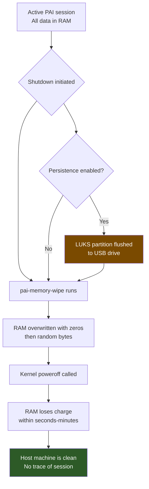

**PAI is a complete, private computer that fits on your keychain.** Your AI, your keys, your OS — running on your hardware, answering only to you. This page is the honest map of what that gets you and where the edges are.

PAI keeps your AI prompts off the internet and your conversations out of the cloud. What it cannot do is protect you from hardware implants, advanced network attacks, a compromised BIOS, or your own mistakes. This page documents every known limitation of PAI so you can make an informed decision about whether it fits your threat model.

### What PAI gives you, up front

Before any caveats, here is what PAI delivers reliably on every boot, with no configuration:

- **Local AI, zero cloud.** Every prompt runs on your CPU or GPU via Ollama. Nothing about your conversation leaves the machine.
- **RAM-only sessions.** Your chats, browser history, downloads, and working files live in memory and vanish at shutdown. The host disk is never touched.
- **Network-hardened by default.** MAC address randomized at boot, UFW set to deny inbound, and Tor available with one command when you want it.
- **Your keys, in your pocket.** GPG encryption, password management, and crypto cold-signing work out of the box — private keys never have to touch a networked machine.
- **Portable, trace-free.** Boot PAI on any AMD64 or ARM64 machine. Full desktop in seconds, and when you pull the drive, nothing stays behind.

Those guarantees cover how most people will use PAI, every day, without thinking about them. The rest of this page is about the remaining edge cases — hardware-level attacks, AI-specific risks, the real-world shape of Tor — so you know exactly where PAI fits in a bigger security picture.

In this guide:
- What PAI is not designed to do (and what tool to use instead)
- Hardware-level attacks PAI cannot prevent
- AI-specific risks you may not have considered
- Network privacy limits, including Tor's real-world constraints
- The attack resistance table: a threat-by-threat breakdown
- How to independently verify PAI's privacy claims with real commands
- What PAI genuinely does protect

**Prerequisites**: No prior security knowledge required. If you are evaluating PAI for a high-risk environment, read this page alongside the [Tails OS documentation](https://tails.boum.org/doc/about/warnings/index.en.html) and make an explicit comparison.

---

## What PAI is NOT

PAI is an offline AI workstation. It is not a hardened anonymity OS.

**PAI is not a replacement for Tails.** [Tails](https://tails.boum.org) is designed from the ground up for anonymity: it routes all traffic through Tor at the kernel level, sandboxes applications with AppArmor, and has been audited by security researchers for over a decade. PAI's Tor support is opt-in and routes application traffic — it does not provide the same isolation guarantees. If your threat model includes state-level adversaries, journalists working in hostile countries, or anyone who needs plausible deniability, use Tails.

**PAI is not a secure OS for classified material.** PAI does not meet the criteria of any government or enterprise security standard (FIPS 140-2, Common Criteria, DISA STIGs). Do not store classified, legally privileged, or trade-secret material on a PAI session unless your organization has independently evaluated it.

**PAI is not audited line-by-line.** PAI is built on Debian 12, Ollama, and Open WebUI. All three receive upstream security patches, but the combination has not been subject to a formal third-party security audit. Review the package list against your own threat model before using PAI in sensitive contexts.

**PAI is not immune to hardware-level attacks.** Intel Management Engine, AMD PSP, Spectre-class speculative execution bugs, and firmware rootkits operate below the OS layer. PAI cannot detect or prevent attacks at this level.

!!! danger

    If you are a high-risk user (activist, journalist, whistleblower, abuse survivor), PAI is a useful tool for private AI work, but it should not be your primary anonymity OS. Use Tails for that role.


---

## Hardware-level attacks PAI cannot prevent

### BIOS and UEFI rootkits

A BIOS or UEFI rootkit can persist across reboots, across operating system installs, and across USB boot sessions. PAI boots from USB and leaves the host's firmware untouched. If the host machine's firmware is compromised before you boot PAI, the attacker has a persistent foothold that PAI cannot detect.

**Mitigation**: Use dedicated hardware you own and control. Enable Secure Boot on hardware that supports it. Verify the UEFI firmware version against the manufacturer's published hash where possible.

### Cold-boot RAM attacks

When PAI shuts down, it runs a RAM-wipe routine (`pai-memory-wipe`) that overwrites memory with random bytes before poweroff. This significantly reduces — but does not eliminate — the risk of a cold-boot attack, where an attacker freezes RAM, removes it, and reads residual data with specialized hardware.

**What pai-memory-wipe does**: Overwrites all available RAM with zeroes and random bytes, then calls `systemctl poweroff`. On most consumer hardware this is sufficient. On enterprise hardware with ECC RAM or battery-backed memory, residual data may survive longer.

!!! warning

    Cold-boot attacks require physical access to the machine within seconds to minutes of shutdown. If you are in an environment where this is plausible, power off quickly and do not leave the machine unattended after shutdown.


### Hardware keyloggers

A USB or PS/2 hardware keylogger intercepts keystrokes before they reach the OS. PAI cannot detect hardware keyloggers because they operate at the physical layer. Every character you type — passwords, prompts, usernames — is visible to a hardware keylogger regardless of what OS is running.

**Mitigation**: Inspect USB ports and keyboard connectors for unfamiliar devices before every session. Use dedicated hardware where possible.

### Evil-maid attacks

An evil-maid attack occurs when an attacker has brief physical access to your machine while you are away and modifies the boot process, installs a bootkit, or replaces hardware components. PAI's USB drive could be swapped, modified, or cloned. The host machine's bootloader could be modified to log your LUKS passphrase.

**Mitigation**: Verify the SHA256 hash of your PAI ISO before flashing. Use a tamper-evident seal on the USB drive. Never leave the USB drive unattended in an adversarial environment.

### Spectre, Meltdown, and speculative execution attacks

Spectre-class vulnerabilities allow malicious code running on the same physical CPU to read memory belonging to other processes — including the kernel. While Debian 12 includes mitigations (retpoline, IBRS, STIBP, L1TF mitigations), these come with a performance cost and some attack variants remain partially unmitigated. Running untrusted code (including some AI models from unknown sources) on PAI while handling sensitive data in other processes carries residual risk.

!!! danger

    Do not run untrusted model files from unknown sources on hardware that also handles sensitive data in other processes. Pull models only from `ollama.com` or sources you have independently verified.


---

## AI-specific warnings

### Model outputs are not confidential from the model itself

Your prompts stay on your device — they do not leave over the network. However, the model itself was trained on vast amounts of internet data and may:

- **Hallucinate facts** that sound authoritative. Never use LLM output as a primary source for medical, legal, financial, or safety-critical decisions.
- **Reproduce training data** including potentially private or copyrighted text that appeared in its training corpus.
- **Reflect training biases** in ways that are subtle and hard to detect.

The privacy guarantee is: your prompts do not go to Anthropic, OpenAI, or any cloud service. The quality guarantee is: none. Treat all model output as a draft requiring human verification.

### Large models require internet access on first pull

**[Requires internet]**

PAI ships with a small default model pre-loaded. If you choose a larger model (such as `llama3.2:3b` or `mistral:7b`), Ollama downloads it from `ollama.com` over the internet. This download:

- Reveals your IP address to Ollama's CDN
- May reveal your hardware capabilities (model size requested)
- Happens in the background without a confirmation dialog

**If this matters**: Enable [privacy mode](../privacy/privacy-mode-tor.md) before pulling a new model, or pull models on a separate non-sensitive network and copy them to the USB persistence partition.

### Open WebUI has no authentication by default

Open WebUI listens on `localhost:8080`. PAI's firewall blocks inbound connections from other machines, but this protection depends on the firewall being active.

!!! danger

    If you add port-forwarding rules, run PAI on a VM with shared networking, or disable the firewall for any reason, Open WebUI becomes accessible to anyone on the network with no password required. Do not change PAI's default firewall rules unless you fully understand the consequences.


### Chat history is stored in RAM by default

Without the [persistence layer](../persistence/introduction.md) enabled, every conversation, model download, and file you create is stored only in RAM. Shutting down or rebooting wipes everything. This is the intended behavior for the highest-privacy sessions. If you need your conversations to survive reboots, set up persistence — and understand that enabling persistence changes your threat model.

---

## Network privacy warnings

### Privacy mode is not the same as Tails-grade Tor

PAI's privacy mode routes your application traffic through Tor using `nftables` rules and a transparent proxy. This is meaningfully better than nothing. It is not the same as Tails, which:

- Routes all traffic at the kernel level with no exceptions
- Sandboxes applications in separate network namespaces
- Has been audited for Tor traffic leaks

PAI's Tor routing can be bypassed by applications that use raw sockets, bypass NetworkManager, or use hardcoded DNS resolvers. The applications that ship with PAI have been tested, but third-party applications you add are not guaranteed to route through Tor.

### MAC address spoofing is opt-in and per-session

PAI can randomize your network interface's MAC address, but this is not automatic. Each session starts with your hardware's real MAC address unless you explicitly enable spoofing. A network adversary with access to router logs can link your sessions by MAC address if you do not enable spoofing.

!!! warning

    Enable MAC spoofing before connecting to any network where you do not want your hardware identified. Run `macchanger -r <interface>` or use the PAI network settings panel.


### DNS leaks are possible

If an application resolves DNS through a method other than NetworkManager (hardcoded resolver, systemd-resolved misconfiguration, or direct UDP port 53), that DNS query bypasses PAI's privacy mode routing and is visible to your network provider.

Applications that have been audited for DNS leaks: Firefox ESR, Ollama, Open WebUI. Applications you install manually have not been audited.

To check for DNS leaks yourself: see the tutorial section below.

### Firefox is identifiable as generic Firefox ESR

Firefox ESR's fingerprint is common and does not stand out, but it is not anonymized. Your browser is identifiable by screen resolution, installed fonts, canvas fingerprint, and HTTP headers. For anonymous browsing, use Tor Browser — not Firefox. Firefox in PAI is appropriate for general web use, not for browsing you need to be anonymous.

---

## Live-system limitations

### No persistent updates

PAI does not support in-place system updates. To get security patches, you download a new ISO, verify its hash, flash a new USB drive, and boot from it. There is no `apt upgrade` workflow for the base system. If a critical security vulnerability is found in Ollama, Debian 12, or the kernel, your running PAI version is vulnerable until you reflash.

Check the [PAI release page](https://github.com/nirholas/pai/releases) periodically for new ISOs.

### System logs do not survive reboot

Troubleshooting a crash requires reproducing it. Logs are in RAM and disappear on shutdown. If you encounter a bug, capture relevant output before rebooting:

```bash
# Save logs to a file before shutdown
journalctl --since "1 hour ago" > /tmp/pai-logs.txt
# Copy to a persistence partition or external drive if needed
```

### Persistence changes your threat model significantly

When persistence is enabled, your conversations, model files, and configuration survive reboots. This is convenient. It also means:

- A seized USB drive contains your conversation history
- The persistence partition is LUKS-encrypted, but the passphrase could be extracted under duress or via cold-boot
- A forgotten USB drive has your data on it

Treat a PAI USB drive with persistence enabled the same as a laptop with full-disk encryption — it protects against casual theft, not targeted forensic analysis.

---

## Attack resistance table

The following table shows PAI's protection against common threat types.

| Threat | PAI Protection | Notes |
|---|---|---|
| Prompts sent to cloud AI | ✓ Blocked | All inference is local via Ollama |
| Conversation history on host machine | ✓ Blocked | RAM only, wiped on shutdown |
| Network surveillance of AI queries | ✓ Blocked | No outbound AI traffic |
| ISP seeing AI usage | ✓ Blocked | No network calls for inference |
| Malware on host OS reading prompts | ✓ Blocked | PAI boots independently of host OS |
| Browser history on host | ✓ Blocked | Separate RAM-only Firefox session |
| Network traffic interception (no privacy mode) | ✗ Not protected | Privacy mode required |
| Network traffic interception (privacy mode on) | Partial | Tor routing, not Tails-grade |
| IP address exposure when pulling models | ✗ Not protected | Ollama pulls from CDN by default |
| DNS leaks from audited apps | ✓ Blocked | In privacy mode |
| DNS leaks from unaudited apps | ✗ Not protected | Not guaranteed |
| Browser fingerprinting | ✗ Not protected | Use Tor Browser for anonymity |
| MAC address tracing | ✗ Not protected by default | Enable MAC spoofing manually |
| Hardware keylogger | ✗ Not protected | Physical attack vector |
| BIOS/UEFI rootkit | ✗ Not protected | Below OS layer |
| Cold-boot RAM attack | Partial | pai-memory-wipe runs on shutdown |
| Evil-maid attack | Partial | ISO hash verification helps |
| Spectre/Meltdown | Partial | Kernel mitigations applied |
| Physical coercion for passphrase | ✗ Not protected | No plausible deniability |
| Open WebUI accessible over network | ✓ Blocked by default | Firewall blocks inbound; do not change |

---

## What happens to your data at shutdown



!!! note

    The orange "LUKS partition flushed" path only applies if you explicitly enabled persistence. In a default session, no data is written to any storage device — the host's drives are never touched.


---

## Tutorial: Verifying PAI is doing what it claims

**Goal**: Independently confirm that PAI is not sending your data anywhere, that the firewall is active, and that AI queries stay local.

**What you need**: A running PAI session with a terminal open.


1. **Verify no outbound AI traffic exists**

   Open a terminal and run:

   ```bash
   # Show all active network connections
   ss -tnp
   ```

   Expected output: You should see connections to `127.0.0.1:11434` (Ollama) from Open WebUI. You should NOT see any connections to external IP addresses from Ollama.

   ```
   State    Recv-Q  Send-Q  Local Address:Port  Peer Address:Port  Process
   LISTEN   0       128     127.0.0.1:11434    0.0.0.0:*          users:(("ollama",pid=1234))
   ESTAB    0       0       127.0.0.1:54321    127.0.0.1:11434    users:(("open-webui",pid=5678))
   ```

2. **Verify the firewall is active**

   ```bash
   # Check UFW (Uncomplicated Firewall) status
   sudo ufw status verbose
   ```

   Expected output:

   ```
   Status: active
   Logging: on (low)
   Default: deny (incoming), allow (outgoing), disabled (routed)
   ```

   The `deny (incoming)` default confirms inbound connections are blocked.

3. **Watch network traffic in real time during an AI query**

   In one terminal, start monitoring outbound traffic:

   ```bash
   # Monitor outbound connections (requires nethogs or iftop)
   sudo nethogs
   ```

   In another terminal or in Open WebUI, send a prompt to the model. In `nethogs` you should see Ollama using bandwidth only on the loopback interface (`lo`), not on your network interface (`eth0`, `wlan0`, etc.).

4. **Check DNS resolution is not leaking**

   ```bash
   # Capture DNS queries for 10 seconds
   sudo tcpdump -i any -n port 53 &
   sleep 10
   sudo kill %1
   ```

   In a standard session with no privacy mode, you will see DNS queries going to your local resolver. In privacy mode, DNS should route through Tor. You should see zero DNS queries originating from Ollama or Open WebUI processes.

5. **Verify Ollama is bound to localhost only**

   ```bash
   # Confirm Ollama is not listening on a public interface
   ss -tlnp | grep 11434
   ```

   Expected output:

   ```
   LISTEN  0  128  127.0.0.1:11434  0.0.0.0:*  users:(("ollama",pid=1234))
   ```

   The `127.0.0.1` binding confirms Ollama only accepts connections from the local machine.

6. **Verify no data is written to the host disk**

   ```bash
   # List all mounted block devices
   lsblk -o NAME,MOUNTPOINT,TYPE

   # Check what is and is not mounted
   findmnt --real
   ```

   The host machine's internal drives (usually `/dev/sda` or `/dev/nvme0n1`) should appear in `lsblk` output but should have no `MOUNTPOINT` value. Only your USB drive (typically `/dev/sdb` or `/dev/sdc`) should be mounted. Nothing is written to the host's storage.

**What just happened?** You have verified that Ollama only communicates locally, the firewall blocks inbound connections, and the host machine's storage is untouched. These are the core privacy claims PAI makes — now you have confirmed them with your own commands, without taking anyone's word for it.

**Next steps**: If you want to verify privacy mode's Tor routing, see [Privacy Mode and Tor](../privacy/privacy-mode-tor.md).

---

## What PAI genuinely does protect

The warnings above are not a reason to avoid PAI — they are the context you need to use it correctly. Here is what PAI reliably delivers:

- **Your prompts never reach a cloud server.** All AI inference runs on your hardware via Ollama. There is no API key, no Anthropic account, no OpenAI billing — your prompts have nowhere to go but your own CPU or GPU.
- **No user accounts or telemetry.** PAI does not phone home, register your hardware, or collect usage statistics.
- **All session data is in RAM.** Every conversation, downloaded file, browser history, and WiFi password is gone the moment you power off. The host machine's storage is never touched.
- **Inbound connections are blocked.** Open WebUI is inaccessible from other machines by default. The firewall default is deny-inbound.
- **Tor routing is available.** You can route all application traffic through Tor with a single command — it is not automatic, but it is there.
- **The USB drive is tamper-resistant.** If the USB drive is physically damaged or the ISO is corrupted, the system will not boot. The SHA256 hash lets you verify authenticity before flashing.

---

## If in doubt, verify

Do not trust PAI's privacy claims — verify them yourself.

```bash
# 1. Verify the ISO hash before flashing
sha256sum pai-amd64.iso
# Compare against the hash published at github.com/nirholas/pai/releases

# 2. Compare the installed package list against the published manifest
dpkg -l | sort > /tmp/installed-packages.txt
# Diff against the manifest in the PAI release notes

# 3. Watch network traffic while using the system
sudo iftop -i wlan0
# or
sudo nethogs

# 4. Verify Tor routing in privacy mode
curl https://check.torproject.org/api/ip
# Should return {"IsTor":true,...} when privacy mode is active
```

!!! tip

    Run the verification tutorial above the first time you use PAI on any new piece of hardware. Save the output. If something looks different on a subsequent session, investigate before continuing.


---

## Frequently asked questions

### Can my employer see what I do on PAI?

It depends on the network. If you connect PAI to your employer's WiFi, your employer can see that a device connected to their network, when, and for how long — but they cannot see the content of your AI queries (those stay local). Your employer's network monitoring would see DNS lookups and outbound connections, but with no AI traffic going out, there is little to observe. If you use PAI on your personal home network, your employer cannot see anything. For maximum isolation, use a personal hotspot or a network your employer does not control.

### Is Tor always on in PAI?

No. Tor routing is opt-in. By default, PAI connects to the internet normally (for things like downloading models or browsing the web). You must explicitly enable privacy mode to route traffic through Tor. See [Privacy Mode and Tor](../privacy/privacy-mode-tor.md) for how to enable it and what it covers.

### Can someone recover my AI conversations after I shut down PAI?

In a default session without persistence, extremely unlikely with consumer hardware. PAI's shutdown routine overwrites RAM before powering off. On most consumer hardware, RAM loses its contents within seconds. A sophisticated cold-boot attack performed within seconds of shutdown is theoretically possible but impractical in most contexts. If you have enabled persistence, your conversations are encrypted on the USB drive — an attacker with the drive and your passphrase could read them.

### Does PAI protect against my ISP seeing my AI usage?

Yes, for AI inference itself — your prompts never leave your machine, so your ISP has nothing to intercept. Your ISP can see that you are using the internet for other things (model downloads, web browsing) but cannot see what you are asking the AI or what it responds with.

### What if someone physically seizes my USB drive?

Without persistence: the drive contains the PAI OS but none of your conversations or personal data. Whoever has the drive gets a copy of the same software available to anyone who downloads PAI. With persistence enabled: the drive contains your data encrypted with LUKS. Without your passphrase, the data is inaccessible using current public cryptanalysis. Under legal duress or physical coercion to reveal the passphrase, the encryption provides no protection.

### Is PAI safe for medical or legal research?

PAI keeps your queries private from cloud providers, which is useful for sensitive research. However, AI model outputs are not reliable enough for medical or legal decision-making — they hallucinate facts, misquote case law, and give confidently wrong medical information. Use PAI for research assistance, not as a substitute for professional judgment.

### Can the model see things on my computer outside the chat?

No. Ollama runs the model in a sandboxed process. The model receives only the text you send it in the chat. It cannot access your filesystem, read other applications' memory, make network requests, or execute code (unless you have explicitly configured tool-use features). The model is a text-in, text-out system with no ambient access to your system.

### What happens if I connect PAI to public WiFi?

Your AI usage remains private (no outbound AI traffic), but your web browsing and model downloads are visible to the network operator unless you enable privacy mode. On public WiFi, other users on the same network could attempt to connect to your machine. PAI's firewall blocks inbound connections, providing protection against casual scanning. For additional protection, enable privacy mode before connecting to any untrusted network.

### Does PAI protect against a compromised WiFi router?

A compromised router can perform man-in-the-middle attacks on unencrypted traffic, read your DNS queries, and log your IP address. PAI's firewall does not protect against attacks originating from a router you are connected to. In privacy mode, traffic is encrypted through Tor before it reaches the router, which substantially limits what a compromised router can observe. For maximum protection on untrusted networks, always use privacy mode.

### Why does PAI not just always run Tor for everything?

Two reasons. First, performance: Tor adds significant latency and reduces bandwidth. Downloading a 4 GB model file through Tor takes much longer and puts load on the Tor network. Second, Tor usage itself is a fingerprint in some contexts — in countries where Tor is blocked or monitored, connecting to Tor may draw more attention than a normal connection. PAI makes Tor opt-in so users can make that tradeoff consciously.

### Can I use PAI in a virtual machine?

Yes, but with reduced security guarantees. In a VM, your hypervisor (VMware, VirtualBox, UTM) can observe everything PAI does, including its RAM contents and network traffic. If the host OS is compromised, the VM's contents are accessible. PAI in a VM is useful for testing and development. For production privacy use, boot from the USB on bare metal.

---

## Related documentation

- [**How PAI Works**](how-pai-works.md) — Architecture overview: what runs where and why
- [**Privacy Mode and Tor**](../privacy/privacy-mode-tor.md) — How to enable Tor routing and what it covers
- [**Persistence Overview**](../persistence/introduction.md) — How to set up encrypted persistence and what it changes about your threat model
- [**System Requirements**](system-requirements.md) — Hardware needed to run PAI
- [**First Boot Walkthrough**](../first-steps/first-boot-walkthrough.md) — What to expect when you first boot PAI
