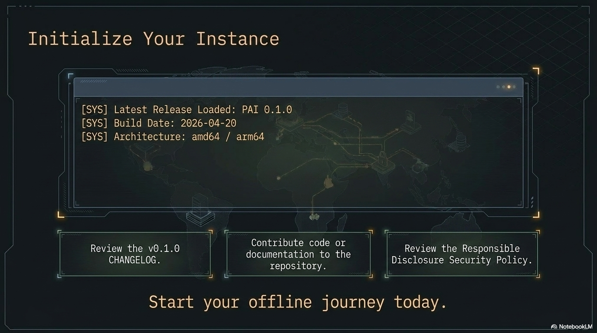
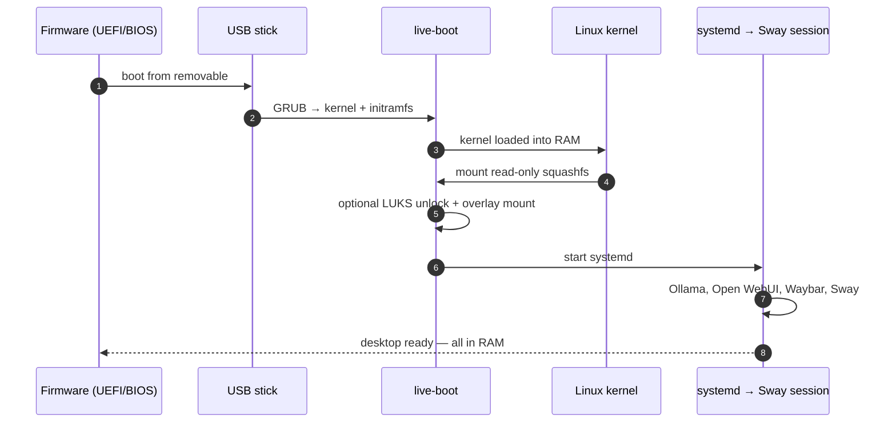

# Getting Started with PAI



This page is the long-form introduction. If you'd rather jump straight
to flashing and booting, see the [quickstart](quickstart.md).

## 1. What is PAI and who is it for?

PAI is a personal AI operating system that runs from a USB stick. You
flash an ISO, plug the stick into any reasonably modern x86_64 machine,
boot from it, and land in a desktop where a local LLM, a browser, a
wallet, and a small set of AI-oriented tools are already wired up and
ready to use.

It's meant for:

- People who want a private, local AI workspace that doesn't depend on
  a cloud provider.
- Researchers and tinkerers who want a reproducible environment to run
  experiments.
- Anyone who wants to carry their AI setup between machines without
  touching the host OS.

PAI does **not** replace your daily driver. It runs alongside it, on
its own stick, and leaves your installed system untouched.


## 2. How PAI boots — a mental model

Three layers, in order:

1. **Firmware** — your machine's UEFI hands control to the USB stick.
2. **Live OS** — a minimal Linux image loads into RAM. Nothing is
   written to your internal disk.
3. **Session** — a Sway desktop starts. Ollama is already running in
   the background. A browser, a terminal, and the PAI launcher are on
   screen.

If you pull the stick out after shutdown, the machine is exactly as you
left it. The only state PAI keeps is whatever you explicitly put on the
stick's persistence partition (see next section).



## 3. What persistence is and why you probably want it

By default PAI is **stateless**: each boot is a clean session. That's
great for demos, visiting machines, or handing the stick to a friend.
It's frustrating if you want to keep chat history, downloaded models,
or browser bookmarks between boots.

Persistence is an optional encrypted partition on the same USB stick.
When enabled, PAI mounts it at first boot and stores:

- Ollama models you've pulled
- Your home directory (chats, configs, downloads)
- Wallet keys
- Browser profile

It's encrypted with a passphrase you set on first boot. Forget the
passphrase and the partition is gone — there is no recovery.

Most users should enable persistence. Skip it only if you genuinely
want the stick to be disposable.


## 4. Your first session — a 10-minute tour

Assume you've followed the [quickstart](quickstart.md) and you're now
sitting at the PAI desktop. Here's the tour.

### Minute 0–2: the desktop

Sway is a tiling window manager. The bar at the bottom shows workspaces
(1–9), the current time, battery, and network. The launcher is bound
to `Super`. There's no "start menu"; everything is a keystroke.


### Minute 2–5: Ollama

Open a terminal (`Super + Enter`). Run:

```
ollama run llama3.2
```

The first prompt has a short pause while the model loads into RAM.
After that it's local, offline, and as fast as your hardware allows.
Type a question. Press `Ctrl+D` to exit.

Models you pull are cached. With persistence enabled, they survive
reboots. Without persistence, they vanish on shutdown.


### Minute 5–7: the browser

The launcher has a "Browser" entry. It opens a hardened browser with
sensible defaults. The browser can talk to your local Ollama via a
small extension — meaning you can chat with your local model from any
web page, without sending anything to a third party.


### Minute 7–10: the wallet

PAI ships with a local wallet for signing and identity. On first run
it generates a keypair, stores it in the persistence partition (if
enabled), and displays a recovery phrase. **Write the phrase down on
paper.** Without it, losing the stick means losing the key.


## 5. What to read next

- [quickstart.md](quickstart.md) — if you haven't flashed yet.
- [architecture.md](architecture/overview.md) — how the pieces fit together.
- [editions.md](editions.md) — which ISO to choose.
- [../FAQ.md](reference/faq.md) — common questions.
- [troubleshooting.md](advanced/troubleshooting.md) — when something breaks.
- [../CONTRIBUTING.md](https://github.com/nirholas/pai/blob/main/CONTRIBUTING.md) — if you want to help.

Welcome aboard.
