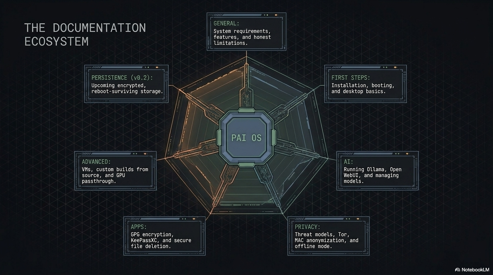

Welcome to the PAI documentation. PAI is a bootable USB Linux distribution that runs Ollama and Open WebUI locally — a complete offline AI workstation that lives entirely in RAM and leaves zero trace on your host machine.

**A complete computer. Anywhere you go.** PAI is an entire operating system — lean enough to fit on a USB stick, powerful enough to run local AI models. Forgot your laptop? Plug PAI into any x86_64 or ARM64 machine and you have your full desktop, your AI, and your tools — wherever you are. Not a rescue disk or a stripped-down appliance: a legit computer that travels on a piece of plastic you can slip into a pocket.

## Quick navigation

-   **New to PAI?**

    ---

    Start with [Installing and Booting](first-steps/installing-and-booting.md), or jump to a platform-specific guide: [macOS](first-steps/starting-on-mac.md), [Windows](first-steps/starting-on-windows.md), [Linux](first-steps/installing-and-booting.md), or [Raspberry Pi](first-steps/using-raspberry-pi-imager.md).

-   **Just booted?**

    ---

    See the [First Boot Walkthrough](first-steps/first-boot-walkthrough.md) for what to expect and [Desktop Basics](first-steps/desktop-basics.md) for how to drive the system.

-   **Want to chat with a model?**

    ---

    [Using Open WebUI](ai/using-open-webui.md) and [Using Ollama](ai/using-ollama.md) cover the two main interfaces.

-   **Something broke?**

    ---

    [Troubleshooting](advanced/troubleshooting.md) is organized by symptom for fast lookup.

## The documentation is organized into seven areas

### 1. General

Foundational understanding of PAI — what it is, what runs on it, what it protects (and doesn't), and how the pieces fit together.

- [**System Requirements**](general/system-requirements.md) — Hardware needed to run PAI
- [**Features and Included Software**](general/features-included.md) — Every app that ships
- [**Warnings and Limitations**](general/warnings-and-limitations.md) — Honest boundaries of the privacy model
- [**How PAI Works**](general/how-pai-works.md) — Architecture, stack, and boot sequence

### 2. First Steps

Getting from "no PAI" to "productive PAI user."

- [**Installing and Booting**](first-steps/installing-and-booting.md) — Flash a USB, boot the system
- [**Raspberry Pi Imager**](first-steps/using-raspberry-pi-imager.md) — Install PAI on a Pi via Imager's custom repository
- [**Starting on Mac**](first-steps/starting-on-mac.md) — UTM setup for Apple Silicon
- [**Starting on Windows**](first-steps/starting-on-windows.md) — PowerShell `flash.ps1` one-liner (with graphical Rufus alternative) or VM setup
- [**First Boot Walkthrough**](first-steps/first-boot-walkthrough.md) — What you see on first launch
- [**Desktop Basics**](first-steps/desktop-basics.md) — Sway, waybar, keyboard shortcuts
- [**Shutting Down**](first-steps/shutting-down.md) — Secure shutdown and memory wipe

### 3. AI

Running, managing, and getting the most out of local AI models.

- [**Using Open WebUI**](ai/using-open-webui.md) — The chat interface
- [**Using Ollama**](ai/using-ollama.md) — CLI, HTTP API, Python SDK
- [**Managing Models**](ai/managing-models.md) — Pull, switch, remove
- [**Choosing a Model**](ai/choosing-a-model.md) — Which model for your hardware

### 4. Privacy

Network and data privacy features — what they do, when to use them, what they don't cover.

- [**Privacy Introduction**](privacy/introduction-to-privacy.md) — Threat model and toolbox overview
- [**Privacy Mode (Tor)**](privacy/privacy-mode-tor.md) — System-wide Tor routing
- [**Tor Browser**](privacy/tor-browser.md) — Anonymous web browsing with fingerprint protection
- [**MAC Address Anonymization**](privacy/mac-address-anonymization.md) — Hardware identifier spoofing at boot
- [**Offline Mode**](privacy/offline-mode.md) — Fully air-gapped workflow

### 5. Apps

Deep dives on the non-AI applications that ship with PAI.

- [**Encrypting Files with GPG**](apps/encrypting-files-gpg.md) — Symmetric and public-key encryption
- [**Password Management**](apps/password-management.md) — KeePassXC on a live system
- [**Secure Delete**](apps/secure-delete.md) — Permanently erasing files (and why SSDs are tricky)

### 6. Advanced

Power-user territory: VMs, custom builds, boot parameters, GPU acceleration.

- [**Running in a VM**](advanced/running-in-a-vm.md) — UTM, VirtualBox, VMware, KVM
- [**Building from Source**](advanced/building-from-source.md) — Make your own PAI ISO
- [**Boot Options**](advanced/boot-options.md) — GRUB and kernel parameters
- [**GPU Setup**](advanced/gpu-setup.md) — NVIDIA, AMD, Intel acceleration
- [**GPU Passthrough**](advanced/gpu-passthrough.md) — GPU in a VM via VFIO
- [**Troubleshooting**](advanced/troubleshooting.md) — Boot, display, AI, network fixes

### 7. Persistence (coming in v0.2)

Optional encrypted storage that survives reboots.

- [**Persistence Introduction**](persistence/introduction.md) — What's planned
- [**Creating Persistence**](persistence/creating-persistence.md) — Setup (v0.2)
- [**Unlocking**](persistence/unlocking.md) — Passphrase management (v0.2)
- [**Backing Up**](persistence/backing-up.md) — Backup strategy (v0.2)

## Reference

- [**Keyboard Shortcuts**](reference/keyboard-shortcuts.md) — Every shortcut in one place
- [**Glossary**](reference/glossary.md) — Terminology used across the docs
- [**FAQ**](reference/faq.md) — Cross-cutting questions

## Not sure where to start?

Pick the path that matches your intent:

### "I want to try PAI without committing"
→ [Starting on Mac](first-steps/starting-on-mac.md) or [Starting on Windows](first-steps/starting-on-windows.md) — run PAI in a VM, no USB flashing required. Safest way to evaluate.

### "I want PAI on my actual hardware"
→ [Installing and Booting](first-steps/installing-and-booting.md) — flash a USB and boot natively for maximum privacy and performance.

### "I want to run PAI on a Raspberry Pi"
→ [Install PAI on Raspberry Pi](first-steps/using-raspberry-pi-imager.md) — add `https://pai.direct/imager.json` as a custom repository in Raspberry Pi Imager and flash to SD card or USB.

### "I want to understand what PAI is first"
→ [How PAI Works](general/how-pai-works.md) + [Warnings and Limitations](general/warnings-and-limitations.md). These two pages together give a complete picture of the system and its boundaries.

### "I want to use the AI"
→ [Using Open WebUI](ai/using-open-webui.md) for the chat interface, or [Choosing a Model](ai/choosing-a-model.md) if you want a bigger model than the default.

### "I want to build or customize PAI"
→ [Building from Source](advanced/building-from-source.md). Covers local and cloud build paths, custom model baking, and repository layout.

### "I'm doing something sensitive and privacy matters"
→ [Privacy Introduction](privacy/introduction-to-privacy.md). Read the threat model first, then pick which privacy tools fit your situation.

## What's new

Latest release: **PAI 0.1.0** (2026-04-20)

- Bootable amd64 and arm64 ISOs with `llama3.2:1b` pre-baked
- Open WebUI rebranded to PAI, fully offline by default
- Sway desktop with waybar, `pai-settings` menu, Tor privacy mode
- ~30 documentation pages covering every subsystem

See the [CHANGELOG](CHANGELOG.md) for the full history and
[Release Notes v0.1.0](https://github.com/nirholas/pai/blob/main/RELEASE_NOTES_v0.1.0.md)
for the download announcement.

## Get involved

- [**Contributing**](https://github.com/nirholas/pai/blob/main/CONTRIBUTING.md) — How to contribute code or docs
- [**Issues**](https://github.com/nirholas/pai/issues) — Report a bug or request a feature
- [**Roadmap**](roadmap.md) — What's coming next
- [**Security Policy**](security.md) — Responsible disclosure
