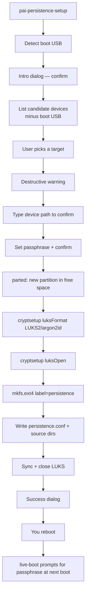

**This guide walks through creating an encrypted persistence partition on a second USB stick using the `pai-persistence-setup` wizard. The wizard is a five-step graphical flow: confirm the boot USB, pick a target device, acknowledge a destructive warning, type the device path to confirm, and set a passphrase. The result is a LUKS2/argon2id partition labeled `persistence`, ready to be mounted by Debian live-boot on the next reboot.** Plan about ten minutes, have a second USB stick ready, and pick a passphrase you can actually remember — this guide covers everything else.

In this guide:
- What you need before starting (second USB, passphrase plan, ~10 minutes)
- Running the `pai-persistence-setup` wizard end to end
- Every safety check the wizard enforces and why each one exists
- The default `persistence.conf` layout and how to customize it before first boot
- Verifying the partition was created correctly
- Troubleshooting common setup failures
- A full tutorial: fresh boot to unlocked persistence in under ten minutes

**Prerequisites**: PAI v0.2 or later, booted from a USB stick, with a graphical desktop (the wizard is zenity-based and requires a display). A second USB stick at least 1 GiB in size, which will be reformatted. You do not need prior experience with LUKS or `cryptsetup` — the wizard owns the destructive commands.

## Before you begin

Have these ready before you start the wizard:

- **A second USB stick.** The setup wizard refuses to target the USB you booted PAI from. This is a safety property, not a bug — resizing a live-booted USB can corrupt the boot image. Persistence lives on its own stick.
- **Minimum size: 1 GiB.** The wizard rejects anything smaller. Realistic sizes depending on use:
  - **8 GB** — minimal, holds Open WebUI state and Wi-Fi creds but limited Ollama model space
  - **32 GB** — comfortable daily driver: a few models, full chat history, Wi-Fi
  - **128–256 GB** — a serious offline model library with room for home-directory persistence
- **A passphrase plan.** Strong, memorable, irreplaceable. Diceware (6 or more random words) or a 20+ character random string are both good. The wizard enforces an 8-character minimum, but 8 characters is the floor, not the goal.
- **Ten minutes.** Most of the time is wizard clicks and the `mkfs.ext4` step — not a long wait on modern hardware.
- **Backup of anything on the target USB.** The wizard writes a new partition in the free space, but if you're reusing a stick with other data on it, **back up first**.

!!! danger

    The target USB's free space will be **erased** when the new partition is created. If the stick has other data, back it up to another drive before starting the wizard.


## What the wizard does, at a glance



Each step is a separate dialog with a clear cancel button. Nothing destructive happens until after you've typed the target device path and confirmed your passphrase twice.

## Running the setup wizard


1. **Open a terminal.** From the Sway desktop, press `Alt+Enter` or click the terminal icon in the waybar.

2. **Launch the wizard:**

    ```bash
    # Either command works; the first is the user-facing shortcut.
    pai-persistence setup
    # or directly:
    sudo pai-persistence-setup
    ```

    The wizard re-executes itself under `sudo` if you didn't run it as root. You'll see the system password prompt in a Polkit dialog.

3. **Read the intro dialog.** The first dialog confirms the boot USB that the wizard is protecting. Example text:

    ```
    This wizard creates an encrypted persistence partition on a USB drive.

    Your boot USB is: /dev/sda

    The wizard will refuse to target the boot USB to protect it.

    Continue? [Continue] [Cancel]
    ```

    Click **Continue**. Cancel at any step is safe — nothing has been written yet.

4. **Pick the target device.** The wizard shows a list of eligible whole-disk devices with their sizes and current mountpoints. The boot USB is excluded from the list. A device is eligible when all of these are true:

    - It's a whole disk (not a partition on a disk)
    - It's not the boot USB
    - It has no currently-mounted partitions
    - It is at least 1 GiB
    - It is not read-only

    Pick the USB you dedicated to persistence and click OK.

    ```
    Choose the device to receive the persistence partition.
    The boot USB (/dev/sda) is excluded from this list.

    Device     Size      Mounted at
    /dev/sdb   32.0G     -
    ```

5. **Acknowledge the destructive warning.** The next dialog is a warning that the target stick's free space will be erased. Confirm you have a backup (if relevant) and click **Yes, I have a backup**.

6. **Type the device path to confirm.** The wizard asks you to type the exact device path it plans to modify — for example, `/dev/sdb`. Typing the path is the hard-to-undo confirmation step: it forces you to look once more before you commit.

    ```
    To confirm, type the full device path below:

    /dev/sdb

    [                    ]
    ```

    Typing anything other than the exact path aborts the wizard with no changes made.

7. **Set your passphrase.** Two password prompts follow. The first takes your passphrase; the second asks you to retype it. If they don't match, the wizard aborts. Minimum length is 8 characters, but you should exceed that comfortably.

    !!! tip

        Use diceware: roll dice against a word list (EFF's long list is the usual choice) and string six or seven words together. Six words gives ~77 bits of entropy — strong against every practical attack. Seven words puts you past anything short of a nation-state. Write the passphrase down on paper, physically, until you've committed it to muscle memory.


8. **Wait for the destructive work.** With both the typed confirmation and the passphrase in hand, the wizard runs the actual partition and format steps. This is the slowest part — typically 30 seconds to three minutes depending on USB write speed.

    The steps the wizard runs, in order:

    ```bash
    # 1. Add a new partition covering the free space at the end of the disk
    parted -s -a optimal /dev/sdb -- unit MiB mkpart primary <start>MiB 100%

    # 2. Let the kernel see the new partition
    partprobe /dev/sdb
    udevadm settle

    # 3. LUKS2 format with argon2id KDF and 4096-byte sectors
    cryptsetup luksFormat --type luks2 --pbkdf argon2id \
        --sector-size 4096 --batch-mode /dev/sdb2

    # 4. Open the LUKS container
    cryptsetup luksOpen /dev/sdb2 pai-persist-setup

    # 5. ext4 filesystem, labeled "persistence" (this is what live-boot looks for)
    mkfs.ext4 -L persistence /dev/mapper/pai-persist-setup

    # 6. Mount it, write persistence.conf, create per-path source subdirs, sync
    mount /dev/mapper/pai-persist-setup /mnt/pai-persist-setup
    # ... writes persistence.conf ...
    # ... mkdir each source=<dir> ...
    sync

    # 7. Close cleanly
    umount /mnt/pai-persist-setup
    cryptsetup luksClose pai-persist-setup
    ```

9. **Success dialog.** When the wizard finishes, it shows:

    ```
    Encrypted persistence created on /dev/sdb.

    Reboot to activate. You will be prompted for your passphrase at boot.
    ```

    Click OK.


## What the wizard wrote

The new partition contains a single file at its root, `persistence.conf`, plus empty source directories for each persisted path. The shipped default looks like this:

```ini
# /var/lib/ollama — Ollama model cache (can grow to tens of GB)
/var/lib/ollama                             source=ollama-models

# /var/lib/open-webui — Open WebUI chat history, users, settings
/var/lib/open-webui                         source=webui-data

# /etc/NetworkManager/system-connections — saved Wi-Fi and VPN configs
/etc/NetworkManager/system-connections      source=wifi-creds

# --- OPT-IN: uncomment to enable ---
#/home/pai                                  source=home
#/var/log                                   source=system-logs
```

Each line means: "on boot, bind-mount the persistence partition's `<source>` subdirectory over `<target-dir>`." The source subdirectories (`ollama-models`, `webui-data`, `wifi-creds`) are created empty. Live-boot does the rest on the next reboot.

See the [persistence.conf.example](https://github.com/nirholas/pai/blob/main/shared/includes/etc/pai/persistence.conf.example) in the PAI source tree for the authoritative template.

### Enabling `/home/pai` persistence before first boot

If you know from the start that you want home-directory persistence, the easiest moment to enable it is **before** the first reboot — while the wizard's just-formatted partition is still easy to mount. From a terminal:

```bash
# Re-open the just-created partition (replace /dev/sdb2 with the new partition)
sudo cryptsetup luksOpen /dev/sdb2 pai-persist
sudo mount /dev/mapper/pai-persist /mnt

# Uncomment the /home/pai line
sudo sed -i 's|^#/home/pai|/home/pai|' /mnt/persistence.conf
sudo mkdir -p /mnt/home

# Close cleanly
sudo umount /mnt
sudo cryptsetup luksClose pai-persist
```

You can also edit `persistence.conf` at any point in the future from a running PAI session with persistence unlocked. See [unlocking persistence](unlocking.md) for the editing workflow.

!!! warning

    Changes to `persistence.conf` only take effect on the **next** reboot. Live-boot reads the config during initramfs, before userspace starts.


## Reboot to activate


1. **Shut down PAI cleanly.** Use the waybar power menu or run `pai-shutdown` from a terminal. A clean shutdown ensures all writes to the just-created partition are flushed.

2. **Leave both USB sticks plugged in.** The boot USB stays where it is. The new persistence USB stays in its port.

3. **Power on.** GRUB loads, the kernel starts, and the initramfs detects a partition labeled `persistence`.

4. **Enter your passphrase at the prompt.** Live-boot prompts you in a plain text console before the graphical desktop loads:

    ```
    Please unlock disk persistence:
    ```

    Type your passphrase. You won't see the characters — this is normal.

5. **Desktop loads.** If the passphrase was correct, live-boot unlocks the partition and bind-mounts the persisted paths before starting systemd. Sway starts normally. The waybar shows **[💾 Persist]** to confirm.

6. **Verify from a terminal:**

    ```bash
    # State marker should exist
    ls /run/pai-persistence-active
    # Expected: the file exists (empty)

    # Status report
    pai-persistence status
    ```

    Expected output:

    ```
    Persistence: ACTIVE
      /var/lib/ollama: persisted
      /var/lib/open-webui: persisted
      /etc/NetworkManager/system-connections: persisted
    ```


From this point on, every file written to a persisted path lands on the encrypted partition. Every Ollama model you pull stays. Every Open WebUI chat persists. Every Wi-Fi network remembers itself.

## Tutorial: setup to unlocked persistence in under ten minutes

**Goal**: Go from a freshly booted PAI to an unlocked persistent PAI with `llama3.2:1b` model saved across reboots.

**What you need**:
- PAI booted from its boot USB
- A second, empty USB stick at least 1 GiB (32 GB recommended)
- A passphrase plan (pick one now — six diceware words)


1. **Launch the wizard.** Open a terminal and run:

    ```bash
    pai-persistence setup
    ```

2. **Click through the wizard.** Confirm the boot USB, pick your second USB from the list, acknowledge the warning, type `/dev/sdb` (or whatever device path is shown), and enter your passphrase twice. Wait for the success dialog.

3. **Shut down and reboot.**

    ```bash
    pai-shutdown
    ```

    Power back on. At the unlock prompt, enter your passphrase.

4. **Confirm persistence is active:**

    ```bash
    pai-persistence status
    ```

    Expected:

    ```
    Persistence: ACTIVE
      /var/lib/ollama: persisted
      /var/lib/open-webui: persisted
      /etc/NetworkManager/system-connections: persisted
    ```

5. **Pull a model.** Connect to Wi-Fi, then:

    ```bash
    ollama pull llama3.2:1b
    ollama list
    ```

    Expected:

    ```
    NAME              ID              SIZE      MODIFIED
    llama3.2:1b       a2af6cc6c18c    1.3 GB    1 minute ago
    ```

6. **Reboot and prove persistence worked.**

    ```bash
    pai-shutdown
    ```

    Power on, enter your passphrase, then:

    ```bash
    ollama list
    ```

    The model is still there. That's persistence working.


**What just happened?** Live-boot mounted your encrypted partition's `ollama-models` subdirectory over `/var/lib/ollama` during early boot. Ollama's on-disk state writes went to the encrypted USB instead of RAM. The reboot wiped RAM but not the USB — so the models came back on the next unlock.

**Next**: [backing up persistence](backing-up.md) so this state survives the loss of the USB stick, not just a reboot.

## Things that can go wrong

### "No eligible target devices found"

The wizard saw no USB stick that satisfies the safety checks. Causes:

- Only the boot USB is plugged in. **Fix**: plug in a second USB stick.
- The second stick is mounted somewhere (often an auto-mount to browse it in Thunar). **Fix**: unmount with `sudo umount /dev/sdX1` and rerun the wizard.
- The second stick is smaller than 1 GiB. **Fix**: use a larger stick.
- The second stick is read-only (SD card lock switch, failing hardware). **Fix**: unlock the switch or use a different stick.

### "parted failed on /dev/sdX"

The partition table couldn't be modified. Causes:

- The stick already has four primary MS-DOS partitions and no room for a fifth. **Fix**: reformat the stick to GPT or wipe it first:
  ```bash
  sudo wipefs -a /dev/sdX
  ```
- The stick is a card reader presenting a removable media that isn't fully inserted. **Fix**: reseat the card and retry.

### "cryptsetup luksFormat failed"

The LUKS format step couldn't complete. Most common causes:

- A flaky USB stick with bad sectors. Try a different stick — cheap USBs fail silently under sustained writes.
- Insufficient memory for argon2id. The PBKDF auto-calibrates to available memory; if PAI is running in less than the recommended RAM, reduce memory pressure (close Firefox, stop Ollama) and retry.

### "Passphrase not accepted on next boot"

You entered the passphrase during setup but the initramfs unlock rejects it. Causes:

- **Keyboard layout mismatch.** If you set up under one layout and boot under another, the typed characters differ. PAI uses a US layout by default at the initramfs stage. If you chose non-US characters in your passphrase, try typing the passphrase as if your layout were US.
- **Caps Lock was on during setup but off during boot** (or vice versa). Try both.
- **A leading or trailing space in the passphrase.** Shell prompts strip whitespace; zenity does not. If you remember pasting the passphrase, check for accidental whitespace.

After three wrong attempts, PAI boots ephemerally. You can try again on the next boot — there is no lockout.

### Wizard exits with "Typed value did not match"

The typed device-path confirmation step has to match exactly. `/dev/sdb` and `/dev/sdb1` are different. `/dev/sdb ` (with trailing space) is different. Read the dialog carefully and retype. This is a safety feature, not a bug.

### The wizard can't find zenity or a display

The wizard is graphical only. It refuses to run in a non-graphical SSH session or TTY. If you need persistence on a headless PAI, the underlying commands (`parted`, `cryptsetup luksFormat`, `mkfs.ext4`, writing `persistence.conf`) are documented above — you can run them by hand. But the default path is: boot into the graphical PAI desktop and run the wizard there.

## Safety checklist (last call)

Before you click "format" or type the device path, verify:

- **Correct target device.** Run `lsblk` in a second terminal and confirm the target is the stick you meant.
- **Passphrase is recorded somewhere safe.** A paper note in a drawer, a second password manager, an encrypted backup on a different medium. Anywhere but only-in-your-head, until you've boot-tested it a dozen times.
- **Any data on the target stick is backed up.** The wizard writes a partition in free space, but in practice most users targeting a "second stick" wipe it; budget for losing whatever's on it.
- **You understand the recovery story.** Forgotten passphrase = lost data, period. Back up what matters (see [backing up persistence](backing-up.md)).

## Frequently asked questions

### How long does the wizard take?
Typically 30 seconds to three minutes, depending on USB write speed. The `mkfs.ext4` step is the slowest on large partitions. The LUKS format itself is fast — argon2id spends most of its time on key derivation, which is a single operation.

### Can I run the wizard again after setup is done?
Yes, but be careful — running it again on the same target will create _another_ partition in the remaining free space, or fail if there's no free space left. To re-create persistence from scratch, wipe the partition first (`sudo wipefs -a /dev/sdb2`) or reformat the LUKS container in place (`sudo cryptsetup erase /dev/sdb2`). Both destroy the old passphrase and data.

### Can I set up persistence on an external SSD instead of a USB stick?
Yes. The wizard treats any block device the same way: USB sticks, SD cards, external SSDs, even internal drives. The only constraint is that the device is not the PAI boot device. An external SSD gives much better write speeds for the Ollama model cache.

### Why does the wizard refuse to put persistence on my PAI boot USB?
Two reasons: (1) resizing a live-booted USB partition can corrupt the running OS, and (2) the PAI ISO is written as a block image — there is no free space at the end of the device to carve a new partition from. The "second USB" model is simpler and safer. It also lets you swap boot USBs (upgrade PAI versions) without touching your persistence data.

### Can I change the default persistence layout before first boot?
Yes — the guide above shows how to mount the just-formatted partition and edit `persistence.conf`. You can add, remove, or uncomment lines before the first reboot. You can also do this later at any time from a running PAI; changes take effect on the next reboot.

### What if I only want to persist Ollama models, not chat history?
Edit `persistence.conf` on the partition and remove the line for `/var/lib/open-webui`. Save, reboot. Only the paths listed in `persistence.conf` are persisted — everything else stays in RAM.

### Does the wizard delete the whole target USB?
No. The wizard creates a **new partition** in free space at the end of the target device. Existing partitions are left untouched. However, if you're reusing a stick that previously had a non-partitioned filesystem, or if you want a clean start, wipe it first with `sudo wipefs -a /dev/sdX`.

### Can I use persistence without the wizard?
Yes — the wizard just automates the standard Debian live-boot persistence setup. The manual steps are: create a partition labeled `persistence`, format it with LUKS2, create an ext4 filesystem labeled `persistence` inside, and write a `persistence.conf` at the root. The wizard enforces safety checks (refusing the boot device, typed confirmation) that a manual setup skips.

### Why LUKS2 and argon2id specifically?
LUKS2 adds per-slot metadata and per-keyslot KDFs compared to LUKS1. argon2id is the current best-practice password-based KDF — memory-hard, resistant to GPU and ASIC attacks, and the winner of the Password Hashing Competition. Using argon2id means a shorter passphrase is defensible than it would be under an older KDF like PBKDF2.

### Can I create multiple persistence partitions for different threat models?
Not easily. Debian live-boot mounts the first partition it finds labeled `persistence`. A second labeled partition is ignored. For a "work" and "personal" split, the practical pattern is two separate USB sticks and swap them at boot.

## Related documentation

- [**Persistence introduction**](introduction.md) — What persistence is and
  when it's the right tool
- [**Unlocking persistence**](unlocking.md) — Day-to-day usage, changing
  passphrases, and editing `persistence.conf`
- [**Backing up persistence**](backing-up.md) — How to protect against the
  loss of the USB stick itself
- [**First boot walkthrough**](../first-steps/first-boot-walkthrough.md) —
  What every PAI session looks like from boot to desktop
- [**Managing Ollama models**](../ai/managing-models.md) — Pulling and
  organizing the models that persistence saves across reboots
- [**Warnings and limitations**](../general/warnings-and-limitations.md) —
  What persistence changes about the PAI threat model
