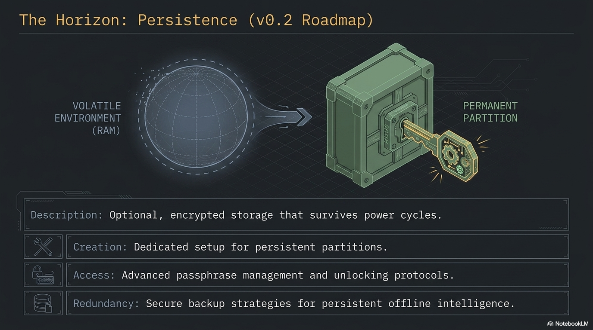
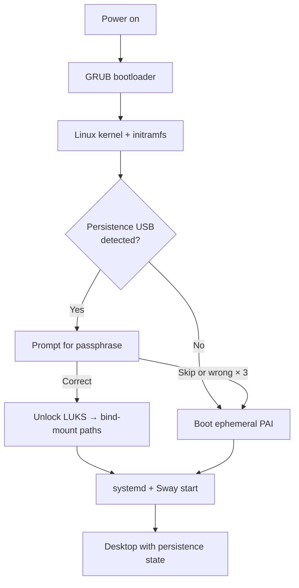

**PAI persistence is an optional, LUKS-encrypted second partition that saves a small, specific set of directories across reboots — your Ollama models, your Open WebUI chat history, and your saved Wi-Fi networks — while the rest of the operating system stays live and read-only.** It lets you keep the parts of your session that are expensive or inconvenient to rebuild, without giving up the anti-forensics properties that make PAI useful in the first place. Every boot you still choose: unlock persistence and resume where you left off, or skip the passphrase and get a clean ephemeral PAI.



In this guide:
- What persistence is, what it saves, and what it deliberately does not save
- The trade-offs against the default RAM-only boot
- The encryption model (LUKS2 with argon2id) and why passphrase choice matters
- The unlock flow on each boot and how to tell whether persistence is active
- When persistence is the right tool — and when staying ephemeral is safer
- How persistence interacts with [privacy mode](../privacy/privacy-mode-tor.md), [offline mode](../privacy/offline-mode.md), and backups

**Prerequisites**: A working PAI boot. A second USB stick (at least 1 GiB) if you plan to set persistence up — PAI refuses to put the persistence partition on the same USB it booted from, by design. No prior LUKS or Debian live-boot experience required.

## What PAI persistence is

By default, PAI is a **live system**: it boots into RAM, runs entirely from memory, and forgets everything the moment you reboot. No trace of your session is written to disk. This is the right default for privacy, but it is inconvenient for real daily use — every boot starts from zero, every Ollama model has to be re-downloaded, every Wi-Fi password has to be re-typed.

Persistence solves that without breaking the live-system model. It is a **second, encrypted partition** — on a separate USB stick from the one you booted from — that Debian live-boot mounts on top of a short list of directories when you enter the correct passphrase. The base operating system stays read-only and unchanged. Only the specific paths you opted in to save are redirected onto the encrypted partition.

!!! tip

    Think of it as a transparent overlay. The live OS is a sealed read-only disc. Persistence is a small encrypted notebook that live-boot clips onto a few predefined pages of that disc. Remove the notebook and the disc reads the same as it did on day one.


The same feature, shipped with Debian live-boot, is what Tails OS uses for its persistent volume. PAI uses the same mechanism with a PAI-specific default layout and a guided setup wizard.

## What persists by default

The default `persistence.conf` shipped by PAI enables three directories:

| Path | What is saved | Why it's on by default |
|---|---|---|
| `/var/lib/ollama` | All Ollama models you have pulled | Model downloads are large (1 GB to 70 GB) and slow |
| `/var/lib/open-webui` | Open WebUI chat history, users, settings | Loss of chat history is the most painful reboot cost |
| `/etc/NetworkManager/system-connections` | Saved Wi-Fi networks and VPN configs | Re-typing Wi-Fi passwords on every boot is friction with no privacy benefit |

Two additional directories are **opt-in**, commented out in the shipped config and ready to be enabled by hand:

- `/home/pai` — your dotfiles, browser profile, `~/Documents`, `~/Downloads`. Saving this turns PAI into a much more traditional desktop, at the cost of the anti-forensics posture.
- `/var/log` — systemd journal. Useful for debugging a repeating boot problem, hostile to privacy.

You can add any path by editing `persistence.conf` on the encrypted partition. See [creating persistence](creating-persistence.md) for the full file format and [unlocking](unlocking.md) for how to edit the config after setup.

## What does NOT persist

Persistence is intentionally narrow. These things are **never** written to the encrypted partition, even if persistence is unlocked:

- **The base OS.** Binaries, kernels, systemd units, the Sway config — all come from the read-only squashfs on the boot USB. You cannot accidentally corrupt the OS by using persistence.
- **`/tmp` and `/var/tmp`.** Always in RAM. Always wiped on shutdown.
- **Process state.** Open applications close when you shut down. You resume with a fresh desktop.
- **Anything not listed in `persistence.conf`.** If you wrote a file to `/opt/something` and did not add `/opt/something` to the config, the file is gone after reboot.
- **Swap.** PAI does not use a swap partition on the live system, and persistence does not create one.
- **Installed packages, by default.** Running `sudo apt install foo` installs `foo` for the current session only. Persisting `/var/lib/dpkg` and related dirs is possible but not a supported default — it creates update conflicts across PAI releases.

!!! warning

    Persistence saves _data_, not _installations_. If you want a package available on every boot, add it to the PAI image (build from source) rather than trying to persist it.


## How persistence changes your threat model

Enabling persistence is a real trade-off. It is worth thinking through before you set it up.

=== "With persistence"

Pros:
- Your Ollama model library survives reboots. A 20 GB model pulled once stays on disk forever.
- Open WebUI chat history, user accounts, and settings carry across sessions.
- Saved Wi-Fi networks reconnect automatically.
- Opt-in home directory persistence means PAI can replace a traditional laptop install.

Cons:
- Your USB stick now stores identifying data. If someone gets physical possession of the stick _and_ your passphrase, they have your work.
- One more passphrase to remember. Forget it and the data is gone — there is no recovery.
- Losing the USB stick (theft, breakage, a coffee spill) means losing everything not backed up.
- The anti-forensics story weakens: a cold forensic capture of the encrypted partition is not readable today, but it _exists_ and can be attacked with future tools or a leaked passphrase.

=== "Without persistence (default)"

Pros:
- Maximum anti-forensics. Every session starts clean. There is nothing to image, decrypt, or subpoena from a cold machine.
- No passphrase to manage, lose, or be compelled to produce.
- Physical discovery of the USB tells an attacker only that you have PAI — not what you did with it.
- Every session's mistakes (accidental download, opened attachment) vanish on reboot.

Cons:
- Re-pulling Ollama models on every session.
- Re-typing Wi-Fi passwords.
- Chat history lost at shutdown.
- PAI cannot fully replace a traditional work machine.


The sensible rule: **default to ephemeral, enable persistence only when the cost of re-building state exceeds the cost of carrying encrypted data.** For a daily-driver AI workstation, that threshold is low and persistence makes sense. For a one-off sensitive session (journalism source meeting, legal review, travel through a hostile network), stay ephemeral.

## Encryption model

PAI persistence is built on standard Linux Unified Key Setup, version 2:

- **LUKS2 container** on a dedicated partition labeled `persistence`.
- **Cipher**: AES-256 in XTS mode (the cryptsetup default).
- **Key derivation function**: **argon2id**, which is memory-hard and resistant to GPU and ASIC attacks. This is the single most important choice in the setup — it is why a medium-strength passphrase is acceptable here where it would be weak against older KDFs.
- **Sector size**: 4096 bytes, for better performance on modern flash.
- **Filesystem**: ext4 inside the LUKS volume, labeled `persistence`.

The LUKS container supports **up to eight key slots**. You can add a backup passphrase, change passphrases without rewriting data, and revoke compromised slots — all covered in [unlocking persistence](unlocking.md).

!!! danger

    There is no backdoor, no master key, and no recovery service. If you lose every passphrase in every active key slot, the data is mathematically unrecoverable. Back up what you cannot afford to lose. See [backing up persistence](backing-up.md).


## How the unlock prompt works

The actual LUKS unlock happens in the **initramfs**, before userspace starts, triggered by two kernel command-line parameters that PAI ships in its GRUB config:

```
persistence persistence-encryption=luks
```

At boot you see:



- **Passphrase correct** → LUKS unlocks, live-boot bind-mounts the paths listed in `persistence.conf`, and the desktop starts with your previous state.
- **Passphrase skipped (Esc / empty)** → PAI boots clean with no persistence this session. The encrypted partition is never opened and leaves no trace on disk.
- **Wrong passphrase** → three attempts, then PAI boots clean. No data loss, no lockout — just an ephemeral session.

This is **per-session opt-in**. You decide at every boot whether this is a "resume my work" session or a "clean slate" session. Persistence is set up once and used on demand.

## The waybar indicator

After boot, the PAI waybar shows a persistence status indicator:

- **[💾 Persist]** — persistence is active, the bind-mounts are in place, and writes to persisted paths are landing on the encrypted partition.
- *(no badge)* — this is an ephemeral session. Anything you write outside `/tmp` lives in RAM and dies at shutdown.

The indicator reads a single file at `/run/pai-persistence-active`, created by `pai-persistence unlock` once live-boot's bind-mounts have been verified. You can check the same state from a terminal:

```bash
# Human-readable state report
pai-persistence status
```

Expected output when active:

```
Persistence: ACTIVE
  /var/lib/ollama: persisted
  /var/lib/open-webui: persisted
  /etc/NetworkManager/system-connections: persisted
```

Expected output when ephemeral:

```
Persistence: OFF (session is ephemeral)
```

## When to use persistence — and when not to

Good fits:

- **Daily-driver use of PAI.** You boot it most mornings, pull new models occasionally, and want your chat history to survive.
- **Maintaining a local model library.** Once you've pulled `qwen2.5:14b` once, you don't want to pull it again.
- **Long-lived projects.** A journalist working on a sustained investigation, a developer iterating on code over weeks, a researcher building up a corpus of Open WebUI conversations.
- **Home machines.** Where "someone might steal my USB" is a lower-probability threat than "I'm tired of re-configuring Wi-Fi."

Bad fits:

- **Shared or public machines.** A persistence partition on a USB you plug into other computers may leak metadata via the host OS's disk-cache and USB-history traces.
- **High-threat travel.** When crossing a border or attending an adversarial event, an ephemeral PAI is a better answer than an encrypted one — "nothing to decrypt" is stronger than "refused to decrypt."
- **One-off sensitive sessions.** Source meetings, legal review of privileged material, incident response on a compromised network — the clean-slate property is more valuable than the convenience.
- **Machines without a reliable USB port.** Debian live-boot's persistence detection runs in early boot and does not retry forever. Flaky USB hardware can cause confusing unlock failures.

## Persistence and privacy mode

Persistence and [privacy mode (Tor)](../privacy/privacy-mode-tor.md) are **orthogonal**. Privacy mode is about your _network_ — where your packets go. Persistence is about your _storage_ — what survives a reboot. The four combinations are all valid:

| Persistence | Privacy mode | What it is |
|---|---|---|
| Off | Off | Default ephemeral PAI, normal networking |
| Off | On | Most paranoid — clean state + Tor |
| On | Off | Daily driver with saved state |
| On | On | Saved state + Tor (your identity is in persistence, your network is anonymous) |

Similarly, [offline mode](../privacy/offline-mode.md) is independent of persistence. You can run an air-gapped session with a fully loaded persistence partition — the models and chat history are local, the network is physically disconnected, and nothing leaves the machine.

## What to do next

1. Decide whether persistence is right for your workflow. If you are unsure, **stay ephemeral for a week first** — you may find you need it less than you expect.
2. Get a second USB stick, at least 1 GiB, dedicated to persistence. Larger if you plan to keep Ollama models (plan for 32 GB or more if you want a real model library).
3. Choose a passphrase you can actually remember. You will type it on every boot.
4. Follow [creating persistence](creating-persistence.md) for the guided setup.
5. Once persistence is active, set up a [backup routine](backing-up.md). Untested backups are theory, not backups.

## Frequently asked questions

### Does PAI persistence encrypt my data?
Yes. Persistence uses LUKS2 with AES-256 in XTS mode and argon2id key derivation. The entire partition is encrypted — filesystem metadata, file contents, free space. Without the passphrase, the partition looks like random noise. See the [encryption model](#encryption-model) section above.

### Can I enable persistence after I've been using PAI for a while?
Yes. Persistence is a one-time setup you can run at any point. Existing ephemeral sessions are unaffected — the partition is created on a second USB stick, and the change takes effect on the next reboot. Follow [creating persistence](creating-persistence.md) when you're ready.

### Can persistence live on the same USB stick as PAI itself?
No — and this is deliberate. The setup wizard refuses to target the same USB PAI booted from, because resizing a mounted live partition risks corrupting the boot image. PAI persistence lives on a second USB stick that you plug in alongside your PAI boot USB. Both sticks stay plugged in during use.

### What happens if I forget my persistence passphrase?
The data is gone. LUKS has no recovery mechanism by design. You can reformat the partition and start over, but the previous contents are permanently unreadable. This is why [backing up persistence](backing-up.md) is part of the setup, not an afterthought.

### Does persistence save my browser history?
Only if you opt in to persisting `/home/pai`. The default layout persists AI-related state (Ollama models, Open WebUI history, Wi-Fi) but leaves the browser profile in RAM. Edit `persistence.conf` on the encrypted partition to uncomment the `/home/pai` line if you want full dotfile persistence.

### Can I use persistence with [privacy mode](../privacy/privacy-mode-tor.md) or [offline mode](../privacy/offline-mode.md)?
Yes. Persistence is about storage; privacy mode and offline mode are about networking. All combinations work. A common pattern: persistence on for your saved models and chat history, privacy mode on for anonymous browsing during the same session.

### Is persistence the same as installing PAI to a disk?
No. Persistence is a small overlay, not a full install. The base OS remains a read-only live image — you cannot customize it, update it in place, or break it by persistence misconfiguration. A full install is not a supported PAI mode; PAI is designed to run live with optional persistence as the only writable surface.

### How big should my persistence USB be?
At least 1 GiB (enforced minimum). For a realistic daily-driver: 32 GB is comfortable for a small model library and chat history. 128 GB or 256 GB if you want to keep a wide selection of Ollama models. Home-directory persistence on top of that adds whatever you put in `~/Documents` and `~/Downloads`.

### Does persistence slow down PAI?
Slightly, on writes to persisted paths. Reads from the persisted paths are typically indistinguishable from a non-persistent boot because Linux caches aggressively in RAM. Writes to Ollama's model cache hit the USB stick's real write speed — cheap sticks may noticeably bottleneck large downloads.

### Can someone see my data if they find the USB stick?
Only if they also have the passphrase, or can force you to produce it. Without the passphrase, the partition is indistinguishable from random data. The `persistence` label and LUKS2 header reveal that _something_ encrypted exists on the stick, but nothing about its contents. Plausible deniability of the _existence_ of persistence requires more than LUKS alone — see Tails' hidden-volume discussions for trade-offs.

## Related documentation

- [**Creating persistence**](creating-persistence.md) — Step-by-step wizard
  walkthrough for first-time setup
- [**Unlocking persistence**](unlocking.md) — Day-to-day usage: unlocking,
  changing passphrases, adding key slots, status checks
- [**Backing up persistence**](backing-up.md) — How to back up the encrypted
  partition safely and test the restore path
- [**Introduction to PAI privacy**](../privacy/introduction-to-privacy.md) —
  Threat models and where persistence fits in them
- [**Offline mode**](../privacy/offline-mode.md) — Running PAI air-gapped,
  with or without persistence
- [**Warnings and limitations**](../general/warnings-and-limitations.md) —
  What PAI does and does not protect against
