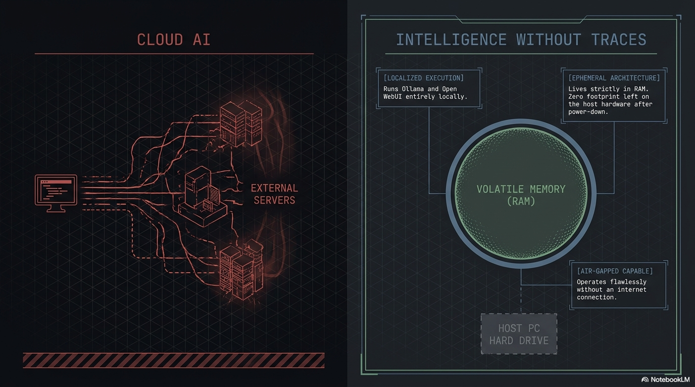
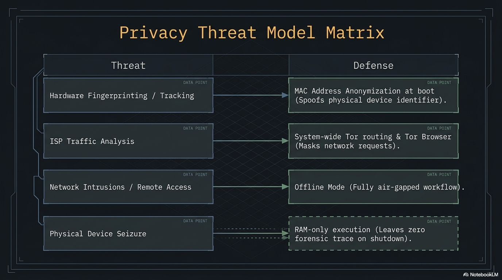
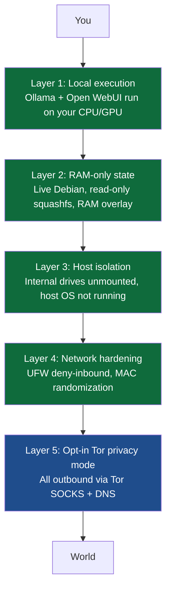

**PAI makes privacy the default, not the feature.** Your AI, your keys, your OS — running on your hardware, in your pocket, answering to no one but you. This guide walks through exactly how that works, and gives you the commands to verify every claim in under five minutes.

Your AI conversations should belong to you. Not to a cloud provider, not to a telemetry service, and not to a future employer poking through your browser history. **PAI** is a bootable USB Linux distribution that runs large language models entirely on your own hardware, keeps every byte of state in RAM by default, and ships with a layered network-privacy stack you control. This page explains exactly what PAI's privacy model protects against, where it stops, and how to verify every claim on this page in under five minutes.

**The short version:** PAI keeps your AI private by design. Prompts run on your hardware. Session state lives in RAM. The host disk stays untouched. Networking defaults to deny-inbound, randomized MAC, and one-command Tor when you want it. Every one of those claims is verifiable from the terminal in under five minutes — you don't have to take our word for any of it.





In this guide:
- The PAI threat model: what is in scope, partially in scope, and out of scope
- The four pillars of PAI privacy (local execution, RAM-only state, layered network privacy, host isolation)
- The privacy toolbox: every privacy tool shipped in PAI and when to reach for it
- A five-minute tutorial to verify PAI's privacy claims on your running system
- How PAI compares to a regular laptop, Tails, Qubes, and a true air-gapped machine
- What traces PAI does leave (because honesty beats marketing)

**Prerequisites**: PAI booted and running, or the willingness to take the commands on faith while you read. No security background required. If you have booted a live Linux USB before, you already know more than enough.

---

## What does privacy mean on PAI?

When most people say "private AI", they mean one of three different things: **confidentiality** (nobody else reads my prompts), **anonymity** (nobody knows the prompts came from me), and **unlinkability** (nobody can connect two of my sessions). PAI is designed to deliver strong **confidentiality** by default, opt-in **network anonymity** through Tor, and session-level **unlinkability** through the RAM-only live-system model.

PAI is a private AI workstation, purpose-built for the job: running large models locally, keeping your keys on-device, and leaving no footprint on the hardware it boots. It sits alongside tools like Tails, Whonix, and Qubes, each of which solves a different problem. PAI is not a drop-in replacement for them, and this guide is written so you know exactly which battles PAI fights and which ones it does not.

!!! note

    If you want a one-sentence summary: PAI stops your AI prompts from leaving your machine, stops your host operating system from keeping a record, and lets you opt into Tor for network-level privacy. It does not make you anonymous to a determined network observer.


---

## The PAI threat model

Every privacy product has a threat model: the list of adversaries it defends against. A product without a published threat model is selling vibes. Here is PAI's.

### What PAI protects against



Each layer is independent. If one layer fails or is bypassed, the others still hold. Tor is opt-in because many PAI users want speed and have no reason to obfuscate the fact that they are on the internet; when you do need it, `pai-privacy on` flips the whole stack.

### Threat matrix

| Threat | In scope? | Mitigation |
|---|---|---|
| Cloud AI providers reading your prompts | Yes | All models run locally via Ollama. Open WebUI never calls a cloud API. |
| SaaS apps logging your queries | Yes | No SaaS in the default image. Local-only inference. |
| Host operating system keeping a record (browser history, API keys, cache) | Yes | Booting PAI does not start your host OS. The host cannot log what it does not see. |
| Forensic analysis of the host machine after use | Yes | Internal drives are not mounted. Nothing is written to them unless you explicitly do so. |
| ISPs and network operators seeing what you research | Partial | UFW firewall + opt-in Tor privacy mode. ISP still sees encrypted traffic volume. |
| Browser fingerprinting | Partial | Tor Browser is included for this use case. Default Firefox is not anti-fingerprinting. |
| MAC-address tracking on untrusted Wi-Fi | Yes | `macchanger` randomizes your MAC at every boot. |
| Passive traffic-analysis of Tor circuits | Partial | Tor provides best-effort defense. A global passive adversary can still correlate. |
| Physical RAM capture after shutdown | Partial | Memory wipe on shutdown clears RAM. No defense against a cold-boot attack mid-session. |
| Nation-state adversary with physical device access | No | Out of scope. Use Tails, Qubes, or an air-gapped machine. |
| Hardware keyloggers, BIOS rootkits, hypervisor implants | No | Out of scope. PAI cannot protect against compromised hardware below the OS. |
| Hiding that you are a PAI user | No | The USB stick itself is evidence. PAI does not disguise itself. |
| Strong cross-session anonymity against a Tor-capable adversary | No | Use Tails. PAI is not an anonymity platform. |

!!! warning

    PAI is not Tails. Tails is built from the ground up for anonymity, with years of adversarial review. If your threat model includes law enforcement, targeted state surveillance, or any adversary willing to run a traffic-correlation attack, use [Tails](https://tails.net). PAI complements Tails; it does not replace it.


---

## The four pillars of PAI privacy

PAI's privacy model rests on four architectural decisions. Each is independently verifiable from the terminal.

### Pillar 1: Everything runs locally

There is no cloud AI in PAI. **Ollama** processes every prompt on your CPU or GPU. **Open WebUI** is the web front end that talks to `localhost:11434` over HTTP; it never makes an outbound request tied to your prompts. The default image contains no analytics agent, no telemetry service, no crash reporter, and no "optional" phone-home.

You can verify this. The following command lists every process that is listening for a network connection on a running PAI system:

```bash
# Show every listening socket, the process, and the user that owns it
sudo ss -tulpen
```

Expected output (abridged):
```
Netid State   Local Address:Port    Process
tcp   LISTEN  127.0.0.1:11434       users:(("ollama",pid=812,fd=3))
tcp   LISTEN  127.0.0.1:8080        users:(("open-webui",pid=941,fd=6))
tcp   LISTEN  127.0.0.1:9050        users:(("tor",pid=1033,fd=5))
```

Every listener is bound to `127.0.0.1`. Nothing is exposed on the external interface. If a future PAI release ever adds a listener on `0.0.0.0`, you will see it here before anyone else.

### Pillar 2: Everything lives in RAM

PAI boots from a read-only squashfs image, and every write lands on a RAM-backed overlay. Your chat history with llama3.2, the browser tabs you left open, the Wi-Fi password you typed, the document you drafted in LibreOffice: all of it lives in volatile memory and nowhere else. When you shut down, it is gone.

```
┌─────────────────────────────────────────────┐
│  RAM overlay (volatile)                     │
│    your writes, chat history, browser state │
│  ────────────────────────────────────────── │
│  Read-only squashfs (immutable)             │
│    /usr, /bin, shipped configs              │
│  ────────────────────────────────────────── │
│  USB device (mounted read-only)             │
└─────────────────────────────────────────────┘
```

The persistence layer is opt-in. If you do not set up a LUKS-encrypted persistence partition, every PAI session starts as a fresh installation. This is called **amnesia**, and it is one of the most powerful privacy properties a system can have.

### Pillar 3: Network privacy is layered

PAI does not assume the network is hostile. It also does not assume it is friendly.

- **UFW firewall**: deny-inbound by default. Nothing listens on the external interface; nothing can connect in.
- **MAC randomization**: `macchanger` rewrites your wireless MAC at every boot, so public Wi-Fi access points cannot link your sessions.
- **Opt-in Tor privacy mode**: `pai-privacy on` routes every outbound TCP connection through Tor, including DNS, so there are no DNS leaks.
- **Offline mode**: `pai-privacy offline` drops all outbound traffic. When you need to work on a confidential document with zero chance of exfiltration, this is the command.

### Pillar 4: The host machine sees nothing

This is the pillar that surprises people. When you boot PAI, your host operating system is not running. Windows is not running. macOS is not running. Your host Linux install is not running. They cannot log your activity because they are asleep on disk.

PAI does not auto-mount internal drives. If you want to read from the host's SSD, you have to explicitly mount it, and you will have to type a password to do so. If you never mount it, you never touch it, and when you unplug the USB stick and reboot, the host has no record that you were there.

!!! tip

    This is the single biggest privacy win over "install a private AI on my laptop". Your laptop already has a browser cache, Spotlight index, recent-files list, swap file, and a dozen logs that will remember what you did. PAI makes all of that irrelevant by not booting the host OS in the first place.


---

## What traces does PAI leave?

Honesty beats marketing. PAI does leave traces. Here are all of them.

| Location | What stays | How to mitigate |
|---|---|---|
| The USB stick | The PAI ISO itself; persistence partition if you created one | Encrypt persistence with [LUKS](../persistence/introduction.md); keep the stick physically secure |
| Internal drives on the host | Nothing, unless you explicitly mount and write to one | Do not mount host drives; use the [secure-delete](../apps/secure-delete.md) tools if you do |
| The local network | Your MAC (randomized) and the fact that a device joined the AP | Use privacy mode + Tor for traffic content; accept that the AP sees the join |
| Your ISP | Encrypted traffic volume and timing | Privacy mode hides destinations; volume and timing are still observable |
| System RAM (briefly) | Secrets, keys, chat history — while the system is running | The memory wipe on shutdown clears this; do not leave PAI running unattended |
| Router logs | DHCP lease with your randomized MAC and hostname | Set a generic hostname; router still logs the lease |

!!! warning

    "Leaves no trace" is a statement about the host machine and the PAI ISO, not the network. Your router and your ISP see the same kind of metadata they always do. Tor mitigates destination metadata; it does not hide that you used the internet.


---

## The privacy toolbox

PAI ships a curated set of privacy tools. The table below is the definitive index.

| Tool | What it does | When to use | Default state | Detail doc |
|---|---|---|---|---|
| Privacy Mode (Tor) | Routes all outbound TCP + DNS through Tor | Researching something sensitive; using PAI on untrusted Wi-Fi | Off | [Privacy mode](privacy-mode-tor.md) |
| MAC Anonymization | Rewrites your wireless MAC at every boot | Public Wi-Fi, coffee shops, airports | On | [MAC anonymization](mac-address-anonymization.md) |
| Offline Mode | Drops all outbound network traffic | Handling a confidential document; running local AI with zero network risk | Off | [Offline mode](offline-mode.md) |
| Memory Wipe | Overwrites RAM before power-off | Every shutdown, automatically | On | [Shutting down](../first-steps/shutting-down.md) |
| UFW Firewall | Deny-all inbound; allow outbound | Always | On | See the firewall section below |
| Secure Delete | Shreds files on external drives | Cleaning up files on a mounted external disk | Available, manual | [Secure delete](../apps/secure-delete.md) |
| GnuPG | Encrypts files for storage and email | Sending anything sensitive; long-term storage | Available, manual | [Encrypting files with GPG](../apps/encrypting-files-gpg.md) |
| KeePassXC | Local password manager | Any password you type more than once | Available, manual | [Password management](../apps/password-management.md) |
| LUKS | Disk encryption for persistence and external drives | Persistence partition; encrypted USB data disk | Available, manual | [Persistence](../persistence/introduction.md) |
| Tor Browser | Browser with anti-fingerprinting and Tor routing | Browsing the web with anonymity | Installed, manual launch | Project site |

### UFW firewall — the always-on piece

PAI ships with `ufw` configured and enabled. The default rules are:

```bash
# Show the firewall status and active rules
sudo ufw status verbose
```

Expected output:
```
Status: active
Logging: on (low)
Default: deny (incoming), allow (outgoing), deny (routed)
New profiles: skip
```

Nothing inbound gets through. Nothing on your machine offers a service to the outside world. If you need to change this (rare; for example, to SSH into your PAI system from another laptop on the same LAN), `sudo ufw allow 22/tcp` will do it, and the change lives only in the current RAM session unless you have persistence enabled.

---

## When to use which tool

Privacy is a spectrum, and the right tool depends on what you are defending against.

- **Local AI work on an offline laptop** → The default image is enough. UFW is on, the host OS is asleep, nothing leaves the machine.
- **Browsing the web + running local AI** → Default image plus privacy mode if the network is untrusted.
- **Researching something sensitive that you do not want tied to your identity** → Privacy mode on, use Tor Browser, do not log into accounts that are linked to your real identity.
- **Writing a confidential document with zero network risk** → Offline mode on. Nothing outbound. Nothing inbound. Full amnesia on shutdown.
- **Strong adversary-model anonymity (journalism, activism under a hostile government)** → Use [Tails](https://tails.net), not PAI. Tails is purpose-built for that threat model.
- **Long-running projects that need persistent data** → LUKS-encrypted persistence partition, and still flip privacy mode on for any sensitive session.

---

## Tutorial: verify your privacy claims in five minutes

A privacy product that cannot be verified is a marketing page. PAI ships every tool you need to check whether the system is doing what this doc claims. Run these commands on a live PAI session.

**Goal**: confirm that (1) only local listeners are open, (2) the firewall is deny-inbound, (3) your MAC is randomized, and (4) Tor is routing correctly when privacy mode is on.

**What you need**: a booted PAI session with a terminal open.


1. **List every listening socket on the machine.**

   ```bash
   # -t TCP, -u UDP, -l listening, -p process, -e extended, -n numeric
   sudo ss -tulpen
   ```

   Every row should show `127.0.0.1:*` or `[::1]:*`. If you see `0.0.0.0:*` on a service you did not start, that is a problem. Report it.

2. **Verify the firewall is active and denying inbound.**

   ```bash
   sudo ufw status verbose
   ```

   Look for `Status: active` and `Default: deny (incoming)`. Those two lines are the core of PAI's network posture.

3. **Confirm your MAC address has been randomized.**

   ```bash
   # Show every network interface and its current hardware address
   ip link show
   ```

   Expected output (abridged):
   ```
   2: wlp2s0: <BROADCAST,MULTICAST,UP,LOWER_UP> mtu 1500 ...
       link/ether 5a:8d:42:7f:91:c3 brd ff:ff:ff:ff:ff:ff
   ```

   Check the MAC against a sticker on your laptop if you have one. On PAI, it will not match: `macchanger` has replaced it.

4. **Turn privacy mode on and confirm Tor is running.**

   ```bash
   # Enable Tor-routed privacy mode
   pai-privacy on

   # Confirm the Tor daemon is active
   systemctl status tor
   ```

   Look for `Active: active (running)`.

5. **Prove your traffic is actually going through Tor.**

   ```bash
   # Ask Tor's own check service over the SOCKS proxy
   curl --socks5-hostname localhost:9050 https://check.torproject.org/api/ip
   ```

   Expected output:
   ```json
   {"IsTor":true,"IP":"185.220.101.42"}
   ```

   `"IsTor":true` is what you want. If you get `false`, Tor is not intercepting. Flip privacy mode off and on again, and retry.


**What just happened?** You independently confirmed, from your own shell, that PAI's four outermost privacy layers are doing exactly what this page promised. You did not have to trust this doc. You verified it.

**Next steps**: Read the [privacy mode deep dive](privacy-mode-tor.md) for the full set of flags, or jump to [MAC anonymization](mac-address-anonymization.md) to see how the MAC rotation is implemented.

---

## PAI vs alternatives

Every privacy tool is a trade-off. PAI is not the right answer for every threat model. Here is an honest comparison.

| Property | Regular laptop | PAI | Tails | Qubes OS | Air-gapped machine |
|---|---|---|---|---|---|
| Runs local AI out of the box | No | Yes | No | No (possible, manual) | Depends |
| Host OS sees your activity | Yes | No | No | Partial (compartment-dependent) | N/A |
| Amnesic by default | No | Yes | Yes | No | No |
| Tor routing | No | Opt-in | Always-on | Via Whonix compartment | N/A |
| Strong anonymity | No | No | Yes | Yes (with Whonix) | N/A |
| Compartmentalization between tasks | No | No | Limited | Yes (VM-per-task) | N/A |
| Runs on most hardware | Yes | Yes | Yes | Limited (strict HCL) | Yes |
| Setup effort | None | Low (flash + boot) | Low | High | Very high |
| Good for: | General use | Local private AI | Anonymity | High-security compartmentalized work | True offline work |

!!! note

    PAI and Tails are not competitors. A significant number of PAI users also run Tails for different tasks. PAI is for "I want to use an AI model without a cloud provider reading my prompts." Tails is for "I am a journalist and my threat model includes a state actor."


---

## What PAI is not

To close the loop: PAI is not a Tor distribution, not a Qubes replacement, not a substitute for an air-gapped machine, and not an anonymity platform. It is an AI workstation that respects your privacy. That phrase is doing real work.

- If you need **anonymity**, use [Tails](https://tails.net).
- If you need **strong compartmentalization**, use [Qubes OS](https://qubes-os.org).
- If you need **true air-gap**, buy a second laptop, remove the Wi-Fi card, and never plug it into a network.
- If you want **local AI without a cloud provider in the loop, on any machine you have, with no trace left on the host**, use PAI.

Pick the tool that matches the job. Stack them when you need to.

---

## Frequently asked questions

### Does PAI make me anonymous?
Not by default, and not fully even with privacy mode on. PAI gives you strong **confidentiality** (your prompts and files stay on your hardware) and opt-in **network privacy** through Tor. Anonymity against a sophisticated adversary requires Tails, which is built specifically for that threat model. If you are a journalist, activist, or anyone with a targeted-adversary threat model, use Tails.

### Can my ISP see I'm using PAI?
Your ISP can see that your machine is on the internet and can see the volume and timing of your encrypted traffic. They cannot see which apps you are using or which websites you visit if privacy mode is on, because everything outbound is tunneled through Tor. The fact that you are using Tor is observable to your ISP, but the contents and destinations are not. There is nothing on the wire that says "this is PAI."

### Does using Tor slow everything down?
Yes, meaningfully. Tor typically adds 200–1500 ms of latency per request and caps effective bandwidth at a few megabits per second. This is fine for browsing, research, and sending email, and painful for video calls or large downloads. Leave privacy mode off when you do not need it. Flip it on when you do. The whole point of making it opt-in is that you pay the performance cost only on the sessions that need it.

### Is PAI safer than Tails?
For privacy against cloud AI providers, yes, because Tails does not ship a local LLM stack. For network anonymity against a state-level adversary, no. Tails is the better choice. The two systems target different threat models, and many users run both: PAI when they want local AI, Tails when they want anonymity.

### Can AI models leak my data?
Locally run models cannot exfiltrate prompts because they have no network access to a model provider. Ollama runs the model on your hardware and sends the output back to `localhost`. The only way data leaves your machine is if you paste the output into a network app yourself. Verify with `sudo ss -tulpen` and confirm the Ollama listener is bound to `127.0.0.1`.

### What if someone steals my USB stick?
If you have no persistence partition, the stick contains only the public PAI ISO, which is the same file thousands of other people have downloaded. There is nothing personal on it. If you have a persistence partition, it is LUKS-encrypted: without your passphrase, the data is inaccessible. Use a strong passphrase, and if the threat is credible, the right answer is secure physical destruction of the stick, not reliance on encryption alone.

### Is PAI HIPAA/GDPR compliant?
PAI is a technology, not a compliance program. It gives you architectural properties (local processing, amnesia, no telemetry) that make compliance dramatically easier than with cloud-based AI, but compliance is always about how you use the tool and the organizational controls around it. For HIPAA, you still need the usual BAAs, access controls, audit logs, and employee training. PAI removes the largest single risk (cloud-AI data handling); it does not remove your compliance work.

### Can I be tracked across PAI sessions?
By default, no. Each PAI session boots fresh: a new MAC address, a new RAM overlay, no cookies or accounts from last time. If you log into the same website with the same credentials in two sessions, that website links the sessions by your login, not by PAI. If you enable the persistence partition, persistent state (by design) crosses sessions. Persistence is a trade-off between convenience and unlinkability; you choose.

---

## Related documentation

- [**Privacy mode (Tor)**](privacy-mode-tor.md) — Deep dive on how `pai-privacy on` routes all outbound traffic through Tor with no DNS leaks
- [**MAC address anonymization**](mac-address-anonymization.md) — How PAI randomizes your hardware MAC at every boot and why it matters on public Wi-Fi
- [**Offline mode**](offline-mode.md) — The zero-network lockdown for handling confidential documents
- [**Shutting down safely**](../first-steps/shutting-down.md) — Memory wipe, persistence handling, and how PAI leaves the host untouched
- [**Persistence**](../persistence/introduction.md) — Optional LUKS-encrypted persistence partition for long-running projects
- [**Secure delete**](../apps/secure-delete.md) — Shredding files when you have to write to an external drive
- [**Encrypting files with GPG**](../apps/encrypting-files-gpg.md) — Long-term file encryption and signed email
- [**How PAI works**](../general/how-pai-works.md) — The architecture under the hood, end to end
