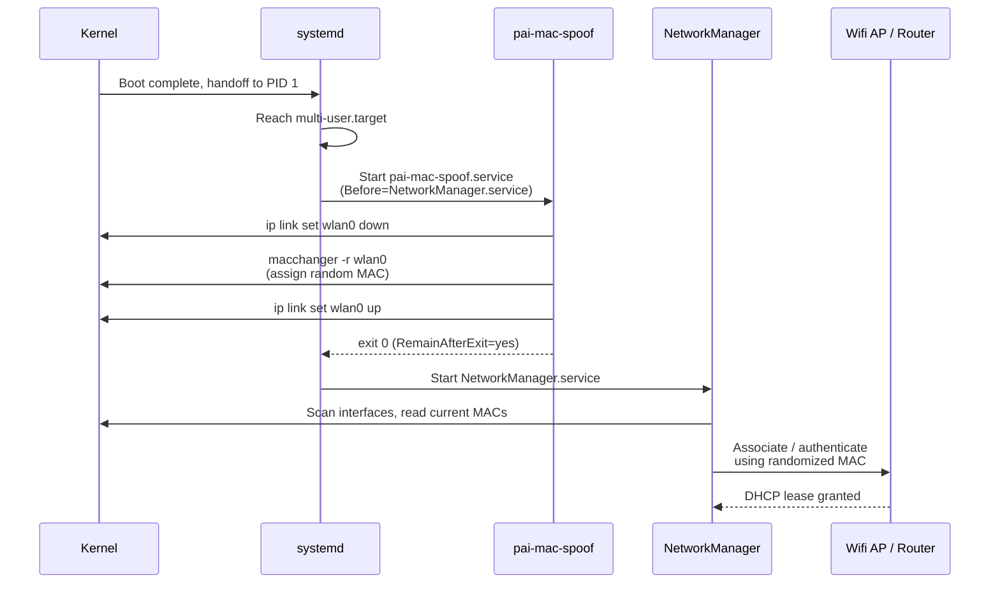

**PAI** randomizes the **MAC address** of every physical network interface on your machine before any network traffic is sent. This happens on every single boot, so your laptop looks like a completely different device to every wifi access point, router, and ethernet switch it meets. This page explains what a MAC address is, how PAI's randomization works under the hood, how to verify it, and exactly what it protects against.

In this guide:

- What a MAC address is and why anyone would want to change it
- How PAI's `pai-mac-spoof` service randomizes your MAC at boot
- The exact boot sequence and where the spoof fits in
- How to verify randomization is working on your system
- What MAC anonymization protects against, and what it does not
- How to disable or customize the behavior
- Frequently asked questions from new PAI users

**Prerequisites**: PAI booted and running. A terminal. No prior Linux networking knowledge needed: this page explains every concept from scratch.

## What is a MAC address?

A **MAC address** (Media Access Control address) is a 48-bit number burned into every network interface at the factory. Your wifi card has one. Your ethernet port has one. Your phone's bluetooth radio has one. It looks like this:

```
aa:bb:cc:dd:ee:ff
```

Six pairs of hexadecimal digits, separated by colons. The first three pairs identify the manufacturer (Apple, Intel, Realtek, and so on). The last three pairs are a unique serial assigned by that manufacturer. Put together, no two network interfaces on Earth are supposed to share a MAC address.

MAC addresses work at **Layer 2** of the network stack, the layer that handles the physical act of getting bits from your device to the nearest switch or access point. IP addresses (Layer 3) change every time you connect to a new network, but your MAC address does not. It is literally baked into your hardware.

!!! note

    The MAC is usually printed on a sticker under your laptop, inside the battery compartment, or on the box it shipped in. You can see your Mac's factory MAC in **System Information**, or on Windows with `ipconfig /all`.


### Why MAC addresses matter for privacy

Every time you join a wifi network, the access point records your MAC address in its logs. Every airport, coffee shop, hotel, library, and university network you have ever connected to has your MAC on file. Because your MAC is permanent and unique, those logs can be cross-referenced:

- A coffee shop chain with 500 locations can see every branch you have visited.
- An advertising network that buys wifi log data can build a map of where you go.
- A landlord, employer, or nosy neighbor with access to a router admin panel can see exactly when your device arrived and left.
- Law enforcement with a subpoena can correlate your MAC across networks over years.

Your MAC is, in effect, a **hardware serial number for network purposes**. That is why PAI randomizes it.

## What PAI does about this

Every time PAI boots, a small systemd service called `pai-mac-spoof.service` runs before **NetworkManager** (the daemon that connects you to wifi or ethernet). The service walks every physical network interface, brings it down, assigns a completely random MAC, and brings it back up. By the time NetworkManager starts scanning for wifi, your hardware identifier has already been replaced.

The result: each PAI session looks like a brand new device to every network it touches. There is no persistent identifier linking your Monday-morning coffee-shop session to your Tuesday-afternoon airport session to your Thursday-evening hotel session.

**[Enabled by default]**
**[No configuration needed]**
**[Runs at every boot]**

## Boot sequence: when MAC spoofing happens

The order of operations matters. If NetworkManager started before the spoof, your real MAC could leak during the brief window when the kernel brings the interface up. PAI's systemd unit is ordered to prevent this:



The critical detail is the `Before=NetworkManager.service` line in the unit file. NetworkManager is blocked from starting until `pai-mac-spoof` completes. That means no packet ever leaves your wifi card with the factory MAC attached.

!!! tip

    You can inspect the unit yourself on a running PAI system with `systemctl cat pai-mac-spoof.service`. The source lives at [`config/includes.chroot_after_packages/etc/systemd/system/pai-mac-spoof.service`](https://github.com/nirholas/pai/blob/main/config/includes.chroot_after_packages/etc/systemd/system/pai-mac-spoof.service) in the repo.


## How the pai-mac-spoof script works

The script is deliberately small — twenty lines of shell. It is worth reading in full because it tells you exactly what is happening:

```bash
#!/bin/bash
set -euo pipefail

# Randomize MAC on all physical network interfaces
for iface in /sys/class/net/*; do
    iface_name=$(basename "$iface")

    # Skip loopback and virtual interfaces
    [[ "$iface_name" == "lo" ]] && continue
    [[ ! -e "$iface/device" ]] && continue

    echo "[pai] Spoofing MAC for $iface_name"
    ip link set "$iface_name" down 2>/dev/null || true
    macchanger -r "$iface_name" 2>/dev/null || true
    ip link set "$iface_name" up 2>/dev/null || true
done

echo "[pai] MAC spoofing complete"
```

Three things to note:

1. **It iterates `/sys/class/net/*`**, which is the kernel's authoritative list of every network interface the machine has seen. Wifi, ethernet, USB dongles, and thunderbolt adapters all appear here.
2. **It skips loopback and virtual interfaces** by checking for `device`. Real hardware has a `/sys/class/net/<iface>/device` symlink pointing at the PCI or USB device. Bridges, VPN tunnels, and docker veth pairs do not.
3. **It uses `macchanger -r`**, which generates a fully random MAC. The `-r` flag produces a completely arbitrary address, including a random OUI (vendor prefix). If you prefer to blend in as a specific vendor, `-a` (same vendor) or `-A` (any vendor) are alternatives.

The script is at `/usr/local/bin/pai-mac-spoof` on a running system.

## Tutorial: verify MAC randomization is working

Goal: confirm, with your own eyes, that the MAC your wifi card advertises differs from the factory MAC.

What you need:

- PAI booted and logged in
- A terminal (default keybind: `Super+Return` in Sway)
- The factory MAC from your laptop's sticker, or from another OS you previously ran


1. Open a terminal and list all network interfaces with their current MAC addresses.

   ```bash
   # Show every network interface and its current MAC
   ip link show
   ```

   Expected output (your interface names may differ):

   ```
   1: lo: <LOOPBACK,UP,LOWER_UP> mtu 65536 qdisc noqueue state UNKNOWN mode DEFAULT group default qlen 1000
       link/loopback 00:00:00:00:00:00 brd 00:00:00:00:00:00
   2: enp0s31f6: <BROADCAST,MULTICAST,UP,LOWER_UP> mtu 1500 qdisc fq_codel state UP mode DEFAULT group default qlen 1000
       link/ether 4e:91:a2:13:5c:7f brd ff:ff:ff:ff:ff:ff
   3: wlan0: <BROADCAST,MULTICAST,UP,LOWER_UP> mtu 1500 qdisc noqueue state UP mode DEFAULT group default qlen 1000
       link/ether 7a:c3:11:bf:48:e2 brd ff:ff:ff:ff:ff:ff
   ```

2. Compare the `link/ether` lines to your factory MAC. If your laptop's sticker says `a4:83:e7:12:34:56` and `ip link show wlan0` reports `7a:c3:11:bf:48:e2`, randomization is working.

3. If your system has `ethtool` installed, read the **permanent** MAC (the factory one) directly from the hardware.

   ```bash
   # Ask the driver for the burned-in hardware address
   sudo ethtool -P wlan0
   ```

   Expected output:

   ```
   Permanent address: a4:83:e7:12:34:56
   ```

   The permanent address should match your sticker. The current MAC (from step 1) should not.

4. Confirm the spoof service ran successfully at boot.

   ```bash
   # View the journal entries for the spoof service
   journalctl -u pai-mac-spoof --no-pager
   ```

   Expected output:

   ```
   systemd[1]: Starting PAI MAC Address Randomization...
   pai-mac-spoof[412]: [pai] Spoofing MAC for enp0s31f6
   pai-mac-spoof[412]: [pai] Spoofing MAC for wlan0
   pai-mac-spoof[412]: [pai] MAC spoofing complete
   systemd[1]: Finished PAI MAC Address Randomization.
   ```

5. Reboot PAI, repeat step 1, and note that the MAC is different again. Every boot = new identity.


**What just happened?** You confirmed that your wifi and ethernet interfaces are advertising addresses that were randomly generated at boot, not the permanent hardware addresses your manufacturer assigned. Access points you connect to will see and log the random MAC only.

## Before and after: real `ip link show` output

Here is a concrete example from a ThinkPad X1 Carbon running PAI, with the real MAC redacted for the owner's privacy.

**Before PAI boot** (taken from the previous OS):

```
2: wlan0: <BROADCAST,MULTICAST,UP,LOWER_UP> mtu 1500
    link/ether a4:83:e7:XX:XX:XX brd ff:ff:ff:ff:ff:ff
```

**After PAI boot #1**:

```
2: wlan0: <BROADCAST,MULTICAST,UP,LOWER_UP> mtu 1500
    link/ether 7a:c3:11:bf:48:e2 brd ff:ff:ff:ff:ff:ff
```

**After PAI boot #2** (same hardware, different session):

```
2: wlan0: <BROADCAST,MULTICAST,UP,LOWER_UP> mtu 1500
    link/ether 02:9e:ad:44:71:08 brd ff:ff:ff:ff:ff:ff
```

**After PAI boot #3**:

```
2: wlan0: <BROADCAST,MULTICAST,UP,LOWER_UP> mtu 1500
    link/ether ee:4d:2c:91:5b:77 brd ff:ff:ff:ff:ff:ff
```

Three boots, three completely unrelated MACs. No network operator can stitch these sessions together using MAC-based correlation.

## What MAC anonymization protects against

MAC randomization defeats a specific, concrete threat: **cross-network tracking by the layer-2 identifier**.

- **Coffee-shop and airport wifi chains** cannot build a profile of every branch you visit.
- **Landlords, hotels, and conference venues** cannot confirm that a device they have seen before is you.
- **Historical wifi logs** no longer link to your current session. If you connected to `LibraryWifi` last year with your real MAC, PAI's random MAC today does not match those records.
- **MAC-based deanonymization** attacks, where someone has your factory MAC from one context and tries to find you in another network's logs, fail.

## What MAC anonymization does NOT protect against

Randomizing your MAC is one narrow privacy measure. It is not a magic cloak:

- **The AP you are currently connected to** still sees your random MAC and can track everything you do during that session. It cannot link the session to other sessions, but within the session you have no MAC-layer anonymity.
- **Your IP address, DNS queries, and browser traffic** are completely unaffected. Use [PAI Privacy Mode with Tor](privacy-mode-tor.md) for those layers.
- **Browser fingerprinting** (canvas, fonts, timezone, user agent) is a completely separate tracking channel. PAI mitigates this with a hardened Firefox profile, not with MAC changes.
- **Device fingerprinting at the radio layer** (wifi probe-request patterns, timing quirks, supported channels) can sometimes identify hardware even with a randomized MAC. This is a research-grade attack, not something every coffee shop runs.
- **Your real MAC is still printed on the hardware**. Anyone with physical access to the laptop can read it.
- **MAC-whitelisted networks** (many corporate, university, and some residential networks) will reject a randomized MAC outright.

!!! warning

    Do not assume MAC randomization makes you anonymous. It is one layer in a defense-in-depth strategy. For serious anonymity threat models, combine it with Tor, a hardened browser profile, and careful operational security. See [Warnings and limitations](../general/warnings-and-limitations.md) for the full honest picture.


## Customizing or disabling MAC spoofing

PAI is a **live system** — changes you make at runtime are gone at reboot unless you rebuild the ISO with your patches. For a temporary per-session change:

**Stop spoofing and restore the permanent MAC** (useful for a MAC-whitelisted network):

```bash
# Stop the spoof service (it has already run, but disable future triggers)
sudo systemctl stop pai-mac-spoof

# Reset wlan0 to its permanent factory MAC
sudo ip link set wlan0 down
sudo macchanger -p wlan0
sudo ip link set wlan0 up

# Restart NetworkManager so it re-reads the interface
sudo systemctl restart NetworkManager
```

Expected output from `macchanger -p`:

```
Current MAC:   7a:c3:11:bf:48:e2 (unknown)
Permanent MAC: a4:83:e7:12:34:56 (Intel Corporate)
New MAC:       a4:83:e7:12:34:56 (Intel Corporate)
```

**Force a specific vendor's OUI** (blends in better than a fully random MAC):

```bash
# Generate a random MAC within the same vendor range as your hardware
sudo macchanger -a wlan0
```

**Permanent customization**: edit `/usr/local/bin/pai-mac-spoof` in the build tree and rebuild the ISO. See [Building from source](../advanced/building-from-source.md).

!!! danger

    Do not disable `pai-mac-spoof.service` in a persistent PAI install without understanding the privacy consequences. Every network you connect to will see and log your permanent hardware MAC.


## What about the first-boot window?

A careful reader will ask: is there a moment between the kernel bringing up the interface and the spoof running where the real MAC leaks?

Short answer: no, not for wifi. The kernel assigns the factory MAC to the interface, but no packets are sent until NetworkManager associates with an access point. Because the spoof runs `Before=NetworkManager.service`, the MAC is randomized before association happens.

**Edge case — ethernet auto-negotiation**: if you boot PAI with an ethernet cable already plugged in, the PHY may negotiate link (exchange electrical signals with the switch) using the real MAC before the spoof runs. Some managed switches log the MAC at this step. For strongest privacy on wired networks, unplug the cable, boot, wait for the login screen, then plug in.

## Frequently asked questions

### What is a MAC address?

A MAC address is a 48-bit hardware identifier assigned to every physical network interface at the factory. It looks like `aa:bb:cc:dd:ee:ff` and is used at the lowest layer of networking to get packets between your device and the nearest switch or access point. Unlike IP addresses, which change when you join a new network, your MAC is permanent unless software intervenes. See the [What is a MAC address?](#what-is-a-mac-address) section above for the long explanation.

### Does MAC spoofing make me anonymous?

No. MAC spoofing defeats exactly one tracking vector: cross-network correlation by hardware identifier. It does nothing about your IP address, DNS traffic, browser fingerprint, or the content of what you do online. For stronger anonymity, combine MAC randomization with [Tor via PAI Privacy Mode](privacy-mode-tor.md), a hardened browser, and disciplined operational security. Anonymity is a system property, not a single switch.

### Can I get banned from a network for spoofing my MAC?

Possibly, in specific situations. Public wifi networks almost never notice or care: they see a new device and hand out a DHCP lease. Corporate, university, and some residential networks use **MAC whitelisting** or **MAC-based authentication**, and a random MAC will be rejected at the authentication step. If you need access to such a network, temporarily restore your real MAC using the commands in [Customizing or disabling MAC spoofing](#customizing-or-disabling-mac-spoofing) above.

### Does MAC spoof work on ethernet too?

Yes. The `pai-mac-spoof` script iterates every physical interface listed in `/sys/class/net/`, which includes ethernet adapters, USB ethernet dongles, and thunderbolt NICs along with wifi cards. Run `ip link show` to confirm your ethernet MAC has been randomized. Note the [first-boot window caveat](#what-about-the-first-boot-window) about cables plugged in during boot.

### Will this break captive portals?

Usually no. Captive portals at airports, hotels, and coffee shops check your MAC for session state (so your browser does not have to re-authenticate every five minutes), but they do not validate it against any whitelist. Your random MAC will register, you will be prompted to accept terms of service or log in, and browsing will work normally. On reboot, the portal will treat you as a brand new visitor, so you will see the portal again, which is exactly the behavior most privacy-focused users want.

### Can the real MAC still be found?

Yes, by several means. Anyone with physical access to the laptop can read it from the sticker or via `ethtool -P`. A piece of malware running as root could read `/sys/class/net/wlan0/device/...` and report it. Radio-level fingerprinting (wifi probe-request timing, supported channels, vendor-specific information elements) can sometimes identify a specific device even with a randomized MAC. For typical threat models (ad tracking, casual surveillance, unsophisticated network operators), MAC randomization is effective. For nation-state adversaries, it is one small piece of a much larger puzzle.

### How often does my MAC change?

Once per boot. PAI generates a new random MAC every time the `pai-mac-spoof.service` unit runs, which is on every system startup. If you leave PAI running for a week, your MAC stays the same for that week. If you suspend and resume, your MAC stays the same. If you reboot, you get a new MAC. For more aggressive per-connection randomization, NetworkManager has a `wifi.cloned-mac-address=random` setting, but PAI's boot-time approach is simpler and covers both wifi and ethernet uniformly.

### How is this different from Tails?

Tails uses a similar approach (MAC randomization at boot, before NetworkManager) but implemented with its own custom tooling and documented in its Tails-specific way. The user-visible outcome is the same: every session, new MAC. PAI's implementation is deliberately minimal (a twenty-line shell script plus a systemd unit) so that anyone can audit it and understand exactly what is happening. Both projects are honest about the limits of MAC randomization.

## Related documentation

- [**Introduction to privacy in PAI**](introduction-to-privacy.md) — The threat model PAI is designed for and how each feature fits in
- [**Privacy mode and Tor**](privacy-mode-tor.md) — Routing all traffic through Tor for network-layer anonymity
- [**Warnings and limitations**](../general/warnings-and-limitations.md) — Honest accounting of what PAI does not protect against
- [**Features included in PAI**](../general/features-included.md) — Full list of privacy and productivity tools shipped in the default image
- [**Building PAI from source**](../advanced/building-from-source.md) — How to customize the `pai-mac-spoof` script and rebuild the ISO
