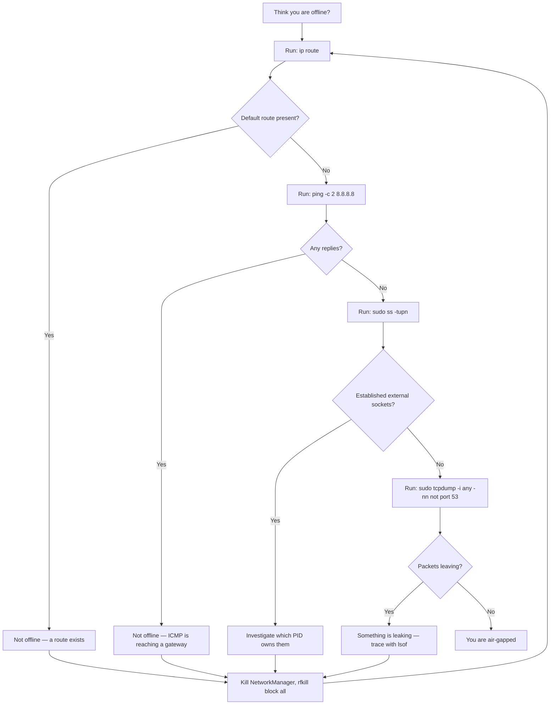

**Offline is the strongest privacy guarantee PAI offers.** No traffic means no leaks — no DNS queries, no telemetry, no accidental API calls, no fingerprinting. When your ethernet cable is unplugged and your radios are off, every guarantee about "local AI" and "nothing leaves your device" stops being a promise and becomes a physical fact. This guide shows you how to go fully offline on PAI, how to prove you got there, what still works, what breaks, and how to run a complete air-gapped AI session from boot to shutdown.

In this guide:
- Why offline mode is the strongest privacy posture on PAI
- Hardware-level and software-level methods to go offline
- A full list of what works and what breaks when disconnected
- How to verify, with real tools, that you are actually offline
- An end-to-end tutorial for a productive offline AI workflow
- How to pre-load Ollama models so they survive into offline sessions

**Prerequisites**: PAI booted from USB. Familiarity with a terminal is helpful for verification steps. No prior experience with `tcpdump` or `ss` required — commands are shown verbatim.

## Why offline mode is the strongest privacy guarantee

PAI already runs all AI inference locally, blocks outbound telemetry, and keeps your session in RAM. That baseline is strong. Offline mode is stronger because it removes an entire class of risk: misconfiguration.

If a firewall rule is wrong, if an app you trusted added a phone-home feature, if a browser extension leaks DNS, if an Open WebUI toggle flipped on a web-search integration — none of it matters when the network interface is physically down. **There is nothing to leak through.** This is the same reason journalists, security researchers, and people handling classified material use air-gapped machines.

!!! tip

    Think of offline mode as the difference between "I promise not to talk about this" and "I have no mouth." Software firewalls are promises; a pulled cable is a physical constraint.


Offline mode is appropriate when you are:

- Drafting a sensitive document before it leaves your machine
- Analyzing private files (medical records, legal discovery, leaked material)
- Working with a source whose identity must not be inferable from traffic patterns
- Traveling through a hostile network or airport Wi-Fi you do not trust
- Using PAI on a plane, a boat, or anywhere without connectivity anyway

## How to go fully offline on PAI

There are two ways to disconnect: hardware and software. Hardware is stronger because it cannot be undone by a misbehaving process. Software is faster and reversible. Use hardware for real threat scenarios. Use software for casual air-gap sessions.

=== "Hardware-level (recommended)"

Physical disconnection is bulletproof. An attacker with code execution inside PAI cannot reach the network if the network hardware cannot reach it either.

- **Unplug the ethernet cable.** Pull it out of the laptop or the dock.
- **Kill Wi-Fi at the hardware switch.** Many ThinkPads, Dells, and older laptops have a physical slider or an `Fn` + `F-key` combo that cuts power to the wireless card. Use it.
- **Kill Bluetooth the same way** if your device has a toggle.
- **Airplane mode** on laptops that support it via firmware.
- **Remove the Wi-Fi card** if you are seriously paranoid and the laptop supports it. Many business laptops do.

After doing this, the operating system cannot bring you back online without physical intervention.

!!! warning

    Some laptops "soft" disable Wi-Fi via the Fn key — the radio is still powered and the OS can re-enable it. Check `rfkill list` after toggling to confirm the block is `hard`, not just `soft`.


=== "Software-level (reversible)"

Software offline is convenient and reversible. Good for a quick air-gap during a session you will resume online later.

```bash
# Stop NetworkManager so it does not try to reconnect
sudo systemctl stop NetworkManager
sudo systemctl stop NetworkManager-wait-online

# Kill every radio: Wi-Fi, Bluetooth, WWAN
sudo rfkill block all

# Bring every non-loopback interface down explicitly
for iface in $(ls /sys/class/net | grep -v lo); do
  sudo ip link set "$iface" down
done
```

Expected state after:

```
$ ip link show
1: lo: <LOOPBACK,UP,LOWER_UP> ...
2: wlan0: <BROADCAST,MULTICAST> ... state DOWN
3: eth0: <BROADCAST,MULTICAST> ... state DOWN
```

Re-enable later with:

```bash
sudo rfkill unblock all
sudo systemctl start NetworkManager
```


!!! note

    PAI's default firewall already blocks inbound connections and most unexpected outbound traffic. The steps above go further — they remove the possibility of any traffic, wanted or not.


## What works offline

PAI is designed so that its core experience works with zero connectivity. The AI stack, the desktop, every productivity app, and every privacy tool runs fully local.

| Feature | Works offline? | Notes |
|---|---|---|
| Ollama inference (llama3.2:1b) | Yes | Baked into the ISO, no download needed |
| Open WebUI chat | Yes | Runs on `localhost:8080`, talks to local Ollama |
| Firefox to `localhost` | Yes | Loads Open WebUI and local files fine |
| Thunar file manager | Yes | All local file operations |
| GPG encryption and signing | Yes | Key generation and use are fully local |
| KeePassXC password vault | Yes | Opens and edits local `.kdbx` files |
| LUKS disk encryption | Yes | Encrypt external drives entirely offline |
| `secure-delete` (`shred`, `wipe`) | Yes | No network dependency |
| Drawing, mousepad, text editors | Yes | Fully local |
| Screenshots (`grim`, `slurp`) | Yes | No network dependency |
| PDF viewing (`zathura`, Firefox) | Yes | Local files only |
| Audio and video playback (`mpv`, `vlc`) | Yes | Local files only |
| Games (Solitaire, Mines, Sudoku) | Yes | No network code |
| Terminal, shell, CLI tools | Yes | Everything in `/usr/bin` works |
| Archive tools (`tar`, `7z`, `zip`) | Yes | Local operation |

## What does not work offline

Being honest about limitations is more useful than pretending everything works. Here is what breaks when you disconnect.

| Feature | Works offline? | Why |
|---|---|---|
| Pulling new Ollama models | No | `ollama pull` fetches from the internet |
| Open WebUI RAG web search | No | External fetch if enabled |
| Open WebUI image generation via API | No | External API call |
| Firefox general web browsing | No | Pages fail to load |
| Tor Browser | No | Needs network to reach the Tor network |
| Waybar crypto price widget | No | Shows `BTC ---.--` |
| NTP clock sync | No | Clock drifts over long sessions |
| `apt update` / `apt install` | No | Needs Debian mirrors |
| Python `pip install` | No | Needs PyPI |
| Git push / pull to remotes | No | Local commits still work |
| Email clients (Thunderbird) | No | Nothing to send or fetch |
| Messaging apps | No | All require a network |
| Map apps that need tile servers | No | Offline maps work if pre-downloaded |

!!! warning

    Long offline sessions can drift the clock by seconds per day. If your workflow depends on accurate timestamps (signed commits, cryptographic nonces, log ordering), re-sync time with `sudo ntpdate pool.ntp.org` the next time you briefly reconnect.


## How to verify you are actually offline

Assume nothing. Verify. Three tools — `ip`, `ss`, and `tcpdump` — prove whether you are actually disconnected. Use this flowchart to work through them in order.



Command details:

```bash
# 1. Is there a default route? There shouldn't be.
ip route
# Expected offline output: empty, or only local link-scope routes

# 2. Can you reach anything? You shouldn't.
ping -c 2 8.8.8.8
# Expected offline output: "Network is unreachable" or 100% packet loss

# 3. Any live sockets to outside addresses?
sudo ss -tupn
# Expected offline output: only 127.0.0.1 and ::1 lines

# 4. Are any packets leaving the machine at all?
sudo tcpdump -i any -nn not port 53 and not host 127.0.0.1
# Expected offline output: listens silently, no packets captured
```

!!! danger

    If `tcpdump` captures any packet destined for a non-loopback address, you are not offline — a process is leaking. Identify it with `sudo lsof -i` and kill or block it before continuing sensitive work.


## Tutorial: Run a complete offline AI workflow

Goal: go fully air-gapped, complete a productive AI session with Ollama and local tools, and reconnect cleanly.

What you need:

- PAI booted from USB
- A laptop with a Wi-Fi kill switch or the ability to unplug ethernet
- About 20 minutes


1. **Pre-stage your materials while still online.** Copy the documents or notes you plan to work with to `~/Documents` via Thunar or a USB stick. Confirm `llama3.2:1b` is present:

   ```bash
   ollama list
   ```

   Expected output:

   ```
   NAME               ID              SIZE      MODIFIED
   llama3.2:1b        a2af6cc6c18c    1.3 GB    2 minutes ago
   ```

2. **Go offline at the hardware level.** Unplug your ethernet cable. Toggle the Wi-Fi hardware switch on your laptop, or press the airplane-mode key. If you do not have a physical switch, run `sudo rfkill block all`.

3. **Verify you are offline.** Run the four commands from the verification flowchart above:

   ```bash
   ip route
   ping -c 2 8.8.8.8
   sudo ss -tupn
   sudo tcpdump -i any -nn not port 53 and not host 127.0.0.1 &
   TCPDUMP_PID=$!
   sleep 10
   sudo kill $TCPDUMP_PID
   ```

   You want an empty route table, a failed ping, loopback-only sockets, and zero packets captured.

4. **Open Open WebUI and chat.** Launch Firefox, navigate to `http://localhost:8080`, pick `llama3.2:1b`, and chat. It should feel exactly like an online session — because the model is on your SSD, not in the cloud.

5. **Do the productive work.** Draft a document in `mousepad`. Summarize a local PDF by pasting it into Open WebUI. Encrypt the result with GPG:

   ```bash
   gpg --symmetric --cipher-algo AES256 draft.md
   ```

   Expected output: a new `draft.md.gpg` file in the current directory.

6. **Save to external media.** Insert an encrypted USB stick. Mount it. Copy your output files over. Unmount cleanly with `udisksctl unmount`.

7. **Reconnect carefully.** When ready to rejoin the network, unblock radios and restart NetworkManager:

   ```bash
   sudo rfkill unblock all
   sudo systemctl start NetworkManager
   ```

   !!! tip

       Before reconnecting, close Open WebUI and any tool that might attempt a sync or update. A clean reconnect with nothing running is harder to fingerprint.


8. **Shut down when done.** PAI wipes RAM on shutdown by default, so no trace of the session remains on the host machine unless you explicitly saved to persistence or external media.


**What just happened?** You completed an end-to-end air-gapped AI workflow: you verified disconnection with four independent tools, did real inference against a local model, produced encrypted output, moved it to external media, and cleaned up. At no point did any byte of your work leave the physical device.

Next step: read about [PAI persistence](../persistence/introduction.md) if you want pre-pulled models and saved configs to survive into future offline sessions.

## Pre-loading Ollama models for offline use

`llama3.2:1b` is baked into the ISO. Any other model must be pulled while online, and without [persistence](../persistence/introduction.md) it disappears on reboot.

Two workflows to plan around:

- **Ephemeral (no persistence).** Boot, connect, run `ollama pull llama3.2:3b`, disconnect, work offline. On reboot, the model is gone.
- **Persistent.** Set up the persistence layer. Pull models once; they survive reboots and are available fully offline on every future boot.

```bash
# Pull while online
ollama pull qwen2.5:3b
ollama pull phi3.5:3.8b

# Verify they are local
ollama list
```

Expected output:

```
NAME              ID              SIZE      MODIFIED
llama3.2:1b       a2af6cc6c18c    1.3 GB    3 days ago
qwen2.5:3b        357c53fb659c    1.9 GB    1 minute ago
phi3.5:3.8b       61819fb370a3    2.2 GB    30 seconds ago
```

After pulling, disconnect and confirm the models still respond with `ollama run qwen2.5:3b "hello"`.

## Choosing offline versus privacy mode

Not every session needs a full air gap. PAI's [privacy mode](privacy-mode-tor.md) routes traffic through Tor and gives strong anonymity without cutting you off entirely. Match the level to your threat model:

| Situation | Recommended posture |
|---|---|
| Daily AI work on personal notes | Default (firewall + local AI) |
| Researching a sensitive topic | Privacy mode with Tor |
| Drafting a leak or confidential document | Offline mode |
| Reviewing legal discovery materials | Offline mode |
| Working on a plane or in a dead zone | Offline mode |
| Communicating with a source | Privacy mode, never offline |

Offline is more paranoid than useful when you need to reach the outside world at all. Privacy mode is a better fit for active communication. Offline is the right tool for pure consumption and creation against local data.

## Frequently asked questions

### Can I still use Open WebUI offline?
Yes. Open WebUI runs as a local service on `localhost:8080` and talks only to the local Ollama instance on `localhost:11434`. Both bind to loopback, so no external network is needed. The only features that break are opt-in integrations: web search, external image-generation APIs, and OpenAI-compatible remote endpoints. Leave those disabled and Open WebUI works identically offline and online.

### Does the AI model work without internet?
Yes. Ollama runs entirely on your local CPU or GPU. The `llama3.2:1b` model is baked into the PAI ISO — about 1.3 GB of weights that live on the USB stick and load into RAM. No inference call ever touches the network. You can confirm with `sudo tcpdump -i any -nn port 11434` while chatting; you will see local traffic only.

### How do I pull models in advance for offline use?
Connect to the internet, run `ollama pull <model>` for each model you want, and confirm with `ollama list`. Without PAI's persistence feature, the models vanish on reboot because PAI is RAM-only by default. With [persistence](../persistence/introduction.md) enabled, pulled models survive reboots and are available on every future offline session. See [managing Ollama models](../ai/managing-models.md) for the full workflow.

### What if I need to look something up while in offline mode?
You have three options. First, pre-stage reference material before disconnecting — download PDFs, save web pages as HTML, or copy notes to `~/Documents`. Second, use the AI model as a reference: ask Ollama to summarize or explain concepts from its training. Third, briefly reconnect, look up the specific thing, and go offline again. Never stay connected longer than the lookup needs.

### Can I copy files between PAI and my host machine offline?
Yes — via external media. Insert a USB stick or SD card, mount it in Thunar, and copy files. For sensitive data, encrypt the external drive with LUKS first (`sudo cryptsetup luksFormat /dev/sdX`). PAI cannot share files over a network if there is no network, but physical media works exactly as on any Linux system. See [first-boot-walkthrough](../first-steps/first-boot-walkthrough.md) for file-move basics.

### Does offline mode survive a reboot?
No. PAI boots into its default networking state on every startup. To "stay offline," either leave the cable unplugged and the hardware switch off, or add a one-line script to your persistent startup that runs `rfkill block all`. Hardware disconnection is simpler and more reliable than scripting.

### Does the clock still work offline?
Yes, but it drifts. Linux keeps time with a monotonic counter while running, but without NTP the wall clock gains or loses a few seconds per day. For most work this is invisible. For time-sensitive operations like signed git commits, re-sync when you next reconnect: `sudo ntpdate pool.ntp.org`.

### Is offline mode the same as airplane mode?
Functionally similar, structurally different. Airplane mode on most laptops is a firmware toggle that kills radios through ACPI. PAI's offline mode can be achieved the same way or by software means (`rfkill`, `systemctl stop NetworkManager`). Either route gets you to the same end state: no packets in or out.

### How do I know if a PAI app is secretly trying to phone home?
Run `sudo tcpdump -i any -nn not host 127.0.0.1` in a terminal and leave it there while you use the app. Anything the app sends to the outside world will appear in the capture. PAI's default apps are vetted not to do this, but any software you install later should be checked this way before you trust it with sensitive work.

## Related documentation

- [**Introduction to PAI privacy**](introduction-to-privacy.md) — Threat
  models and privacy philosophy on PAI
- [**Privacy mode with Tor**](privacy-mode-tor.md) — Anonymous networking when
  you need to stay online
- [**Managing Ollama models**](../ai/managing-models.md) — Pulling, switching,
  and removing local LLMs
- [**PAI persistence**](../persistence/introduction.md) — Keep pulled models
  and configs across reboots
- [**Warnings and limitations**](../general/warnings-and-limitations.md) —
  What PAI does and does not protect against
- [**First boot walkthrough**](../first-steps/first-boot-walkthrough.md) —
  What to expect on your first PAI session
