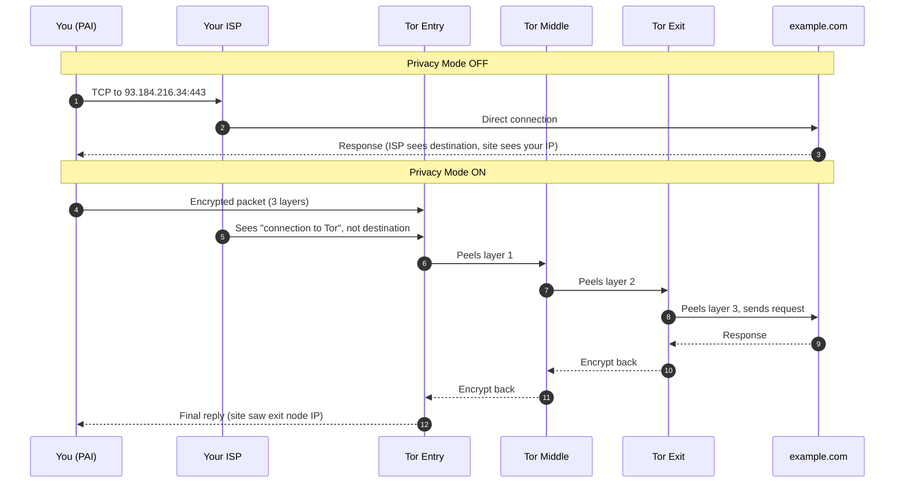

**One command. Whole-session Tor.** `pai-privacy on` flips every TCP connection and every DNS query on your PAI machine through the Tor network, at the iptables layer, with no per-app configuration. Your browser, your terminal, your AI tooling — all of it, Tor-routed, at once.

**PAI Privacy Mode** is an opt-in toggle that routes every outbound TCP connection and DNS query from your PAI session through the **Tor network**. One command (`pai-privacy on`) flips your whole session from direct-to-internet to fully Tor-routed. This guide documents exactly what the `pai-privacy` script does, what Privacy Mode protects against, where it falls short, and how it differs from running Tor Browser.

In this guide:

- What Privacy Mode does at the packet level
- How to enable, verify, and disable it
- A side-by-side comparison of Privacy Mode and Tor Browser
- A complete tutorial for a private browsing session
- What Tor nodes are and how your traffic flows through them
- Troubleshooting, limits, and common questions

**Prerequisites**: PAI is booted and has a working network connection. You will need `sudo` rights (the live user has them by default). No prior Tor knowledge is required.

**[Session-only]** **[Requires sudo]** **[Not a Tails replacement]**

## What Privacy Mode actually does

When you run `pai-privacy on`, the `pai-privacy` script at `/usr/local/bin/pai-privacy` performs a sequence of system-level changes. The goal is simple: force every TCP packet and DNS lookup from your machine to go through Tor, and refuse to route anything directly.

Here is the exact sequence, taken from the script itself:

1. **Start the Tor service** with `systemctl start tor`. If Tor is already running, this is a no-op.
2. **Wait for Tor to bootstrap** by polling `https://check.torproject.org/api/ip` through the SOCKS5 proxy on `127.0.0.1:9050`. The script waits up to 30 seconds. If Tor cannot build a circuit in that window, it aborts.
3. **Install iptables NAT rules** in the `OUTPUT` chain so that:
   - Traffic to `127.0.0.0/8` (localhost) returns immediately and is never redirected.
   - Traffic owned by the `debian-tor` system user returns immediately, so Tor itself can still reach the internet.
   - All other TCP traffic is redirected to `127.0.0.1:9040` (Tor's transparent proxy port).
   - All UDP traffic on port 53 (DNS) is redirected to `127.0.0.1:5353` (Tor's DNS port).
4. **Append `TransPort 9040` and `DNSPort 5353`** to `/etc/tor/torrc` if they are not already there, then reload Tor. This is what makes transparent proxying possible.
5. **Create the flag file `/tmp/.pai-privacy-mode`**. The waybar indicator watches for this file and displays the onion icon when it appears.

When you run `pai-privacy off`, the script flushes the `OUTPUT` chain of the NAT table (`iptables -t nat -F OUTPUT`) and deletes the flag file. Tor itself keeps running in the background. No application config is changed, no network interface is reset. Your traffic goes direct again.

!!! note

    Privacy Mode is **session-only**. The flag file lives in `/tmp`, which is a tmpfs on PAI, so a reboot always leaves you in normal (non-private) mode. This is intentional — the default posture should be the one you explicitly chose.


### Why transparent proxying matters

Transparent proxying at the iptables layer means your applications do not need to know Tor exists. Firefox, `curl`, `wget`, Open WebUI, and anything else you launch will transparently have their traffic rewritten to go through Tor. This is a much stronger guarantee than per-app SOCKS configuration, where one misconfigured app can leak.

!!! tip

    If you only need a single app to use Tor (and nothing else), use `torsocks firefox` or `torsocks curl` directly. Privacy Mode is the right choice when you want **everything** forced through Tor.


## How traffic flows through the Tor network

**Tor** stands for "The Onion Router". It is a volunteer-run network of around 7,000 relays worldwide that anonymizes TCP traffic by bouncing it through a chain of three relays. Each relay peels off one layer of encryption — hence "onion" — and only the final relay can see your plaintext destination.

A Tor circuit has three hops:

- **Entry guard** — the first relay. It sees your real IP but does not know where you are going.
- **Middle relay** — passes traffic between entry and exit. It sees neither your IP nor your destination.
- **Exit node** — the last relay. It sees your destination (the website) but not your real IP.

No single relay knows both ends of the path. This is what gives Tor its anonymity property.



The left half of the diagram is your normal browsing. The right half is what Privacy Mode gives you: your ISP sees you talking to a Tor entry guard (and nothing about what sites you load), and the websites you visit see a random exit node's IP, not yours.

!!! warning

    Tor is an anonymizing network, not a magic cloak. Your ISP can still see you are **using Tor**. In most countries this is fine. In some countries (China, Iran, and others), Tor use itself is a signal. For bridge/obfuscation options, see the [Tor Project documentation](https://support.torproject.org/).


## How to enable Privacy Mode

There is one primary interface: the `pai-privacy` command.

```bash
# Enable Privacy Mode (route everything through Tor)
sudo pai-privacy on

# Disable Privacy Mode (direct connection restored)
sudo pai-privacy off

# Check current state and Tor exit IP
sudo pai-privacy status
```

Expected output when enabled:

```
Privacy Mode: ON
Tor IP: 185.220.101.47
```

Expected output when disabled:

```
Privacy Mode: OFF
```

### Verifying it is actually working

Three independent checks confirm Privacy Mode is live:

1. The waybar status bar shows the onion indicator (an onion icon labeled Tor) in the top or bottom bar.
2. `pai-privacy status` prints `Privacy Mode: ON` and a Tor exit IP.
3. Visiting `https://check.torproject.org` in Firefox shows the green "Congratulations. This browser is configured to use Tor." banner.

!!! tip

    If you want a quick one-liner sanity check from the terminal, run `curl https://api.ipify.org` before and after toggling Privacy Mode. The IP should change from your real one to a Tor exit.


## Privacy Mode versus Tor Browser

PAI ships both **Privacy Mode** (system-wide Tor) and **Tor Browser** (a hardened Firefox). They solve overlapping but different problems. Here is the same task done with each, so you can see when to pick which.

=== "Task: read a news site anonymously"
    **With Privacy Mode (Firefox through Tor):**

    ```bash
    # Turn on system-wide Tor routing
    sudo pai-privacy on

    # Launch regular Firefox — now Tor-routed
    firefox https://news.example/ &
    ```

    You get Tor-level IP anonymity, but Firefox still has your timezone, your font list, your canvas fingerprint, and your screen size. A determined tracker can still fingerprint you across visits.

    **With Tor Browser:**

    ```bash
    # Launch Tor Browser (bundled on PAI)
    tor-browser
    ```

    You get Tor-level IP anonymity **plus** aggressive anti-fingerprinting: spoofed timezone, standardized user-agent, canvas randomization, NoScript by default, and a letterboxed window so screen size cannot identify you.
=== "Task: run a `curl` request privately"
    **With Privacy Mode:**

    ```bash
    sudo pai-privacy on
    curl https://api.example/data
    ```

    The `curl` call is transparently proxied through Tor at the iptables layer. No flags, no config.

    **With Tor Browser:**

    Tor Browser cannot help here — it is a browser, not a general proxy. You would fall back to `torsocks curl https://api.example/data`, which requires Tor to be running but does not require Privacy Mode.
=== "Task: download a large file"
    **With Privacy Mode:**

    ```bash
    sudo pai-privacy on
    wget https://example/bigfile.iso
    ```

    Works, but will be slow. Tor is bandwidth-limited (typically 1 to 5 MB/s per circuit). Large downloads also stress the Tor network, which is rude to other users.

    **With Tor Browser:**

    Same bandwidth limits apply. For large files, the right answer is often: do the download **without** Tor on a different machine, then move the file to your PAI USB.

### When to use each

| Scenario | Privacy Mode | Tor Browser |
|---|---|---|
| Hiding your IP from a website | Yes | Yes |
| Preventing browser fingerprinting | No | Yes |
| JavaScript isolation / NoScript | No | Yes |
| Routing non-browser apps (curl, wget, Open WebUI) | Yes | No |
| Routing Firefox specifically | Yes | N/A (use Tor Browser) |
| Protects against a determined state actor | Partial | Partial (stronger) |
| Works for one-off quick checks | Yes | Yes |

!!! tip

    For serious anonymity work, use **both**. Run `sudo pai-privacy on` to force every process through Tor, and use **Tor Browser** for the actual browsing so fingerprinting is also defeated.


## Tutorial: browse privately with Privacy Mode enabled

**Goal**: enable Privacy Mode, confirm you are routed through Tor, do some browsing, then cleanly disable it.

**What you need**:

- A booted PAI session with a working internet connection
- A terminal (Super+Enter on PAI's default Sway config)
- Firefox already open or ready to launch


1. Open a terminal and enable Privacy Mode.

   ```bash
   sudo pai-privacy on
   ```

   Expected output:

   ```
   [pai] Enabling Privacy Mode (Tor)...
   [pai] Privacy Mode ENABLED — all traffic routes through Tor
   ```

   The command may take up to 30 seconds on the first run while Tor builds its first circuit.

2. Verify Privacy Mode is active.

   ```bash
   sudo pai-privacy status
   ```

   You should see:

   ```
   Privacy Mode: ON
   Tor IP: 185.220.101.47
   ```

   The IP will differ each time — it is whatever Tor exit node your circuit happens to use.

3. Look at the waybar. You should see the onion indicator near the clock. This confirms that the `/tmp/.pai-privacy-mode` flag file exists and waybar has picked it up.

   
   *PAI's waybar with Privacy Mode ON. The onion icon is the single visual cue that your traffic is Tor-routed.*

4. Open Firefox and go to `https://check.torproject.org`. You should see the green "Congratulations. This browser is configured to use Tor." banner.

   
   *The Tor Project's check page confirms your traffic exits through a Tor relay.*

5. Do your browsing. Every tab, every DNS lookup, every background request goes through Tor. Try a few sites to get a feel for the latency — typically 500 ms to 2 seconds per page load.

6. When you are done, disable Privacy Mode.

   ```bash
   sudo pai-privacy off
   ```

   Expected output:

   ```
   [pai] Disabling Privacy Mode...
   [pai] Privacy Mode DISABLED — direct connection restored
   ```

   The onion icon vanishes from waybar within a few seconds.

7. Confirm you are back to direct routing.

   ```bash
   curl -s https://api.ipify.org
   ```

   You should now see your real IP.


**What just happened?** You installed a set of iptables NAT rules that rewrote every outbound TCP packet to land at Tor's transparent proxy, then removed those rules when you were done. Tor itself kept running the whole time, but without the iptables rules it simply listens and does nothing.

**Next steps**: Read about [Tor Browser](tor-browser.md) for hardened anonymous browsing, and [offline mode](offline-mode.md) if you want the opposite — no network at all.

## What Privacy Mode protects, and what it does not

### What is protected

- **Browser traffic** from Firefox, Chromium, or any GUI browser you launch.
- **DNS queries**, which are rewritten to Tor's DNSPort (`5353`). There is no DNS leak to your ISP.
- **Terminal tools** — `curl`, `wget`, `git clone` over HTTPS, `ssh` to arbitrary hosts.
- **Open WebUI's own network calls** — for example if you have enabled RAG web search, those calls go through Tor.
- **Background updates and telemetry** — if any process tries to phone home, it is Tor-routed, not direct.

### What is NOT protected

- **Model weights already on disk.** If you pulled `llama3.1:8b` from the Ollama registry before enabling Privacy Mode, that download was logged by your ISP and by the Ollama registry. Privacy Mode cannot retroactively anonymize past network activity.
- **Local-only traffic.** Localhost traffic (`127.0.0.0/8`) is exempted from Tor routing — this is correct behavior. Your Ollama to Open WebUI loop runs on `localhost` and was already private.
- **Browser fingerprinting.** Firefox in Privacy Mode is still regular Firefox. Your canvas hash, WebGL vendor, font list, timezone, and window size all remain identifying. Use **Tor Browser** for anti-fingerprinting.
- **Clock and system info leaks.** Tor Browser spoofs these; Firefox-through-Tor does not.
- **Side-channel correlation attacks.** A global passive adversary who can see traffic entering and leaving the Tor network can sometimes correlate by timing and volume. This is beyond the threat model of most users, but real.
- **You clicking "sign in with Google".** Tor hides your IP, not your voluntarily-given identity. Logging in to any account you have used before links that session to you.

!!! danger

    Privacy Mode is **not** a replacement for [Tails](https://tails.net). Tails enforces Tor routing at the firewall level from boot, ships with a carefully audited Tor configuration, and has a decade of scrutiny behind it. PAI's Privacy Mode is lighter-weight and opt-in. It is great for day-to-day privacy. It is not the right tool if you are a journalist protecting a source from a state adversary.


## Troubleshooting

### Tor will not start

Run `journalctl -u tor -n 50` and look at the last 50 log lines. The most common causes are:

- A corrupted `/etc/tor/torrc` (perhaps from a previous `pai-privacy on` that was killed mid-run). Reinstall the default file or remove the `TransPort` and `DNSPort` lines and let `pai-privacy` re-add them.
- A port collision on `9040`, `9050`, or `5353`. Check `sudo ss -tulpn | grep -E '9040|9050|5353'`.
- No internet connectivity at all. Tor cannot bootstrap without a working connection to the outside world.

### Browsing is slow

Tor adds three hops of latency and is bandwidth-limited by the slowest relay in your circuit. Typical page loads are 500 ms to 3 seconds. To try a new circuit:

```bash
# Ask Tor to build a fresh circuit
sudo killall -HUP tor
```

Tor will pick different relays on the next connection. In Tor Browser, use **New Identity** from the menu for the same effect.

### Some sites block Tor outright

Many sites (Cloudflare-protected sites in particular) detect Tor exit nodes and either CAPTCHA you, show reduced functionality, or refuse entirely. This is a Tor-wide problem, not a PAI bug. Workarounds:

- Use Tor Browser's circuit menu to pick a different exit node.
- Accept that some sites are unreachable via Tor and disable Privacy Mode for those specific tasks.

### Waybar indicator stuck after toggle off

If the onion icon is still showing after `pai-privacy off`, check whether `/tmp/.pai-privacy-mode` still exists:

```bash
ls -la /tmp/.pai-privacy-mode
# If the file exists:
sudo rm /tmp/.pai-privacy-mode
```

The waybar module polls this file and updates within a few seconds of its disappearance.

## Practical usage patterns

**Pattern A — quick private research.** Toggle Privacy Mode on, open Tor Browser, do the research, close Tor Browser, toggle Privacy Mode off.

**Pattern B — all-session privacy.** Turn Privacy Mode on immediately after boot and use PAI normally for the whole session. Every app is Tor-routed. Shut down when done.

**Pattern C — model management first, then privacy.** Leave Privacy Mode OFF while pulling large models (`ollama pull llama3.1:8b`). Once models are in place, toggle Privacy Mode ON and do all subsequent work privately. Tor throughput is typically too slow for multi-gigabyte downloads.

## Frequently asked questions

### Does Privacy Mode hide my IP address?

Yes, from the websites you visit. A site you load while Privacy Mode is ON sees the IP of a Tor exit node, not your real IP. Your **ISP**, on the other hand, sees that you are connecting to the Tor network — it does not see where that traffic ends up. If an observer needs to know neither that you are using Tor, they would need to layer a bridge or a VPN on top, which is outside the scope of Privacy Mode.

### Can my employer see I am using PAI with Privacy Mode on?

On a corporate network, your employer can see that a device on their network is connecting to known Tor entry guards. They cannot see which sites you load or what data you send. Whether this is acceptable depends on your workplace's acceptable use policy. PAI itself runs entirely from USB and does not touch the host disk, so booting PAI is separate from using Privacy Mode — the latter is the part that is detectable as "Tor traffic".

### Is Privacy Mode always on?

No. PAI boots with Privacy Mode OFF by default. You must explicitly run `sudo pai-privacy on` each session. This is a deliberate design choice: the default posture is the one you chose, not one chosen for you. The flag file lives in `/tmp`, so a reboot always resets you to OFF.

### Does the AI model go through Tor?

No, because the AI model runs **locally**. When you chat with Ollama through Open WebUI, the traffic is `127.0.0.1` to `127.0.0.1` — it never leaves your machine. Privacy Mode's iptables rules explicitly exempt `127.0.0.0/8` from redirection, so local AI stays fast and private. The only way AI traffic would touch Tor is if you pointed Open WebUI at a remote model provider, which is a non-default configuration.

### Why is Privacy Mode slower?

Tor adds three network hops (entry, middle, exit) between you and every destination. Each hop adds latency, and the slowest relay in your circuit caps your bandwidth. Typical Tor throughput is 1 to 5 MB/s and page-load latency is 500 ms to 3 seconds. This is the cost of anonymity — the same packets pass through three volunteer-run servers, each encrypting and decrypting, before reaching the target.

### What is the difference between Privacy Mode and incognito or private browsing?

They solve completely different problems. **Incognito / private browsing** is a browser feature that prevents the browser from saving your history, cookies, and cache locally. It does nothing to hide your traffic from your ISP or the websites you visit — those see exactly the same IP and request patterns as a normal session. **Privacy Mode** is a network-level feature that routes your traffic through Tor so your ISP and destination sites cannot see who you are. The two are complementary, not substitutes.

### Does Privacy Mode protect against fingerprinting?

No. Privacy Mode operates at the network layer. It does not change what your browser sends to websites. Your Firefox still reports the same user-agent, the same list of installed fonts, the same canvas and WebGL fingerprints, and the same window size and timezone. A site that fingerprints you while Privacy Mode is on will still recognize you on a later visit. For anti-fingerprinting, use **Tor Browser**, which ships with mitigations specifically designed to make all Tor Browser users look identical.

## Related documentation

- [**Introduction to PAI Privacy**](introduction-to-privacy.md) — The full privacy model of PAI, including how the live-USB boot protects against disk forensics.
- [**MAC Address Anonymization**](mac-address-anonymization.md) — Complementary layer: randomize your hardware address so the local network cannot fingerprint your device.
- [**Offline Mode**](offline-mode.md) — When you need stronger guarantees than Tor, cut the network entirely.
- [**Warnings and Limitations**](../general/warnings-and-limitations.md) — Honest discussion of what PAI cannot protect against.
- [**System Requirements**](../general/system-requirements.md) — Minimum hardware to run PAI, including Tor.
- [**How PAI Works**](../general/how-pai-works.md) — End-to-end architecture of the PAI live system.
