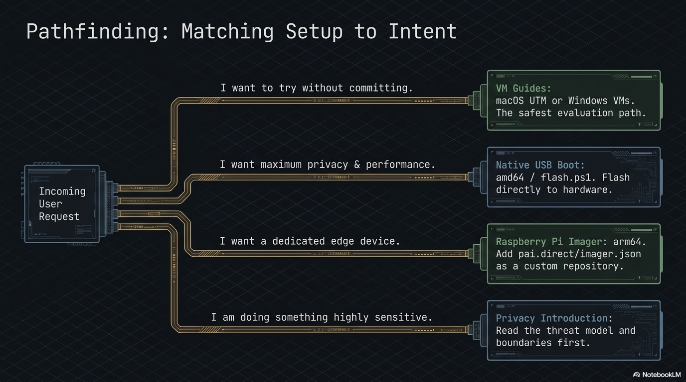

# PAI Quickstart



Goal: a running PAI in **under ten minutes**. For background and
concepts, read [getting-started.md](getting-started.md) instead.

You will need:

- A USB stick, 16 GB or larger (32 GB recommended for persistence).
- A computer with a USB port and UEFI firmware.
- About ten minutes.

## 1. Check hardware requirements

- 8 GB RAM minimum, 16 GB recommended for local LLMs.
- A free USB-A or USB-C port (USB 3.x strongly recommended).
- UEFI firmware (almost every machine since ~2015). Legacy BIOS-only
  machines are not supported.

## 2. Download the ISO and signature

Grab the latest `pai-<version>.iso` and its `.minisig` signature from
the project's release page. Put both files in the same directory.

## 3. Verify the download

Check the SHA-256 against the value on the release page:

```
sha256sum pai-<version>.iso
```

If it doesn't match, **stop** and re-download.

> **v0.1.0 note:** minisign detached signatures are not published for
> v0.1.0 — verification beyond the SHA-256 check becomes available
> starting v0.2, once the release keypair is provisioned. See
> [../SECURITY.md](security.md) for status.

## 4. Flash the ISO

Pick the tool that matches your OS:

- **Linux / macOS** — `sudo dd if=pai-<version>.iso of=/dev/sdX bs=4M
  status=progress conv=fsync`. Replace `/dev/sdX` with your stick. The
  wrong device will destroy its contents; check with `lsblk` first.
- **Any OS** — [BalenaEtcher](https://etcher.balena.io/). Pick ISO,
  pick stick, click Flash.
- **Windows** — run `irm https://pai.direct/flash.ps1 | iex` in an elevated
  PowerShell. (Graphical alternative: [Rufus](https://rufus.ie/) — select ISO,
  leave defaults, write in DD mode.)

See [usb-flashing.md](USB-FLASHING.md) for screenshots and per-OS
detail.

## 5. Boot from USB

Restart with the stick inserted. Press the boot-menu key for your
vendor:

| Vendor               | Key         |
| -------------------- | ----------- |
| Dell                 | `F12`       |
| HP                   | `F9` / `Esc`|
| Lenovo (ThinkPad)    | `F12`       |
| ASUS                 | `F8` / `Esc`|
| Acer                 | `F12`       |
| MSI                  | `F11`       |
| Apple (Intel)        | hold `Option`|

Pick the USB entry. If your machine boots to the host OS instead, see
[troubleshooting.md#boot-issues](advanced/troubleshooting.md).

## 6. First-boot setup

The live system asks for:

- Keyboard layout.
- Whether to enable **persistence** (recommended — an encrypted
  partition on the stick for chats, models, wallet keys). Set a strong
  passphrase. There is no recovery if you forget it.

A minute later you'll land at the Sway desktop.

## 7. Hello, AI

Open a terminal with `Super + Enter` and run:

```
ollama run llama3.2
```

First load takes a few seconds. Then type a prompt, hit enter, and
you're talking to a model running entirely on your hardware. `Ctrl+D`
exits.

## You're done

From here:

- [getting-started.md](getting-started.md) — the full tour.
- [editions.md](editions.md) — swap to a different ISO if this one
  isn't the right fit.
- [troubleshooting.md](advanced/troubleshooting.md) — if anything above
  misbehaved.
